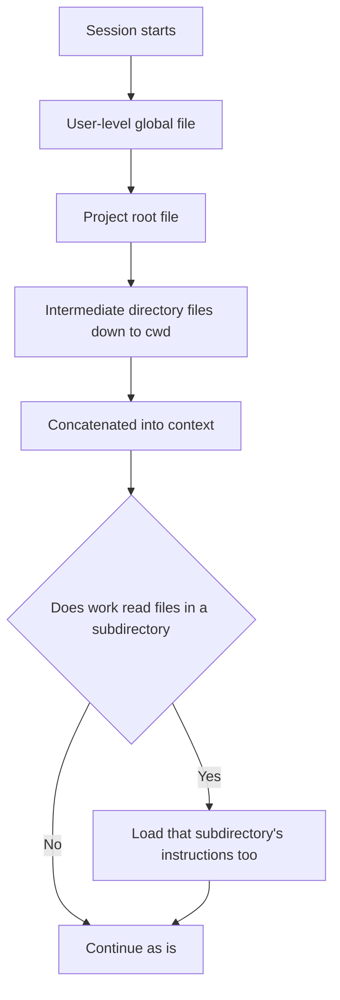

# Instructions and Memory: CLAUDE.md and AGENTS.md

> **Learning goal**: Explain where instruction files are discovered and in what order they enter context. Keep only content worth paying for on every turn, write rules agents actually follow, and check those files so they do not rot.

"Agent setup map" called instructions the **advisory layer**. This document goes deep on that layer. Behaviour described here follows, as of 2026-09, the official Claude Code docs, the openai/codex source and the agents.md specification.

## Key Concepts

An **instruction file** is Markdown that enters context automatically when a session starts. Conversation history disappears when the session ends, but a file survives into the next session and into other tools. That is why durable decisions go into files, not conversations (see "Developing with Claude Code + Codex"). **Memory**, by contrast, is a record the agent writes for itself rather than one a person writes. Claude Code's auto memory is the main example; it is machine-local and not shared.

| Tool | File | Scope | Note |
|---|---|---|---|
| Claude Code | `/etc/claude-code/CLAUDE.md` (Linux), etc. | organization, managed | Cannot be excluded |
| Claude Code | `~/.claude/CLAUDE.md`, `~/.claude/rules/` | user, every project | Personal preference |
| Claude Code | `./CLAUDE.md` or `./.claude/CLAUDE.md` | project, committed | Shared with the team |
| Claude Code | `./CLAUDE.local.md` | just me, this project | Add to `.gitignore` |
| Claude Code | `.claude/rules/*.md` | project | Loads at start without `paths`; with `paths`, when a matching file is read |
| Codex | `~/.codex/AGENTS.md` (`AGENTS.override.md` first) | user, global | |
| Codex | `AGENTS.md` in each directory (`AGENTS.override.md` first) | project root down to cwd | Total capped by `project_doc_max_bytes`, 32 KiB by default |

## Principles

### Discovery and load order

Claude Code reads `CLAUDE.md` and `CLAUDE.local.md` from the directory you launch in and **every directory above it** at start, and **concatenates** them instead of letting one override another. Content stacks from the filesystem root toward the working directory, so the nearest file is read last. Within one directory, `CLAUDE.local.md` is appended after `CLAUDE.md`. Files in **subdirectories** load not at start but when Claude reads a file in that directory.

Codex finds the project root by a root marker such as `.git`, then, in each directory from the root down to cwd, picks **the first file** in the order `AGENTS.override.md` → `AGENTS.md` → `project_doc_fallback_filenames`, and concatenates them. It never walks above the root, and anything past the 32 KiB total is truncated (source `codex-rs/core/src/agents_md.rs`, as of 2026-09).



**Imports**: CLAUDE.md can pull in other files with `@path/to/file`. Relative paths resolve against *the importing file*, and imports recurse up to four hops. Imported files also load in full at start, so imports **organize content but do not save tokens**. `` `@README` `` inside a code span is not imported. Block-level HTML comments `<!-- -->` are stripped before content enters context, so they can hold notes for human maintainers.

### How AGENTS.md relates to Claude Code

AGENTS.md is an open format that many coding agents read. The agents.md specification settles conflicts this way: "the closest AGENTS.md to the edited file wins; explicit user chat prompts override everything." Claude Code reads AGENTS.md directly from v2.1.277, but under the default (`claude-md-or-agents-md`) it reads **only CLAUDE.md whenever any CLAUDE.md exists**.

| Repository has | What Claude Code reads (default) |
|---|---|
| only `AGENTS.md` | `AGENTS.md` |
| both `AGENTS.md` and `CLAUDE.md` | `CLAUDE.md` only |
| a `CLAUDE.md` that imports `@AGENTS.md` | both, without duplication |

To make one file the shared source for both tools, put the import on the first line of CLAUDE.md and write only Claude-specific content beneath it. A symlink also works, but a Windows clone may check it out as a one-line text file.

```markdown
@AGENTS.md

Claude Code only: start changes under `src/billing/` in plan mode.
```

### What goes in and what stays out

Instructions are **context paid for on every turn**. The Claude Code docs recommend under 200 lines per file and note that longer files reduce adherence.

| Content | Where it goes | Why |
|---|---|---|
| Facts every session needs: build and test commands, forbidden paths | CLAUDE.md / AGENTS.md | Always needed |
| Rules for one path only | `paths` rules in `.claude/rules/`, a subdirectory AGENTS.md | Loads only when those files are touched |
| Multi-step procedures: deploy, release | Skill | Body loads only when invoked |
| Prohibitions that must hold | permission deny, hooks | Enforcement, not advice |
| Long design documents | ordinary docs + one pointer line in the instructions | Read when needed |
| Structure the code already reveals | leave it out | The agent reads the code itself |

### Writing rules that get followed

A good rule points to **a single source**, is **testable**, and has a **trigger** that says when it applies.

Bad example:

```text
Keep the code clean and write good tests.
Git policy: 1) no direct push to main 2) small commits 3) ... (40 lines copied from GIT_POLICY.md)
IMPORTANT!!! NEVER touch .env!!!
```

Good example:

```text
Before reporting done, run `node --test tests/` and quote the result.
Any merge → read `.ai/REPOSITORY.md` first.
Secrets: `.env*` is blocked by a deny rule in `.claude/settings.json`; do not work around it.
```

The first bad line cannot be checked. The second copies its source, so the two drift apart. The third tries to replace enforcement with emphasis. The good lines each point, in one line, to a command, a trigger and the place enforcement lives.

## Applied: This Repository's Setup

This repository's `CLAUDE.md` (31 lines) is not a manual but an **entry contract**. Its opening, followed by four things to notice:

```text
First check that `.ai/PROJECT_CONTEXT.md` exists and describes *this*
repository. Missing → the set is not adopted here: stop and run
`python3 .ai/tools/adopt.py`, which is the procedure and travels with the set.

Read at the start of a run, and nothing more:
`.ai/CORE.md`, `.ai/MANAGER.md`, `.ai/PROJECT_CONTEXT.md`.

Load on demand:
- parallel work → `.ai/EXECUTION.md`
- review → `.ai/REVIEW.md`
- any merge → `.ai/REPOSITORY.md`
```

1. **Adoption check**: the first line tests a precondition so that policy copied from another repository is not trusted blindly. `AGENTS.md` adds a line saying that where this repository is the policy set's home (`LESSONS_FROM_PRACTICE.md` present), the instance files are absent on purpose.
2. **"and nothing more"**: pinning the start-up reading to three files caps the context cost.
3. **Trigger table**: everything else is read only when a condition arises, as in "merge → REPOSITORY.md". It imitates on-demand skill loading at the level of documents.
4. **Two entry files**: Claude Code ignores AGENTS.md when CLAUDE.md exists, so this repository gives each tool its own entry file. AGENTS.md carries extra Codex-only lines such as the pointer to Codex model routing. The price is the risk that the two files drift.

`.ai/HARNESS.md` writes this principle down in a section titled "The entry file is read every turn". A section that summarizes another document does not belong in an entry file: it is paid for every turn, it drifts from its source, and when its heading differs the checks cannot see it.

**The guard against rot** is `.ai/tools/check_policy_set.py`. Each check prints the question it answers, and each one admits, in its own `NOT VERIFIED` comment, that it reads structure only and never judges whether the prose is right.

| Check | Question it answers |
|---|---|
| front matter | Does every policy document carry `doc_id`, `version`, `canonical_path` and `updated`? |
| cross-references | Does every `` `file.md` § *Section* `` reference point to something that exists? |
| one owner per heading | Is any heading claimed by two policy documents? (a structural proxy for duplicated rules) |
| portability | Has any project-specific term leaked outside the files allowed to know it? |
| changelog | Does every release entry carry a version, a date and an improvement? |
| project context | Does an adopting repository's `.ai/PROJECT_CONTEXT.md` hold every fact the set reads? |
| capability definitions | Does every agent and skill definition carry a `name` and `description`, with the name matching its file or folder? |

```bash
python3 .ai/tools/check_policy_set.py
```

## Going Deeper

### Memory features and their limits

Claude Code's **auto memory** is on by default and writes a `MEMORY.md` index plus topic files under `~/.claude/projects/<project>/memory/`. Each session loads only the first 200 lines or 25KB of `MEMORY.md`; topic files are read on demand. Turn it off with the toggle in `/memory` or with `"autoMemoryEnabled": false`.

The limits are clear too. It is **machine-local**: worktrees of the same repository share it, but other machines, cloud environments and Codex do not. Ordinary subagents do not receive the main conversation's auto memory, and records accumulate that no human has reviewed.

Codex also has a `[memories]` settings group, but its detailed behaviour was not verified for this document (needs confirmation). This is why this repository's `.ai/CORE.md` says that on hearing a standing directive such as "from now on", the run writes it **in the same turn** into `.ai/PROJECT_CONTEXT.md` or `.ai/memory/PROJECT_LESSONS.md`. Memory that every tool and machine shares, and that git reviews, is in the end a file in the repository.

### Tools for checking instruction state

- `/context`: the memory files actually loaded in this session.
- `/memory`: open and edit CLAUDE.md, CLAUDE.local.md and the auto memory location.
- `/doctor prompt-audit`: finds outdated or contradictory instructions and proposes edits (v2.1.283 or later).
- `InstructionsLoaded` hook: logs which file loaded, when and why. Useful when debugging path-scoped rules.

### What a subagent inherits

An ordinary Claude Code subagent loads the CLAUDE.md hierarchy as is. The exceptions are the built-in Explore and Plan agents, and a custom agent can opt out with `omitClaudeMd: true`. It does not inherit the conversation history or auto memory. This is the same reason this repository gives a Worker a **Mission Packet** instead of the whole `.ai/` folder: a subagent's context is cheaper the smaller it is, and what it needs arrives reliably only when the packet states it.

## Common Misconceptions

- **"CLAUDE.md is the system prompt, so it is always obeyed."** According to the Claude Code docs, CLAUDE.md is delivered as a user message after the system prompt, and strict compliance is not guaranteed.
- **"Splitting with @imports saves tokens."** Imports load at start too. To save, move content to `paths` rules or skills.
- **"If AGENTS.md exists, Claude Code reads it."** Not by default when a CLAUDE.md is also present.
- **"Auto memory means decision records are unnecessary."** Auto memory is machine-local and not shared with other tools.

## Self-Check Questions

1. You start Claude Code in `foo/bar/`. When does each of `foo/CLAUDE.md`, `foo/bar/CLAUDE.md` and `foo/bar/baz/CLAUDE.md` load?
2. In Codex, if one directory has both `AGENTS.override.md` and `AGENTS.md`, which is read?
3. If a 40-line deployment procedure must leave CLAUDE.md, where does it go, and why?
4. What does this repository pay for keeping two entry files instead of importing `@AGENTS.md` from CLAUDE.md?
5. Name one defect `check_policy_set.py` can catch and one it cannot.

## References

- Claude Code, [How Claude remembers your project](https://code.claude.com/docs/en/memory) (checked 2026-09-29)
- Claude Code, [Extend Claude Code: context costs](https://code.claude.com/docs/en/features-overview) (checked 2026-09-29)
- OpenAI Codex, [Custom instructions with AGENTS.md](https://developers.openai.com/codex/guides/agents-md) (2026-09-29, cross-checked against source `codex-rs/core/src/agents_md.rs`)
- [AGENTS.md specification](https://agents.md) (2026-09-29, checked via the `agentsmd/agents.md` repository)
- This repository: `CLAUDE.md`, `AGENTS.md`, `.ai/HARNESS.md`, `.ai/CORE.md`, `.ai/tools/check_policy_set.py`
