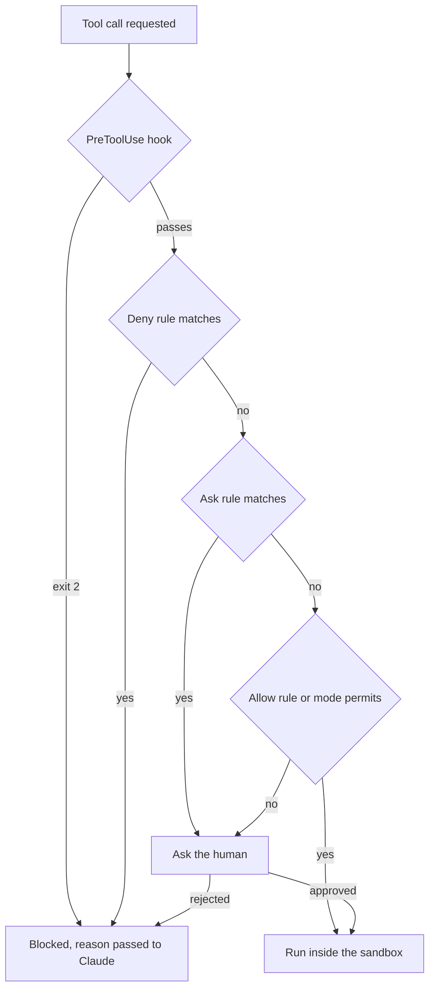

# Permissions, Sandboxes and Hooks: Designing the Enforced Layer

> **Learning goal**: Distinguish Claude Code's permission rules and permission modes from Codex's approval policy and sandbox mode. Use the hook input/output contract to implement a force-push block and a guard against ending with uncommitted work, and design risk-tiered permissions for a one-person studio.

The advisory layer covered in "Instructions and memory" is what an agent *tries* to follow. This document covers the **enforced layer**, which the harness executes regardless of what the agent decides. Key names and behaviour were checked against official docs and the openai/codex source as of 2026-09.

## Key Concepts

The three mechanisms are layered because each has different gaps. Permission rules look at command **text**, the sandbox at **actual system calls**, and hooks at **context** (branch, git state).

| Mechanism | What it stops | Basis for the decision | Limit |
|---|---|---|---|
| Permission rules (allow · ask · deny) | tool calls | tool name and argument text | Bash can slip past through another spelling of the same program |
| Permission mode · approval policy | what runs without asking | session-wide default | rules sit on top of the mode |
| Sandbox | filesystem · network access | OS level (Seatbelt, bubblewrap) | covers shell commands only |
| Hook | behaviour at a lifecycle point | code you write | stops only what the code sees |

## Principles

### Claude Code permission rules

Rules are evaluated in the order **deny → ask → allow**, and the first match decides. Specificity does not change the order, so a `Bash(aws *)` deny always comes before a `Bash(aws s3 ls)` allow. A deny in any scope blocks an allow in any other.

| Rule | Meaning |
|---|---|
| `Bash(npm run *)` | commands starting with `npm run`. Put `*` after the subcommand (a trailing `:*` means the same) |
| `Read(./.env)`, `Edit(/src/**/*.ts)` | gitignore syntax. `/` is relative to the settings file, `//` is absolute, `~/` is home |
| `WebFetch(domain:*.example.com)` | fetches to subdomains |
| `mcp__github__get_*` | tools from one MCP server |

Claude Code checks each subcommand of a command joined with `&&`, `;` or `|`, and strips wrappers such as `timeout` and `nice` before matching. Even so, **Bash rules are not a security boundary**. In the official docs' own example, a `Bash(git push *)` deny does not stop `git -C . push origin main`. Also, `allow` in a committed `.claude/settings.json` applies only after workspace trust is accepted, while `deny` and `ask` apply immediately.

### Permission modes

| Mode | Runs without asking | Use |
|---|---|---|
| `default` (labelled Manual in the UI) | reads only | sensitive work |
| `acceptEdits` | reads, file edits in the working directory, common file commands such as `mkdir` · `mv` | iterating while you review |
| `plan` | reads (plus classifier-approved commands when auto mode is available) | exploring before changing |
| `auto` | everything, with a classifier checking in the background | long tasks |
| `dontAsk` | only pre-approved tools; everything else is denied | CI, scripts |
| `bypassPermissions` | everything | isolated containers · VMs only |

Cycle with `Shift+Tab`; set the starting mode with `--permission-mode`. `auto` and `bypassPermissions` cannot be set as the default from project or local settings. Writes to **protected paths** such as `.git`, `.claude`, `.husky` and `.mcp.json` are, as a rule, auto-approved only in `bypassPermissions`. Deny rules block in every mode.

### Sandbox

Claude Code's sandbox puts an OS boundary around Bash · PowerShell · Monitor commands and their child processes. macOS uses Seatbelt; Linux and WSL2 use `bubblewrap` and `socat`. Turn it on with `/sandbox` or in settings. Writes are limited by default to the working directory and temp directories, but reads are broad, so block paths such as `~/.ssh` yourself. The `allowUnsandboxedCommands: false` below closes the escape hatch of retrying outside the sandbox. Because `autoAllowBashIfSandboxed` defaults to on, Bash inside the sandbox runs without asking, but content-specific ask rules such as `Bash(git push *)` and deny rules still apply.

```json
{
  "sandbox": {
    "enabled": true, "allowUnsandboxedCommands": false,
    "filesystem": { "denyRead": ["~/.ssh", "~/.aws"] },
    "network": { "allowedDomains": ["github.com", "registry.npmjs.org"] }
  }
}
```

### Codex: approval policy and sandbox mode

| Key | Value | Meaning |
|---|---|---|
| `sandbox_mode` | `read-only` · `workspace-write` · `danger-full-access` | network is off by default in `workspace-write` (`[sandbox_workspace_write] network_access`) |
| `approval_policy` | `on-request` (default; `on-failure` is an alias) | the model asks for approval when it needs it |
| `approval_policy` | `never` | never asks; failures go straight back to the model |
| `approval_policy` | `{ granular = { ... } }` | per-category allow or automatic rejection |

So Codex separates **what it can do** (`sandbox_mode`) from **when it asks** (`approval_policy`). The value `untrusted` raises a "no longer supported" error in the 2026-09 main source. On the CLI, change them with `-s`/`--sandbox` and `-a`/`--ask-for-approval`; `--dangerously-bypass-approvals-and-sandbox` (alias `--yolo`) is only for environments already isolated from outside. Per-command rules are written in Starlark in `rules/*.rules` under a config folder (for example `~/.codex/rules/default.rules`), such as `prefix_rule(pattern = ["git", "push", ["--force", "-f"]], decision = "forbidden")`. The rule matches tokens **from the front**, so `git push origin --force` is not caught.

### Hooks: events and the input/output contract

A Claude Code hook is a command · http · mcp_tool · prompt · agent handler that runs at a lifecycle event. As of 2026-09 there are more than thirty events; the common ones are `SessionStart`, `UserPromptSubmit`, `PreToolUse`, `PermissionRequest`, `PostToolUse`, `Stop`, `SubagentStop`, `PreCompact` and `SessionEnd`.

- **Input**: JSON on stdin. The common fields `session_id`, `transcript_path`, `cwd`, `permission_mode` and `hook_event_name` are joined by event-specific fields (`tool_name`, `tool_input`, `stop_hook_active`, and so on).
- **Exit code**: 0 is success, and stdout JSON is read. 2 is a block, and stderr goes to Claude as the reason. Exit 2 in `PreToolUse` stops the call before permission rules are evaluated. **Other values are, for most events, non-blocking errors, and the action goes ahead.**
- **JSON output**: `PreToolUse` uses `hookSpecificOutput.permissionDecision` (`allow` · `deny` · `ask` · `defer`); `Stop` uses a top-level `"decision": "block"` with `reason`. A hook's `allow` cannot override deny or ask rules either.



## Applied: This Repository's Setup

This repository bakes permissions into its role agents. The two Claude agents declare `tools: Read, Grep, Glob, Bash` and `permissionMode: plan`; the three Codex agents declare `sandbox_mode = "read-only"`. `.ai/HARNESS.md` adds that a parent runtime override can supersede a file's sandbox setting, so the effective permissions must be verified. But **there is no committed `.claude/settings.json` and no hook**. Below is a draft that fills that gap; this repository's test command is `node --test tests/*.test.cjs`.

```json
{
  "permissions": {
    "allow": ["Bash(node --test *)", "Bash(python3 .ai/tools/check_policy_set.py)", "Bash(git diff *)", "Bash(git log *)", "Bash(git commit *)"],
    "ask": ["Bash(git push *)", "Bash(git reset --hard *)", "WebFetch"],
    "deny": ["Read(./.env)", "Read(./.env.*)", "Bash(git push --force *)", "Bash(git push -f *)"]
  },
  "hooks": {
    "PreToolUse": [{ "matcher": "Bash", "hooks": [{ "type": "command", "if": "Bash(git *)", "command": "bash \"$CLAUDE_PROJECT_DIR\"/.claude/hooks/block-force-push.sh" }] }],
    "Stop": [{ "hooks": [{ "type": "command", "command": "bash \"$CLAUDE_PROJECT_DIR\"/.claude/hooks/stop-if-dirty.sh" }] }]
  }
}
```

**Hook 1, block force push** (`.claude/hooks/block-force-push.sh`, needs `jq`). It also catches spellings the deny rules miss, such as `git -C . push --force` and `git push origin +main`.

```bash
CMD=$(jq -r '.tool_input.command // empty')
if printf '%s\n' "$CMD" | grep -Eq 'push.*(--force|[[:space:]]-f([[:space:]]|$)|[[:space:]]\+[^[:space:]])'; then
  echo "Blocked: force push is not allowed from an agent session. Ask the owner." >&2
  exit 2
fi
exit 0
```

**Hook 2, do not stop with uncommitted changes** (`.claude/hooks/stop-if-dirty.sh`). Exit 2 prevents the stop, and stderr becomes the next instruction. When `stop_hook_active` is `true`, the hook has already sent Claude back once, so it lets the stop happen. Without that check, Claude Code only overrides the hook after it blocks eight times in a row.

```bash
INPUT=$(cat)
if [ "$(printf '%s' "$INPUT" | jq -r '.stop_hook_active')" = "true" ]; then exit 0; fi
cd "$CLAUDE_PROJECT_DIR" || exit 0
if [ -n "$(git status --porcelain)" ]; then
  echo "Uncommitted changes remain. Commit them in meaningful units, or state in the report why they stay uncommitted." >&2
  exit 2
fi
exit 0
```

## Going Deeper

### Risk-tiered design for a one-person studio

Running many products alone means many approval prompts, and many prompts end with approvals nobody reads. So assign **one mechanism per risk tier**. This moves the safety loop from "Claude Code as a Git client" into configuration, and for T3 it adds a last line of defence outside the agent, such as GitHub branch protection.

| Tier | Examples | Claude Code | Codex |
|---|---|---|---|
| T0 inspect | reading, searching, `git diff` | allowed by default | `read-only` |
| T1 local · reversible | edits, tests, local commits | `acceptEdits` or allow + sandbox | `workspace-write` + `on-request` |
| T2 shared state | push, PRs, installing dependencies, network | ask | approve requests to leave the sandbox |
| T3 irreversible · external cost | force push, deploys, payment APIs, mass deletion | deny + hook + human | `forbidden` rules + server-side protection |

### Secrets hygiene

- Put `.env*`, `~/.ssh` and `~/.aws` in **both** a permission deny and the sandbox `denyRead`. The permission rule stops the Read tool; the sandbox stops Bash paths such as `cat`. Never commit `.claude/settings.local.json` or `CLAUDE.local.md`.
- In a project `.mcp.json`, credential variables such as `ANTHROPIC_API_KEY` read as empty in a remote server's `url` and `headers`. This keeps someone else's repository from sending your key out. Codex narrows the environment passed to commands with `shell_environment_policy` (`inherit`, `exclude`, `include_only`, `set`).

### Common failure modes

- **A hook silently lets things through**: if the script is not executable or `jq` is missing and it exits 1, that is a non-blocking error and the action proceeds. Test every blocking hook right after installing it with an input that should be caught. Similarly, an `echo` in a shell profile that lands before stdout makes JSON output be ignored.
- **Project allow rules do not take effect**: the workspace is not yet trusted, or this is a `claude -p` run, which has no trust dialog. In Codex too, an untrusted project's `.codex/config.toml` stays disabled.

## Common Misconceptions

- **"Grant broad allow rules and deny only the dangerous ones."** A Bash deny is escaped by a change of spelling. Layer the sandbox under any broad allow.
- **"Protected paths are protected even in bypassPermissions."** That mode allows protected-path writes too. Do not use it outside a container.
- **"Codex `never` is a safe mode."** It only stops asking; safety is decided by `sandbox_mode`.

## Self-Check Questions

1. `Bash(git push *)` is in ask and `Bash(git push origin main)` is in allow. How is `git push origin main` handled?
2. What happens when a blocking hook exits with 1, and why is that dangerous?
3. What happens if a Stop hook does not check `stop_hook_active`?
4. In Codex, with `approval_policy = "never"` and `sandbox_mode = "workspace-write"` together, what is allowed and what is blocked?
5. Why is agent configuration alone not enough to stop a T3 action?

## References

- Claude Code, [Configure permissions](https://code.claude.com/docs/en/permissions) · [Permission modes](https://code.claude.com/docs/en/permission-modes) · [Sandboxing](https://code.claude.com/docs/en/sandboxing) (checked 2026-09-29)
- Claude Code, [Hooks reference](https://code.claude.com/docs/en/hooks) · [Hooks guide](https://code.claude.com/docs/en/hooks-guide) (checked 2026-09-29)
- OpenAI Codex, [Agent approvals & security](https://developers.openai.com/codex/agent-approvals-security) · [Sandbox](https://developers.openai.com/codex/concepts/sandboxing) (2026-09-29, cross-checked against source `protocol.rs`, `config.schema.json`, `execpolicy/README.md`)
- This repository: `.ai/HARNESS.md`, `.claude/agents/*.md`, `.codex/agents/*.toml`
