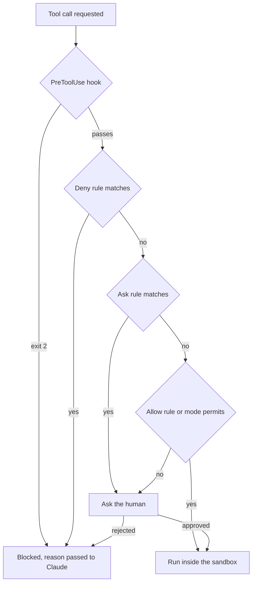

# Permissions, Sandboxes and Hooks: Designing the Enforced Layer

> **Learning goal**: Distinguish Claude Code's permission rules and permission modes from Codex's approval policy and sandbox mode. Use the hook input/output contract to implement a force-push block and a guard against ending with uncommitted work, and design risk-tiered permissions for a one-person studio.

The advisory layer covered in "Instructions and Memory" is what an agent *tries* to follow. This document covers the **enforced layer**, which the harness executes regardless of what the agent decides. Key names and behaviour were checked against official docs and the openai/codex source as of 2026-09.

## Key Concepts

The three mechanisms are layered because each has different gaps. Permission rules look at command **text**, the sandbox at **actual system calls**, and hooks at **context** (branch, git state).

| Mechanism | What it stops | Basis for the decision | Limit |
|---|---|---|---|
| Permission rules (allow · ask · deny) | tool calls | tool name and argument text | Bash can slip past through another spelling of the same program |
| Permission mode · approval policy | what runs without asking | session-wide default | rules sit on top of the mode |
| Sandbox | filesystem · network access | OS level (Seatbelt, bubblewrap) | covers shell commands only |
| Hook | behaviour at a lifecycle point | code you write | stops only what the code sees |

## Principles

### Claude Code permission rules

Rules are evaluated in the order **deny → ask → allow**, and the first match decides. Specificity does not change the order, so a `Bash(aws *)` deny always comes before a `Bash(aws s3 ls)` allow. A deny in any scope blocks an allow in any other.

| Rule | Meaning |
|---|---|
| `Bash(npm run *)` | commands starting with `npm run`. Put `*` after the subcommand (a trailing `:*` means the same) |
| `Read(./.env)`, `Edit(/src/**/*.ts)` | gitignore syntax. `/` is relative to the settings file, `//` is absolute, `~/` is home |
| `WebFetch(domain:*.example.com)` | fetches to subdomains |
| `mcp__github__get_*` | tools from one MCP server |

Claude Code checks each subcommand of a command joined with `&&`, `;` or `|`, and strips wrappers such as `timeout` and `nice` before matching. Even so, **Bash rules are not a security boundary**. In the official docs' own example, a `Bash(git push *)` deny does not stop `git -C . push origin main`. Also, `allow` in a committed `.claude/settings.json` applies only after workspace trust is accepted, while `deny` and `ask` apply immediately.

### Permission modes

| Mode | Runs without asking | Use |
|---|---|---|
| `default` (labelled Manual in the UI) | reads only | sensitive work |
| `acceptEdits` | reads, file edits in the working directory, common file commands such as `mkdir` · `mv` | iterating while you review |
| `plan` | reads (plus classifier-approved commands when auto mode is available) | exploring before changing |
| `auto` | everything, with a classifier checking in the background | long tasks |
| `dontAsk` | only pre-approved tools; everything else is denied | CI, scripts |
| `bypassPermissions` | everything | isolated containers · VMs only |

Cycle with `Shift+Tab`; set the starting mode with `--permission-mode`. `auto` and `bypassPermissions` cannot be set as the default from project or local settings. Writes to **protected paths** such as `.git`, `.claude`, `.husky` and `.mcp.json` are, as a rule, auto-approved only in `bypassPermissions`. Deny rules block in every mode.

### Sandbox

Claude Code's sandbox puts an OS boundary around Bash · PowerShell · Monitor commands and their child processes. macOS uses Seatbelt; Linux and WSL2 use `bubblewrap` and `socat`. Turn it on with `/sandbox` or in settings. Writes are limited by default to the working directory and temp directories, but reads are broad, so block paths such as `~/.ssh` yourself. The `allowUnsandboxedCommands: false` below closes the escape hatch of retrying outside the sandbox. Because `autoAllowBashIfSandboxed` defaults to on, Bash inside the sandbox runs without asking, but content-specific ask rules such as `Bash(git push *)` and deny rules still apply.

```json
{
  "sandbox": {
    "enabled": true, "allowUnsandboxedCommands": false,
    "filesystem": { "denyRead": ["~/.ssh", "~/.aws"] },
    "network": { "allowedDomains": ["github.com", "registry.npmjs.org"] }
  }
}
```

### Codex: approval policy and sandbox mode

| Key | Value | Meaning |
|---|---|---|
| `sandbox_mode` | `read-only` · `workspace-write` · `danger-full-access` | network is off by default in `workspace-write` (`[sandbox_workspace_write] network_access`) |
| `approval_policy` | `on-request` (default; `on-failure` is an alias) | the model asks for approval when it needs it |
| `approval_policy` | `never` | never asks; failures go straight back to the model |
| `approval_policy` | `{ granular = { ... } }` | per-category allow or automatic rejection |

So Codex separates **what it can do** (`sandbox_mode`) from **when it asks** (`approval_policy`). The value `untrusted` raises a "no longer supported" error in the 2026-09 main source. On the CLI, change the sandbox with `-s`/`--sandbox`; the interactive TUI also accepts `-a`/`--ask-for-approval` (`-a` is a TUI flag defined in `codex-rs/tui/src/cli.rs` in the 2026-09 main source, not one of the shared options that `codex exec` also takes); `--dangerously-bypass-approvals-and-sandbox` (alias `--yolo`) is only for environments already isolated from outside. Per-command rules are written in Starlark in `rules/*.rules` under a config folder (for example `~/.codex/rules/default.rules`), such as `prefix_rule(pattern = ["git", "push", ["--force", "-f"]], decision = "forbidden")`. The rule matches tokens **from the front**, so `git push origin --force` is not caught.

### Hooks: events and the input/output contract

A Claude Code hook is a command · http · mcp_tool · prompt · agent handler that runs at a lifecycle event. As of 2026-09 there are more than thirty events; the common ones are `SessionStart`, `UserPromptSubmit`, `PreToolUse`, `PermissionRequest`, `PostToolUse`, `Stop`, `SubagentStop`, `PreCompact` and `SessionEnd`.

- **Input**: JSON on stdin. The common fields `session_id`, `transcript_path`, `cwd`, `permission_mode` and `hook_event_name` are joined by event-specific fields (`tool_name`, `tool_input`, `stop_hook_active`, and so on).
- **Exit code**: 0 is success, and stdout JSON is read. 2 is a block, and stderr goes to Claude as the reason. Exit 2 in `PreToolUse` stops the call before permission rules are evaluated. **Other values are, for most events, non-blocking errors, and the action goes ahead.**
- **JSON output**: `PreToolUse` uses `hookSpecificOutput.permissionDecision` (`allow` · `deny` · `ask` · `defer`); `Stop` uses a top-level `"decision": "block"` with `reason`. A hook's `allow` cannot override deny or ask rules either.



## Applied: This Repository's Setup

This repository bakes permissions into its role agents. The two Claude agents declare `tools: Read, Grep, Glob, Bash` and `permissionMode: plan` (plan mode: mostly reads, plus classifier-approved commands when auto mode is available); the three Codex agents declare `sandbox_mode = "read-only"`. The parent's mode can supersede `permissionMode`, though (see "Subagents, Skills and Plugins"). `.ai/HARNESS.md` adds that a parent runtime override can supersede a file's sandbox setting, so the effective permissions must be verified. But **there is no committed `.claude/settings.json` and no hook**. Below is a draft that fills that gap; this repository's test command is `node --test tests/*.test.cjs`.

```json
{
  "permissions": {
    "allow": ["Bash(node --test *)", "Bash(python3 .ai/tools/check_policy_set.py)", "Bash(git diff *)", "Bash(git log *)", "Bash(git commit *)"],
    "ask": ["Bash(git push *)", "Bash(git reset --hard *)", "WebFetch"],
    "deny": ["Read(./.env)", "Read(./.env.*)", "Bash(git push --force *)", "Bash(git push -f *)"]
  },
  "hooks": {
    "SessionStart": [{ "hooks": [{ "type": "command", "command": "bash \"$CLAUDE_PROJECT_DIR\"/.claude/hooks/session-baseline.sh" }] }],
    "PreToolUse": [{ "matcher": "Bash", "hooks": [{ "type": "command", "if": "Bash(git *)", "command": "bash \"$CLAUDE_PROJECT_DIR\"/.claude/hooks/block-force-push.sh" }] }],
    "Stop": [{ "hooks": [{ "type": "command", "command": "bash \"$CLAUDE_PROJECT_DIR\"/.claude/hooks/stop-if-dirty.sh" }] }]
  }
}
```

**Hook 1, block force push** (`.claude/hooks/block-force-push.sh`). It joins lines continued with a trailing `\`, turns an escaped `\#` into `_`, deletes every backslash, unwraps single-token quotes and deletes multi-word quoted strings (commit messages and the like). A double-quoted string that contains `$` or a backtick is kept, not deleted. It then deletes comments (from a `#` at the start of a word to the end of the line), splits the command on `&&` · `;` · `|` · newlines, and checks **every argument after the first `push` in each command**. Anchoring on the last `push` instead would let a trailing word `push`, as in `git push -f origin main push`, hide every option before it. It blocks bundled short options containing `f` (`-uf`, `-4f`), every long option starting with `--force` (including abbreviations such as `--force-w`), `--mirror` and its abbreviations (down to `--m`), refspecs starting with `+`, and **every argument containing `$`, a backtick, `{` or `}`**. Variables, command substitutions and brace expansions (`-{f,v}`) have no value until they run, so it blocks them without looking, failing closed. It also blocks any command that contains `remote.<name>.mirror` or a `remote.<name>.push` value starting with `+`, whether set once with `git -c ...` or saved with `git config`. If `jq` is missing, the input cannot be read, or the input has no command (empty stdin, `{}`, a `tool_input` without `command`), it **fails closed** (exit 2). If an empty `CMD` ended in exit 0, the block would be silently off, and stderr at exit 0 only reaches the debug log, so nobody would know.

```bash
command -v jq >/dev/null || { echo "Blocked: jq is missing, so the force-push check cannot run." >&2; exit 2; }
CMD=$(jq -r '.tool_input.command // empty') || exit 2
[ -n "$CMD" ] || { echo "Blocked: hook input had no command" >&2; exit 2; }
CMD=${CMD//$'\\\n'/}
S=$(printf '%s\n' "$CMD" | sed -E "s/\\\\#/_/g; s/\\\\//g; s/[\"']([^\"'[:space:]#]*)[\"']/\1/g; s/\"[^\"\$\`]*\"|'[^']*'//g; s/(^|[[:space:];&|])#.*$//; s/(&&|\|\||[;&|])/\n/g")
ARGS=$(printf '%s\n' "$S" | grep -oE '(^|[[:space:]])push([[:space:]].*)?$' | sed -E 's/^[[:space:]]?push//; s/^/ /; s/$/ /')
if printf '%s\n' "$ARGS" | grep -Eq '[[:space:]]-[A-Za-z0-9]*f[A-Za-z0-9]*([[:space:]]|$)|[[:space:]]--force[^[:space:]=]*|[[:space:]]--m(i(r(r(o(r)?)?)?)?)?([[:space:]]|$)|[[:space:]]\+[^[:space:]]|[$`{}]' ||
   printf '%s\n' "$S" | grep -Eiq 'remote\.[^[:space:]]+\.(mirror|push[=[:space:]]+\+)'; then
  echo "Blocked: force push is not allowed from an agent session. Ask the owner." >&2
  exit 2
fi
exit 0
```

Below is a subset of the 77 cases actually run (2026-09-30, bash 5 · GNU grep/sed · jq 1.7). That `-4f`, `--force-w`, `--mirr`, `\-f`, `--forc$'e'`, `-{f,v}` and `git -c remote.x.push=+HEAD:refs/heads/main push x` really do produce a forced update or a mirror push was checked separately with git 2.43 against a local bare remote. "No jq" means a run with `jq` removed from `PATH`. The newline substitution uses GNU sed syntax, so test separately with the default macOS sed.

| Command | Expected | With jq | No jq |
|---|---|---|---|
| `git push origin main` | 0 | 0 | 2 |
| `git push -u origin feature` | 0 | 0 | 2 |
| `git push origin fix-foo` | 0 | 0 | 2 |
| `git commit -m "push -f later" && git status` | 0 | 0 | 2 |
| `git push origin main # -f` · `git commit -m "fix #12" && git push origin main` | 0 | 0 | 2 |
| `git push -o ci.skip origin main` · `origin force` · `origin mirror` · `origin fix-force` | 0 | 0 | 2 |
| `git push origin HEAD:+main` (creates a remote branch named `+main`) · `git push origin main -o push` | 0 | 0 | 2 |
| `git -c remote.origin.push=refs/heads/main:refs/heads/main push origin` | 0 | 0 | 2 |
| `git push --no-force` · `--no-force-with-lease` · `--porcelain` · `--prune` · `--follow-tags` · `--push-option=x` | 0 | 0 | 2 |
| `git push -fu origin main` · `-uf` · `-nf` | 2 | 2 | 2 |
| `git -C . push -f origin main` | 2 | 2 | 2 |
| `git push origin "+main"` · `'+main'` | 2 | 2 | 2 |
| `git push --force-with-lease=main:abc123 origin main` | 2 | 2 | 2 |
| `git push --force-if-includes origin main` | 2 | 2 | 2 |
| `git push --mirror origin` | 2 | 2 | 2 |
| `git commit -m "push" && git push -f origin main` | 2 | 2 | 2 |
| `git push -4f origin main` · `-f4` | 2 | 2 | 2 |
| `git push --force-w origin main` · `--force-with-l` | 2 | 2 | 2 |
| `git push --mirr origin` · `--mir` · `--mi` · `--m` | 2 | 2 | 2 |
| `git push \-f origin main` · `--forc\e` · `--forc$'e'` | 2 | 2 | 2 |
| `F=-f; git push $F origin main` · `git push -$(echo f) origin main` | 2 | 2 | 2 |
| `git push origin fix#1 -f` · `git commit -m '#' && git push -f origin main` | 2 | 2 | 2 |
| `git push \` then a newline, next line `-f origin main` | 2 | 2 | 2 |
| `git tag push && git push -f origin main push` · `git push -f origin main -o push` | 2 | 2 | 2 |
| `git remote add push ../remote.git && git push -f push main` | 2 | 2 | 2 |
| `git push -{f,v} origin main` · `--{mirror,verbose}` · `-{f,}` | 2 | 2 | 2 |
| `git branch \# && git push origin main \# -f` · `git push origin main -o \# -f` | 2 | 2 | 2 |
| `git -c remote.origin.mirror=true push origin` · `git -c Remote.Origin.Mirror push origin` | 2 | 2 | 2 |
| `git -c remote.origin.push=+refs/heads/main:refs/heads/main push origin` · `git config remote.origin.push +refs/heads/main:refs/heads/main && git push origin` | 2 | 2 | 2 |
| Input with no command: empty stdin · `{}` · `{"tool_input":{}}` · `{"tool_input":{"command":""}}` · `{"tool_input":{"command":null}}` | 2 | 2 | 2 |
| Input that is not JSON | 2 | 2 | 2 |
| Limit: `git p -f origin main` · `git -c alias.p=push p -f origin main` | 2 | **0** | 2 |
| Limit: `echo push -f` | 0 | **2** | 2 |
| Out of scope: `git push origin :main` · `--delete origin main` · `-d origin main` | 0 | 0 | 2 |

Comment removal targets only a `#` **at the start of a word**, and a single-token quote containing `#` is deleted rather than unwrapped. Deleting every `#` on the line would let `git push origin fix#1 -f` and `git commit -m '#' && git push -f origin main` through (checked with the two cases above). Conversely, as in bash, the tail of `git status;# note && git push -f` is a comment, so it passes. In bash, `\#` is a literal `#`, not a comment, so it becomes `_` **before** backslashes are deleted. In the other order, `\#` would turn into a `#` at the start of a word, and the `-f` in `git push origin main -o \# -f` would vanish as a comment (checked with the case above).

The limits of Hook 1, stated plainly: aliases are expanded by git at run time, so they are not caught (`git p -f`, `git -c alias.p=push p -f`). Neither are strings wrapped in `eval` or `sh -c`, or a push inside a script file. Force set in git config (a `+` refspec in `remote.<name>.push`, `remote.<name>.mirror`) is blocked only when it appears in the command; settings already in `.git/config`, or supplied through `GIT_CONFIG_*` environment variables or `--config-env`, are not seen. Branch deletion via `:dst`, `--delete`, `-d` or `--prune` is not covered; branch protection is. In the other direction, other commands where `-f` follows the word `push`, such as `echo push -f`, every push argument containing `$`, `{` or `}`, such as `git push origin $BRANCH`, and lookups such as `git config --get remote.origin.mirror` are blocked as false positives. So this hook cuts down common mistakes; it is not a security boundary. The real boundary is a server-side rule outside the agent, such as the GitHub branch protection in the T3 row of the risk-tier table below.

**Hooks 2 · 3, do not stop with uncommitted changes this session made**. A session can start on a dirty tree that holds the owner's WIP. So `SessionStart` (`session-baseline.sh`) saves `git status --porcelain` as a per-session baseline, and `Stop` (`stop-if-dirty.sh`) objects **only to new lines**. Paths come from `cwd` in the stdin JSON, not `$CLAUDE_PROJECT_DIR`: after Claude enters a worktree, `CLAUDE_PROJECT_DIR` stays where the session started and only `cwd` follows. The baseline is written only when absent, so it survives `SessionStart` firing again after compact or resume. `session_id` goes into a file name, so any character other than letters, digits, `.`, `_` and `-` becomes `_`, and if the value is empty or `null` the script does nothing and exits.

```bash
command -v jq >/dev/null || exit 0
INPUT=$(cat)
SID=$(printf '%s' "$INPUT" | jq -j '.session_id' | tr -c 'A-Za-z0-9._-' '_'); DIR=$(printf '%s' "$INPUT" | jq -r '.cwd')
[ -n "$SID" ] && [ "$SID" != null ] || exit 0
cd "$DIR" 2>/dev/null && GITDIR=$(git rev-parse --absolute-git-dir 2>/dev/null) || exit 0
[ -e "$GITDIR/agent-baseline-$SID" ] || git status --porcelain > "$GITDIR/agent-baseline-$SID"
exit 0
```

```bash
command -v jq >/dev/null || { echo '{"systemMessage":"stop-if-dirty: jq is missing, uncommitted-work check skipped"}'; exit 0; }
INPUT=$(cat)
[ "$(printf '%s' "$INPUT" | jq -r '.stop_hook_active')" = "true" ] && exit 0
SID=$(printf '%s' "$INPUT" | jq -j '.session_id' | tr -c 'A-Za-z0-9._-' '_'); DIR=$(printf '%s' "$INPUT" | jq -r '.cwd')
[ -n "$SID" ] && [ "$SID" != null ] || exit 0
cd "$DIR" 2>/dev/null && GITDIR=$(git rev-parse --absolute-git-dir 2>/dev/null) || exit 0
BASE="$GITDIR/agent-baseline-$SID"
[ -f "$BASE" ] || { echo '{"systemMessage":"stop-if-dirty: no session baseline, check skipped"}'; exit 0; }
NEW=$(git status --porcelain | grep -vxF -f "$BASE")
if [ -n "$NEW" ]; then
  printf 'Files changed during this session are uncommitted:\n%s\nCommit your own changes in meaningful units, or say in the report why they stay uncommitted. Do not commit files that were already modified before the session.\n' "$NEW" >&2
  exit 2
fi
exit 0
```

| Situation | Expected | Result |
|---|---|---|
| clean tree | 0 | 0 |
| only files the owner modified before the session | 0 | 0 |
| agent edits a tracked file / creates a new file | 2 | 2 |
| same, with `stop_hook_active: true` | 0 | 0 |
| agent committed; only the owner's WIP remains | 0 | 0 |
| no baseline · no `jq` | 0 + warning | 0 + `systemMessage` |
| `session_id` is `../../evil` · `a b/c` | a file inside `.git/` | `agent-baseline-.._.._evil` · `agent-baseline-a_b_c` |
| `session_id` missing · `null` · empty string | 0, no file | 0, no file |
| Limit: agent adds a new file inside `u/`, which the owner left untracked | 2 | **0** |

The limits, stated plainly: if the agent further edits a file the owner had already modified, the `git status` line is unchanged and the hook misses it. If the agent adds a file inside a directory the owner left untracked, `git status --porcelain` still shows the single line `?? u/`, so the hook misses that too (the last row of the table above). With no baseline (installed mid-session, a new worktree) or no `jq`, it does not block but reports through `systemMessage`, because failing closed at Stop would leave a session unable to end. Baseline files stay in `.git/`, so remove them with a `SessionEnd` hook if you want.

## Going Deeper

### Risk-tiered design for a one-person studio

Running many products alone means many approval prompts, and many prompts end with approvals nobody reads. So assign **one mechanism per risk tier**. This moves the safety loop from "Claude Code as a Git client" into configuration, and for T3 it adds a last line of defence outside the agent, such as GitHub branch protection.

| Tier | Examples | Claude Code | Codex |
|---|---|---|---|
| T0 inspect | reading, searching, `git diff` | allowed by default | `read-only` |
| T1 local · reversible | edits, tests, local commits | `acceptEdits` or allow + sandbox | `workspace-write` + `on-request` |
| T2 shared state | push, PRs, installing dependencies, network | ask | approve requests to leave the sandbox |
| T3 irreversible · external cost | force push, deploys, payment APIs, mass deletion | deny + hook + human | `forbidden` rules + server-side protection |

### Secrets hygiene

- Permission rules stop the Read tool and the sandbox stops Bash paths such as `cat`, so use **both**. The sandbox `credentials` block denies reads of listed files (`"mode": "deny"`) and unsets listed environment variables before each sandboxed command. There is no built-in list, so write your own. `permissions.blockReadsOutsideWorkingDirectories` makes the file tools refuse reads outside the working directories.
- Never commit `.claude/settings.local.json` or `CLAUDE.local.md`. In a project `.mcp.json`, some credential variables (the docs' example: `ANTHROPIC_AUTH_TOKEN`) read as empty in a remote server's `url` and `headers`. Codex narrows the environment passed to commands with `shell_environment_policy` (`inherit`, `exclude`, `include_only`, `set`).

```json
{
  "permissions": { "blockReadsOutsideWorkingDirectories": true, "deny": ["Read(./.env)", "Read(./.env.*)"] },
  "sandbox": {
    "enabled": true,
    "credentials": {
      "files": [{ "path": "~/.ssh", "mode": "deny" }, { "path": "~/.aws/credentials", "mode": "deny" }],
      "envVars": [{ "name": "GITHUB_TOKEN", "mode": "deny" }, { "name": "NPM_TOKEN", "mode": "deny" }]
    }
  }
}
```

### Common failure modes

- **A hook switches off with a notice**: if the script path is wrong or not executable, the shell exits with a code such as 127 and the transcript shows `Failed with non-blocking status code: ...`, but the action proceeds. Look for that notice on the first run.
- **A hook switches off without a notice**: worse. If a tool such as `jq` is missing, the input comes out empty and the script exits 0, nothing is shown at all. Write blocking hooks to exit 2 when a tool is missing, and test right after installing, both with and without the tool (both must print `exit=2`).
- **Project allow rules do not take effect**: the workspace is not yet trusted, or this is a `claude -p` run, which has no trust dialog. In Codex too, an untrusted project's `.codex/config.toml` stays disabled.

```bash
printf '%s' '{"tool_input":{"command":"git push -f"}}' | bash .claude/hooks/block-force-push.sh; echo "exit=$?"
printf '%s' '{"tool_input":{"command":"git push -f"}}' | env PATH=/nonexistent /bin/bash .claude/hooks/block-force-push.sh; echo "exit=$?"
```

## Common Misconceptions

- **"Grant broad allow rules and deny only the dangerous ones."** A Bash deny is escaped by a change of spelling. Layer the sandbox under any broad allow.
- **"Protected paths are protected even in bypassPermissions."** That mode allows protected-path writes too. Do not use it outside a container.
- **"Codex `never` is a safe mode."** It only stops asking; safety is decided by `sandbox_mode`.

## Self-Check Questions

1. `Bash(git push *)` is in ask and `Bash(git push origin main)` is in allow. How is `git push origin main` handled?
2. What happens when a blocking hook exits with 1, and why is that dangerous?
3. What happens if a Stop hook does not check `stop_hook_active`?
4. In Codex, with `approval_policy = "never"` and `sandbox_mode = "workspace-write"` together, what is allowed and what is blocked?
5. Why is agent configuration alone not enough to stop a T3 action?

## References

- Claude Code, [Configure permissions](https://code.claude.com/docs/en/permissions) · [Permission modes](https://code.claude.com/docs/en/permission-modes) · [Sandboxing](https://code.claude.com/docs/en/sandboxing) (checked 2026-09-29)
- Claude Code, [Hooks reference](https://code.claude.com/docs/en/hooks) · [Hooks guide](https://code.claude.com/docs/en/hooks-guide) (checked 2026-09-29)
- OpenAI Codex, [Agent approvals & security](https://developers.openai.com/codex/agent-approvals-security) · [Sandbox](https://developers.openai.com/codex/concepts/sandboxing) (2026-09-29, cross-checked against source `protocol.rs`, `config.schema.json`, `execpolicy/README.md`)
- This repository: `.ai/HARNESS.md`, `.claude/agents/*.md`, `.codex/agents/*.toml`
