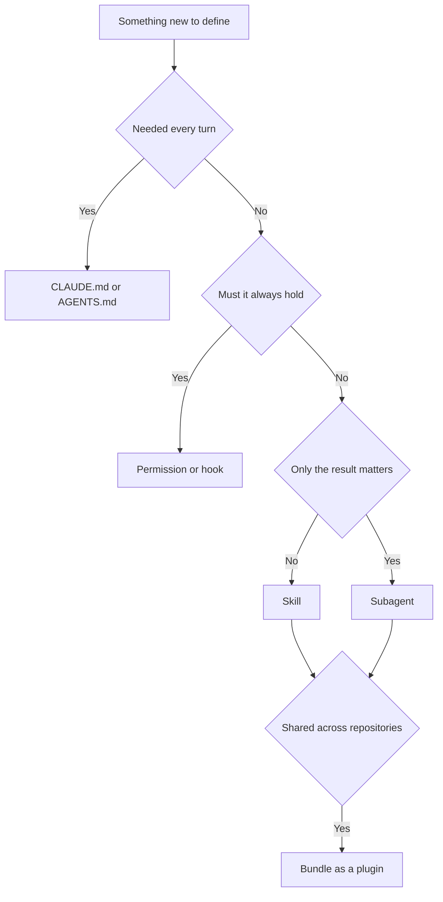

# Subagents, Skills, Commands and Plugins

> **Learning goal**: Tell apart what subagents, skills, commands and plugins hold and when each enters the context, define them as files in Claude Code and Codex, and read and change this repository's explorer, reviewer and automatic-development skill using the rule of one role per file.

As of 2026-09-29. Field names and paths follow the official Claude Code docs and Codex's public source and docs, and both change often. The concepts live in "Session · Agent · Subagent" and "Multi-agent roles and model routing"; this document turns them into **actual configuration files**. Instruction files are covered in "Instructions and Memory", permissions and hooks in "Permissions, Sandbox, Hooks".

## Key Concepts

| Component | One-line definition | When it enters the context | Claude Code location | Codex location |
|---|---|---|---|---|
| Subagent | Definition of a **worker** that runs in its own context (instructions + tools + model) | When delegated to, in a fresh context | `.claude/agents/*.md` | `.codex/agents/*.toml` |
| Skill | A **procedure and reference material** pulled in when needed | Description always, body when invoked | `.claude/skills/<name>/SKILL.md` | `.agents/skills/<name>/SKILL.md` |
| Command | A **trigger** a person pulls with `/name` | When a person types it | `.claude/commands/*.md` (merged into skills) | Invoke a skill explicitly with `$name` |
| Plugin | A **distribution unit** bundling the above with hooks and MCP servers | Every session where it is enabled | `.claude-plugin/plugin.json` + marketplace | `codex plugin` command (details need checking) |

In one sentence: **a subagent answers "who", a skill "how", a command "when a person says so", and a plugin "how do I hand this out"**. In Claude Code, custom commands have been merged into skills. `.claude/commands/deploy.md` and `.claude/skills/deploy/SKILL.md` both create `/deploy`; for new work a skill is better, since it adds supporting files and invocation-control fields.

SKILL.md follows the open [Agent Skills](https://agentskills.io) standard. The standard fields are `name`, `description`, `license`, `compatibility`, `metadata` and `allowed-tools`; fields such as `disable-model-invocation` and `context: fork` are Claude Code extensions. When both tools read the same SKILL.md, **expect the extension fields to work only in Claude Code**.

## Principles

### Context Isolation: What It Saves and What It Spends

A subagent that is not a fork **starts from an empty context**. It does not know the conversation or the files already read; it gets the delegation message and its own definition file. The tool results of a long investigation stay out of the main context, but there is a price. The subagent's requests count against **the same usage limits** as the main conversation, it spends time gathering facts again, and without a fixed summary format it returns a narrative of its process that spends the context it was meant to save. By default Claude Code allows nesting three layers deep (`CLAUDE_CODE_MAX_SUBAGENT_SPAWN_DEPTH`) and 20 concurrent subagents.

The official guidance: use the **main conversation** when the task needs frequent back-and-forth, when phases share a lot of context, for a quick targeted change, or when latency matters. Hand a **subagent** the investigations whose result is all you need, whose process is long, or that are independent of each other.

### Progressive Disclosure: Why Skills Are Cheap

1. **Listing**: every skill's name and description are always present. Claude Code spends about 1% of the context window on the listing and truncates each skill's `description` + `when_to_use` at 1,536 characters. On overflow, descriptions of the least-used skills drop first. That is why **putting "when to use it" in the first sentence of the description** is half of skill design.
2. **Body**: the SKILL.md body loads when the skill is invoked. The official advice is to keep it under 500 lines.
3. **Supporting files**: reference documents and scripts the body points to are read only when needed.

### Who Invokes It

| Purpose | Claude Code | Codex |
|---|---|---|
| Only a person invokes it (procedures with big side effects, such as deploys or automatic development) | `disable-model-invocation: true` — the description also leaves the listing | `policy.allow_implicit_invocation: false` in `agents/openai.yaml` — invoked only as `$name` |

### What Goes Where



## Applied: This Repository's Setup

### Claude Code Subagent: A Read-Only Explorer

The front matter of `.claude/agents/fast-explorer.md`:

```yaml
---
name: fast-explorer
description: Read-only search across the repository. Use when finding where something already exists would cost the main context more than the answer is worth.
tools: Read, Grep, Glob, Bash
permissionMode: plan
maxTurns: 6
---
```

| Field | Value | Why |
|---|---|---|
| `tools` | No Edit or Write | Omitting the field **inherits every tool**. The list is an allowlist |
| `permissionMode` | `plan` | Starts in read-only exploration (plan mode) |
| `maxTurns` | `6` | At the limit it stops and returns a partial result |
| `model` | Unset | The cheapest capable model wins this role, so the harness decides |

The body fixes the return format to `FILES / FINDINGS / RISK`, under 150 tokens. **The return format is the context budget.** `adversarial-reviewer.md` has the same tools and `plan` mode with `maxTurns: 8`, but leaves the model unset for a different reason: independent review is defined as "a model **different** from the implementer's", which cannot be chosen before you know who implemented.

### Codex Custom Agent: The Same Role Translated to TOML

`.codex/agents/dispatcher.toml` (excerpt):

```toml
name = "dispatcher"
description = "Low-cost first-pass request router. Classifies intent, risk, repository, cost exposure, required tools and the next agent; never edits or merges."
model = "gpt-5.6-luna"
model_reasoning_effort = "low"
sandbox_mode = "read-only"
developer_instructions = '''
You are the first-pass Dispatcher. You classify and route; you do not edit,
implement, choose product scope, approve paid automation, or merge.
'''
```

| Claude Code field | Codex counterpart | Difference |
|---|---|---|
| `name`, `description`, body | `name`, `description`, `developer_instructions` | All three are required |
| `tools` allowlist | None | `sandbox_mode` and the instructions stand in for it |
| `permissionMode: plan` | `sandbox_mode = "read-only"` | A parent runtime setting can override it, so check the effective permissions |
| `maxTurns` | None | "At most eight rounds" in the instructions is not an enforced counter |
| `model` | `model`, `model_reasoning_effort` | A model in the agent file takes precedence over the spawn request, so the reviewer file leaves it empty on purpose |

Codex spawns subagents **only when explicitly asked**. Unlike Claude Code, which delegates from descriptions alone, Codex needs its instructions to say which agent to call and when.

### Skill: Automatic Development That Never Starts Itself

`auto-dev` holds the same procedure on both platforms. The Codex side enforces its invocation policy in `.agents/skills/auto-dev/agents/openai.yaml`.

```yaml
policy:
  allow_implicit_invocation: false
```

The Claude side stops it with its description ("Invoke ONLY when the user explicitly asks…") and the body's first section, *This mode never starts itself*. To enforce it mechanically as well, `disable-model-invocation: true` could be added. That field also prevents preloading into subagents and running when a scheduled task uses the skill as its prompt.

## Going Deeper

### Writing a Command-Style Skill

```markdown
---
name: release-notes
description: Draft release notes from commits since a tag. Use only when the owner asks for release notes.
disable-model-invocation: true
argument-hint: [since-tag]
allowed-tools: Bash(git log *) Bash(git tag *)
---

Draft release notes for commits since $ARGUMENTS, grouped by user-visible change.
```

Substitutions such as `$ARGUMENTS`, `$0` and `${CLAUDE_SKILL_DIR}` are available. Put a script in the skill folder and call it as `${CLAUDE_SKILL_DIR}/scripts/…` so it works from any working directory. `context: fork` runs the skill in a subagent context, which suits long investigative procedures.

### Plugins and Marketplaces

A plugin is a folder holding a `.claude-plugin/plugin.json` manifest plus `skills/`, `agents/`, `hooks/hooks.json` and `.mcp.json`. A marketplace is a repository with a `.claude-plugin/marketplace.json` file: **a catalog, not a hosted store**. While developing, load the folder directly with `--plugin-dir`.

An enabled plugin's skill and agent descriptions enter the context **every turn**, even in sessions that never use them, and what a plugin runs, it runs **with your privileges**. Cloud sessions do not install plugins declared in repository settings, so anything a cloud session needs is committed under `.claude/` directly. For a one-person studio: first **commit `.claude/` in each repository**, and move to a plugin when you copy the same files into a third repository.

### Design Rules

1. **One responsibility per agent.** "Explore, fix and review" is three agents.
2. **Reviewers are read-only.** A reviewer that can edit implements its own opinion and then passes it.
3. **Review with a different model.** When that is impossible, label the result `FALLBACK REVIEW`.
4. **Fix the return format.** A subagent without one returns a process report.
5. **Commit capabilities.** An agent that exists only in a home folder is absent from other runs and cloud sessions.

```text
Bad:  description: Helps with code.
Good: description: Independent review of a diff against its requirement.
        Use at MEDIUM and HIGH risk, after build and tests, before merge.
```

## Common Misconceptions

- **"Leaving `tools` empty is safe."** Omission means inheriting everything. Write the list to restrict.
- **"Many skills fill the context."** Only descriptions are always present. The real problem is descriptions getting truncated so the skill is **never invoked**.
- **"More subagents are cheaper and faster."** Each rereads in a fresh context, and usage accumulates against the same limits.
- **"Codex reads Claude's setup as is."** The SKILL.md format is shared, but the folders (`.claude/skills` vs `.agents/skills`) and agent formats (Markdown vs TOML) differ.
- **"`sandbox_mode` in the agent file is the effective permission."** A parent runtime setting can override it. Check what actually applies.

## Self-Check Questions

1. What is the difference between omitting a subagent's `tools` field and writing only `Read, Grep`?
2. What symptom appears when a skill description exceeds 1,536 characters or the listing budget overflows?
3. Explain why this repository's `adversarial-reviewer` pins no model, including Codex's precedence rule.
4. State the criterion for putting a deploy procedure in CLAUDE.md, a skill or a hook.
5. When a plugin's skill does not appear in a cloud session, what do you suspect first?

## References

- [Create custom subagents](https://code.claude.com/docs/en/sub-agents) — Claude Code Docs, accessed 2026-09-29
- [Extend Claude with skills](https://code.claude.com/docs/en/skills) — Claude Code Docs, accessed 2026-09-29
- [Plugins overview](https://code.claude.com/docs/en/plugins) — Claude Code Docs, accessed 2026-09-29
- [Agent Skills](https://agentskills.io) — Agent Skills open standard, accessed 2026-09-29
- [Subagents](https://developers.openai.com/codex/subagents) — OpenAI Codex Docs, confirmed through search results, accessed 2026-09-29
- [Build skills](https://developers.openai.com/codex/skills) — OpenAI Codex Docs, confirmed through search results, accessed 2026-09-29
- This repository's `.claude/agents/`, `.codex/agents/`, `.agents/skills/auto-dev/` and `.ai/HARNESS.md` — as of 2026-09-29
