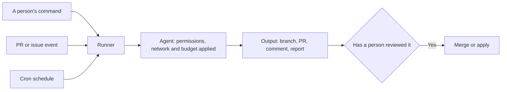

# Headless, CI and Cloud Runs

> **Learning goal**: Tell apart agent runs nobody watches (headless CLI, SDK, GitHub Actions, cloud sessions, scheduled runs), set permissions, network reach and spending limits explicitly for each, keep a record of every run, and diagnose common setup problems in order.

As of 2026-09-29. Claude Code follows its official docs, and Codex its public source and official action repository; flag names change often. Recheck every command in this document with `--help` before running it.

## Key Concepts

| Run type | Claude Code | Codex | Fits |
|---|---|---|---|
| Headless CLI | `claude -p` | `codex exec` | Ask once and get a result from a script or Makefile |
| SDK | Claude Agent SDK (Python, TypeScript) | Needs checking | Put an agent loop inside your own program |
| CI action | `anthropics/claude-code-action` | `openai/codex-action` | React to PR and issue events |
| Cloud session | Claude Code on the web | Codex cloud | Work that continues after you close the laptop |
| Scheduled run | Routines, Actions `schedule` | Actions `schedule` | Daily reports, weekly cleanups |



## Principles

### With Nobody There, Configuration Answers

In an interactive session a person answers permission prompts, stops the run and watches the cost. Headless, those answers must be **written down in advance**. `dontAsk` denies every call that would prompt and runs only what an allow rule covers, which suits a locked-down CI. The space in the rule `Bash(git diff *)` matters: written as `Bash(git diff*)`, it also matches `git diff-index`.

| Question | Claude Code | Codex |
|---|---|---|
| What may run without asking | `--allowedTools "Read,Bash(git diff *)"`, `--permission-mode dontAsk` | `--sandbox read-only` or `workspace-write` |
| How far can it reach | The cloud environment's network level, `--strict-mcp-config` | The sandbox, the cloud agent phase's internet setting |
| How much may it spend | `--max-turns`, `--max-budget-usd`, `--model` | `--model`, workflow `timeout-minutes` |

### Reproducible Runs Dislike Implicit Configuration

By default `claude -p` reads the same configuration as an interactive session (CLAUDE.md, hooks, skills, plugins, `.mcp.json`) and runs the repository's hooks and MCP servers **without a trust check**. `--bare` skips all of that auto-discovery; it is recommended for scripts and is planned to become the default for `-p`. You then pass what you need **explicitly** with `--append-system-prompt-file`, `--mcp-config`, `--agents` and `--settings`. The more a CI job runs code others submitted, the safer this is.

## Applied: This Repository's Setup

As of 2026-09-29 this repository has neither `.github/workflows/` nor `.claude/settings.json`, so the configuration below is what adoption would look like (model names are examples; `<commit-sha>` is a reviewed action commit). Before adopting, `.ai/HARNESS.md` requires two things:

- **Cost-bearing automation**: before enabling it, record the provider, billing unit, expected upper bound, owner approval and expiry. If any is unknown, do not enable it; use local verification instead.
- **Reproducing a run**: any result that will be quoted later carries the base commit, the exact command and the tool versions that command depended on.

### Headless One-Liners

```bash
claude --bare -p "Summarize the failing tests in test.log" --allowedTools "Read" --output-format json --max-turns 5 --max-budget-usd 1.00
codex exec --sandbox read-only --json -o summary.md "Summarize the failing tests in test.log"
```

- `--bare` does not read your subscription (claude.ai) login or OAuth credentials. Set `ANTHROPIC_API_KEY` before running it, and the run is billed as API usage, not against your subscription.
- Claude's `--output-format` is `text`, `json` or `stream-json`. A `json` result includes `result`, `session_id` and `total_cost_usd`, and `--json-schema` enforces a shape through `structured_output`. Follow up with `--resume <session_id>` or `--continue`; in Codex, `codex exec resume --last`.
- Codex's `--json` streams events as JSONL, and `-o` (`--output-last-message`) writes only the final answer to a file. Structured output uses `--output-schema <file>`. The `--full-auto` flag in older guides does not appear among the shared options in the main-branch source as of 2026-09, so set `--sandbox` directly. Use `--dangerously-bypass-approvals-and-sandbox` (Codex) and `bypassPermissions` (Claude) only on a disposable runner that is already isolated.

### GitHub Actions

```yaml
name: agent-review
on: pull_request
permissions:
  contents: read
  pull-requests: read
  id-token: write
jobs:
  review:
    runs-on: ubuntu-latest
    timeout-minutes: 15
    concurrency:
      group: agent-review-${{ github.event.pull_request.number }}
      cancel-in-progress: true
    steps:
      - uses: actions/checkout@<commit-sha>
      - uses: anthropics/claude-code-action@<commit-sha>
        with:
          anthropic_api_key: ${{ secrets.ANTHROPIC_API_KEY }}
          prompt: "Use the adversarial-reviewer subagent to review this pull request against its description."
          claude_args: |
            --max-turns 8
            --allowedTools "Read,Grep,Glob,Bash(git diff *)"
```

```yaml
      - uses: openai/codex-action@<commit-sha>
        with:
          openai-api-key: ${{ secrets.OPENAI_API_KEY }}
          prompt-file: .github/codex/review.md
          permission-profile: ":read-only"
          safety-strategy: drop-sudo
          output-file: codex-review.md
```

- With a `prompt`, the Claude action runs in automation mode and has neither shell nor GitHub API access beyond the tools you allow. To post results as PR comments, name the commenting tool in `--allowedTools` as the official examples do. `id-token: write` is needed for the default GitHub App authentication. The easiest install is `/install-github-app` inside Claude Code.
- The Codex action selects permissions with `permission-profile` (`:read-only`, `:workspace`, or a named profile). The `sandbox` input is legacy, and the two are mutually exclusive. The default `safety-strategy`, `drop-sudo`, removes sudo rights before Codex runs. There are also interactive integrations where a person calls `@claude` or `@codex review` on a PR.
- PRs from forks get no secrets. Working around that by checking out PR code under `pull_request_target` runs a stranger's code next to your secrets. Do not.

## Going Deeper

### Claude Agent SDK

```python
import asyncio
from claude_agent_sdk import query, ClaudeAgentOptions

async def main():
    options = ClaudeAgentOptions(allowed_tools=["Read", "Grep", "Glob"], max_turns=5, max_budget_usd=1.0)
    async for message in query(prompt="List TODO comments in src/ grouped by file.", options=options):
        print(message)

asyncio.run(main())
```

Install with `pip install claude-agent-sdk` or `npm install @anthropic-ai/claude-agent-sdk`. It gives you Claude Code's tools, agent loop and context management as a library, and it reads skills and settings from `.claude/`. From other languages, call `claude -p --output-format json` as a subprocess. Third-party products may not offer claude.ai login, so use API key authentication.

### Cloud Sessions

| Item | Claude Code on the web | Codex cloud |
|---|---|---|
| Network | Per environment: None, Trusted (default), Full or Custom | Internet during setup; agent phase blocked by default, plus an allowlist |
| Preparation | Setup script: runs as root on Ubuntu 24.04 before Claude Code starts, must exit 0 | Setup script, optional maintenance script |
| Cache | Snapshot of a setup that finishes in about five minutes, rebuilt after about seven days | Invalidated when scripts, variables or secrets change |
| Secrets | Environment variables are readable by everyone who uses the environment. Keep secrets out | Secrets go only to the setup script and are removed before the agent phase |
| Repository config | CLAUDE.md, `.claude/settings.json`, `.mcp.json`, skills and agents come along. `~/.claude` and plugins do not | Reads AGENTS.md |

In Claude Code, the setup script is for **preparing the VM** (installing tools), and a SessionStart hook is for **preparing the project** (`npm install`) in both local and cloud sessions. From the terminal, `claude --cloud "task"` creates a cloud session and `claude --teleport` pulls one back.

### Scheduled Runs

- **Claude Routines**: start a cloud session on a schedule, an API call or a GitHub event. From the CLI, use `/schedule`. The minimum interval is one hour, and a routine belongs to your personal account, so its commits and comments appear **under your name**.
- **GitHub `schedule`**: runs only on the default branch, and public repositories have schedules disabled after 60 days without activity. A scheduled prompt must not invoke a skill that "decides what to build"; that is why this repository's `auto-dev` never starts itself.

### Cost Control and Observability

| Lever | Setting | Effect |
|---|---|---|
| Model | `--model`, subagent `model: haiku` | Simple classification and search on a cheaper model |
| Turns and budget | `--max-turns`, `--max-budget-usd` (print mode, includes subagent spend) | Stops runaway runs |
| Time and concurrency | `timeout-minutes`, `concurrency` | Stops duplicate runs and endless waits |
| Records | `total_cost_usd` in JSON, `/usage`, `CLAUDE_CODE_ENABLE_TELEMETRY=1` (OpenTelemetry), Codex `[otel]` | Collects estimated cost and events. The billing console is the source of truth |

### Troubleshooting Checklist

| Symptom | Look first at | Common causes |
|---|---|---|
| The agent ignores instructions | Whether CLAUDE.md appears in `/context` | Not read under `--bare`; a subfolder CLAUDE.md loads only when a file there is read; vague or conflicting instructions. Rules that must hold belong in permissions or hooks |
| Permission prompts everywhere | `/permissions` | Rule syntax errors; allowed locally but never committed. Headless uses `--allowedTools` |
| An MCP server does not load | `/mcp`, `claude mcp list`, `codex mcp list` | Pending approval, a missing-variable warning, unfinished OAuth. Read the `claude --debug=mcp` log |
| Hooks do not fire | `/hooks` | Defined in a standalone file (must be the `"hooks"` key of a settings file), `matcher` written as an array, `--bare`, user settings absent in the cloud |
| A cloud session will not start | The setup-phase log | Script exited non-zero; installing with network level None |
| 429 or 529 errors | The error reference, `/usage` | Too many concurrent subagents or jobs. Limit concurrency, `--fallback-model` |
| No idea where to start | `/doctor` or `claude doctor`, `codex doctor` | Installation, authentication or settings-file errors |

## Common Misconceptions

- **"Headless runs with the interactive configuration."** It may (`-p`) or may load almost nothing (`--bare`). Check what was read.
- **"The agent in CI cannot see secrets."** Every step in a job can read job-level environment variables. Give keys only to the step that needs them.
- **"Cloud environment variables are a secret store."** Everyone who uses the environment can read them.
- **"`--max-budget-usd` fixes the bill."** It is a client-side estimate. The billing console is the source of truth.

## Self-Check Questions

1. How do `claude -p` and `claude --bare -p` treat the repository's hooks and `.mcp.json` differently?
2. Explain why `pull_request_target` is dangerous in a workflow that reviews fork PRs.
3. What belongs in a cloud setup script, and what in a SessionStart hook?
4. What must be recorded alongside an agent run's result so it can be quoted later?

## References

- [Run Claude Code programmatically](https://code.claude.com/docs/en/headless), [CLI reference](https://code.claude.com/docs/en/cli-reference) — Claude Code Docs, accessed 2026-09-29
- [Agent SDK overview](https://code.claude.com/docs/en/agent-sdk/overview), [Claude Code GitHub Actions](https://code.claude.com/docs/en/github-actions) — Claude Code Docs, accessed 2026-09-29
- [Claude Code on the web](https://code.claude.com/docs/en/claude-code-on-the-web), [Configure cloud environments](https://code.claude.com/docs/en/cloud-environments), [Routines](https://code.claude.com/docs/en/routines) — Claude Code Docs, accessed 2026-09-29
- [Debug your configuration](https://code.claude.com/docs/en/debug-your-config), [Monitoring](https://code.claude.com/docs/en/monitoring-usage) — Claude Code Docs, accessed 2026-09-29
- [codex-action action.yml](https://github.com/openai/codex-action/blob/main/action.yml), [codex exec CLI definition](https://github.com/openai/codex/blob/main/codex-rs/exec/src/cli.rs), [openai/codex-action](https://github.com/openai/codex-action) — OpenAI GitHub, accessed 2026-09-29
- [Non-interactive mode](https://developers.openai.com/codex/noninteractive), [Cloud environments](https://developers.openai.com/codex/cloud/environments) — OpenAI Codex Docs, confirmed through search results, accessed 2026-09-29
