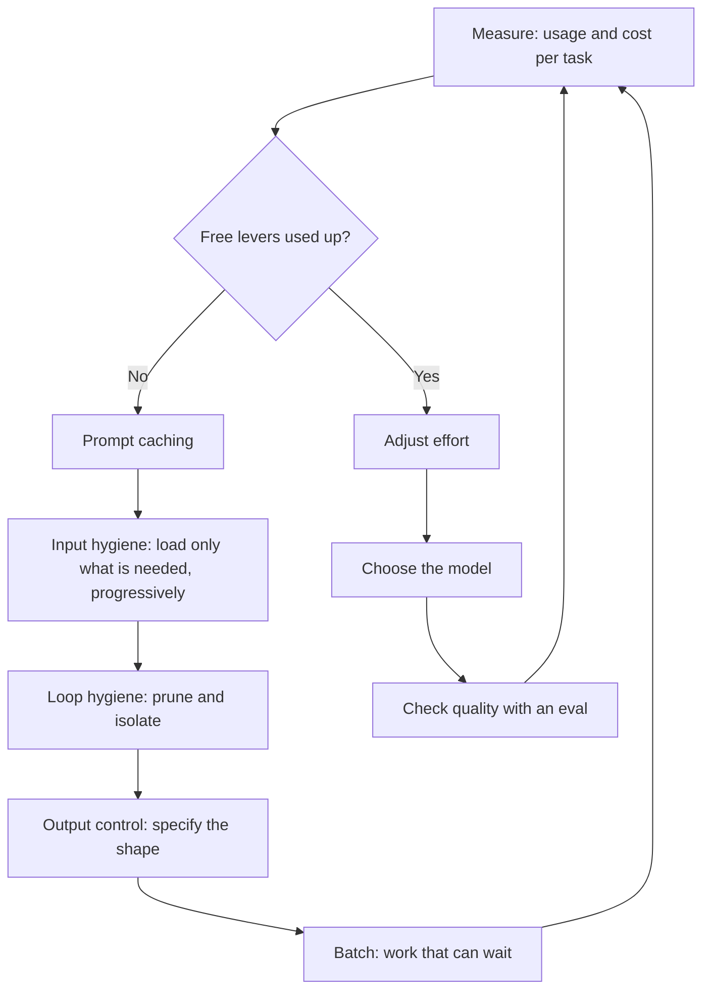

# Principles of AI Token Efficiency: Count Cost per Completed Task

> **Learning goal**: Explain what a token is and which line items you pay for, calculate why agent-loop cost compounds, and plan and measure savings in order, from free levers to trade-off levers.

In a one-person studio that builds several products with Claude Code and Codex, AI cost should be read as "how much to finish one feature", not "how much per request". This document covers the principles; tool-by-tool practice is in "Saving Tokens in Practice". Prices and features are **as of 2026-09** and include only what official documentation confirms. Dollar-to-won conversions use **1 USD = 1,400 KRW (an assumption for easy arithmetic)**.

## Key Concepts

### Tokens and tokenizers

A **token** is the unit a model processes text in. The tokenizer cuts text into tokens, and billing, context limits and speed are all set in tokens. The same text yields different token counts under different tokenizers.

| Fact | Source (checked 2026-09) |
|---|---|
| In English, roughly 1 token ≈ 4 characters ≈ 0.75 words; it varies by language and content | Anthropic Pricing FAQ |
| The tokenizer in Claude 4.7 and later models produces about 30% more tokens for the same text (content-dependent) | Anthropic Pricing |
| The same sentence translated into different languages can differ in token length by up to about 15x | Petrov et al., NeurIPS 2023 |

Whether Korean, English or code costs more, and by how much, **must be measured per model.** The "Korean costs N times more" figures that circulate online were usually measured with a different tokenizer. Count Claude tokens with the model-specific `count_tokens`, not with OpenAI's tokenizer (tiktoken). It is free (only a requests-per-minute limit applies), so prepare the same content in Korean, English and code and measure it once.

```python
import anthropic

client = anthropic.Anthropic()
for path in ["sample_ko.txt", "sample_en.txt", "sample_code.ts"]:
    text = open(path, encoding="utf-8").read()
    for model in ["claude-opus-5-5", "claude-haiku-4-5"]:
        n = client.messages.count_tokens(
            model=model,
            messages=[{"role": "user", "content": text}],
        ).input_tokens
        print(f"{path}\t{model}\t{len(text)} chars\t{n} tokens\t{len(text)/n:.2f} chars/token")
```

### What you pay for

An API response's `usage` reports four token counts separately, each at its own rate. Total prompt size is `input_tokens + cache_creation_input_tokens + cache_read_input_tokens`; `input_tokens` is only the uncached remainder.

| Item | `usage` field | Rate (relative to input price) |
|---|---|---|
| Regular input | `input_tokens` | 1x |
| Cache write | `cache_creation_input_tokens` | 1.25x for 5-minute TTL, 2x for 1-hour TTL |
| Cache read | `cache_read_input_tokens` | 0.1x (0.05x on Opus 5.5, 0.025x on Fable 5.1) |
| Output | `output_tokens` | Output price. **Includes thinking tokens**, billed even when not shown |
| Batch API | All of the above | 50% off every item, stacks with cache discounts |

| Model (2026-09, USD per 1M tokens) | Input | 5m write | 1h write | Cache read | Output |
|---|---:|---:|---:|---:|---:|
| Claude Fable 5.1 | 10 | 12.50 | 20 | 0.25 | 50 |
| Claude Opus 5.5 | 4 | 5 | 8 | 0.20 | 20 |
| Claude Sonnet 5.5 | 2 | 2.50 | 4 | 0.20 | 10 |
| Claude Haiku 4.5 | 1 | 1.25 | 2 | 0.10 | 5 |

## Principles

### 1. An agent loop resends the whole history every turn

The model remembers nothing between requests. Every turn, Claude Code and Codex resend the system prompt, tool definitions, and all prior conversation and tool results. With a fixed prefix S, growth of Δ per turn, and N turns:

```text
total_input = N*S + D*N*(N-1)/2
assumption: S = 20,000, D = 3,000, N = 30, output 800 per turn
total_input = 600,000 + 1,305,000 = 1,905,000 tokens
output      = 30 * 800 = 24,000 tokens
```

Double N and input roughly quadruples. **Prompt caching** does not stop the resending; it reprices the prefix already processed. Assume turn 1 writes S and each later turn reads the previous prompt and writes only the new Δ: that is 1,798,000 read and 107,000 written tokens (sum 1,905,000).

| Assumed 30-turn session | No cache | With cache | Ratio |
|---|---:|---:|---:|
| Opus 5.5 | 1,905,000×$4 + 24,000×$20 = **$8.10** (11,340 KRW) | 107,000×$5 + 1,798,000×$0.20 + $0.48 = **$1.37** (1,924 KRW) | about 5.9x |
| Sonnet 5.5 | 1,905,000×$2 + 24,000×$10 = **$4.05** (5,670 KRW) | 107,000×$2.50 + 1,798,000×$0.20 + $0.24 = **$0.87** (1,214 KRW) | about 4.7x |

(Each ×$ multiplies by the per-1M-token price, then divides by 1,000,000.) With caching on, the gap between the two models shrinks from 2x to about 1.6x, because both read cache at $0.20. In its published measurements, Anthropic reports that caching cut agent-loop cost by a factor of 2.7 to 5.3.

### 2. The context window is working memory

The context window is the working memory the model sees at once. A 1M-token model bills a 900k-token request at the same per-token rate as a 9k one, but **being able to fit something is not a reason to include it.** Unneeded context costs twice: once in tokens, and again in retries caused by lower quality.

- Liu et al., "Lost in the Middle" (TACL 2024): performance dropped significantly when the relevant information sat in the middle of a long input.
- Anthropic, "Effective context engineering for AI agents" (2025-09): as tokens grow, the ability to recall information from context accurately declines, a **context rot** that appears across all models; it advises finding "the smallest possible set of high-signal tokens" that maximizes the chance of the desired outcome.

### 3. The unit of cost is the completed task, not the request

When a cheap model fails, you pay its tokens, the retry, and your own time fixing it. Assuming you retry until success, **cost per completed task = cost per attempt ÷ success rate**. A setup at $0.20 per attempt with 50% success costs $0.40 per task; one at $0.30 with 90% success costs $0.33. The attempt is pricier; the task is cheaper.

In Anthropic's measurements (SWE-bench Pro, Claude Opus 5.5), running everything at `low` effort and re-running only the 13% that failed at `high` passed about 97% for about $0.17 per task, against 95.3% for $0.29 running everything at `high`. It only works when you have a failure signal (tests, a validator).

### 4. Lever order: free levers first, trade-offs later

Anthropic's cost-optimization guidance splits levers into two kinds. **Free levers** lower the price without lowering quality. **Trade-off levers** exchange intelligence for cost. The order matters.



| Kind | Lever | Effect | Condition |
|---|---|---|---|
| Free | Prompt caching | Repeated prefix at 0.1x or less | Keep the prefix byte-identical |
| Free | Input hygiene | Load reference docs and tool definitions only when needed | No gain if most calls use the whole doc |
| Free | Loop hygiene | Summarize or isolate bulky tool results | Only for long loops |
| Free | Output control | Fix the answer shape to cut output tokens | Provide a format example |
| Free | Batch | 50% off every token | Work that only needs to finish within 24 hours |
| Trade-off | Effort | Tune thinking and tool-call depth | Check quality with an eval |
| Trade-off | Model choice | Changes the unit price itself | Last, one step at a time |

### 5. How to measure

| What you want to see | Claude API | Claude Code | Codex |
|---|---|---|---|
| Tokens per request | The four fields of the response `usage` | Status line `current_usage`, `claude -p --output-format json` | `usage` on the `turn.completed` event of `codex exec --json` |
| Size before sending | `POST /v1/messages/count_tokens` | `/context` (context breakdown and optimization suggestions) | `/status` (configuration and token usage) |
| Session and account totals | Console Usage, Usage & Cost Admin API | `/usage` (`/cost` is an alias), including a cache hit-rate line | `/usage` (account usage) |

Codex's `usage` carries `cached_input_tokens` and `reasoning_output_tokens` separately, so cache hits and reasoning tokens can be told apart (openai/codex source, checked 2026-09). The dollar figure in Claude Code's `/usage` is a list-price estimate; on a subscription plan, read it as plan-limit consumption rather than cost.

## Applied: A Day in a Solo Studio

| Time | Task | Tool · model | Tokens (assumed) | Cost |
|---|---|---|---|---|
| 09:00 | Build the checkout screen, 30 turns | Claude Code · Opus 5.5 `medium` | Read 1,798,000 / write 107,000 / output 24,000 | $1.37 |
| 12:30 | Resume the same session after lunch; the 5-minute TTL has passed, so the 107,000-token prefix is rewritten | Claude Code · Opus 5.5 | Write 107,000 | 107,000×$5 = $0.54 ($0.02 on a hit) |
| 14:00 | Refactor another product | Codex CLI | Input 400,000 (320,000 cached) / output 30,000 (18,000 reasoning) | Drawn from the ChatGPT plan limit |
| 22:00 | Generate 1,000 product descriptions | Claude API · Sonnet 5.5 Batch | 2,000 input / 500 output each | $9.00 standard → $4.50 Batch |

All numbers are assumptions, and Claude is assumed to run on an API key, converted to dollars. The Claude total is $1.37 + $0.54 + $4.50 = **$6.41** (about 8,970 KRW). The lines to notice are not model prices but **one cache miss** (about 25x a hit) and **work that could run overnight** (halved by Batch). For gaps of 5 to 60 minutes the 1-hour TTL pays off. On models with cheap cache reads such as Opus 5.5 and Fable 5.1, though, a 5-minute TTL plus a `max_tokens: 0` keep-alive can be cheaper (see the Cache break-even section below). Past an hour, as here, neither TTL helps, so `/clear` before lunch or accept the cold miss. Tool-by-tool methods are in "Saving Tokens in Practice".

## Going Deeper

### A tokenizer change distorts price comparisons

Moving from Sonnet 4.6 ($3/$15) to Sonnet 5 ($2/$10) cuts the input price by 33%, but the new tokenizer produces about 30% more tokens for the same text. Text that was 1,000,000 tokens under the old tokenizer becomes about 1,300,000, so 1.3×$2 = $2.60: about 13% cheaper than $3. When switching models, compare **`usage` on the same task**, not the price table.

### Cache break-even

The 5-minute TTL already pays on the second request: 1.25 + 0.1 = 1.35 < 2 (two uncached requests). The 1-hour TTL pays from the third: 2 + 0.1×2 = 2.2 < 3. On Opus 5.5, reads are 0.05x, so 1.25 + 0.05 = 1.30. If requests start less than 5 minutes apart, the 5-minute TTL is always cheaper; at 5 to 60 minutes, the 1-hour TTL usually wins. The exception is models with cheap reads, such as Opus 5.5 (0.05x reads) and Fable 5.1 (0.025x). A keep-alive that stays on the 5-minute TTL and, during a pause, re-sends the previous request with `max_tokens: 0` every 4 minutes pays only a read per refresh. In Anthropic's "Optimizing for cost and intelligence" measurements, on Opus 5.5 this cost 8-13% less than the 1-hour TTL when only 5-10% of turns followed a pause of 6 to 32 minutes (at `medium` effort), but more when every turn followed a pause. On Fable 5.1 it cost 13-20% less when pauses ran for minutes. Those measurements sent the keep-alive with `max_tokens: 1`; whether `max_tokens: 0` refreshes an existing entry was not measured on Opus 5.5. A `max_tokens: 0` request cannot be combined with `stream: true` or Batch.

### Thinking tokens bill at the output rate

Even if the visible answer is 500 tokens, 4,000 thinking tokens make the Opus 5.5 output cost 4,500×$20 = $0.09. Counting only the visible part gives $0.01, a 9x underestimate. Opus 5.5, Sonnet 5.5 and the Fable models cannot turn thinking off; effort is the only control (Claude Code docs, 2026-09).

## Common Misconceptions

- **"The cheap model is always cheaper."** Cost per task = cost per attempt ÷ success rate, and caching narrows the gap between models.
- **"Turn caching on and it just works."** A timestamp or UUID in the system prompt, unsorted JSON, or a tool list that changes per turn breaks the cache without any error. Confirm with `cache_read_input_tokens`.
- **"Writing in Korean costs N times more."** It depends on the tokenizer. Trust only what you measured with `count_tokens`.
- **"With a big context window, include everything."** The price per token is the same, but quality can drop (context rot).
- **"Lowering `max_tokens` saves money."** The model never sees it. A response that hits it is a truncated failure that costs a retry. To shorten answers, specify the shape; to shorten thinking, lower effort.
- **"`/compact` is free."** The summarization request itself reads the whole conversation. After the cache has gone cold, it is expensive.

## Self-Check Questions

1. What do you miss if you look only at `input_tokens` among the four `usage` fields and conclude "input was only 4K"?
2. With S = 10,000, Δ = 2,000 and N = 20, what is the total uncached input in tokens?
3. Which is cheaper per task: $0.10 per attempt at 40% success, or $0.25 per attempt at 95% success?
4. Which TTL fits a feature whose requests arrive about 20 minutes apart, and why?
5. Why do effort and model choice come last in the lever order?

## References

- [Pricing](https://platform.claude.com/docs/en/about-claude/pricing) — Anthropic, checked 2026-09-29
- [Prompt caching](https://platform.claude.com/docs/en/build-with-claude/prompt-caching) — Anthropic, checked 2026-09-29
- [Token counting](https://platform.claude.com/docs/en/build-with-claude/token-counting) — Anthropic, checked 2026-09-29
- [Optimizing for cost and intelligence](https://platform.claude.com/docs/en/about-claude/models/optimizing-for-cost-and-intelligence) — Anthropic, checked 2026-09-29
- [Manage costs effectively](https://code.claude.com/docs/en/costs) · [Commands](https://code.claude.com/docs/en/commands) — Claude Code Docs, checked 2026-09-29
- [Effective context engineering for AI agents](https://www.anthropic.com/engineering/effective-context-engineering-for-ai-agents) — Anthropic Engineering, 2025-09
- [Lost in the Middle: How Language Models Use Long Contexts](https://aclanthology.org/2024.tacl-1.9/) — Liu et al., TACL 2024
- [Language Model Tokenizers Introduce Unfairness Between Languages](https://arxiv.org/abs/2305.15425) — Petrov et al., NeurIPS 2023
- [openai/codex `exec_events.rs`](https://github.com/openai/codex/blob/main/codex-rs/exec/src/exec_events.rs) — OpenAI, checked 2026-09-29
