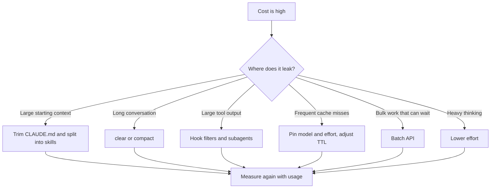

# Saving Tokens in Practice, Tool by Tool

> **Learning goal**: Find where tokens leak in Claude Code, Codex and your own API apps, cut them with tool-specific settings and habits, and compare before and after in numbers.

The principles (billing line items, loop compounding, lever order) are in "Principles of AI Token Efficiency". This document is the tool-by-tool practice. Where configuration files live and how they combine is in "Agent Setup Map"; writing instructions in "Instructions and Memory"; permissions and hooks in "Permissions, Sandbox, Hooks"; subagents and skills in "Subagents, Skills and Plugins"; MCP in "MCP and External Tools"; and cost control for headless runs and CI in "Headless, CI and Cloud Runs". Here we cover only the token angle. Commands and settings keys are **as of 2026-09**, limited to what official documentation and source confirm. Dollar-to-won conversions use 1 USD = 1,400 KRW (an assumption).

## Key Concepts

### Three directions: put in less, repeat less, generate less

| Direction | Meaning | Typical means |
|---|---|---|
| Put in less | Keep each request's context small | Short CLAUDE.md and AGENTS.md, skills, MCP tool search, narrow file reads, output filters |
| Repeat less | Re-send the same prefix cheaply | Keep prompt caching intact, pin model and effort, cut history with `/clear`, isolate with subagents |
| Generate less | Reduce output and thinking | Specify the output shape, tune effort, Batch |

When cost spikes, do not guess; find where it leaks first.



## Principles

### Claude Code

| Method | What it cuts | Command or setting (2026-09) |
|---|---|---|
| Keep CLAUDE.md under 200 lines; move task-specific instructions into skills | Base context carried every turn | `/memory`, `/context` |
| Skills keep only their description resident; the body loads when invoked | Base context | `/skills`, press `t` to sort by token count |
| Hand high-output work such as exploration, logs and tests to subagents | Main conversation context | `model: haiku` in the subagent configuration |
| `/clear` when the task changes, `/compact <what to keep>` at boundaries, `/rewind` for a wrong turn | History | `/autocompact 500k` |
| Keep side questions out of the history | History | `/btw` |
| Choose model and effort at session start and do not change them midway | Cache misses | `/model`, `/effort` |
| MCP tool definitions are deferred by default (tool search). Disable unused servers, and prefer a CLI when one exists | Starting context | `/mcp`, `/context` (`ENABLE_TOOL_SEARCH` only needed via a proxy or custom base URL) |
| Filter test output with a hook so only failing lines remain | Tool output | `PreToolUse` hook |
| Name the file and function instead of "improve the codebase" | Read volume | Specific prompts, plan mode |
| An API-key user keeps using the same session after long gaps | Cache misses | `promptCacheTtl: "1h"` |

**`.claudeignore` is not an official feature** (absent from the official docs as of 2026-09; GitHub has only feature requests). Block files that never need reading with `Read` rules under `permissions.deny`. Such a rule stops Claude's file tools but is not a security boundary, so follow "Permissions, Sandbox, Hooks" for permission design.

```json
{
  "permissions": {
    "deny": ["Read(./dist/**)", "Read(./coverage/**)", "Read(./.env)"]
  },
  "autoCompactWindow": "500k"
}
```

Know which actions break the cache and which keep it (Claude Code, "How Claude Code uses prompt caching").

| Breaks the cache | Keeps the cache |
|---|---|
| Switching models (including `opusplan` plan-mode toggles and a skill that names a `model`) | Editing repository files (only a change notice is appended) |
| Changing effort on most models (kept on Opus 5.5, Sonnet 5.5 and Fable 5.1 with an API key or subscription) | Editing CLAUDE.md (but it does not apply until `/clear`, `/compact` or a restart) |
| Turning on fast mode; MCP connection changes while tool search is off | Changing permission mode, invoking skills and commands, `/recap`, `/rewind` |
| `/compact` (rewrites the conversation layer); the first session after a Claude Code upgrade | Spawning a subagent (the parent prefix is untouched) |

### Codex

| Method | What it cuts | Setting or command (2026-09, checked in openai/codex source) |
|---|---|---|
| Keep AGENTS.md short. The combined size cap defaults to 32 KiB, and a cap is not a target | Base context every turn | `project_doc_max_bytes` |
| Match the reasoning level to the task; the options vary by model | Reasoning tokens | `model_reasoning_effort`, `plan_mode_reasoning_effort` |
| Create configuration layers per kind of work | Wrong defaults | `codex --profile <name>` → `$CODEX_HOME/<name>.config.toml` |
| Summarize a long conversation or start fresh | History | `/compact`, `/new` |
| Check usage | Measurement | `/status`, `/usage` |
| Run repeated jobs non-interactively and fix the result shape | History and output | `codex exec --json`, `--output-schema` |

There are also `tool_output_token_limit` (the token budget for storing tool output in context) and `model_auto_compact_token_limit` (the auto-compact threshold), but their defaults vary by version and need checking. `profile` and `[profiles.<name>]` inside config.toml are legacy: using `--profile <name>` while config.toml also has `profile = "<name>"` or `[profiles.<name>]` is an error that tells you to move them into `$CODEX_HOME/<name>.config.toml`.

```bash
codex exec --profile cheap --json "Summarize the last 10 commits into CHANGELOG.md" > run.jsonl
jq -s '[.[] | select(.type=="turn.completed") | .usage] | {input: (map(.input_tokens) | add), cached: (map(.cached_input_tokens) | add), reasoning: (map(.reasoning_output_tokens) | add)}' run.jsonl
```

### Your own API apps

- **Caching design**: render order is `tools` → `system` → `messages`, and a single differing byte invalidates everything after it. Put what never changes first and what changes per turn last. There are at most 4 breakpoints, or a top-level `cache_control` can place them automatically. The minimum cacheable length varies by model (512 to 4,096 tokens); anything shorter silently does not cache.
- **Silent invalidators**: the current time or a UUID in the system prompt, unsorted JSON serialization, per-user tool lists, conditionally appended system sections. Put dynamic instructions late in `messages`.
- **Batch API**: work that can wait gets 50% off every token, stacking with cache discounts. Most batches finish within an hour; requests still unprocessed after 24 hours expire.
- **Context editing and compaction (beta)**: context editing clears old tool results to free the window; it is not a savings lever. Every clear rewrites the cache. Prune rarely and in large batches.
- **Output shape**: in Anthropic's measurements, a memo-style answer used six times the output tokens and cost 2.8 times a one-line answer, with accuracy within run-to-run noise. Specify the shape with an example, and keep `max_tokens` only as a backstop.
- **Let the model look things up instead of stuffing**: move large reference docs behind a tool or skill, and use tool search (`defer_loading`) once tool definitions pass roughly 10K tokens. In Anthropic's measurements it cost 45% less at 502 tools. Measure user input with `count_tokens` first and trim it.

### Comparison with other vendors (as of 2026-09)

| Item | Anthropic Claude API | OpenAI API | Google Gemini |
|---|---|---|---|
| Mechanism | Explicit `cache_control` or top-level automatic | Automatic (prefixes of 1,024 tokens or more) | Implicit automatic + explicit manual |
| Cache read | 0.1x input (0.05x Opus 5.5, 0.025x Fable 5.1) | Up to 90% off (per-model cached-input price) | 90% off on Gemini 2.5 and later |
| Cache write | 1.25x (5 minutes), 2x (1 hour) | Needs checking (secondary sources do not confirm a write multiplier) | Standard input price; explicit adds hourly storage cost |
| Lifetime | 5 minutes or 1 hour | 30-minute window on the GPT-6 family (Sol · Luna) (announced 2026-09-22, confirmed only by secondary sources) | Explicit caches take a set TTL |
| Batch | 50% | 50% | 50% |

## Applied: A Day in a Solo Studio

These are anti-patterns that show up often in a real day. All token counts and costs are **assumptions**, with Claude on an API key and Opus 5.5.

| Anti-pattern | Bad example (assumed) | Good example (assumed) | Difference |
|---|---|---|---|
| Bloated CLAUDE.md | 600 lines ≈ 12,000 tokens carried for 30 turns | 150 lines ≈ 3,000 tokens + 2 skills | Turn-1 write 9,000×$5 + turns 2–30 reads 261,000×$0.20 ≈ **$0.10/session** |
| Whole test log | A 40,000-token log carried for the next 15 turns | Hook keeps 1,500 tokens of failing lines | 38,500×$5 + 577,500×$0.20 ≈ **$0.31/run** |
| Exploring 20 files in the main session | 60,000 tokens carried for the next 20 turns: $0.30 + $0.24 = $0.54 | A Haiku 4.5 subagent explores and returns only a 1,000-token summary ≈ $0.14 | **about $0.40/run** |
| Switching to Sonnet for a side question | Sonnet 5.5 rewrites the 150,000-token context: $0.375 | Ask Opus as is: 150,000×$0.20 = $0.03 | **about 12.5x** |
| Current time in an API app's system prompt | 10,000 tokens × 2,000 requests a day, rewritten every time: 20M×$2.50 = $50/day (Sonnet 5.5) | Move the time into the user message: 20M×$0.20 ≈ $4/day | **about $46/day** |

The last row is more expensive than not caching at all (20M×$2 = $40/day): a broken cache pays only the write premium. The subagent row's $0.14 is Haiku-side writes 60,000×$1.25 + reads 300,000×$0.10 + output 5,000×$5 = $0.13, plus about $0.01 for returning the summary. When caching works well, as in the CLAUDE.md row, the dollar difference is small. You still trim for context quality and for what a cache miss costs.

**Solo studio checklist**

- [ ] Each product repository's CLAUDE.md and AGENTS.md stays under 200 lines, with procedural instructions in skills
- [ ] Model and effort are chosen at session start, and `/clear` runs when the task changes
- [ ] Logs, tests and exploration go through subagents or hooks so only summaries reach the main conversation
- [ ] Unused MCP servers are off, and `/context` checks the starting context once a week
- [ ] Build output and minified files are in `Read` deny rules
- [ ] Bulk generation that can run overnight goes through the Batch API, and repeated coding jobs through `codex exec` scripts
- [ ] API apps assert `cache_read_input_tokens > 0` in a test
- [ ] The `/usage` cache hit-rate line and the monthly bill are recorded once a month

## Going Deeper

### When savings levers collide

Every saving that changes the prefix breaks the cache once. Compaction, context editing and client-side history pruning all do, and a subagent starts from a fresh prefix that shares no cache with its parent. Launch several workers on the same prefix at once and none can read the others' cache; each writes its own. The rule is to prune **rarely, in large batches, at natural boundaries**. The Claude Code docs' figure that agent teams use about 7x the tokens of a standard session in plan mode comes from the fact that each teammate keeps its own context.

### One lever at a time, confirmed by measurement

Change one lever, rerun the same task, and read `usage` and output quality together. Keep it if it helps; revert it if not. Change two at once and you cannot tell which one worked. Change quality-affecting levers such as effort and model only when you have a pass bar such as tests or a checklist.

## Common Misconceptions

- **"Just create a `.claudeignore`."** It is not an official feature as of 2026-09. Use `Read` deny rules.
- **"Switching to a cheaper model for a moment is cheaper."** The new model has no cache and rewrites the whole conversation.
- **"Subagents always save money."** A subagent sends its own requests and starts from a fresh prefix. It pays only when it isolates high-output work.
- **"Editing CLAUDE.md takes effect immediately."** It applies on the next `/clear`, `/compact` or restart.
- **"Context editing is a savings feature."** It is a tool for freeing the window. Used often, it keeps breaking the cache.

## Self-Check Questions

1. If `/context` shows a large MCP entry, what would you check and change first?
2. Name two alternatives to switching models for a side question.
3. In Codex, which output do you read, and how, to total the token usage of a nightly job?
4. If an API app's `cache_creation_input_tokens` equals the whole conversation size on every request, what do you suspect?
5. Which checklist item will you apply first this week, and how will you measure it?

## References

- [Manage costs effectively](https://code.claude.com/docs/en/costs) — Claude Code Docs, checked 2026-09-29
- [How Claude Code uses prompt caching](https://code.claude.com/docs/en/prompt-caching) — Claude Code Docs, checked 2026-09-29
- [Explore the context window](https://code.claude.com/docs/en/context-window) · [Model configuration](https://code.claude.com/docs/en/model-config) — Claude Code Docs, checked 2026-09-29
- [Configure permissions](https://code.claude.com/docs/en/permissions) — Claude Code Docs, checked 2026-09-29
- [Prompt caching](https://platform.claude.com/docs/en/build-with-claude/prompt-caching) · [Batch processing](https://platform.claude.com/docs/en/build-with-claude/batch-processing) — Anthropic, checked 2026-09-29
- [Optimizing for cost and intelligence](https://platform.claude.com/docs/en/about-claude/models/optimizing-for-cost-and-intelligence) — Anthropic, checked 2026-09-29
- [openai/codex](https://github.com/openai/codex) — `codex-rs/core/src/config/mod.rs`, `codex-rs/exec/src/cli.rs`, `codex-rs/tui/src/slash_command.rs`, checked 2026-09-29
- [Codex configuration reference](https://developers.openai.com/codex/config-reference) — OpenAI, checked via search results 2026-09-29
- [Prompt caching](https://developers.openai.com/api/docs/guides/prompt-caching) · [Pricing](https://developers.openai.com/api/docs/pricing) · [Better prompt caching for GPT-6](https://openai.com/index/better-prompt-caching-for-gpt-6/) — OpenAI, checked via search results 2026-09-29 (announced 2026-09-22 per secondary sources; original not checked)
- [Context caching](https://ai.google.dev/gemini-api/docs/caching) · [Context caching overview (Google Cloud)](https://docs.cloud.google.com/vertex-ai/generative-ai/docs/context-cache/context-cache-overview) · [Batch API](https://ai.google.dev/gemini-api/docs/batch-api) — Google, checked via search results 2026-09-29
- [.claudeignore feature request #29455](https://github.com/anthropics/claude-code/issues/29455) — GitHub, checked via search results 2026-09-29
