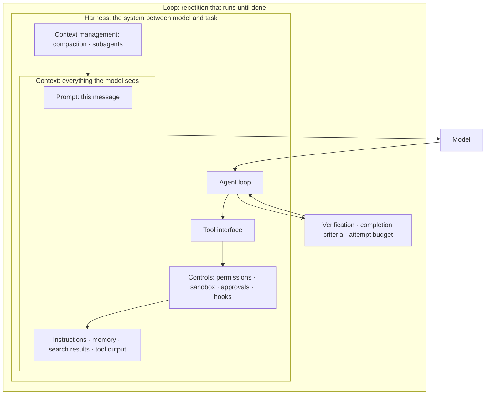

# Layers of AI Engineering: Prompt, Context, Harness

> **Learning goal**: Tell apart what prompt, context, harness and loop engineering each design, decide which layer a failure in front of you belongs to, and then design your own repository's harness, and measure changes to it, on the principle "instructions request; hooks and permissions enforce".

When the same model given the same job produces different results, what differs is everything outside the model. This document splits that outside into four layers: this message (prompt), everything the model sees (context), the system between the model and the task (harness), and the repetition that runs until the work is done (loop). Where configuration files live is in "Agent Setup Map"; writing instructions in "Instructions and Memory"; implementing permissions and hooks in "Permissions, Sandbox, Hooks"; subagents and skills in "Subagents, Skills and Plugins"; and external tools in "MCP and External Tools". Here we stay at the level of concepts, principles and design decisions. The loop layer gets its own in-depth treatment in "Loop Engineering", and "Reverse Engineering: Law and Lawful Uses", despite the shared word, covers legal questions rather than this layer structure. Term origins and case studies are **as of 2026-09**, limited to what could be confirmed, and sources whose originals could not be opened directly are marked as such.

## Key Concepts

### Four layers wrap from the inside out



Each outer layer contains the inner ones. A good prompt is useless if the context lacks the facts it needs; good context still ends in an incident if the harness cannot stop a dangerous action; and a sturdy harness still yields false completion if the loop cannot verify "done".

| Layer | What is designed | Scope | Failure it prevents | Typical artefacts |
|---|---|---|---|---|
| Prompt | The wording, examples and output format of this request | One message | Wrong format, ambiguous requests, off tone | Prompt templates, few-shot examples, output schemas |
| Context | The makeup of every token the model sees in one inference | One request (one window) | Unknown facts, stale information, lost focus from context rot | CLAUDE.md and AGENTS.md, document indexes, search tools, compaction rules |
| Harness | The agent loop, tools, context management and controls | Session and repository | Forbidden actions, the same mistake repeated, tool misuse | Permission rules, sandbox, hooks, subagent definitions, linters, structural tests |
| Loop | Completion criteria, verification and stop rules for the repetition | Until one task is finished | Never finishing, false claims of success, repeating the same attempt | Completion criteria, verification commands, attempt budget, state files |

### The order in which the names arrived

| Layer | When it spread | Trigger | Confirmation level |
|---|---|---|---|
| Prompt | Early 2020s | Spread of conversational LLMs | Common knowledge |
| Context | Around June 2025 | Tobi Lütke and Andrej Karpathy spoke of "context engineering rather than prompt engineering". Anthropic "Effective context engineering for AI agents" (2025-09-29) | Anthropic post read in the original; the June remarks confirmed via search results |
| Harness | February 2026 | Anthropic already used "harness" in the title of its 2025-11-26 post "Effective harnesses for long-running agents" (original checked); the discipline name "harness engineering" spread in February 2026. Mitchell Hashimoto listed "Engineer the Harness" as a step in a post (early February). OpenAI, Ryan Lopopolo, "Harness engineering: leveraging Codex in an agent-first world" (2026-02-11 per secondary sources). Birgitta Böckeler systematised it on martinfowler.com (2026-04) | Anthropic post: original checked; the rest confirmed via search results (originals not checked) |

The Anthropic post separates the two like this. Prompt engineering is "methods for writing and organizing LLM instructions for optimal outcomes"; context engineering is the "set of strategies for curating and maintaining the optimal set of tokens (information) during LLM inference". The goal is "the smallest possible set of high-signal tokens that maximize the likelihood of some desired outcome".

### The four parts of a harness

| Part | What it decides | Details |
|---|---|---|
| Agent loop | The cycle of model call → tool execution → feeding results back, and when it ends | "Session · Agent · Subagent" |
| Tool interface | What the model can do, and what shape the results come back in | "MCP and External Tools" |
| Context management | What stays resident, when to load more, and when to summarise or isolate | "Instructions and Memory", "Subagents, Skills and Plugins" |
| Controls | Permissions, sandbox, approvals, hooks: what runs regardless of the model's judgement | "Permissions, Sandbox, Hooks" |

Böckeler is reported to divide a harness into **guides** (feedforward that steers before the agent acts) and **sensors** (feedback that observes after it acts so it can self-correct), and to split each again into deterministic **computational** controls (linters, tests) and model-judged **inferential** ones (LLM review) (confirmed via search results). The same framework separates the inner harness built by the tool vendor from the outer harness the user adds on top. A solo studio designs the outer harness.

## Principles

### 1. Requests ask; enforcement blocks

| Means | Nature | If it is broken |
|---|---|---|
| Prompts, CLAUDE.md and AGENTS.md, skill bodies | **Request**: the model reads it and tries to follow it | If the model forgets or reinterprets it, the action happens anyway |
| Permission rules, sandbox, approvals, hooks, tests in CI | **Enforcement**: the harness or the OS executes it | The tool call is refused or the merge is blocked |

The Claude Code documentation calls CLAUDE.md and auto memory "context, not enforced configuration", and says to use a `PreToolUse` hook to block an action regardless of what the model decides. Permission rules in settings are "enforced by the client regardless of what Claude decides to do", and hooks give "deterministic control" that does not rely on the LLM choosing to run them. The design rule is one line: **a request broken twice gets promoted to enforcement.** Conversely, making everything enforced blocks work that needs judgement. Keep enforcement for "must never happen" and "a machine can decide it".

### 2. Fix the environment, not the prompt

Adding "be careful next time" to the prompt after an agent's mistake is a request that lasts one session. Harness engineering starts by reading the mistake as **a signal of a defect in the environment**. The OpenAI team reportedly asked, whenever the agent got stuck, "what capability is missing, and how do we make it both legible and enforceable", then added the missing tool, document or check to the repository, with Codex writing that fix too. The team reportedly produced about 1,500 PRs and about a million lines over about five months with no hand-written code (starting with three engineers; per secondary sources, original not checked). What is worth copying is the order rather than the numbers: mistake → decide the layer → permanent fix in the repository → confirm the same mistake is now structurally impossible.

### 3. AGENTS.md is a map, not a manual

The entry file is loaded into context every turn, so the longer it is, the more it costs and the less it is followed. The Claude Code documentation recommends keeping each CLAUDE.md under 200 lines. After one big AGENTS.md failed, the OpenAI team reportedly decided to "give Codex a map, not a 1,000-page instruction manual": an AGENTS.md of roughly 100 lines pointing to design docs, architecture maps and execution plans under `docs/` (confirmed via search results). An entry file holds only the role, what to read first, and when to read what else.

### 4. Let machines check the rules

Writing "respect the layer direction" as a sentence is a request; writing a structural test that checks dependency direction is enforcement. The OpenAI team reportedly checked architecture rules with custom linters and structural tests and **put remediation instructions into the linter error messages** so they landed straight in the agent's context (confirmed via search results). The error message effectively becomes the next prompt. A solo studio can start by making the failure messages of its existing type checker, linter and tests easy for an agent to read.

### 5. Tool output becomes feedback

An agent can only fix what it can see. The OpenAI team reportedly let the agent query a browser (Chrome DevTools Protocol) and logs and metrics directly, so it could confirm UI and performance problems itself (per secondary sources). Two principles follow. Return verification results **in a form the agent can read**, and return **only the lines needed for a decision**, not the whole log. The second is also a cost issue ("Principles of AI Token Efficiency").

### 6. Deciding which layer a failure belongs to

| Symptom | Layer | Check first |
|---|---|---|
| Prose instead of JSON, length or tone not as requested | Prompt | Were the format and examples specified? |
| Does not know repository rules, uses a stale API | Context | Was that fact in `/context`, and was there a tool to find it? |
| Forgets earlier decisions after a long session | Context | Is the history too long; compaction and state notes |
| A forbidden action such as editing `.env` or a force push | Harness | Was the prohibition a request or enforcement? |
| The same rule violation in every session | Harness | Is there a linter or test that checks it? |
| "Done" without running tests, or endless retries | Loop | Is completion decided mechanically; is there an attempt cap? |

Read the table from the top and start at the first row that fits. One more rule: **if a fix in one layer is followed by the same failure, suspect the next layer out.** If it recurs after two prompt fixes, it is a context or harness problem.

### 7. Loop engineering at a glance

The loop layer designs "when can we say it is finished". Let a machine decide the completion criteria, as a test does; cap retries of the same failure; and for work that spans sessions, leave progress in files and in git. Anthropic's post on long-running agents (2025-11-26) reports the failure where Claude "declares victory on the entire project too early", and answers it with a feature list file, a progress log, finishing one feature at a time, and end-to-end tests. How to design this is in "Loop Engineering".

## Applied: Reading This Repository's Harness by Layer

The file layout is in "Agent Setup Map". Here we map **what actually exists** in this site's repository onto the four layers.

### Layer by layer

| Layer | What this repository has | Request / enforcement |
|---|---|---|
| Prompt | No committed prompt templates. The `adversarial-reviewer` and `fast-explorer` definitions fix the return format (`PASS`/`FAIL` blocks; `FILES:`, `FINDINGS:`, `RISK:`) | Request |
| Context | `CLAUDE.md` (31 lines) and `AGENTS.md` (34 lines) point to three `.ai/` files to read at the start and to files to load per trigger. `.ai/HARNESS.md` defines entry files as "contracts, not manuals" | Request |
| Harness: delegation | Two Claude agents (`tools` allowlist, `permissionMode: plan`, `maxTurns` 6 and 8) and three Codex agents (`sandbox_mode = "read-only"`) | Partly enforced |
| Harness: invocation control | Two editions of the `auto-dev` skill. The Codex edition has `allow_implicit_invocation: false`; the Claude edition blocks only through its description and first section | Enforced in Codex, requested in Claude |
| Harness: checks | `tests/*.test.cjs` (nav title counts in both languages, heading order, fences, leftover Korean, Mermaid edge comparison) and `.ai/tools/check_policy_set.py` | Checks with teeth, but nothing runs them automatically |
| Harness: permissions and hooks | No committed `.claude/settings.json`, hook scripts, `.mcp.json` or CI configuration (`.github/`) | None |
| Loop | The attempt budget in `.ai/LOOP.md` (stop after three attempts on one failure) and its non-convergence signs; `auto-dev`'s propose → challenge → execute → verify order | Request |

### Three visible gaps

1. **The same rule has different force in different tools.** The explorer's "at most six rounds" is enforced in Claude as `maxTurns: 6` but is a sentence in the instructions for Codex. `.ai/HARNESS.md` admits that "Claude's tool allowlists and `maxTurns` are not Codex configuration keys". And a Claude agent's `permissionMode: plan` is ignored when the parent session is in `acceptEdits`, `auto` or `bypassPermissions` ("Permissions, Sandbox, Hooks").
2. **The checks exist, but they do not run unless someone calls them.** The tests are a good sensor that mechanically checks the structure of Korean and English pairs such as this document. With no hook and no CI, though, whether they run depends on the agent following an instruction. A check with teeth is being invoked by request.
3. **The two entry contracts read the same situation differently.** This repository has no `.ai/PROJECT_CONTEXT.md`, only its template. When it is missing, `CLAUDE.md` says "the set is not adopted here: stop and run `python3 .ai/tools/adopt.py`", while `AGENTS.md` says that when maintaining the policy template itself (`LESSONS_FROM_PRACTICE.md` is present), "project instance files are intentionally absent; do not create them". `check_policy_set.py` also reads this state as "the set as shipped" and passes. When human-written requests disagree, different models behave differently. This is a defect in the context layer.

**Next step.** Do not fill every gap at once. Pick the request broken most often, move it to enforcement, and compare before and after as in the *Measuring a harness change* section below. In this repository the candidate is moving "run `node --test tests/*.test.cjs` before finishing" into a `Stop` hook or CI. The hook settings format and a `Stop` hook example are in "Permissions, Sandbox, Hooks", and the CI draft is in "Headless, CI and Cloud Runs". Neither has a hook that runs the tests, so build one from those examples.

## Going Deeper

### Harness investment versus model upgrades

Models improve every few months, and an upgrade is usually one line of configuration. A harness has to be built and maintained by you. So sort harness parts into two kinds. **Parts that hold the project's facts and rules** (tests, architecture checks, permissions, the document map) keep their value when the model changes, and a better model makes better use of them. **Parts that compensate for a model's weaknesses** (long prompts that dictate every step, workaround instructions for a specific mistake) may become unnecessary or even get in the way when the model changes. At each upgrade, remove the latter one at a time and check against a fixed task set. This split is this document's design judgement, not a conclusion confirmed by published measurement.

### Harness lock-in

Permission syntax, hook event schemas and agent definition formats differ from tool to tool. This repository writes the same roles twice, as `.claude/agents/*.md` and `.codex/agents/*.toml`, and the same skill twice, under `.claude/skills/` and `.agents/skills/`, and in the process it gained rules such as `maxTurns` that are enforced on one side only: a real example of lock-in cost. The response is to keep the substance of each rule in a **portable layer** (tests, scripts, Markdown documents) and keep the tool-specific files as thin wrappers that call it. For example, write a prohibition once as a script and have both the Claude hook and the Codex hook call that script.

### Measuring a harness change

Confirm the effect of a harness change with **a before/after comparison on a fixed task set**, not a feeling. Anthropic's "Demystifying evals for AI agents" (2026-01-09, original checked) breaks agent evaluation into tasks, trials, graders and transcripts, among other parts, and says it is often better to grade the result the agent produced than the path it took, such as the order of tool calls ("grade what the agent produced, not the path it took"). The counts below are a starting point, not a recommendation; with a small task set it is easy to mistake a chance difference for an effect, so hold off on conclusions when the difference is small.

```text
1. Task set: 10-20 tasks from past bugs and feature requests, each with a mechanical pass criterion (test, check command)
2. Fix: model, effort, base commit, tool versions
3. Change: one harness element only (e.g. add a Stop hook)
4. Repeat: several runs per task (model output differs every run)
5. Record: pass rate per task, human interventions, turns, token usage
6. Decide: keep it if the pass rate rises at an acceptable cost; otherwise revert
```

### Neighbouring engineering disciplines

| Discipline | One-line definition | Use in a solo studio |
|---|---|---|
| Eval engineering | Measuring an AI system's quality repeatedly with tasks and graders | The pass/fail call on harness, prompt and model changes; the fixed task set above is its minimal form |
| SRE | Running service reliability with SLOs and error budgets | Start with one SLO line and one alert per product |
| Chaos engineering | Experiments that inject failures on purpose to confirm resilience | Less a full programme than actually testing a backup restore and handling of external API failures |
| Platform engineering | Building the shared tools and paths developers use as a product | A template repository and harness shared by several products is a one-person platform |
| Release engineering | Making builds, versions and deployments reproducible | Automate tags, the changelog and the rollback procedure |
| Data engineering | Designing pipelines that collect, move and clean data | A minimal pipeline that brings usage logs and payment data into one place |
| Feature engineering | ML work designing features as model inputs | Only when training your own ML model; in LLM apps, context engineering takes its place |
| Growth engineering | Engineering that improves acquisition, conversion and retention through experiments | Instrumenting the sign-up and payment flows, and small A/B tests |

## Common Misconceptions

- **"Writing 'never' in CLAUDE.md blocks it."** Instructions are requests. If something must be blocked, move it into permission rules or a hook.
- **"Context engineering means putting in lots of context."** The opposite: it means finding the smallest set of high-signal tokens that produces the result.
- **"Harnesses are for big teams."** A short entry file, one test and one deny rule are a harness too. The payoff is larger in a solo studio, where human review time is the most expensive resource.
- **"A better model makes the harness unnecessary."** Parts that compensate for model weaknesses shrink, but parts that hold the project's facts and rules remain.
- **"If the tests are in the repository, they are enforced."** Only when a hook or CI decides who runs them and when.

## Self-Check Questions

1. "Do not modify the deploy script" has been broken twice. Into what, in which layer, would you move it, and how would you confirm the effect?
2. An agent keeps using an old function name that no longer exists in the repository. Which do you suspect first, the prompt layer or the context layer, and why?
3. Using this repository's files, explain why the same "at most six rounds" rule is enforced in Claude and only requested in Codex.
4. After a model upgrade, name one harness part you would try removing first and one you would keep to the end.
5. To measure the effect of adding a Stop hook, what must you hold fixed and what must you record?

## References

- [Effective context engineering for AI agents](https://www.anthropic.com/engineering/effective-context-engineering-for-ai-agents) — Anthropic Engineering, published 2025-09-29, checked 2026-09-29
- [Effective harnesses for long-running agents](https://www.anthropic.com/engineering/effective-harnesses-for-long-running-agents) — Anthropic Engineering, published 2025-11-26, checked 2026-09-29
- [Demystifying evals for AI agents](https://www.anthropic.com/engineering/demystifying-evals-for-ai-agents) — Anthropic Engineering, published 2026-01-09, checked 2026-09-29
- [How Claude remembers your project](https://code.claude.com/docs/en/memory) — Claude Code Docs, checked 2026-09-29
- [Automate actions with hooks](https://code.claude.com/docs/en/hooks-guide) — Claude Code Docs, checked 2026-09-29
- [Harness engineering: leveraging Codex in an agent-first world](https://openai.com/index/harness-engineering/) — OpenAI, Ryan Lopopolo, checked via search results 2026-09-29 (published 2026-02-11 per secondary sources; original not checked)
- [Notes on OpenAI's harness engineering post](https://github.com/celesteanders/harness/blob/main/docs/research/260211_openai_harness_engineering_codex.md) — GitHub (secondary source), checked 2026-09-29
- [Harness engineering for coding agent users](https://martinfowler.com/articles/harness-engineering.html) — martinfowler.com, Birgitta Böckeler, checked via search results 2026-09-29
- [My AI Adoption Journey](https://mitchellh.com/writing/my-ai-adoption-journey) — Mitchell Hashimoto, checked via search results 2026-09-29
- [Context engineering](https://simonwillison.net/2025/Jun/27/context-engineering/) — Simon Willison, 2025-06-27, checked via search results 2026-09-29
