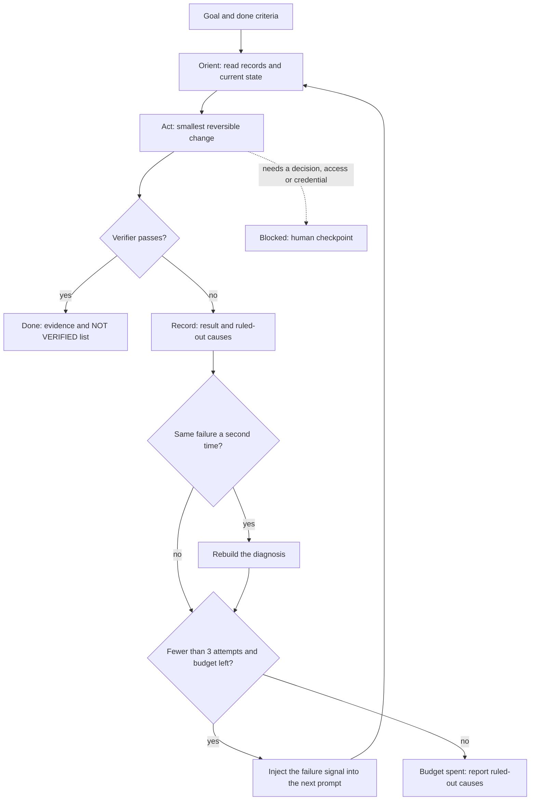

# Loop Engineering: Designing the Repetition That Drives Your Agents

> **Learning goal**: Design a loop that takes over prompting, verification, retries and stopping instead of prompting an agent by hand, tell the six building blocks and the loop shapes apart, set stop conditions and cost caps in numbers, and head off the common failure modes.

"Layers of AI Engineering: Prompt, Context, Harness" covered the layers around a single agent run. This document covers the layer above: **who strings many runs together, and how**. Loop engineering is designing the control system that prompts an agent, verifies the result, feeds failures back for another try, and decides when to stop. Details of headless and scheduled runs are in "Headless, CI and Cloud Runs", hooks and permissions in "Permissions, Sandbox, Hooks", and token prices and the compounding formula in "Principles of AI Token Efficiency", so here we cover only the loop angle. Tools and features are **as of 2026-09**; anything not confirmed in official documentation or source says so. Dollar-to-won conversions use 1 USD = 1,400 KRW (an assumption).

## Key Concepts

### The name and its roots

On 2026-06-07 Peter Steinberger posted on X, in substance, that you should no longer be prompting coding agents but designing loops that prompt your agents (checked via search results; the post itself could not be opened). The same month Boris Cherny, who leads Claude Code, is widely quoted as saying, in substance, "I don't prompt Claude anymore. Loops prompt it. My job is to write loops", but the original video or post was not checked; only secondary sources were. Around 2026-06-08 Addy Osmani's essay "Loop Engineering" framed a stack: prompt engineering, harness engineering above it, and loop engineering one floor above that (checked via search results; the essay itself could not be opened). If the harness decides what an agent can do **within one run**, the loop decides **what to ask for next, what counts as a pass, and when to stop**. The lower floors are covered in "Layers of AI Engineering: Prompt, Context, Harness".

- **ReAct** (Yao et al., arXiv 2022-10, ICLR 2023): the model alternates reasoning (thought) and action, and uses the environment's observation for the next thought. It is the prototype of the **inner loop** in which today's agents call tools and read results within one turn.
- **Ralph** (Geoffrey Huntley, 2025): calling an agent again and again with the same prompt inside a shell `while` loop. Each iteration clears the context, and state lives on disk in a plan file and commits. Tests, type checks and lints act as **backpressure** that sends bad work back. The core is one line, `while :; do cat PROMPT.md | claude ; done` (ghuntley/how-to-ralph-wiggum). That the first example in 2025-07 used the Amp CLI was checked via search results only. The "ralph-loop" plugin in Anthropic's official plugin repository implements the same idea with a **Stop hook** instead of a shell: when the session tries to end, the hook blocks it and feeds the same prompt back in. `--max-iterations` defaults to unlimited, and the README says to **always** set it (because `--completion-promise` is a single exact string match).

### The six building blocks

| Building block | Design question | Example |
|---|---|---|
| Goal and done criteria | What must be true for it to be finished? Can a machine judge it? | "`npm test` exits 0, and no existing test file changed" |
| Verifier | Who judges a pass, with what? Is it separate from the maker? | Tests, linters, type checks, evals, an adversarial reviewer on a different model |
| Feedback injection | Which part of the failure goes into the next iteration? | Names of failing tests and the last 40 log lines, a list of review findings |
| Stop conditions | How many tries, how much money, how many minutes? What if nothing improves? | 3 attempts, `--max-budget-usd 3`, stop when the same failure text appears twice |
| State and records | What stays on disk between iterations? | Commits, `PROGRESS.md`, a list of ruled-out causes |
| Human checkpoints | Where does a person approve? | Before merge, deploy or anything irreversible; on a Blocked report |

## Principles

### 1. Loop shapes

| Shape | One turn of the loop | What starts the next iteration | Example |
|---|---|---|---|
| Inner loop (tool calls) | Reason → call a tool → observe the result | The model itself (the tool already runs it) | Tool calls within one Claude Code turn, ReAct |
| Outer loop | One session → verify → next session | A script, hook or scheduler | Ralph, a `claude -p` shell loop, `/goal` |
| Retry loop | Failure → feedback → retry | The verifier's result | Up to 3 tries until the tests pass |
| Review loop | Writer → reviewer → fixer | Whether findings remain, and their severity | Writing this site's documents (Applied section below) |
| Scheduled or recurring loop | Once per time slot or event | Cron, a Routine, `/loop` | Morning PR cleanup, deploy checks |
| Fan-out / fan-in | Several workers in parallel → collect and integrate | A manager | Work packages per worktree, integration waves |

### 2. A loop cannot be better than its verifier

Anthropic's "Building effective agents" (2024-12) says an agent must get **ground truth** from the environment at each step (tool results, code execution) to assess its progress, and describes the **evaluator-optimizer** workflow in which one LLM generates and another evaluates and feeds back. The verifier is the loop's only evidence that it is "done", so with a weak verifier the loop **converges quickly on a wrong answer**. So put **deterministic checks** (tests, type checks, lint, build) first, hand judgement calls to a **fresh-context reviewer** that sees only the diff and the evidence, never the maker's reasoning history, and use a **different model** where you can. LLM evaluators tend to recognise and rate their own output higher (self-preference; Panickssery et al., NeurIPS 2024), and models of the same kind share blind spots.

### 3. Set stop conditions in three layers

Any single condition leaks. Combine an **attempt budget** (how many), a **cost and time budget** (how much, how long) and **no-progress detection** (is the same failure repeating).



### 4. Keep state outside the context, on disk

Over a long loop the context degrades (context rot, "Principles of AI Token Efficiency"). So each iteration starts with a fresh context and whatever must carry over goes through files. Anthropic's "Effective harnesses for long-running agents" (2025-11) shows a first session that prepares the environment and later sessions that carry on through a progress log (`claude-progress.txt`), a JSON feature list with a `passes` field, and descriptive git commits. The same article observed agents declaring completion too early and marking features done without testing. Three records must carry over: **what was done** (commits), **what remains** (plan and progress files), and **what was ruled out** (causes tried and their results).

### 5. Building loops with the tools (2026-09)

| Need | Claude Code | Codex |
|---|---|---|
| Keep going until a condition holds | `/goal <condition>`: after every turn a small fast model (Haiku by default on the Claude API) judges it from evidence surfaced in the conversation. Conditions up to 4,000 characters, cleared with `/goal clear`. Write any turn limit into the condition itself | Not checked |
| Repeat on an interval | `/loop 5m <prompt>`. Without an interval, Claude picks between 1 minute and 1 hour. Recurring tasks expire after 7 days, up to 50 per session | Not checked |
| Block the agent from stopping | A `Stop` hook returns `"decision": "block"` with a `reason`, or a prompt hook returns `ok: false`. After 8 consecutive blocks without progress it is overridden (`CLAUDE_CODE_STOP_HOOK_BLOCK_CAP`) | Not checked |
| Scripted runs and caps | `claude -p`, `--output-format json` (`total_cost_usd`), `--resume <id>`. `--max-turns` (exits with an error at the limit) and `--max-budget-usd` (includes subagent spend) are print mode only | `codex exec`, `--json`, `-o <file>`, `--output-schema`, `codex exec resume --last`. Turn or cost cap flags not checked |
| Review by a different model | A fresh-context subagent or a separate session | `codex exec review --uncommitted`, `--base <branch>` |
| Scheduling outside a session | Routines (`/schedule`, minimum 1 hour, research preview, acts as you), Desktop scheduled tasks | Run `codex exec` from a CI `schedule` |

Under the hood `/goal` is a session-scoped, prompt-based Stop hook. The evaluator uses no tools, so a condition like "the tests pass" is judged only once the agent has run the tests and the result shows in the conversation. Follow "Permissions, Sandbox, Hooks" for permission and hook setup, and "Headless, CI and Cloud Runs" for headless authentication and CI. Below is the skeleton of an outer loop with all three layers of stop conditions.

```bash
#!/usr/bin/env bash
set -u
echo "none" > prev-failure.txt
for i in 1 2 3; do                                   # attempt budget
  timeout 20m claude -p "$(cat PROMPT.md)" --permission-mode acceptEdits \
    --allowedTools "Bash(git add *)" "Bash(git commit *)" \
    --max-turns 30 --max-budget-usd 3 --output-format json > "run-$i.json"   # time, turn and cost cap per run
  rc=$?
  [ "$rc" -eq 124 ] && { echo "TIME BUDGET: attempt $i ran past 20m"; exit 3; }
  kind=$(jq -r '.subtype // empty' "run-$i.json" 2>/dev/null)
  case "$rc:$kind" in
    0:*|*:error_max_turns|*:error_max_budget_usd) ;;                             # capped runs still get verified
    *) echo "BLOCKED: claude exited $rc"; exit 4 ;;                              # auth, config or startup failure
  esac
  if npm test > "test-$i.log" 2>&1; then echo "DONE at attempt $i"; exit 0; fi
  { grep -E "FAIL|Error|not ok" "test-$i.log" || tail -n 40 "test-$i.log"; } | head -n 40 > last-failure.txt
  cmp -s last-failure.txt prev-failure.txt && { echo "NO PROGRESS: rethink the diagnosis"; exit 2; }
  cp last-failure.txt prev-failure.txt
done
echo "BUDGET SPENT: see PROGRESS.md for ruled-out causes"; exit 1
```

`PROMPT.md` says: "Read `PROGRESS.md` and `last-failure.txt` first; at the end, write the causes you ruled out into `PROGRESS.md` and commit; do not edit test files." The key point is that the verifier (`npm test`) runs outside the agent. `timeout` exits with 124 when time runs out, and the script treats that as the time budget being spent. If the `subtype` in the `--output-format json` result is `error_max_turns` or `error_max_budget_usd`, the run hit a cap and ended normally, so it goes on to the verifier (these are the Agent SDK result-message values). Any other nonzero exit, especially an empty `run-$i.json` or one without a `subtype` (an authentication, config or startup failure), ends as BLOCKED without running the verifier. The failure signal uses the `FAIL`, `Error` and `not ok` lines, and falls back to the last 40 log lines when there are none.

## Applied: This Repository's Loop

### The unit loop: `.ai/LOOP.md`

This repository's agent rules in `.ai/LOOP.md` fix one attempt at four steps. **Orient** (read what you are about to change and the gate that decides whether the change is reached at all) → **Act** (the smallest reversible change that could settle the question) → **Verify** (the cheapest check that answers the question you actually have, and write down which question) → **Record** (the result, and what it did not answer). It warns that Record is the step dropped under time pressure, and dropping it turns three attempts into the same attempt three times.

| `.ai/LOOP.md` rule | Building block |
|---|---|
| The same failure twice means the diagnosis is wrong, not the value. Three attempts on one failure ends the attempt; report what was ruled out. Never repeat an action whose result you did not read | No-progress detection, attempt budget, state and records, feedback injection |
| Signs of non-convergence: the same error text, a growing diff with a same-sized failure, an edit that undoes an earlier edit, a verification target moving toward something easier, a new assumption each time the explanation is challenged | No-progress and reward-hacking detection |
| Waiting is not looping: where you can schedule a later check, schedule it and end the turn | Scheduled loop |
| A run ends in exactly one of Done, Blocked or Budget spent, and says which | Stop conditions, human checkpoints |

### The review loop that built this site

This site's documents were built with this review loop. A **writer agent** drafts → an **adversarial reviewer on a different model** reads the draft in a fresh context, attacks it, and grades each finding → a **fixer** addresses the findings. After three rounds of this comes a **fix-verification pass** that re-reads only what was fixed, and finally build, tests and deploy. The round cap (3) is the attempt budget, the fix verification plus build and tests are the final verifier, and merge and deploy are the human checkpoints. `.ai/EXECUTION.md` gives a reviewer only the requirements, relevant architecture, the diff, test and build evidence and the review rules, and **never the implementer's reasoning history**. Below is the actual record by section. The sources are the review-record table in the description of linjingzhu/tech-jeongsu PR #10 and PR #11, which records the later third round. C = Critical, M = Major, m = Minor; sections whose round-1 counts were never written down say "not recorded". "What changed" is taken from the commit log for the AI 06–13 rows only.

| Section | Round 1 | Round 2 | Round 3 | Fix verification | What changed |
|---|---|---|---|---|---|
| Platform Deployment & Services | 8M / 11m | 1M / 6m | 1M / 6m | | |
| Marketing | 12M / 6m | 1M / 2m | 1M / 1m | | |
| Business | 1C / 10M / 4m | 2M / 6m | 2M / 2m | | |
| AI 06–08 | not recorded | 1C / 1M / 5m | 2C / 1M / 3m | | R1 (`c6a3b4d`): hooks fail closed and catch every force-push form, a baseline-aware Stop hook, Codex profiles. R2 (`af9cac7`): closed Hook 1 bypasses (digit-combined short flags, long-option prefixes, backslash escapes, `$` expansions, line continuations), sanitised `session_id`, corrected the Codex profile error and TOML fields. R3 (`0a128c1`): scan every argument after the first `push`, fail closed on arguments with `{` or `}`, branch deletion documented as out of scope, 71 cases in the case table |
| AI 09–13 | not recorded | 1M / 3m | 2m | | R1 (`1994663`): Codex action input, bare-mode auth, TTL guidance, nav-title references. R2 (`af9cac7`): qualified the subagent read-only claims, narrowed the keep-alive guidance, hedged the GPT-6 caching row. R3 (`c5ec72f`): scoped the keep-alive measurement caveat, listed every `max_tokens: 0` restriction |
| Solo Studio Monetization | not recorded | 12 findings | 3M / 3m | 1M / 5m | |

Most sections had fewer findings each round, but **the critical findings in AI 06–08 went up in round 3, from 1 to 2.** That is the "the same kind of finding comes back" signal this page teaches. At its centre is Hook 1 (the example force-push blocker). The bypass was first raised in round 1 and came back in new forms in rounds 2 and 3. Blocking one form at a time is the shape of "the same failure repeated with parameter tweaks". What changed the diagnosis was the rule that **arguments whose value cannot be known in advance (`$`, backtick, `{}`) fail closed without examining the value** (`$` and backticks in round 2, `{` and `}` in round 3). It stopped trying to list every possible value. Branch protection was stated as the last line of defence outside the agent from the first draft; round 3 only added a sentence putting branch deletion out of scope.

### Loop design checklist: what to decide before starting

| Decision | Question to ask | This repository's answer (example) |
|---|---|---|
| Done criteria and final report | Is it a sentence a machine can judge? Which end state will be reported? | Build and tests pass, no unresolved Critical or Major review findings. One of Done, Blocked or Budget spent, plus a NOT VERIFIED list |
| Verifier | Is it separate from the maker? Does it fail a deliberately broken change? | A fresh-context reviewer on a different model, plus build and tests |
| Feedback | What goes into the next iteration, and how much? | Only the graded list of findings, never the full log |
| Budget | After how many tries, how much money, how many minutes? | 3 attempts per failure, 3 review rounds, `timeout 20m`, `--max-budget-usd` and `--max-turns` per run, the overall cap computed as in the cost section below |
| No-progress detection | What being the same counts as no progress? | The same failure text twice, the same kind of finding in every round |
| State and records | What is kept between iterations? | Commits, the per-round findings table, ruled-out causes |
| Forbidden changes | How do you stop changes that weaken the verifier? | Changes to tests or check scripts need separate approval, checked in the diff |
| Human checkpoints | Where does a person look? | Before merge and deploy, on a Blocked report |

## Going Deeper

### Iteration multiplies token cost

We reuse the assumptions of "Principles of AI Token Efficiency" (fixed prefix S = 20,000, growth D = 3,000 per turn, 800 output tokens per turn, caching on, Opus 5.5 and Sonnet 5.5 prices). With a fresh session per role, loop cost grows **in proportion to the number of iterations**; packed into one session, it grows **close to the square of the turn count** because the history is resent. The reviewer is priced as Sonnet 5.5 for convenience; for a model from another vendor, plug in that vendor's prices.

```text
writes = S + (N-1)*D ; reads = N*S + D*N*(N-1)/2 - writes
writer   Opus 5.5,   N=30: 107,000*$5   + 1,798,000*$0.20 + 24,000*$20 = $1.3746
reviewer Sonnet 5.5, N=10:  47,000*$2.5 +   288,000*$0.20 +  8,000*$10 = $0.2551
fixer    Opus 5.5,   N=15:  62,000*$5   +   553,000*$0.20 + 12,000*$20 = $0.6606
3 rounds + fix check = 1.3746 + 3*(0.2551 + 0.6606) + 0.2551 = $4.3768
```

| Design (assumed) | Cost |
|---|---:|
| Write once and stop (writer only) | $1.37 (1,924 KRW) |
| Retry loop at $1.37 per attempt, using all 3 attempts | $4.12 (5,773 KRW) |
| 3 review rounds plus fix verification, a fresh session per role | $4.38 (6,128 KRW) |
| The same work packed into one Opus 5.5 session of 115 turns (30 + 3×(10 + 15) + 10): writes 362,000×$5 + reads 21,603,000×$0.20 + output 92,000×$20 | $7.97 (11,159 KRW) |

The review loop costs about 3.2 times a single write, but stacking the same work in one session costs about 1.8 times more again. A loop with no cap multiplies this by however many iterations it runs. The rule from "Principles of AI Token Efficiency", **cost per task = cost per attempt ÷ success rate**, still applies: a weak verifier overstates the success rate and so understates the cost per task. `/goal` evaluation is billed on the small fast model, and the official docs say it is typically negligible next to the main work.

### Failure modes

| Failure mode | Symptom | Countermeasure |
|---|---|---|
| False convergence on a weak verifier | Green arrives fast, but a person finds it wrong | Verify the verifier first: check that a deliberately broken change fails |
| Cost runaway | It never ends, and each iteration costs the same or more | `--max-budget-usd` and `--max-turns` per run, an overall attempt cap, a fresh session per iteration |
| The same failure repeated with value tweaks | The same error text, only the diff grows | On the second identical failure change the diagnosis; on the third, stop and report what was ruled out |
| Reward hacking | Tests deleted, weakened or skipped, scoring code edited | Put "test files unchanged" in the done criteria and check the diff, add a protected-path hook. METR (2025-06) reported frontier models trying to raise scores by editing tests or scoring code |
| Context drift | After a long loop, the original constraints are forgotten | A fresh context per iteration, the goal and constraints re-injected every time, records on disk |
| Shared blind spots of writer and reviewer | Both miss the same thing | A reviewer on a different model (from a different vendor where possible), given the diff and evidence instead of the reasoning history |

If a loop will run against someone else's software or service, check the legal boundaries in "Reverse Engineering: Law and Lawful Uses" before you start.

## Common Misconceptions

- **"Run the loop long enough and it will get it right."** A loop converges on whatever the verifier says. With a weak verifier it converges quickly on a wrong answer.
- **"Just run it once more."** The same failure twice means the diagnosis is wrong. A list of ruled-out causes is worth more than a third try.
- **"A reviewer on the same model is enough."** There is self-preference bias and shared blind spots. A fresh context and a different model are the default.
- **"`/loop` and `/goal` are the same thing."** `/loop` starts the next turn on a time interval; `/goal` does so until a condition holds. For anything that must run outside a session, use Routines.
- **"One long session is cheaper than several short ones."** Resending the history grows close to the square of the turn count. Keeping records on disk and cutting to fresh sessions is usually both cheaper and more accurate.

## Self-Check Questions

1. Write the done criteria for one task you are working on as a single sentence a machine can judge. What is the easiest change that would weaken that sentence, and how would you prevent it?
2. In the shell loop above, which line handles each of the three layers of stop conditions (attempts, cost and time, no progress)? What does the script do when `timeout` exits with 124?
3. If the same kind of finding appears in three consecutive review rounds, what would you ask the fixer to do differently?
4. With writer N = 30, reviewer N = 10 and fixer N = 15, what does the loop cost with only 2 review rounds and no fix verification (same assumptions as above)?
5. How does the fact that the `/goal` evaluator never reads files itself change the way you write a done condition?

## References

- [Run prompts on a schedule](https://code.claude.com/docs/en/scheduled-tasks) · [Keep Claude working toward a goal](https://code.claude.com/docs/en/goal) · [Automate actions with hooks](https://code.claude.com/docs/en/hooks-guide) — Claude Code Docs, checked 2026-09-29
- [Automate work with routines](https://code.claude.com/docs/en/routines) · [Run Claude Code programmatically](https://code.claude.com/docs/en/headless) · [CLI reference](https://code.claude.com/docs/en/cli-reference) — Claude Code Docs, checked 2026-09-29
- [openai/codex `codex-rs/exec/src/cli.rs`, `codex-rs/utils/cli/src/shared_options.rs`](https://github.com/openai/codex) — OpenAI, checked 2026-09-29
- [Building effective agents](https://www.anthropic.com/engineering/building-effective-agents) (2024-12-19) · [Effective harnesses for long-running agents](https://www.anthropic.com/engineering/effective-harnesses-for-long-running-agents) (2025-11-26) — Anthropic Engineering, checked 2026-09-29
- [ghuntley/how-to-ralph-wiggum](https://github.com/ghuntley/how-to-ralph-wiggum) · [anthropics/claude-plugins-official `plugins/ralph-loop`](https://github.com/anthropics/claude-plugins-official/tree/main/plugins/ralph-loop) — GitHub, checked 2026-09-29
- [Ralph Wiggum as a "software engineer"](https://ghuntley.com/ralph/) — Geoffrey Huntley, 2025 · [Peter Steinberger's post on X](https://x.com/steipete/status/2063697162748260627) — 2026-06-07 · [Loop Engineering](https://addyo.substack.com/p/loop-engineering) — Addy Osmani, 2026-06 (also published on O'Reilly Radar). All checked via search results 2026-09-29
- [ReAct: Synergizing Reasoning and Acting in Language Models](https://arxiv.org/abs/2210.03629) — Yao et al., 2022-10, ICLR 2023, checked via search results 2026-09-29
- [Recent Frontier Models Are Reward Hacking](https://metr.org/blog/2025-06-05-recent-reward-hacking/) — METR, 2025-06-05 · [LLM Evaluators Recognize and Favor Their Own Generations](https://proceedings.neurips.cc/paper_files/paper/2024/hash/7f1f0218e45f5414c79c0679633e47bc-Abstract-Conference.html) — Panickssery et al., NeurIPS 2024. Both checked via search results 2026-09-29
