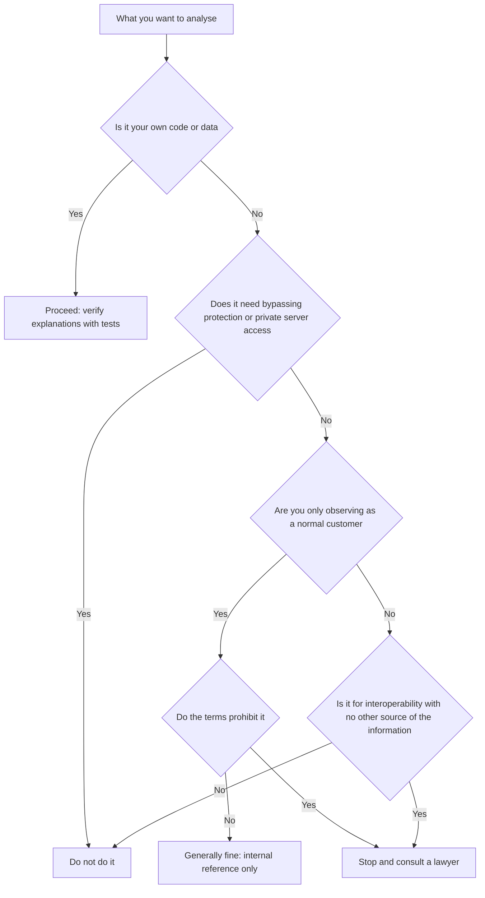

# Reverse Engineering: Law and Lawful Uses

> **Learning goal**: Explain what reverse engineering is and why people do it, tell apart the boundaries set by Korean, US and EU law and by contracts, and carry out competitor product analysis and your own legacy decoding within lawful limits, verifying as you go.

A solo studio runs into reverse engineering too: when it studies a competitor's pricing, and when it has to reread its own code and data files that were left without documentation. This document covers **the legal boundaries and lawful uses**, not analysis techniques. Permissions to give an agent are in "Permissions, Sandbox, Hooks"; what to show the model in "Layers of AI Engineering: Prompt, Context, Harness"; the repeating structure that feeds verification back in "Loop Engineering"; and who owns outsourced code in "Contracts · IP · Open Source". Statutes and cases are **as of 2026-09**; items confirmed only through search results, because the original could not be opened directly, are marked in the references.

> **This document is general information, not legal advice.** Legal interpretation depends on the facts and on timing. Consult a lawyer before analysing anyone else's software or service.

## Key Concepts

### Definition

**Forward engineering** goes from requirements through design and implementation to a finished product. **Reverse engineering** runs the other way. It starts from a finished product and recovers its design, structure and behaviour. A good output is not a copy of the original but **an explanation with evidence**. Sentences such as "the payment screen appears after the 7-day free trial" or "the first field of this save file is a version number", together with a way to check them again, are the result.

### Why people do it

- **Interoperability**: to let your program exchange information with other programs or files.
- **Maintaining your own legacy**: to understand again your own code and data formats whose documents and authors are gone.
- **Studying competitors' products**: to learn onboarding, pricing and feature structure by using them as a normal customer.
- **Security research**: for authorised professionals to find and fix flaws.

Even with the same purpose, the target and the method decide whether it is lawful. The principles below cover that boundary.

## Principles

### Korea: reverse analysis of program code under the Copyright Act

- **Definition (Article 2, item 34)**: copying or converting program code to obtain the information needed for an independently created program to interoperate with other programs.
- **Conditions (Article 101-4(1), "Reverse Analysis of Program Code")**: (1) a person using the program with legitimate authority, or a person they authorise, (2) where the information needed for interoperability cannot readily be obtained and obtaining it is unavoidable, (3) limited to the parts needed for interoperability.
- **Limits on use (Article 101-4(2))**: the information obtained may not be used for purposes other than interoperability or given to third parties, and may not be used to develop, produce or sell a program substantially similar in expression to the target, or for any other copyright infringement.
- **Technological protection measures (Article 104-2, "Prohibition of Circumvention of Technological Protection Measures")**: circumventing protection measures without legitimate authority is prohibited. The same article lists a few exceptions, including reverse analysis of program code for interoperability, but they are narrow. Do not decide on your own whether an exception applies.

### Korea: trade secrets and information networks

- **Trade secrets (Unfair Competition Prevention and Trade Secret Protection Act, Article 2, items 2 and 3)**: technical or business information that is not publicly known, has independent economic value and is kept secret is a trade secret. Acquiring it by theft, deception or other improper means, or using or disclosing what was acquired that way, is infringement.
- **Reverse engineering and trade secrets (Supreme Court Decision 96Da16605, 1996-12-23)**: the Supreme Court set the injunction period on the premise that a trade secret can be acquired by lawful means such as independent development or reverse engineering. This reads as not treating the lawful purchase and analysis of a product on the market as an improper means in itself. Individual cases may still be judged differently.
- **Network intrusion (Network Act, Article 48(1))**: entering an information network without legitimate access rights, or beyond the access permitted, is prohibited, and a violation can be a criminal offence. This document does not settle which penalty article applies.
- **The crawling case (Supreme Court Decision 2021Do1533, 2022-05-12)**: in a case where a competitor's private app API was used to collect accommodation listings, acquittal on the criminal charges, including network intrusion, became final. On the same facts, **a civil first-instance ruling was reported that awarded about 1 billion won for unfair competition by unauthorised use of another's work product (the catch-all provision in Article 2, item 1 of the Unfair Competition Prevention Act).** The appeal outcome could not be confirmed. A criminal acquittal does not mean you are safe.

### The US and the EU

- **US DMCA §1201(f)**: a person with the right to use a program lawfully may circumvent a technological measure solely to identify elements needed for an independently created program to interoperate, where those elements were not previously readily available. The condition is that this does not amount to copyright infringement.
- **Sega v. Accolade (9th Cir. 1992)**: reverse analysis to make compatible games was fair use when it was the only way to reach unprotected elements and there was a legitimate reason.
- **Bowers v. Baystate (Fed. Cir. 2003)**: a licence clause prohibiting reverse engineering was enforced. It shows that in the US a contract can narrow what the statute allows.
- **EU Directive 2009/24/EC**: Article 6 lets a licensee or similar person decompile, when interoperability information is not readily available, only the parts needed, and bars using the information for other goals, giving it to others or developing a similar program. Article 8 makes contract terms contrary to Article 6 null and void.

### Contracts: EULAs and ToS

Software EULAs and service terms of service (ToS) commonly prohibit reverse engineering, automated collection and unofficial clients. How far such clauses can narrow what Article 101-4 allows in Korea was not confirmed for this document. Apart from the legal answer, the practical risk is clear: account bans, loss of app store or API access, breach-of-contract claims and broken partnerships. For a solo studio, a single account ban can halt the business.

### "May I do this?"



| Scenario | Conditions under which it is allowed | Risk |
|---|---|---|
| Signing up to a competitor normally and recording screens, pricing and onboarding | Normal sign-up and payment, terms followed, manual observation, internal use | Low |
| Integrating through public docs, public APIs or SDKs | Follow the documented terms and rate limits | Low |
| Decoding your own code, outsourced code whose rights you received, or your own data files | Ownership confirmed by contract | Low |
| Analysing purchased software to build a compatible tool | Article 101-4 conditions met, EULA checked, advice first | Medium to high |
| Authorised security testing | Only within written permission or a bug bounty scope | High without permission |
| Analysing a competitor's app to carry over features or code | Not for interoperability; may hit the similar-program ban | High |
| Automated collection of a competitor's data through a private API | ToS breach; Network Act and unfair competition issues | High |
| Defeating DRM or licence checks | Prohibited outside the narrow exceptions of Article 104-2 | High |
| Reusing or redistributing extracted images, audio or fonts | Not without the rights holder's permission | High |

The risk levels are this document's general judgement, not legal conclusions.

## Applied: Lawful Reverse Engineering in a Solo Studio

### Competitor teardown: use it as a customer and record

Sign up as a normal customer and pay if needed. Record only what a person sees while using the product, with no automation tools and no private paths.

| What to record | What to write down | Where it is used |
|---|---|---|
| Onboarding | Number of sign-up steps, time to first value, information requested | Activation design |
| Pricing | Plan names, prices, free limits, trial length, annual discount, cancellation steps | Pricing design |
| Funnel | When payment is prompted, paywall placement, order and spacing of emails and pushes | Lifecycle design |
| Feature structure | Menu structure, feature differences by plan, missing features | Positioning, roadmap |
| Customer voice | Recurring complaints and praise in public reviews | Differentiation hypotheses |

1. Collect the records in one table with dates and screenshots. Prices and terms change often.
2. Compare several competitors in the same columns and mark what everyone does and what nobody does.
3. Turn the gaps into customer problems, test them in interviews from "Market & Customer Research · Segmentation", and put them into "Discovery · Strategy · Roadmaps".
4. Turn the confirmed differences into a positioning statement using "Positioning · Messaging · Brand". Set prices with the framework in "Paid Sales, Subscriptions and Pricing".
5. Before naming a competitor in ads, read "Law · Ethics · Ad Disclosure". Keep screenshots and copy as internal material and do not publish them.

### Reading your own legacy code and data files with an AI agent

When you need to understand your own undocumented code, or save files your own app produced, an AI agent is a fast assistant. But the agent's explanation is a **hypothesis**, not a fact. A plausible but wrong explanation is the most dangerous kind.

1. **Confirm ownership**: check by contract that the code is yours or that its rights were transferred to you.
2. **Separate the workspace**: work on a copy, not the original, and narrow the agent's write and network permissions ("Permissions, Sandbox, Hooks"). Use only sample files your own app produced, and anonymise them first if customer data is mixed in.
3. **One question at a time**: ask narrowly, such as "how does this function write the version field of the save file", rather than "what does this module do".
4. **Record explanations as hypotheses**: attach one line on how to check each agent explanation.
5. **Verify by running**: run the existing tests, add characterization tests that pin current behaviour, and compare the outputs of the old program and the new code on the same input. If it fails, revise the hypothesis and ask again ("Loop Engineering").
6. **Document only what is confirmed**: move only explanations that passed verification into the README or format documentation.

```python
# Characterization test: pin today's behaviour before trusting any explanation
import json
import subprocess


def test_new_reader_matches_legacy_output(tmp_path):
    out = tmp_path / "new.json"
    subprocess.run(["python", "new_reader.py", "samples/save_001.dat", str(out)], check=True)
    legacy = json.loads(open("samples/save_001.legacy.json", encoding="utf-8").read())
    assert json.loads(out.read_text(encoding="utf-8")) == legacy
```

## Going Deeper

### Where the lines blur

- **Collecting public pages versus private APIs**: public pages anyone can see and private APIs reached by imitating an app's internal traffic may be assessed differently in law. That a civil first-instance damages ruling was reported after the criminal acquittal in 2021Do1533 shows the gap.
- **Contract versus statute**: the EU, through Article 8, does not let contracts remove the decompilation allowance, while the US Bowers case enforced a contractual ban. Korea's position was not settled for this document.
- **Services across borders**: foreign services' terms usually set the governing law and jurisdiction. Something that looks lawful in Korea may be disputed under the law of the country the terms name.

### When to call a lawyer

- When you plan to analyse someone else's software for interoperability
- When protection measures, licence checks or private servers are involved even slightly
- When you receive a warning letter or a notice of terms violation from a competitor
- When you plan to use analysis results in a product, an ad or a public post

## Common Misconceptions

- **"I bought it, so I can analyse it however I like."** Ownership aside, the Article 101-4 conditions and limits on use, and the contract terms, still apply.
- **"If the app is public, its private API is public too."** Being inside an app does not make an API public. Terms and Network Act issues remain.
- **"A criminal acquittal means no problem."** Civil liability and account bans are separate.
- **"Saying it is for interoperability is enough."** What is examined is whether it was really limited to the parts needed and whether the information could not be obtained otherwise.
- **"The AI explained it, so it is right."** An unverified explanation is a hypothesis. Confirm it with tests and output comparison.

## Self-Check Questions

1. Can you explain the three conditions in Article 101-4(1) and the limits on use in Article 101-4(2)?
2. In a competitor teardown, name one permitted observation and one action to avoid.
3. How did the criminal judgment in 2021Do1533 differ from the reported civil first-instance ruling, and what is the lesson for a studio?
4. How do EU Article 8 and Bowers v. Baystate differ on the effect of contract clauses?
5. When an AI agent explains a legacy file format, what would you use to verify that explanation before putting it in documentation?

## References

- [Copyright Act, Article 101-4 (Reverse Analysis of Program Code)](https://www.law.go.kr/%EB%B2%95%EB%A0%B9/%EC%A0%80%EC%9E%91%EA%B6%8C%EB%B2%95/%EC%A0%9C101%EC%A1%B0%EC%9D%984) — Korea Law Information Center, checked via search results 2026-09-29
- [Copyright Act, Article 2 (Definitions)](https://www.law.go.kr/%EB%B2%95%EB%A0%B9/%EC%A0%80%EC%9E%91%EA%B6%8C%EB%B2%95/%EC%A0%9C2%EC%A1%B0) · [Article 104-2 (Prohibition of Circumvention of Technological Protection Measures)](https://www.law.go.kr/%EB%B2%95%EB%A0%B9/%EC%A0%80%EC%9E%91%EA%B6%8C%EB%B2%95/%EC%A0%9C104%EC%A1%B0%EC%9D%982) — Korea Law Information Center, checked via search results 2026-09-29
- [Unfair Competition Prevention and Trade Secret Protection Act, Article 2 (Definitions)](https://www.law.go.kr/%EB%B2%95%EB%A0%B9/%EB%B6%80%EC%A0%95%EA%B2%BD%EC%9F%81%EB%B0%A9%EC%A7%80%EB%B0%8F%EC%98%81%EC%97%85%EB%B9%84%EB%B0%80%EB%B3%B4%ED%98%B8%EC%97%90%EA%B4%80%ED%95%9C%EB%B2%95%EB%A5%A0/%EC%A0%9C2%EC%A1%B0) — Korea Law Information Center, checked via search results 2026-09-29
- [Act on Promotion of Information and Communications Network Utilization and Information Protection, Article 48](https://www.law.go.kr/%EB%B2%95%EB%A0%B9/%EC%A0%95%EB%B3%B4%ED%86%B5%EC%8B%A0%EB%A7%9D%EC%9D%B4%EC%9A%A9%EC%B4%89%EC%A7%84%EB%B0%8F%EC%A0%95%EB%B3%B4%EB%B3%B4%ED%98%B8%EB%93%B1%EC%97%90%EA%B4%80%ED%95%9C%EB%B2%95%EB%A5%A0/%EC%A0%9C48%EC%A1%B0) — Korea Law Information Center, checked via search results 2026-09-29
- [Supreme Court Decision 96Da16605 (1996-12-23)](https://law.go.kr/LSW/precInfoP.do?evtNo=96%EB%8B%A416605) — Korea Law Information Center, checked via search results 2026-09-29
- [Supreme Court Decision 2021Do1533 (2022-05-12)](https://casenote.kr/%EB%8C%80%EB%B2%95%EC%9B%90/2021%EB%8F%841533) — CaseNote, checked via search results 2026-09-29
- [News report on the Yanolja v. Yeogi Eottae civil first-instance ruling](https://v.daum.net/v/kpTVF0ahwV) — press report, checked via search results 2026-09-29 (judgment text and appeal outcome not checked)
- [17 U.S. Code § 1201](https://www.law.cornell.edu/uscode/text/17/1201) — Cornell LII, checked via search results 2026-09-29
- [Sega Enterprises Ltd. v. Accolade, Inc., 977 F.2d 1510 (9th Cir. 1992)](https://law.justia.com/cases/federal/appellate-courts/F2/977/1510/305345/) — Justia, checked via search results 2026-09-29
- [Bowers v. Baystate Technologies, Inc., 320 F.3d 1317 (Fed. Cir. 2003)](https://law.justia.com/cases/federal/appellate-courts/F3/320/1317/615628/) — Justia, checked via search results 2026-09-29
- [Directive 2009/24/EC on the legal protection of computer programs](https://eur-lex.europa.eu/eli/dir/2009/24/oj/eng) — EUR-Lex, checked via search results 2026-09-29
