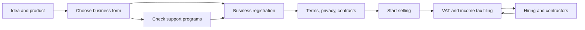

# Business Track Overview

> This is general information, not legal or tax advice. Rules change often, so verify with the official source or a licensed tax accountant (semusa) or lawyer before acting.

**Reference date: 2026-09-28**

A good product can still cost you money in taxes, penalties and contract disputes if the business form around it is wrong.

> The goal of this track is to give **a solo or small software business a map for deciding what to file, register and keep, when, and where**.

Intended readers:

- Developers starting an app, SaaS or web service alone or with a few people
- Freelancers who do contract development while preparing their own product
- Product Owners who want to settle the structure before founding a company

## The Three Pillars

| Pillar | Core question | Documents |
|---|---|---|
| Business registration | In what form, under which industry code, and where do you register | 01, 02 |
| Legal | How do you define relationships with customers, staff, contractors and open source | 03, 04, 05 |
| Tax | Which taxes do you file and when, and what evidence do you keep | 06, 07, 08 |
| Public support | Which support programs exist and where to find them | 09 |



## Document Map

| No. | Document | One-line summary |
|---|---|---|
| 01 | Sole Prop, Corporation, VAT Type | How to choose between sole proprietorship and corporation, simplified and general VAT, plus incorporation basics |
| 02 | Registration and Mail-Order Sales | Industry codes, Hometax registration, business address, business account and cards, mail-order business report |
| 03 | Terms, Privacy, E-Commerce | Terms of service, privacy policy, withdrawal rights and subscription billing rules |
| 04 | Contracts, IP, Open Source | Service contracts, NDAs, trademark filing, copyright ownership, open-source licenses |
| 05 | Hiring, Social Insurance, Freelancers | Employment contracts, the four social insurances, 3.3% contracts and disguised-freelancer risk |
| 06 | VAT, Zero Rate, Tax Invoices | VAT filing periods, zero rating for overseas revenue, electronic tax invoices |
| 07 | Income Tax, Corporate Tax, Withholding, Books | Individual and corporate income tax, withholding, payment statements, books and expenses |
| 08 | Startup Relief, Tax Calendar, Accountants | Startup SME tax reduction, the yearly tax calendar, when to hire a tax accountant |
| 09 | Startup Support Programs | K-Startup, the integrated announcement, registration timing and eligibility |

## Reading Order

```text
Not registered yet
→ 09 (check support-program eligibility first)
→ 01 → 02
→ 03 → 04
→ 06 → 07 → 08
→ 05 once you hire someone
```

Why the order matters: **some programs for pre-founders accept only applicants who hold no business registration.** Registering first can cost you eligibility.

## Principles of This Track

- Figures (thresholds, rates, deadlines) are written **together with the official source and the year they apply to**.
- Figures not confirmed in an official source are left out or marked **needs verification**.
- Statutes are amended, so follow the links and re-check the **current article**.
- Contested questions (such as how overseas app-store revenue is taxed) assume confirmation by a tax accountant.

Bad example:

> I applied for simplified VAT status using a threshold I read on a blog.

Good example:

> I checked this year's threshold and its start date on the National Tax Service (NTS) guide page, and saved a screenshot of the application screen in my bookkeeping folder.

## Key First-Year Checklist

- [ ] If you plan to apply for support programs, you decided the registration date first
- [ ] You chose sole proprietor or corporation, simplified or general VAT, with reasons
- [ ] You looked up the industry code on Hometax and matched it to how you actually earn revenue
- [ ] You checked whether you must file a mail-order business report
- [ ] You published terms of service and a privacy policy before launch
- [ ] You separated a business bank account and business cards
- [ ] You added the tax calendar to your calendar app

## References

- [NTS - Business registration guide](https://www.nts.go.kr/nts/cm/cntnts/cntntsView.do?mi=2443&cntntsId=7776) (accessed 2026-09-28)
- [NTS - VAT basics](https://www.nts.go.kr/nts/cm/cntnts/cntntsView.do?cntntsId=7693&mi=2272) (accessed 2026-09-28)
- [Bizinfo - 2026 Pre-Startup Package call for applicants](https://www.bizinfo.go.kr/sii/siia/selectSIIA200Detail.do?pblancId=PBLN_000000000119019) (2026 call, accessed 2026-09-28)
- [Korea Law Information Center](https://www.law.go.kr/) (accessed 2026-09-28)
