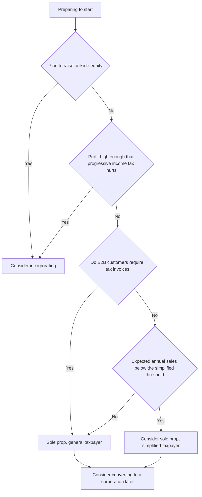

# Sole Prop · Corporation · VAT Type

> This is general information, not legal or tax advice. Rules change often, so verify with the official source or a licensed tax accountant (semusa) or lawyer before acting.

There are two decisions to make first when you start a business.

1. **Who is the business** — you as an individual (sole proprietor, gaein saeopja) or a separate corporation (beopin)
2. **How you pay VAT** — as a simplified taxpayer (gan-i gwase-ja) or a general taxpayer (ilban gwase-ja)

The second choice applies only to sole proprietors. A corporation cannot be a simplified taxpayer.

## Sole Proprietorship vs Corporation

| Item | Sole proprietor | Corporation (stock company) |
|---|---|---|
| Setup | Starts with business registration alone | Articles of incorporation, capital paid in, incorporation registry, then business registration |
| Income tax | Global income tax (6% to 45% per the NTS rate table) | Corporate tax (fiscal years starting on or after 2026-01-01: 10%, 20%, 22%, 25%) |
| Ownership of money | Money in the business account is the owner's money | The corporation's money. The CEO needs a basis such as salary or dividends to take it |
| Liability | Owner has unlimited liability for business debts | Shareholders are in principle limited to their contribution |
| Investment | No equity structure | Equity investment by issuing new shares |
| Admin cost | Low | Registry filings, double-entry books, shareholder and board records |

> Do not pick a corporation on tax rates alone. The moment you take the corporation's money for personal use, **tax on salary or dividends** applies again, and withdrawals without a basis cause problems.

## Decision Flow



## Simplified Taxpayer vs General Taxpayer

| Item | Simplified taxpayer | General taxpayer |
|---|---|---|
| Criterion | Individuals with prior-year gross supply below KRW 104 million (threshold applied from 2024-07-01) | All other individuals, every corporation |
| VAT payment exemption | No VAT payable if gross supply for the period is below KRW 48 million (tax periods starting 2021 onward) | None |
| Filings per year | Once | Twice (final returns, individuals) |
| Tax invoices | Must issue if prior-year gross supply is KRW 48 million or more; new or smaller businesses issue receipts | Issues invoices |
| Input VAT | 0.5% of invoiced purchase amounts credited (supplies from 2021-07-01) | Full input VAT credit, refunds possible |

Simplified status is not always better.

- If early equipment or contractor costs are large and you **want input VAT refunded**, general status can be better.
- If much of your revenue is **zero-rated** overseas revenue, refunds can arise, and simplified status can be a disadvantage there. See document 06.
- To give up simplified status you must file **by the last day of the month before the month you want general status to apply**, and you cannot return to simplified status for 3 years (VAT Act Article 70).

## Incorporation Basics

A stock company (jusik hoesa) is created in this order.

```text
Decide trade name, purpose, head office
→ Draft articles of incorporation
→ Pay in capital (balance certificate)
→ File and pay registration license tax
→ Incorporation registry (Internet Registry Office or Online Incorporation System)
→ Corporate business registration
→ Social insurance workplace report (once staff or CEO pay starts)
```

Points to know:

- **The minimum capital rule was abolished** (Commercial Act amendment of 2009, effective 2010-05-29). Par value per share must be KRW 100 or more (Commercial Act Article 329).
- **Notarizing the articles**: notarization is required in principle, but for a company with total capital under KRW 1 billion founded by promoters only (balgi seollip), the articles take effect when each promoter signs or seals them (Commercial Act Article 292).
- With capital under KRW 1 billion you can incorporate online through the **Online Incorporation System** of the Ministry of SMEs and Startups. It provides only standard articles, so write your own if you need special share terms.
- Where you place the head office can change the registration license tax burden and startup tax relief (document 08). Confirm amounts with the local government and a judicial scrivener.

Bad example:

> We incorporated with KRW 1 million of capital and from the first month the CEO paid personal expenses with the corporate card.

Good example:

> We set capital at six months of operating costs, fixed the CEO's pay through the articles and a shareholder resolution, and paid it as salary.

## Converting from Sole Proprietor to Corporation

Many start as sole proprietors and move to a corporation once profit is stable.

| Method | Overview |
|---|---|
| New corporation, then move the business | Create a new corporation and close the sole proprietorship. Contracts and accounts must be moved |
| Business transfer | Transfer the whole sole-prop business to the corporation |
| In-kind contribution | Contribute the sole-prop business assets to the corporation |

If business fixed assets are transferred by in-kind contribution or business transfer and the conditions are met, **capital gains tax can be carried over** (Restriction of Special Taxation Act Article 32). There are net-asset requirements and application deadlines, so design the conversion with a tax accountant first.

Check when converting:

- [ ] Procedures to move app-store, payment-processor and domain accounts to the new owner
- [ ] Customer consent to assign ongoing contracts
- [ ] Change of rights holder for trademarks, copyright and other IP
- [ ] Eligibility for startup tax relief (a conversion may not count as a "startup")

## References

- [NTS - VAT basics](https://www.nts.go.kr/nts/cm/cntnts/cntntsView.do?cntntsId=7693&mi=2272) (accessed 2026-09-28)
- [NTS Call Center - Simplified taxation FAQ](https://call.nts.go.kr/call/qna/selectQnaInfo.do?mi=1329&ctgId=CTG11937) (accessed 2026-09-28)
- [NTS - Corporate tax rates (2026 onward)](https://www.nts.go.kr/nts/cm/cntnts/cntntsView.do?cntntsId=7746&mi=2372) (accessed 2026-09-28)
- [NTS - Global income tax rates](https://www.nts.go.kr/nts/cm/cntnts/cntntsView.do?mi=2227&cntntsId=7667) (accessed 2026-09-28)
- [Korea Law Information Center - VAT Act Article 61, scope of simplified taxation](https://www.law.go.kr/LSW//lsLawLinkInfo.do?lsJoLnkSeq=1000920535&lsId=001571&chrClsCd=010202&print=print) (accessed 2026-09-28)
- [Korea Law Information Center - Commercial Act Article 292, effect of articles](https://www.law.go.kr/LSW/lsLawLinkInfo.do?chrClsCd=010202&lsJoLnkSeq=900729564) (accessed 2026-09-28)
- [Easy Law - Concept of a stock company](https://easylaw.go.kr/CSP/CnpClsMain.laf?popMenu=ov&csmSeq=736&ccfNo=1&cciNo=1&cnpClsNo=2) (accessed 2026-09-28)
- [Easy Law - Converting a sole proprietorship to a corporation](https://easylaw.go.kr/CSP/CnpClsMain.laf?popMenu=ov&csmSeq=632&ccfNo=3&cciNo=1&cnpClsNo=2) (accessed 2026-09-28)
- [Online Incorporation System - Notes on incorporation](https://www.startbiz.go.kr/contents/intr/startBizAtpn.do) (accessed 2026-09-28)
