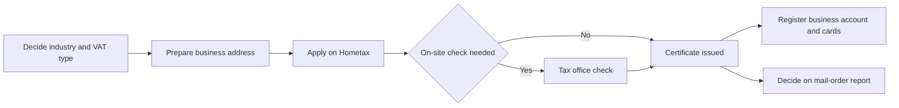
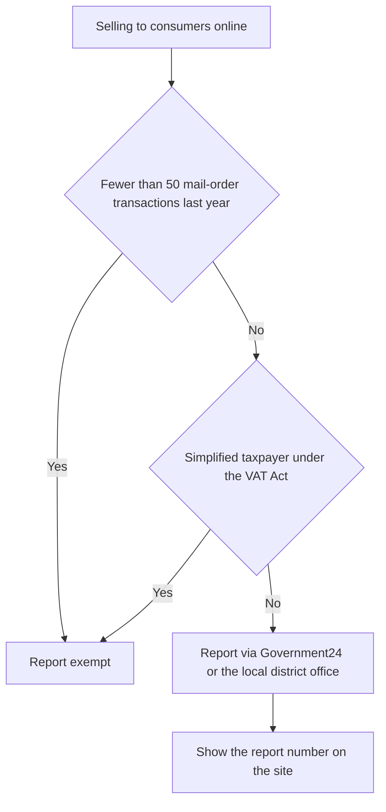

# Registration · Mail-Order Sales

> This is general information, not legal or tax advice. Rules change often, so verify with the official source or a licensed tax accountant (semusa) or lawyer before acting.

Business registration (saeopja deungnok) tells the tax office "I run this kind of business." Software businesses have little equipment, so it is easy to postpone, but there are deadlines and consequences.

## When to Register

- A business must apply to the tax office with jurisdiction over the place of business **within 20 days from the start of business** (VAT Act Article 8).
- You may register **before** the business starts.
- Input VAT on equipment or contractor costs bought before registration can be credited only if you apply for registration **within 20 days** after the end of the tax period containing the supply date (VAT Act Article 39).

> Exception: if you are preparing for a pre-founder support program, decide the registration date first. See document 09.

## Choosing an Industry Code

The industry code (eopjong code) affects expense ratios, eligibility for tax relief and statistical classification. Choose it based on **how revenue is actually earned**.

| Revenue model | Industry to consider (examples) | Notes |
|---|---|---|
| Build and sell or subscribe your own app or SaaS | Application software development and supply | Commonly cited as code 722000. Verify on Hometax |
| Custom development for clients | Computer programming services, etc. | Verify on Hometax |
| Selling goods online | E-commerce retail (525101) | NTS guide for online businesses |
| Revenue from video platforms | Media content creation (921505), one-person media content creator (940306) | Taxable or exempt depends on staff and facilities |

- You can register one main industry and several secondary ones.
- Codes and names can change every year, so check the current code in the **Hometax industry code lookup**.

## Registration Steps

| Channel | Use |
|---|---|
| Hometax / Sontax (mobile) | Registration for individuals and corporations, corrections, suspension and closure |
| Government24 (gov.kr) | Registration for individuals, mail-order business report |
| Internet Registry Office / Online Incorporation System | Corporate incorporation registry (corporations register the business after the registry) |

Per the NTS guide, processing takes **2 days by default** and can take longer if an on-site check is needed.

## Business Address

Software businesses often use the home as the place of business.

| Type | What to check |
|---|---|
| Home | Fairly simple if you own it. If rented, confirm with the landlord that the lease allows business registration |
| Rented office | Submit a copy of the lease. If you rent only part of a building, submit a floor plan of that part |
| Shared office | Check whether the contract with the operator is a sublease and whether it includes an address for business registration |
| Address-only services | Differs from where you actually work, which can cause problems at on-site checks and for relief requirements |

Bad example:

> To get regional startup tax relief, I registered with a rented address in a region where I do not actually work.

Good example:

> I signed with the shared office where I actually work, and confirmed that the contract explicitly allows its address for business registration.

## Business Account and Cards

- **Business bank account**: a double-entry bookkeeper must report a business account within 6 months from the start of the tax period in which the duty applies. If the duty applies from the start of business, within 6 months from the start of the next tax period (Income Tax Act Article 160-5). Failing to report or use it brings penalty tax and loss of relief.
- Even simple-bookkeeping businesses find books and evidence easier when **the account is separate from day one**.
- Registering **business credit cards** on Hometax collects purchase records automatically for VAT and income tax filing.

## Mail-Order Business Report

Selling goods or services to consumers online can make you a **mail-order business operator (tongsin panmae eopja)** (E-Commerce Act Article 12).

- The exemption criteria are in the Fair Trade Commission **Notice on Criteria for Exemption from Mail-Order Business Report** (notice effective 2022-04-05). Withdrawn orders are not counted.
- Even when exempt, **E-Commerce Act duties such as displaying operator identity still apply** (document 03).
- Prepaid mail-order sales may require a certificate of using a purchase-safety (escrow) service (Government24 required-documents guide).
- Whether listing an app only on app stores requires a report can depend on the sales structure, so confirm with the local district office.

## Checklist Right After Registration

- [ ] Confirm the industry and VAT type on the registration certificate match your intent
- [ ] Separate the business account and register business cards on Hometax
- [ ] Decide whether the mail-order report applies and file if so
- [ ] Enter business details in app-store and payment-processor accounts
- [ ] Prepare a certificate for issuing electronic tax invoices (document 06)
- [ ] Put the first VAT filing month in your calendar (document 08)

## Suspending or Closing the Business

Pausing or closing a business also has filings, and the deadlines matter as much as at registration.

| Task | Deadline and key point | Basis |
|---|---|---|
| Suspension or closure report | File on Hometax or Sontax, or with the tax office (Government24), attaching the registration certificate | VAT Act Article 8, Government24 suspension and closure guide |
| Deemed supply of remaining goods | Goods still held at closure (such as equipment whose input VAT was credited) are treated as supplied to yourself and become subject to VAT | VAT Act Article 10(6) |
| Closing VAT final return | File and pay for results from the start of the tax period to the closure date, plus remaining goods, **by the 25th of the month after the month of closure** | VAT Act Article 49, Easy Law |
| Global income tax | Income for the year of closure is combined with other income and filed **in May of the next year** | Income Tax Act (NTS global income tax filing guide) |
| Mail-order business closure report | If you filed a mail-order business report, report the suspension or closure to the local government (Government24) | E-Commerce Act, Government24 |
| Social insurance workplace withdrawal report | If you had staff, file loss-of-coverage reports and a workplace withdrawal report. Health insurance must be notified **within 14 days** of the event. National Pension workplace withdrawal and loss-of-coverage reports are due **by the 15th of the month after the event**, and withdrawing the workplace also ends its members' coverage | Government24 health insurance workplace withdrawal, National Health Insurance EDI guide, National Pension Service workplace guide |
| Withholding tax and payment statements | Settle withholding tax and payment statements for wages and business income paid up to the closure date | Document 07 |

- If you **restart the same kind of business** after closing, it is not a "startup" for the startup SME tax reduction (Restriction of Special Taxation Act Article 6(10), document 08). If you only want a break, consider suspension instead of closure.
- Sort out app-store and payment-processor accounts, business accounts and cards, and domain ownership before closing.

## References

- [Korea Law Information Center - VAT Act Article 8, business registration](https://www.law.go.kr/LSW/lsLawLinkInfo.do?lsJoLnkSeq=1011773243&chrClsCd=010202&ancYnChk=) (accessed 2026-09-28)
- [NTS - Applying for business registration](https://www.nts.go.kr/nts/cm/cntnts/cntntsView.do?mi=2444&cntntsId=7777) (accessed 2026-09-28)
- [NTS - Registration documents and issuance](https://www.nts.go.kr/nts/ad/cntnts/cntntsView.do?mi=2445) (accessed 2026-09-28)
- [NTS - Tax guide for one-person media creators](https://www.nts.go.kr/nts/cm/cntnts/cntntsView.do?mi=2480&cntntsId=7802) (accessed 2026-09-28)
- [NTS - Tax guide for social-media sellers](https://www.nts.go.kr/nts/cm/cntnts/cntntsView.do?mi=2483&cntntsId=7804) (accessed 2026-09-28)
- [NTS Call Center - Business account FAQ](https://call.nts.go.kr/call/qna/selectQnaInfo.do?mi=1441&ctgId=CTG11781) (accessed 2026-09-28)
- [Government24 - Mail-order business report](https://www.gov.kr/mw/AA020InfoCappView.do?CappBizCD=11300000006) (accessed 2026-09-28)
- [Korea Law Information Center - Notice on criteria for exemption from mail-order business report](https://www.law.go.kr/admRulLsInfoP.do?admRulSeq=2100000191541) (accessed 2026-09-28)
- [Hometax - Industry code lookup](https://mob.tbht.hometax.go.kr/jsonAction.do?actionId=UTBABAAB78F001) (accessed 2026-09-28)
- [Government24 - Business suspension (closure) report](https://www.gov.kr/mw/AA020InfoCappView.do?CappBizCD=12100000078) (accessed 2026-09-28)
- [Easy Law - Online shop founders: suspension, closure and resumption reports](https://easylaw.go.kr/CSP/CnpClsMain.laf?popMenu=ov&csmSeq=25&ccfNo=2&cciNo=2&cnpClsNo=2) (accessed 2026-09-28)
- [Easy Law - Business closure report (closing VAT final return)](https://easylaw.go.kr/CSP/CnpClsMain.laf?popMenu=ov&csmSeq=534&ccfNo=5&cciNo=1&cnpClsNo=2) (accessed 2026-09-28)
- [Government24 - Mail-order business suspension, closure and resumption report](https://www.gov.kr/mw/AA020InfoCappView.do?HighCtgCD=A09006&CappBizCD=11300000008&tp_seq=03) (accessed 2026-09-28)
- [Government24 - Health insurance workplace withdrawal report](https://gov.kr/mw/AA020InfoCappView.do?CappBizCD=14600000324&HighCtgCD=A05007&tp_seq=) (accessed 2026-09-28)
- [National Health Insurance EDI - Workplace withdrawal (extinction) report](https://edi.nhis.or.kr/webedi/help/html/appli/ap_06.html) (accessed 2026-09-28)
- [National Pension Service - Workplace practice guide 2026 (PDF)](https://edi.nps.or.kr/cm/main/guide/edi_workguide_new.pdf) (2026 edition, accessed 2026-09-28)
- [Korea Law Information Center - VAT Act](https://law.go.kr/LSW/lsInfoP.do?lsiSeq=269797) (Article 10(6), remaining goods at closure, accessed 2026-09-28)
