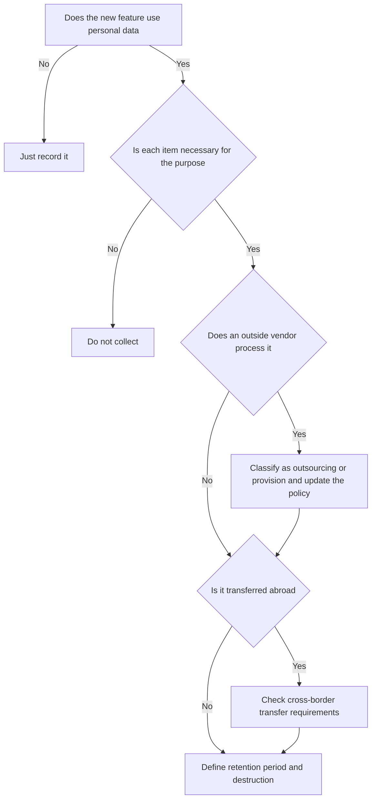

# Terms · Privacy · E-Commerce

> This is general information, not legal or tax advice. Rules change often, so verify with the official source or a licensed tax accountant (semusa) or lawyer before acting.

An online service creates three legal relationships the moment it launches.

| Relationship | Main law | Output |
|---|---|---|
| Terms of use | Act on the Regulation of Terms and Conditions | Terms of service |
| Handling personal data | Personal Information Protection Act (PIPA) | Privacy policy, consent screens |
| Online sales and subscriptions | Act on Consumer Protection in Electronic Commerce (E-Commerce Act) | Operator identity display, withdrawal notices, checkout screens |

## Terms of Service

Standard terms are contract terms a business prepares in advance to contract with many customers.

- **Duty to state and explain**: write the terms in Korean using standardized wording so customers can understand them easily, and mark important parts clearly with symbols, characters or colors. Disclose the terms when contracting and give a copy on request (Terms Regulation Act Article 3).
- The "important parts" that must be explained are those that directly affect a customer's decision to contract or the price.
- Fair Trade Commission **standard terms** (for example the standard terms for internet shopping malls) are a good starting point. Standard terms are recommendations.

Bad example:

> We copied another service's terms and only changed the company name. The refund clause did not match our billing.

Good example:

> Starting from the standard terms, we reflected our real plans, cancellation and refund method, and data retention periods, and kept a change history.

## Privacy Policy

A personal information controller must set a privacy policy and publish it so data subjects can easily check it (PIPA Article 30).

Typical items in the policy:

- Purpose of processing personal data
- Processing and retention period
- Provision to third parties (if applicable)
- Outsourcing of processing (if applicable)
- Destruction procedure and method
- Rights of data subjects and how to exercise them
- Chief privacy officer

The Personal Information Protection Commission (PIPC) publishes **Privacy Policy Drafting Guidelines**. A revised edition was released in April 2025, so write from the latest edition.

## Commonly Missed Points in Data Handling

| Situation | Article to check | Key point |
|---|---|---|
| Data stored in overseas cloud or SaaS | Article 28-8, cross-border transfer | One of the legal grounds, such as separate consent, is required |
| Users under 14 | Article 22-2, protection of children's data | Legal guardian consent and verification of that consent |
| Appointing an officer | Article 31, chief privacy officer | Required in principle, with exceptions below certain thresholds |
| Analytics and ad SDKs | Article 30 policy, outsourcing vs provision | Inventory what each SDK collects |

## E-Commerce Act Duties

### Operator Identity Display

An online mall operator must display the trade name, representative's name, business address, phone number, email address, business registration number, terms of use and more on the initial screen (E-Commerce Act Article 10). A mail-order business shows its report number and other identity details in its advertising.

### Withdrawal of Orders

- A consumer can withdraw an order **within 7 days** of receiving the written contract terms, or, if delivery is later, within 7 days of receiving the goods or the start of the service (E-Commerce Act Article 17).
- Where withdrawal is limited, as with **digital content**, the business must state that clearly and take steps such as **providing a trial version** so the right is not obstructed.

### Subscription Billing and Dark Patterns

The amended E-Commerce Act promulgated on 2024-02-13 **took effect on 2025-02-14** and directly regulates six types of dark patterns.

| Regulated practice | Article | Meaning for a subscription SaaS |
|---|---|---|
| Raising a recurring charge, or converting free to paid | Article 13(6) | Under the Enforcement Decree, obtain consumer consent within 30 days before the change and explain how to cancel |
| Showing only part of the price instead of the total | Article 21-2(1)1 | Show the real total on the pricing screen |
| Pre-selecting options | Article 21-2(1)2 | Do not pre-check paid options |
| False hierarchy | Article 21-2(1)3 | Do not grey out only the "cancel" button |
| Obstructing cancellation or account deletion | Article 21-2(1)4 | Cancellation as easy as sign-up |
| Nagging | Article 21-2(1)5 | No repeated pop-ups after a refusal |

Bad example:

> We silently moved users to an annual plan when the free trial ended.

Good example:

> Before the trial ended we asked for consent to the paid plan, and the consent screen showed the cancellation method and the charge.

## Pre-Launch Checklist

- [ ] Terms of service: review price, cancellation, refund, service change and limitation-of-liability clauses
- [ ] Privacy policy: matches the real data items, SDKs and storage locations
- [ ] Sign-up consent screen: required and optional items separated
- [ ] Site footer: operator identity and mail-order report number
- [ ] Checkout: total price shown, notice of withdrawal limits
- [ ] Subscriptions: free-to-paid consent flow and cancellation path

## References

- [Korea Law Information Center - Act on the Regulation of Terms and Conditions](https://www.law.go.kr/LSW/lsInfoP.do?lsiSeq=203797) (accessed 2026-09-28)
- [Korea Law Information Center - PIPA Article 30](https://www.law.go.kr/LSW/lsLinkCommonInfo.do?lsJoLnkSeq=1033215151) (accessed 2026-09-28)
- [Privacy Portal - Privacy Policy Drafting Guidelines (April 2025)](https://www.privacy.go.kr/front/bbs/bbsView.do?bbsNo=BBSMSTR_000000000049&bbscttNo=20806) (published April 2025, accessed 2026-09-28)
- [Privacy Portal - Duty to verify legal guardian consent](https://www.privacy.go.kr/front/contents/cntntsView.do?contsNo=94) (accessed 2026-09-28)
- [Korea Law Information Center - E-Commerce Act](https://www.law.go.kr/lsInfoP.do?lsId=009318&ancYnChk=0) (accessed 2026-09-28)
- [Korea Policy Briefing - Consent required within 30 days before a recurring price increase or paid conversion](https://www.korea.kr/news/policyNewsView.do?newsId=148939436) (accessed 2026-09-28)
- [Fair Trade Commission - Amendment of the E-Commerce consumer protection guideline](https://www.ftc.go.kr/www/selectBbsNttView.do?key=12&bordCd=3&nttSn=46527) (accessed 2026-09-28)
- [Fair Trade Commission - Standard terms](https://www.ftc.go.kr/www/selectBbsNttView.do?pageUnit=10&pageIndex=1&searchCnd=all&key=202&bordCd=201&nttSn=11139) (accessed 2026-09-28)
