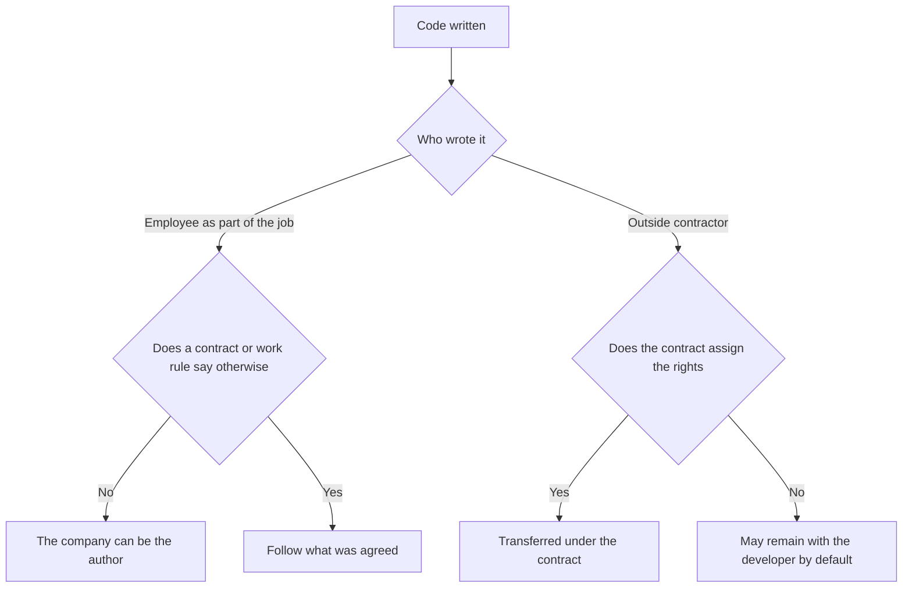

# Contracts · IP · Open Source

> This is general information, not legal or tax advice. Rules change often, so verify with the official source or a licensed tax accountant (semusa) or lawyer before acting.

Most assets of a software business are **code, names, data and relationships**. This document covers the contracts and rights that decide who owns them.

## Service Contract Basics

When you take on or hand out contract work, put at least the following in writing.

| Item | What to decide |
|---|---|
| Scope | Feature list, out of scope, change-request process |
| Acceptance | Acceptance criteria, period, deemed-acceptance conditions |
| Payment | Amount, whether VAT is included, timing, handling of late payment |
| Ownership | Copyright in deliverables, rights in pre-existing code and libraries |
| Warranty | Period and scope |
| Confidentiality | Covered information, duration, return or destruction |
| Termination | Grounds and settlement on termination |

Under Article 38 of the Software Promotion Act (principle of fair contracts), the Ministry of Science and ICT has distributed **six standard software contracts** (four between software businesses, two between software workers and businesses) since 2020-12-31. They are a good starting point for a draft.

Bad example:

> We agreed "one app for 5 million" in a chat and started. Without acceptance criteria the final payment slipped by six months.

Good example:

> Starting from a standard contract, we attached the feature list and acceptance period as an annex, and stated that change requests are quoted separately.

## NDAs and Protecting Technical Data

- An NDA should cover **the name and scope of the technical data, period of use, who may access it, no use outside the purpose, damages for breach, and how it is returned or destroyed**.
- Public bodies such as the Ministry of SMEs and Startups distribute a **standard NDA** form you can use as a draft.
- If you must hand core source code to a business partner, consider the **technology escrow system** (Korea Large and Small Business Cooperation Foundation) (Act on the Promotion of Collaborative Cooperation between Large and Small-Medium Enterprises, Article 24-2).

## Copyright: Who Owns the Code



- A work made for hire can have the company as its author when the requirements are met (Copyright Act Article 9). For computer programs, the "published under the company's name" requirement does not apply.
- Courts read Article 9 **narrowly as an exception** and do not extend it to outsourcing (contract-for-work) relationships. Rights in outsourced deliverables must be **stated in the contract**.
- Even when rights are assigned, a developer's pre-existing libraries and templates are often excluded. Keep a list of that scope.

## Trademarks: Protecting the Service Name

- On 2025-10-01 the Korean Intellectual Property Office was upgraded and reorganized as the **Intellectual Property Service (Jisik Jaesan Cheo)**. Filing is still done through **Patent-ro** (patent.go.kr).
- Before e-filing, get a patent customer number and register your certificate.
- Filing fees (per the Intellectual Property Service guide): KRW 52,000 per class for electronic filing, plus KRW 2,000 for each designated good beyond 10. KRW 46,000 per class if you designate only goods from the published list of names. Check registration fees and reductions separately.
- A trademark right lasts **10 years** from registration and can be renewed for 10 years at a time (Trademark Act Article 83).

Before filing a trademark:

- [ ] Search for identical or similar marks, for example on KIPRIS
- [ ] Align the app name, domain and social media handles
- [ ] Designated goods: software, SaaS services and your real business scope
- [ ] Applicant: individual or corporation (a transfer is needed on conversion)

## Open-Source License Compliance

The Korea Copyright Commission runs **OLIS** (Open Source Software License Information System), with a license guide, comparison table and scanning tools. Guide version 5.0 was published in June 2025.

| Type | Examples | Key duty when distributing |
|---|---|---|
| Permissive | MIT, BSD, Apache-2.0 | Keep copyright and license notices (Apache-2.0 adds conditions such as NOTICE) |
| Weak copyleft | LGPL, MPL | Disclose changes to the library or file, etc. |
| Strong copyleft | GPL, AGPL | Possible duty to disclose source of combined works. For AGPL, also consider network service use |

```text
Extract the dependency list (SBOM)
→ Identify licenses
→ Check distribution form (app / SaaS / on-premises)
→ Generate notice files
→ Review copyleft combinations
→ Add to the release checklist
```

A license violation can become copyright infringement or breach of contract.

## References

- [NIPA - Using the six standard software contracts](https://www.nipa.kr/home/2-1/7817) (accessed 2026-09-28)
- [Ministry of Science and ICT - Standard software contracts announcement](https://www.msit.go.kr/bbs/view.do?sCode=user&mPid=122&mId=123&bbsSeqNo=96&nttSeqNo=3179216) (accessed 2026-09-28)
- [Ministry of SMEs and Startups - Standard NDA](https://mss.go.kr/site/smba/ex/bbs/View.do?cbIdx=81&bcIdx=1031902) (accessed 2026-09-28)
- [SME Technology Protection Portal - Technology escrow](https://www.ultari.go.kr/portal/psi/techData.do) (accessed 2026-09-28)
- [Easy Law - Authors](https://easylaw.go.kr/CSP/CnpClsMain.laf?popMenu=ov&csmSeq=695&ccfNo=1&cciNo=1&cnpClsNo=2) (accessed 2026-09-28)
- [Korea Copyright Commission - Works made for hire](https://www.copyright.or.kr/information-materials/dictionary/view.do?glossaryNo=400) (accessed 2026-09-28)
- [Intellectual Property Service - Trademark e-filing FAQ](https://kipo.go.kr/kcall/faqRead.do?curMenuCd=SCD0300093&pgmSeq=60&pgmId=PGM0000014&sysCd=60&urlDo=/cFaqChargeList.do) (accessed 2026-09-28)
- [Patent-ro - Fee guide](https://www.patent.go.kr/smart/jsp/ka/menu/fee/main/FeeMain01.do) (accessed 2026-09-28)
- [Intellectual Property Service - Renewal registration](https://www.kipo.go.kr/ko/kpoContentView.do?menuCd=SCD0200209) (accessed 2026-09-28)
- [Intellectual Property Service - History](https://www.kipo.go.kr/ko/kpoContentView.do?menuCd=SCD0200442) (accessed 2026-09-28)
- [OLIS - License guide](https://www.olis.or.kr/license/licenseGuide.do) (accessed 2026-09-28)
