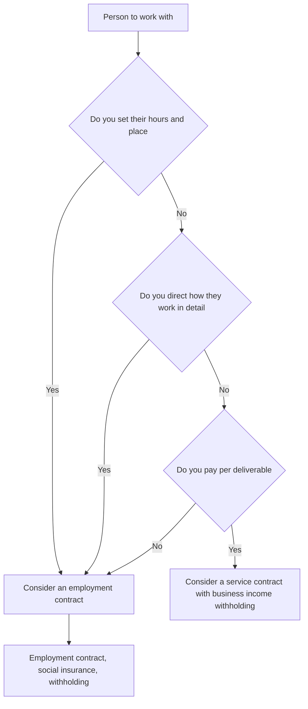

# Hiring · Social Insurance · Freelancers

> This is general information, not legal or tax advice. Rules change often, so verify with the official source or a licensed tax accountant (semusa) or lawyer before acting.

The moment you bring in your first person, you become an **employer** or a **client**. The form of the working relationship changes tax, insurance and labor-law obligations all at once.

## Employee or Freelancer

It is decided by **how the work is actually done**, not by the contract title. Supreme Court case law looks at the following factors of subordinate employment (summary of Ministry of Employment and Labor guidance).

| Factor | Facts pointing toward an employee |
|---|---|
| Work content | The employer decides what the work is |
| Direction and supervision | Specific, direct direction while doing the work |
| Time and place | Working hours and place are set and binding |
| Substitutability | Cannot hire a third party to do the work instead |
| Tools | Equipment and tools are provided by the employer |
| Pay | Pay is for the labor itself, not for a result |
| Continuity and exclusivity | Continuous, exclusive work for one employer |

Whether there is a base salary, whether wage income tax is withheld, and whether social insurance is paid can be set by the employer at will, so **these alone do not rule out employee status.**

## The Risk of Fake 3.3 Contracts

- A "fake 3.3 contract" treats someone who is really an employee as earning business income (3.3% withholding) to avoid social insurance and labor law.
- The Ministry of Employment and Labor announced that it inspected 108 suspected workplaces **from 2025-12-01 to 2026-03-05** and found 1,070 workers handled this way at 72 of them (67%).
- If the person is found to be an employee, unpaid insurance premiums and labor-law duties such as annual leave and severance can apply retroactively.

Bad example:

> Daily 10 a.m. start, always in the team Slack, fixed monthly pay, yet we signed only a "freelancer contract" and withheld 3.3%.

Good example:

> We kept a structure of no set hours and acceptance and payment per feature deliverable, both in the contract and in practice. When full-time presence became necessary, we switched to an employment contract.

## Employment Contract

- When signing an employment contract, the employer must state wages, contractual working hours, holidays, paid annual leave and more, and **deliver a written document stating wage components, calculation and payment method** (Labor Standards Act Article 17).
- Start from the Ministry of Employment and Labor **standard employment contract**.
- Failing to deliver the written contract is subject to penalties. There are also separate fine provisions for fixed-term and part-time workers. Check amounts in the current articles.

## The Four Social Insurances

| Insurance | 2026 rate | Notes |
|---|---|---|
| National Pension | 9.5% | Rising 0.5 percentage points a year from 2026 up to 13% (Ministry of Health and Welfare). Split equally between worker and employer |
| Health Insurance | 7.19% | Split equally between worker and employer |
| Long-term Care Insurance | 0.9448% of income | Ministry of Health and Welfare 2026 rate announcement |
| Employment Insurance | Unemployment benefit rate has been raised before | Additional rates by business size. Check with the Social Insurance Information Center calculator |
| Industrial Accident Insurance | Published per industry | Announced at year-end for the next year |

- When you hire, file a **workplace establishment report** and **employee enrollment reports**. Deadlines differ by insurance, so check the Social Insurance Information Center (4insure.or.kr) and file via EDI.
- If a corporate CEO receives pay, the CEO can also become an employee-insured member.

## Freelancer (Business Income) Contracts

- When paying for personal services, withhold **3.3% (including local income tax)** of the payment.
- Pay the withheld tax **by the 10th of the month after payment** (except businesses approved for semiannual payment).
- If you submit the simplified payment statement for business income every month, the annual payment statement is waived (payments from 2023-01-01, excluding business income subject to year-end settlement).
- See document 07 for details.

## First-Hire Checklist

- [ ] Record why the person is an employee or a freelancer
- [ ] Write and deliver the employment contract
- [ ] File the social insurance workplace report and enrollment reports
- [ ] Add payroll withholding and simplified payment statement dates to your calendar
- [ ] Decide how to store personal data such as resident registration numbers
- [ ] Check the clause on ownership of deliverables (document 04)

## References

- [Ministry of Employment and Labor - Fake 3.3 disguised employment inspection results](https://www.moel.go.kr/news/enews/report/enewsView.do?news_seq=19096) (accessed 2026-09-28)
- [Korea Policy Briefing - Planned inspection of fake 3.3 employment](https://www.korea.kr/news/policyNewsView.do?newsId=148955889) (accessed 2026-09-28)
- [Korea Law Information Center - Labor Standards Act Article 17](https://www.law.go.kr/lsLawLinkInfo.do?chrClsCd=010201&lsJoLnkSeq=1015677481) (accessed 2026-09-28)
- [National Pension Service - Pension contributions](https://www.nps.or.kr/pnsinfo/ntpsklg/getOHAF0038M0.do) (accessed 2026-09-28)
- [National Health Insurance EDI - 2026 premium rate increase notice](https://edi.nhis.or.kr/portal/images/popup/20251204_pop01longdesc.html) (posted December 2025, accessed 2026-09-28)
- [Ministry of Health and Welfare - 2026 long-term care insurance rate](https://www.mohw.go.kr/board.es?mid=a10503010100&bid=0027&act=view&list_no=1487817) (accessed 2026-09-28)
- [Social Insurance Information Center - Premium calculator](https://www.4insure.or.kr/pbiz/ntcn/inscSmlCalcView.do) (accessed 2026-09-28)
- [Easy Law - Reporting the four social insurances](https://easylaw.go.kr/CSP/CnpClsMain.laf?popMenu=ov&csmSeq=632&ccfNo=3&cciNo=4&cnpClsNo=1) (accessed 2026-09-28)
- [NTS - Simplified payment statement (business income of residents)](https://www.nts.go.kr/nts/cm/cntnts/cntntsView.do?mi=40349&cntntsId=238925) (accessed 2026-09-28)
