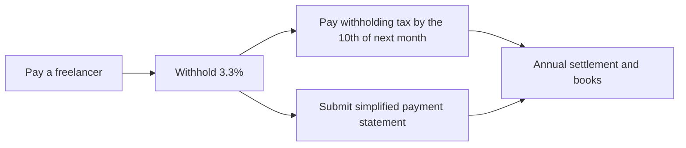

# Income Tax · Corporate Tax · Withholding · Books

> This is general information, not legal or tax advice. Rules change often, so verify with the official source or a licensed tax accountant (semusa) or lawyer before acting.

If VAT is "tax on transactions," income tax and corporate tax are **tax on the profit you kept over a year**. Books and evidence are how you prove that profit.

## Global Income Tax (Sole Proprietors)

- Income for one year (January 1 to December 31) is combined and filed and paid **in May of the next year**. The deadline is May 31.
- Businesses that submit a sincere-filing confirmation (seongsil singo hwagin) get one more month, until **June 30**.
- Rates are progressive from **6% to 45%** by tax base bracket (NTS global income tax rate table). Local income tax is added separately.
- **Interim prepayment**: part of the income tax for the first half (January 1 to June 30) is billed and paid in November. If the estimated interim amount is below KRW 500,000 nothing is payable, but you must file the estimate to cancel the notice.

### Who Needs a Sincere-Filing Confirmation

A sole proprietor whose **revenue for the tax period** reaches the industry threshold must file a sincere-filing confirmation checked by a tax accountant or similar with the global income tax return (Income Tax Act Article 70-2, Enforcement Decree Article 133). Per the NTS sincere-filing confirmation guide (as of filings for the 2026 tax year):

| Industry group (excerpt) | Revenue threshold |
|---|---|
| Agriculture, forestry, fishing, mining, wholesale and retail, real estate sales, and any business not listed below | KRW 1.5 billion or more |
| Manufacturing, accommodation and food, construction, transport and storage, **information and communications**, finance and insurance, etc. | KRW 750 million or more |
| Real estate including rental, professional, scientific and technical services, facility management and business support services, education, arts, sports and recreation, etc. | KRW 500 million or more |

- Software development and supply usually falls under information and communications (KRW 750 million), but if contract development is registered under a professional, scientific and technical services code the KRW 500 million threshold may apply, so check your registered industry code.
- Filing the confirmation gives a **tax credit of 60% of the cost** spent directly on it (Restriction of Special Taxation Act Article 126-6). The credit has a cap, so check the amount in the article.
- If an under-report leads to a correction, the confirmation cost credit is denied for the following 3 tax years (NTS guide).

## Corporate Tax

- File within **3 months** from the end of the month in which the fiscal year ends (Corporate Tax Act Article 60). For December year-end corporations, March 31 of the next year.
- Rates (fiscal years starting on or after 2026-01-01, NTS guide): tax base up to KRW 200 million 10%, over 200 million up to 20 billion 20%, over 20 billion up to 300 billion 22%, over 300 billion 25%.
- **Interim prepayment**: a corporation whose fiscal year exceeds 6 months pays interim tax for the first 6 months **within 2 months** after that period (Corporate Tax Act Article 63). The first fiscal year of a newly founded corporation is excluded.

## Withholding and Payment Statements

Withholding (woncheon jingsu) means deducting tax in advance when you pay someone and paying it on their behalf.

| Payee | Withholding | Payment statement |
|---|---|---|
| Staff salary (wage income) | Simplified tax table, year-end settlement | Payment statement by March 10 of the next year. Simplified statements are semiannual for payments through 2026 and **monthly for payments from 2027-01-01** (by the end of the next month) |
| Daily workers | Daily wage income withholding | By the last day of the month after payment |
| Freelancers (business income) | 3.3% of the payment (including local income tax) | Monthly simplified statements waive the annual statement (from 2023-01-01) |

- Pay withheld tax **by the 10th of the month after the month of withholding**.
- If you meet conditions such as regular headcount and are approved, **semiannual payment** (10th of the month after the half-year) is possible.
- Missing the payment statement deadline incurs penalty tax of 1% of the unsubmitted amount (0.25% for daily wage income and simplified statements). Submitting within 1 month after the deadline reduces it (NTS guide).
- Monthly simplified statements for wage income were deferred once and start on 2027-01-01. The NTS says that during 2027 (through 2028 for small businesses), filing by the old half-year deadline waives the non-filing penalty.



## Books: Simple Bookkeeping vs Double-Entry

The bookkeeping duty is set by **revenue by industry in the previous tax period**. New businesses are in principle simple-bookkeeping businesses.

| Industry group (excerpt of NTS criteria) | Simple bookkeeping | Double-entry required |
|---|---|---|
| Information and communication, manufacturing, accommodation and food, etc. | Below KRW 150 million | KRW 150 million or more |
| Professional, scientific and technical services, business support services, education services, etc. | Below KRW 75 million | KRW 75 million or more |

- Software development and supply usually falls under information and communication, but the registered industry code decides, so check on Hometax.
- Simple-bookkeeping businesses may still keep double-entry books.
- Small businesses with previous-period revenue below KRW 48 million, among others, are exempt from the no-bookkeeping penalty.
- Without books you file on an estimated (expense-ratio) basis, and real expenses are hard to recognize even when they are large.

## Expenses

- To have a cost recognized, the rule is to obtain **qualified evidence** (tax invoice, invoice, credit card slip, cash receipt).
- If you pay a business and do not receive qualified evidence, a **2%** penalty on the unreceived amount can apply (check the NTS guide for the threshold amount and exceptions).

| Cost | Evidence | Caution |
|---|---|---|
| Cloud and SaaS (overseas) | Invoice, card slip | Overseas vendors issue no Korean tax invoice. Pay by card and keep the invoice |
| App-store fees | Settlement report | Keep it paired with the gross revenue |
| Contract development | Tax invoice or withholding record | Distinguish a business from an individual freelancer |
| Equipment | Tax invoice, card slip | Fixed asset or not, depreciation |
| Meals and entertainment | Card slip | Record the business purpose |

Bad example:

> We mixed personal and business cards and hunted for a year of receipts in May.

Good example:

> We used only the business card, gathered overseas invoices into a folder at each month-end, and noted the purpose.

### Business Passenger Cars (double-entry bookkeepers)

A double-entry bookkeeper who deducts business passenger car costs (depreciation, lease or rental fees, fuel, insurance, repairs, vehicle tax, tolls, etc.) follows Income Tax Act Article 33-2 and Enforcement Decree Article 78-3.

| Item | Detail |
|---|---|
| Business-only car insurance | Costs are allowed by the business-use ratio only if, for the whole tax period, the car is insured for driving by the business owner, staff and similar people only |
| No such insurance | For costs incurred in 2024 and 2025 a transition rule allowed 50% of the business-use amount (excluding sincere-filing businesses, medical practices, etc.). **For costs from 2026-01-01 that 50% transition rule has ended**, so less is allowed (the decree sets 0% for cars beyond the first, etc.). Check how it applies by number of cars and industry in the decree and with a tax accountant (needs verification) |
| Depreciation | Straight-line over 5 years, and business-use depreciation is capped at **KRW 8 million a year**. The excess carries over to later tax periods |
| Driving log | With a log, costs are allowed by business mileage ratio. Without one, only up to **KRW 15 million** of annual related costs counts as business use |
| Statement | File the business passenger car cost statement with the global income tax return. Penalty tax applies if it is missing or inaccurate (NTS business passenger car guide) |

- Simplified bookkeepers are outside this special rule, but they must still prove business use.

## Monthly Routine

```text
Start of month: download last month's settlement reports (domestic / overseas split)
10th: pay withholding tax (if any)
End of month: submit simplified payment statements (business income, and wage income from 2027)
End of month: file overseas invoices and card slips
End of quarter: check VAT preliminary notices and returns
```

## References

- [NTS - Global income tax filing and payment deadlines](https://www.nts.go.kr/nts/cm/cntnts/cntntsView.do?mi=2225&cntntsId=7665) (accessed 2026-09-28)
- [NTS - Sincere filing confirmation system](https://www.nts.go.kr/nts/cm/cntnts/cntntsView.do?mi=2234&cntntsId=7672) (accessed 2026-09-28)
- [Korea Law Information Center - Restriction of Special Taxation Act Article 126-6, credit for sincere-filing confirmation costs](https://www.law.go.kr/LSW/lsLawLinkInfo.do?chrClsCd=010202&lsJoLnkSeq=1000684517&lsId=001584&print=print) (accessed 2026-09-28)
- [Korea Law Information Center - Income Tax Act Enforcement Decree Article 78-3, business passenger car costs](https://www.law.go.kr/LSW/lsLawLinkInfo.do?lsJoLnkSeq=1000316871&chrClsCd=010202) (accessed 2026-09-28)
- [NTS - Tax treatment of business passenger cars (PDF)](https://www.nts.go.kr/comm/nttFileDownload.do?fileKey=21e8ce1222b24853f1ed9c839862b569) (accessed 2026-09-28)
- [NTS - Notice deferring monthly simplified payment statements for regular employees](https://www.nts.go.kr/nts/na/ntt/selectNttInfo.do?mi=2207&bbsId=1011&nttSn=1330270) (accessed 2026-09-28)
- [NTS - Global income tax rates](https://www.nts.go.kr/nts/cm/cntnts/cntntsView.do?mi=2227&cntntsId=7667) (accessed 2026-09-28)
- [NTS - Global income tax interim prepayment](https://www.nts.go.kr/nts/cm/cntnts/cntntsView.do?cntntsId=7673&mi=2236) (accessed 2026-09-28)
- [NTS - Corporate tax filing and payment deadlines](https://www.nts.go.kr/nts/cm/cntnts/cntntsView.do?mi=2371&cntntsId=7745) (accessed 2026-09-28)
- [NTS - Corporate tax rates (2026 onward)](https://www.nts.go.kr/nts/cm/cntnts/cntntsView.do?cntntsId=7746&mi=2372) (accessed 2026-09-28)
- [NTS - Corporate tax interim prepayment](https://www.nts.go.kr/nts/cm/cntnts/cntntsView.do?mi=6565&cntntsId=7991) (accessed 2026-09-28)
- [NTS - Withholding tax filing and payment deadlines](https://www.nts.go.kr/nts/cm/cntnts/cntntsView.do?mi=2290&cntntsId=7702) (accessed 2026-09-28)
- [NTS - Submitting payment statements](https://www.nts.go.kr/nts/cm/cntnts/cntntsView.do?mi=12242&cntntsId=8631) (accessed 2026-09-28)
- [NTS - Simplified payment statement (wage income) deadline cases](https://www.nts.go.kr/nts/cm/cntnts/cntntsView.do?mi=40678&cntntsId=239032) (accessed 2026-09-28)
- [NTS - Simple bookkeeping guide](https://www.nts.go.kr/nts/cm/cntnts/cntntsView.do?cntntsId=7670&mi=2231) (accessed 2026-09-28)
- [NTS - Bookkeeping duty and expense-ratio criteria](https://www.nts.go.kr/nts/cm/cntnts/cntntsView.do?mi=2230&cntntsId=7669) (accessed 2026-09-28)
