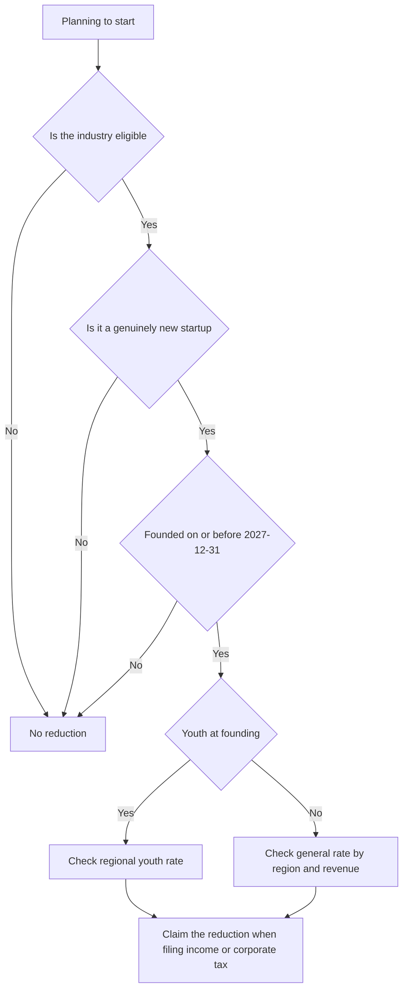

# Startup Relief · Tax Calendar · Accountants

> This is general information, not legal or tax advice. Rules change often, so verify with the official source or a licensed tax accountant (semusa) or lawyer before acting.

Early-stage tax benefits are decided by **when, where and in which industry you start, and the founder's age**. Many of these conditions are hard to change after registration.

## Startup SME Tax Reduction (Restriction of Special Taxation Act Article 6)

| Item | Content (per the article on the Korea Law Information Center) |
|---|---|
| Eligible | SMEs founded in the industries listed in the law **on or before 2027-12-31** |
| Period | The first tax year with income and the tax years ending **within 4 years** from the start of the following year (up to 5 tax years) |
| Taxes covered | Income tax or corporate tax on income from that business |
| Youth | Aged 15 to 34 at founding (check the article for details such as military service credit) |

### Reduction Rates for Youth Startups Founded on or after 2026-01-01

| Founding location | Reduction |
|---|---|
| Outside the capital region, or a depopulation area within the capital region | 100% |
| Capital region (excluding overcrowding control areas and depopulation areas) | 75% |
| Capital-region overcrowding control area | 50% |

- Guidance states that for youth founders from 2026-01-01, **reduced tax above KRW 500 million in total is not reduced**. Check the article for whether the cap is annual or for the whole period (needs verification).
- Non-youth founders and small (revenue-based) founders also have regional rates. The 2026 amendment changed the brackets, so **check the original article** (needs verification).
- Startups founded on or before 2025-12-31 follow the previous rules (inside or outside the overcrowding control area).

### Cases Not Treated as a "Startup"

The following may not count as a "startup" for the reduction. Confirm details with the article and a tax accountant.

- Converting a sole proprietorship into a corporation
- Restarting the same kind of business after closing
- Succeeding to or acquiring an existing business
- Only adding or changing an industry

Bad example:

> We converted a sole proprietorship run for five years into a corporation and assumed the new corporation would get the startup reduction.

Good example:

> Before founding, we confirmed with a tax accountant that the business address, industry code and founder's age met the requirements, and kept a record.

## Tax Calendar (December year-end, January to December periods)

| Month | Individual general taxpayer | Corporation | Common (with staff or freelancers) |
|---|---|---|---|
| January | VAT final return (previous 2nd period) | VAT final return | Withholding tax, simplified statement (wages, previous second half) |
| February | | | Withholding tax, prepare year-end settlement |
| March | | Corporate tax return (March 31) | Payment statements (March 10) |
| April | Pay VAT preliminary notice | VAT preliminary return or notice | Withholding tax |
| May | Global income tax return (May 31) | | Withholding tax |
| June | Global income tax for sincere-filing businesses (June 30) | | Withholding tax |
| July | VAT final return (1st period) | VAT final return | Withholding tax, simplified statement (wages, first half) |
| August | | Corporate tax interim prepayment (end of August) | Withholding tax |
| September | | | Withholding tax |
| October | Pay VAT preliminary notice | VAT preliminary return or notice | Withholding tax |
| November | Global income tax interim prepayment (end of November) | | Withholding tax |
| December | Review next year's plan | | Withholding tax |

- Withholding tax is due by the 10th of the next month (January 10 and July 10 if approved for semiannual payment), and simplified statements for business income are monthly.
- Simplified taxpayers file one VAT final return in January, and July is the preliminary assessment period.
- If a deadline falls on a Saturday or holiday, it moves to the next business day. Check actual dates each year on the **NTS tax schedule**.

## When You Need a Tax Accountant

| Signal | Why |
|---|---|
| Considering incorporation or conversion | Tax is decided at the design stage |
| Overseas revenue grows | Zero-rate requirements and evidence |
| You become a double-entry bookkeeper | Financial statements and business account management |
| First employee | Payroll, social insurance, year-end settlement |
| Claiming startup reductions or credits | Checking requirements and application documents |
| The tax office asks for an explanation | Response deadline and approach |

What you can do yourself: business registration, simple bookkeeping, straightforward VAT returns, withholding tax returns.
What is better delegated: corporate tax returns, applying reductions, global income tax needing adjustments, tax audit responses.

## References

- [Korea Law Information Center - Restriction of Special Taxation Act Article 6, tax reduction for startup SMEs](https://www.law.go.kr/LSW//lsLawLinkInfo.do?lsJoLnkSeq=1001035269&lsId=001584&chrClsCd=010202&print=print) (article in force in 2026, accessed 2026-09-28)
- [Korea Law Information Center - Restriction of Special Taxation Act Enforcement Decree links](https://www.law.go.kr/LSW/lsLinkCommonInfo.do?lspttninfSeq=148488&chrClsCd=010202) (accessed 2026-09-28)
- [NTS - Corporate tax guide for startup SMEs](https://www.nts.go.kr/nts/cm/cntnts/cntntsView.do?mi=6553&cntntsId=7979) (accessed 2026-09-28)
- [NTS - Youth support: tax reductions and savings](https://nts.go.kr/nts/cm/cntnts/cntntsView.do?mi=41127&cntntsId=239082) (accessed 2026-09-28)
- [Easy Law - Tax benefits for startups](https://easylaw.go.kr/CSP/CnpClsMain.laf?popMenu=ov&csmSeq=632&ccfNo=4&cciNo=3&cnpClsNo=1) (accessed 2026-09-28)
- [NTS - Tax schedule](https://www.nts.go.kr/nts/ad/taxSchdul/selectList.do?taxMonth=&mi=135747) (accessed 2026-09-28)
- [NTS - VAT filing and payment deadlines](https://www.nts.go.kr/nts/cm/cntnts/cntntsView.do?mi=2273&cntntsId=7694) (accessed 2026-09-28)
- [NTS - Corporate tax interim prepayment](https://www.nts.go.kr/nts/cm/cntnts/cntntsView.do?mi=6565&cntntsId=7991) (accessed 2026-09-28)
