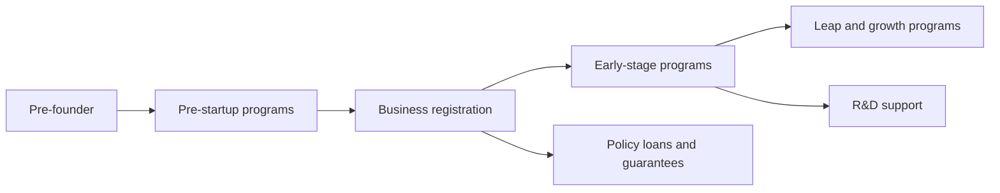

# Startup Support Programs

> This is general information, not legal or tax advice. Rules change often, so verify with the official source or a licensed tax accountant (semusa) or lawyer before acting.

Central and local government startup programs are announced anew every year. Rather than memorizing individual programs, this document covers **where to find them and which eligibility conditions to check first**.

## Scale and Channels

- The Ministry of SMEs and Startups publishes an **integrated announcement of central and local startup support programs** every year.
- 2026 integrated announcement: **111 institutions, 508 programs, KRW 3.4645 trillion in total** (up KRW 170.5 billion, 5.2%, year on year). By type, loans KRW 1.4245 trillion (41.1%), R&D KRW 864.8 billion, commercialization KRW 815.1 billion.

| Channel | Use |
|---|---|
| K-Startup (k-startup.go.kr) | Korea Institute of Startup and Entrepreneurship Development (KISED) calls and applications, integrated announcement |
| Bizinfo (bizinfo.go.kr) | Search ministry and local government program calls |
| Ministry of SMEs and Startups (mss.go.kr) | Original integrated announcement, policy releases |
| KISED (kised.or.kr) | Program calls, contacts |
| Online Incorporation System (startbiz.go.kr) | Incorporation procedure (document 01) |

## "Startup Company" as Defined by Law

- **Startup company**: a company (corporation or sole proprietor) for which **7 years have not passed** since it started business after founding an SME (Support for Small and Medium Enterprise Establishment Act Article 2).
- **Pre-founder**: an individual or similar who intends to start a business.
- Programs usually divide eligibility by this definition and business age (time since founding).

## Finding Programs by Stage



| Stage | Representative program (2026 calls) | Condition to check first |
|---|---|---|
| Pre-startup | Pre-Startup Package | The applicant must hold **no** business registration (individual or corporate) as of the announcement date |
| Early | Early-Stage Startup Package | Business-age requirement (check the call) |
| Leap | Startup Leap Package | Business-age requirement (check the call) |
| R&D | Startup Growth Technology Development | Technical merit, corporate R&D lab and other requirements |

- The 2026 Pre-Startup Package application period was **2026-03-06 to 2026-03-24** (per the Bizinfo call). Dates change every year.
- Funding amounts, self-contribution ratios and business-age criteria differ by program and change yearly. Decide based on **the original call text**.

## The Most Common Mistake: Registration Order

```text
Learn about a program
→ Check "eligibility" in the call
→ Check whether holding a registration disqualifies you
→ Decide when to register
→ Register (when needed)
```

Bad example:

> A side project earned a little, so I registered as a sole proprietor. The next year's Pre-Startup Package call said I was no longer eligible.

Good example:

> I checked program schedules first and registered the business to fit the agreement schedule after being selected.

- Some calls have exceptions (for example, existing businesses in a different industry), so read the eligibility clauses and FAQ to the end.
- Past closures, duplicate applications by the same representative and limits on receiving multiple government programs are also items to check in the call.

## Support Program Preparation Checklist

- [ ] Sign up on K-Startup and Bizinfo and set alerts for your fields
- [ ] List programs for your stage from the original integrated announcement
- [ ] Mark the "business registration," "business age" and "duplicate benefit" conditions in each call
- [ ] Draft a business plan (problem, solution, market, team, funding plan)
- [ ] After selection, check agreement and settlement rules (how to evidence program spending)
- [ ] Keep tax filings and settlement evidence in the same folder structure

## References

- [Korea Policy Briefing - Next year's startup support budget KRW 3.4645 trillion](https://www.korea.kr/news/policyNewsView.do?newsId=148956820) (accessed 2026-09-28)
- [Bizinfo - 2026 integrated announcement of central and local startup support programs](https://www.bizinfo.go.kr/sii/siia/selectSIIA200Detail.do?pblancId=PBLN_000000000116904) (accessed 2026-09-28)
- [Ministry of SMEs and Startups - 2026 integrated announcement of startup support programs](https://www.mss.go.kr/site/ulsan/ex/bbs/View.do?cbIdx=254&bcIdx=1064200) (accessed 2026-09-28)
- [Bizinfo - 2026 Pre-Startup Package revised call for pre-founders](https://www.bizinfo.go.kr/sii/siia/selectSIIA200Detail.do?pblancId=PBLN_000000000119019) (accessed 2026-09-28)
- [Bizinfo - 2026 Early-Stage Startup Package (general) call](https://www.bizinfo.go.kr/sii/siia/selectSIIA200Detail.do?pblancId=PBLN_000000000117819) (accessed 2026-09-28)
- [KISED - Program calls](https://www.kised.or.kr/menu.es?mid=a10302000000) (accessed 2026-09-28)
- [Korea Law Information Center - Support for Small and Medium Enterprise Establishment Act](https://www.law.go.kr/LSW/lsInfoP.do?urlMode=lsInfoP&lsId=001472) (accessed 2026-09-28)
- [Easy Law - Startup procedure and support overview](https://easylaw.go.kr/CSP/CnpClsMain.laf?popMenu=ov&csmSeq=632&ccfNo=1&cciNo=1&cnpClsNo=2) (accessed 2026-09-28)
