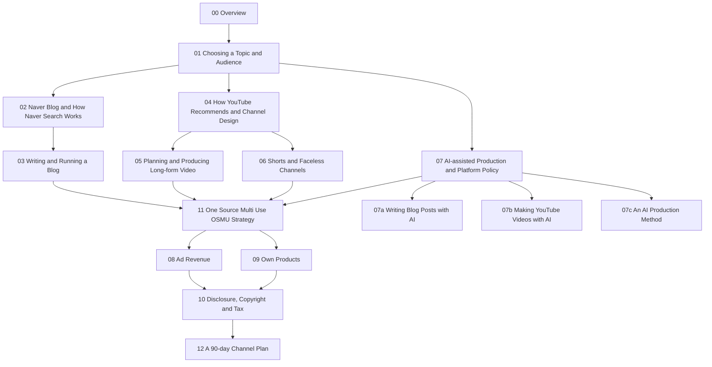

# Blog & YouTube Monetization Overview

> **Learning goal**: Compare how Naver Blog and YouTube reach readers and how each turns into money, explain why ads and own products, the two revenue engines, should be planned together from day one, decide the order in which to read the 16 documents in this section, and estimate in numbers how long the monetization thresholds take.

This section is a textbook for someone new to both blogging and YouTube. On the blog side it covers only Naver Blog; on the YouTube side it covers long-form, Shorts, faceless channels and AI-assisted production. Revenue centres on advertising (Naver AdPost, the YouTube Partner Program) and own products (courses, e-books, templates). All policies and figures are **as of 2026-09**, and facts whose official page could not be opened directly are marked "confirmed via search results". The basics of ad metrics are already covered in "Advertising Revenue in Depth" and pricing in "Paid Sales, Subscriptions and Pricing", so they are not repeated here. The exchange rate uses the site-wide assumption USD 1 = KRW 1,400.

## Key Concepts

| Term | Meaning | Where this section covers it |
|---|---|---|
| Discovery | The path by which someone who does not know you yet first meets your post or video. On Naver mostly search, on YouTube mostly recommendations | "Naver Blog and How Naver Search Works", "How YouTube Recommends and Channel Design" |
| Monetization gate | The platform bar you must clear before receiving ad revenue: the AdPost review, the YPP entry thresholds | "Ad Revenue: AdPost and the YouTube Partner Program" |
| Ad engine | Money made as views × revenue per 1,000 views (RPM) | "Ad Revenue: AdPost and the YouTube Partner Program" |
| Own-product engine | Money made as buyers × price: templates, e-books, VOD courses | "Own Products: Courses, E-books and Templates" |
| Compounding asset | Posts and videos that keep being discovered after you make them, and readers who come back to you | This document, Principles section |
| One Source, Multi Use (OSMU) | Splitting one source asset (an outline, a recording) into long-form, Shorts, a Naver post and product modules | "One Source, Multi Use (OSMU) Strategy" |

### One Source, Multi Use (OSMU): The Backbone of This Section

Beginners who run a blog and a YouTube channel at once tend to assume the work doubles. This section is designed the other way round. **Write one outline first, then draw several outputs from it.** One outline becomes a long-form video script, the Shorts cut from that video, a Naver post that tells the same material in prose, and later a chapter of a course or e-book. Each output still needs reshaping for its format, but research and structure are done once. The splitting method and repurposing rules are in "One Source, Multi Use (OSMU) Strategy". Copying the same content unchanged to many places is not OSMU, and both platforms treat repetitive or duplicated content unfavourably ("AI-assisted Production and Platform Policy").

## Principles

### How Naver Blog and YouTube Differ

| Aspect | Naver Blog | YouTube |
|---|---|---|
| Discovery | Search-led: Smart Blocks and the blog tab in integrated search, plus source links in AI Briefing, introduced 2025-03 | Recommendation-led (Home, Up Next, the Shorts feed), with search on top |
| Reader's state | Already feels a problem and is looking for an answer; intent is clear | Often browsing and becoming curious; search visitors have clear intent |
| Production cost | Text and screenshots; time is the main cost | Script, recording, editing, thumbnail; the same topic takes longer |
| How revenue starts | Ads after passing the AdPost review; Naver publishes no numeric bar | Ad revenue sharing after passing the YPP thresholds (subscribers plus watch hours or Shorts views) |
| What compounds | Posts that keep ranking, neighbours, and an assessment of topic expertise (source trust, described as C-Rank) | Videos that keep being recommended, subscribers, viewing history |
| Path to products | Downloads and product links inside posts; search intent is close to purchase intent | Description, pinned comment, channel memberships; trust built by voice and presence |

The two platforms cover each other's weaknesses. The blog gathers readers with clear search intent cheaply; YouTube builds trust and reach. Other blog platforms (for example Tistory with AdSense) offer different ad options, but by reader profile this section covers Naver Blog only.

### The Two Revenue Engines: Ads and Own Products

> Ad revenue = views × RPM ÷ 1,000
> Own-product revenue = visitors × purchase conversion rate × price − sales fees

Compare what each engine needs to earn the same KRW 500,000 a month. **All RPM and price figures below are assumptions.** Neither AdPost nor YouTube publishes an official average RPM.

| Engine | Assumption | Needed for KRW 500,000 a month |
|---|---|---|
| Ads | Publisher revenue KRW 1,000 per 1,000 views (assumption) | 500,000 views a month |
| Ads | Publisher revenue KRW 3,000 per 1,000 views (assumption, within the assumed range of "Advertising Revenue in Depth") | 166,667 views a month |
| Own product | Template pack at KRW 15,000 (assumption), before fees | 34 sales a month |

Ads only matter with **many views**; products matter even with **a small number of serious readers**. A beginner's first year is a low-view period, so starting with ads alone means spending most of that year at zero revenue.

### Why Plan Both From Day One

1. **The ad gates open late.** YPP shares no ad revenue until you clear the entry thresholds. AdPost also requires passing a review.
2. **Products are tied to the topic choice.** If you pick a topic with nothing to sell, adding a product a year later fails because the audience does not fit ("Choosing a Topic and Audience").
3. **Product material piles up as you make content.** Posts that give away a free template, questions you are asked often and a course outline are all by-products of early content. Designing OSMU so it yields "product modules" from the start costs no extra time.
4. **Ads are the floor, products the ceiling.** Ads are the easiest first step to turn traffic into money, while revenue per reader is far higher with products. This matches "Advertising Revenue in Depth".

### Section Map and Learning Order

| Stage | Documents | Question this stage answers |
|---|---|---|
| 1. Direction | "Blog & YouTube Monetization Overview", "Choosing a Topic and Audience" | What will you make, and for whom? |
| 2. Blog | "Naver Blog and How Naver Search Works", "Writing and Running a Blog" | How are you found on Naver, and how will you keep writing? |
| 3. YouTube | "How YouTube Recommends and Channel Design", "Planning and Producing Long-form Video", "Shorts and Faceless Channels" | How do recommendations work, and how will you make videos? |
| 4. Tools and rules | "AI-assisted Production and Platform Policy", "Writing Blog Posts with AI: Tools and Tutorials", "Making YouTube Videos with AI: Tools and Tutorials", "An AI Production Method: Prompts, Review and Automation" | How far can you use AI and keep monetization safe, and which tools and working method fit each stage? |
| 5. Connection | "One Source, Multi Use (OSMU) Strategy" | How will you split one outline into several outputs and products? |
| 6. Revenue | "Ad Revenue: AdPost and the YouTube Partner Program", "Own Products: Courses, E-books and Templates" | How will you switch on and grow both engines? |
| 7. Rules | "Disclosure, Copyright and Tax" | What must you disclose, what must you not use, and how do you pay tax? |
| 8. Execution | "A 90-day Channel Plan" | How will you spend the first 90 days, week by week? |

It is safer to read 07 before you start using tools. If you plan to use an AI voice or automated editing in 05 or 06, read 07 first. Read 07a and 07b alongside 03, 05 and 06 (07a for blog posts, 07b for video), and 07c after them.

## Applied: Example Creator J's Starting Point

Every Applied section in this group follows the same person.

| Item | Detail |
|---|---|
| Person | Example creator J. Office worker with 10 hours a week available |
| Topic | Work automation with spreadsheets and AI tools |
| Format | Faceless: screen recording plus their own voice. AI helps with scripts and editing; an AI voice is only a tested option |
| Channels | A Naver Blog (tutorials and templates) and YouTube (one 8–12 minute long-form lecture a week plus 3 Shorts cut from it) |
| Principle | "One outline, two outputs": the blog post and the video are built from the same outline |
| Period | D0 = 2026-10-05 (Monday), D90 = 2027-01-03 |
| Revenue path | Ads switch on first but slowly. Products go free template → paid template pack → e-book or VOD course |

J's split of the 10 weekly hours is a starting assumption; actual times are measured and adjusted in "A 90-day Channel Plan".

| Task | Hours per week (assumption) |
|---|---|
| Research, outline and script | 2.0 |
| Screen and voice recording | 1.5 |
| Long-form editing and thumbnail (with AI help) | 3.0 |
| Blog post from the same outline | 2.0 |
| Cutting 3 Shorts | 1.0 |
| Community (replies, neighbours) | 0.5 |
| Total | 10 |

Over 13 weeks J makes 13 long-form videos, 39 Shorts (38 published by D90) and 13 blog posts. What J checks at D90 is not revenue but **which topics' posts and videos got a response in search and recommendations, and how many people took the free template**.

## Going Deeper

### Realistic Expectations: Time to the Thresholds

The YPP ads tier needs 1,000 subscribers together with valid watch hours, and under the August 2026 announcement (confirmed via search results) **channels applying from 2027-02-01 need 8,000 valid watch hours in 365 days**. In J's illustrative model built on that new bar (monthly views growing steadily; not a forecast), the ads tier arrives in month 11–26, so J looks to products for revenue in the meantime; the threshold table, the watch-hour-to-view conversion and the AdPost review are covered in "Ad Revenue: AdPost and the YouTube Partner Program".

### The Distribution of Outcomes

- A study of a random sample of YouTube channels (Bärtl, 2018) found that **the top 3% of channels took 85% of views**.
- According to National Tax Service data (reported from a National Assembly release in 2026-02), 34,806 people reported one-person media creator income for tax year 2024, averaging about KRW 71 million each. The top 1% (348 people) averaged about KRW 1.29 billion; the bottom 50%, reported as 17,404 people, averaged about KRW 24.63 million.

Both figures describe **those who already had results**. The tax figures are gross receipts before expenses and include only people who had income to report. Channels that started and quit without income are not counted. Think of the median rather than the mean, and of the people missing from the denominator.

### Other Revenue: Affiliates, Sponsorships and Support Programmes

Affiliate commissions and brand sponsorships are possible but are not the focus here. In 2026-06 Naver began piloting "Naver Mate", which pays an activity grant to about 3,000 creators a month chosen by AI Briefing citations and topic expertise, and in 2026-08 it announced that combined AdPost, Brand Connect and Mate support was about double its 2025-02 level (confirmed via search results). Whatever the form, if you receive something of value you must **disclose the economic interest in the title or at the start**. The rules are in "Disclosure, Copyright and Tax" and "Law · Ethics · Ad Disclosure".

## Common Misconceptions

- **"Running a blog and YouTube doubles the work"** — Built from one outline, research and structure happen once. Only format-specific polishing is separate.
- **"Ads first, products later"** — The ad gates open late. Product potential is already decided when you choose the topic.
- **"The average YouTuber earns KRW 71 million, so I will too"** — That is the average of people who had income to report. The top 1% pulls the average up.
- **"AdPost approves you at 90 days and 50 posts"** — No numeric bar could be confirmed in the official help. It is folklore not confirmed on any official page.

## Self-Check Questions

1. What is the main discovery path on Naver Blog and on YouTube? How does that difference shape the first sentence of a post and of a video?
2. Assuming publisher revenue of KRW 2,000 per 1,000 views, how many views does KRW 300,000 a month need? How many sales of a KRW 12,000 template earn the same?
3. Assuming an average view duration of 5 minutes, how many views over 12 months equal the 8,000-hour bar?
4. Give two reasons not to read the tax statistics on one-person media creators as "a beginner's expected income".
5. Name four outputs J can draw from a single outline.

## References

- [New opportunities to earn and changes to the YouTube Partner Program — YouTube Official Blog](https://blog.youtube/news-and-events/youtube-partner-program-updates-2027-new-opportunities-earn/) — YouTube, 2026-08-10, confirmed via search results (2026-09-30)
- [Changes to the YouTube Partner Program — YouTube Help](https://support.google.com/youtube/answer/12843009?hl=en) — Google, confirmed via search results (2026-09-30)
- [YouTube monetization threshold change: doubled from February 2027 (Korean)](https://www.digitalmarketer.co.kr/insights/youtube-ypp-2027-threshold-change) — Digital Marketer, confirmed via search results (2026-09-30)
- [YouTube channels, uploads and views: A statistical analysis of the past 10 years](https://journals.sagepub.com/doi/abs/10.1177/1354856517736979) — Mathias Bärtl, Convergence, 2018, confirmed via search results (2026-09-30)
- [YouTubers' average annual income: bottom 50% KRW 24.63M, top 1% KRW 1.3B (Korean)](https://www.mediatoday.co.kr/news/articleView.html?idxno=332451) — Media Today, 2026-02, confirmed via search results (2026-09-30)
- [Creator support roughly doubled since AI Briefing launched (Korean)](https://navercorp.com/media/pressReleasesDetail?seq=10034578) — NAVER Corp. press release, 2026-08, confirmed via search results (2026-09-30)
- [Naver names 3,000 creators cited by AI and launches Naver Mate (Korean)](https://www.edaily.co.kr/News/Read?newsId=03466966645478440) — Edaily, 2026-06, confirmed via search results (2026-09-30)
- [Naver AdPost requirements and earnings (Korean)](https://postdot.kr/blog/naver-adpost-guide) — PostDot, confirmed via search results (2026-09-30). The official help (adpost.naver.com) could not be opened directly.
- [Paid blog posts and reviews must state "ad" or "sponsored" in the title or opening (Korean)](https://www.ajunews.com/view/20241115102251443) — Aju Business Daily, 2024-11-15, confirmed via search results (2026-09-30)
