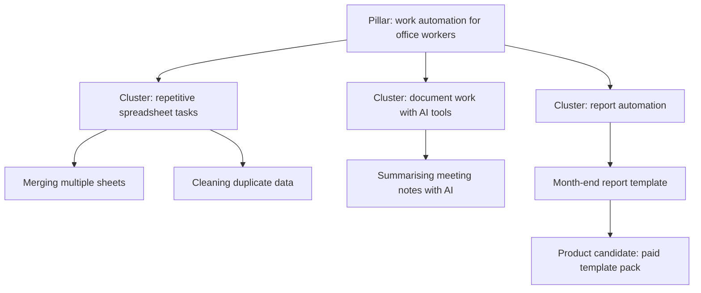

# Choosing a Topic and Audience

> **Learning goal**: Compare topic candidates on four criteria (demand, your edge, monetization path, sustainability), check demand with Naver and YouTube tools before you produce anything, design reader and viewer personas and a topic tree (pillar, cluster, individual pieces), and explain how the topic caps both ad RPM and product potential.

Both revenue engines from "Blog & YouTube Monetization Overview" start with the choice of topic. This document covers only the step of deciding what to make and for whom. How Naver search picks posts is in "Naver Blog and How Naver Search Works", YouTube recommendations and channel design in "How YouTube Recommends and Channel Design", and the general theory of validating a product opportunity in "Choosing Opportunities and Validating Demand" and "Market & Customer Research · Segmentation". Tool screens and features are **as of 2026-09**; items whose Naver help page could not be opened directly are marked "confirmed via search results".

## Key Concepts

| Term | Meaning |
|---|---|
| Niche | A topic narrowed around one problem a particular reader keeps having. "Spreadsheets" is broad; "automating repetitive spreadsheet work for office workers" is a niche |
| Demand | How many people search for that problem or watch videos about it, and how steadily |
| Edge | Why you can explain the topic better than others who cover it: experience, job, material, point of view |
| Monetization path | What this topic's readers would pay for besides ads: templates, e-books, courses |
| Sustainability | Whether the topic is deep enough, and you interested enough, to keep making new posts and videos for a year or more on a few hours a week |
| Persona | One representative reader drawn from real research: situation, goal, sticking point, the words they use |
| Topic tree | A content map running from pillar (big topic) to cluster (group of sub-problems) to individual posts and videos |

## Principles

### Four Criteria for Choosing a Topic

| Criterion | Question to ask | Evidence |
|---|---|---|
| Demand | Are people searching for or looking up this problem all year round? | Naver search volume, search trends, YouTube search suggestions, view counts of competing videos |
| Edge | Have you done this yourself, or do you do it every day? Do you have screens or material others cannot show? | Your own work records, questions colleagues often ask you |
| Monetization path | Does this reader spend money to save time? Do advertisers want this reader? | Whether similar paid products are selling, whether search ads run on the keywords |
| Sustainability | Can you think of sub-problems for 50 posts and videos? Will the topic still interest you in a year? | The number of individual items in a draft topic tree |

Score each criterion 1–5; if any of the four scores 1 (effectively absent), the topic is out. Big demand without an edge loses to competitors; an edge without a monetization path becomes a hobby. Subjective scores are fine. What matters is **comparing all four criteria in the same table**.

### Checking Demand on Naver

| Tool | What it shows | Watch out for |
|---|---|---|
| Naver DataLab search trends | Search trends per topic term (a group of keywords), split by period, device, gender and age | It is a **relative value** with the period's maximum set to 100. It is not absolute search volume, and numbers change with what you compare against |
| Naver Search Ad keyword tool | Monthly searches per keyword (PC and mobile), average monthly clicks, competition level, related keywords | Needs a search ad account; it is described as usable without running ads. These are ad metrics, so "competition" means advertiser competition, not blog competition |
| Creator Advisor trends | Keywords searched most per blog topic area | Available once you open a blog. Short-lived fads are mixed in |
| Looking at the actual results page | How Smart Blocks, blog posts and AI Briefing appear for the keyword | The shape of the results is the slot you would compete for. If blog posts barely appear, a blog will struggle to reach that searcher |

The order is: DataLab for **seasonality and trend**, the keyword tool for **scale and related keywords**, and the real results page for **where a blog can stand**. For a new blog, several related keywords that each name a specific problem are more realistic than one high-volume keyword.

### Checking Demand on YouTube

- **Search suggestions**: Type a topic term into YouTube's search box and suggestions follow. The phrasing in them is how viewers actually talk. Try the term with "how to", "automate", "beginner" and similar words several times.
- **Competing channels**: Pick 5–10 channels on the same topic and note the upload date, views and subscriber count of recent videos. A video with high views relative to its channel's subscribers signals demand for the topic itself. Also check whether any channel started within the last year has grown.
- **The Inspiration tab (formerly the Research tab) in YouTube Studio**: It is described as showing what your viewers and YouTube users overall search for, and "content gaps" where searches are many but fitting videos few (confirmed via search results). It is available once the channel exists, so use it in the second round of validation. The tab is being phased out from 2026-08, however, and Ask Studio replaces it. How to find ideas with Ask Studio is covered in "Making YouTube Videos with AI: Tools and Tutorials".

YouTube is recommendation-led, so some topics with little search volume spread widely through recommendations. Conversely, a topic with clear search demand can expect search traffic from the first video, which is safer for a beginner. How recommendations work is covered in "How YouTube Recommends and Channel Design".

### Reader and Viewer Personas

Even when they are the same person, a blog reader and a YouTube viewer are in different states.

| Item | Blog reader | YouTube viewer |
|---|---|---|
| Moment of arrival | Arrives by searching for a specific problem | Arrives by recommendation or search and decides in the first seconds whether to stay |
| What they want | Steps, formulas and files they can copy | To watch the process they will follow, and trust in the person explaining |
| Sticking point | When their situation differs from the example | When it is too fast or the screen is too small |
| Moment that leads to a product | "I want this template file" | "I want to take this person's course from the start" |

Do not write personas from imagination. Build them from **sentences people actually used**: search suggestions, related keywords, comments on competing videos, questions on Q&A services, questions from colleagues. Five lines on one page are enough: situation, goal, sticking point, the words they use, what makes them spend money.

### The Topic Tree: Pillar, Cluster, Individual Posts and Videos

| Layer | Role | Form |
|---|---|---|
| Pillar | The big question the whole channel answers. Usually 1–3 | A long introductory post, the first video of a playlist |
| Cluster | A group of sub-problems under the pillar. Each cluster becomes a category or playlist | Blog category, YouTube playlist |
| Individual piece | A post or video that answers one search, one problem | Tutorial post, 8–12 minute lecture, Shorts |

The tree decides two things at once. On Naver Blog it becomes the category structure and topic focus ("Naver Blog and How Naver Search Works"); on YouTube it becomes playlists and viewing flow. How to split one individual piece into long-form, Shorts, a Naver post and a product module is covered in "One Source, Multi Use (OSMU) Strategy".

### The Topic Caps Ad RPM and Product Potential

Google says AdSense revenue varies with content topic and visitor region, and YouTube explains that RPM varies with topic, viewer region and advertiser friendliness. Neither AdPost nor YouTube publishes average RPM per topic, so the table below is **a qualitative comparison of direction only**.

| Topic type | Ad RPM tendency | Product potential | Why |
|---|---|---|---|
| Topics close to purchase or work decisions: work, personal finance, education | May be higher | High | Advertisers want these readers, and readers pay to save time |
| Hobbies, daily life, entertainment | May be lower | Depends on the topic | Many views but weak purchase intent |
| News and issue round-ups | Highly variable | Low | Consumed briefly, little material to sell |
| Topics that are not advertiser-friendly | Ads may be limited | Low | Ad serving may be restricted |

The topic sets the ceiling for ads and the ceiling for products **at the same time**. Making better content later rarely raises these ceilings much. RPM math is in "Advertising Revenue in Depth" and product pricing in "Paid Sales, Subscriptions and Pricing".

## Applied: Example Creator J's Topic Validation

J put three candidates in one table and scored them 1–5. The scores are **J's judgement**, not measurements.

| Candidate | Demand | Edge | Monetization path | Sustainability | Decision |
|---|---|---|---|---|---|
| Work automation with spreadsheets and AI tools | 4 | 4 (daily work) | 5 (templates, courses) | 4 | Chosen |
| Commute reading log | 3 | 3 | 2 | 4 | On hold: weak monetization path |
| Latest AI news round-up | 4 | 1 | 2 | 2 | Out: edge scores 1 (effectively absent), weak sustainability; repetitive summaries carry policy risk |

J checks demand during the week before D0. Numbers are read from the tools and written down; this document does not invent example figures.

| Step | Task | J's pass condition (assumption) |
|---|---|---|
| 1 | Collect 50 related keywords with the keyword tool | 30 or more keywords naming a specific problem |
| 2 | Check two-year trends for the top 5 topic terms in DataLab | No clear downward trend |
| 3 | Look at the real results for the top 10 keywords | Blog posts appear in at least half of them |
| 4 | Record YouTube search suggestions and 5 competing channels | At least one channel started within the last year has grown |

J's two personas:

- **Reader "the month-end report owner"**: Spends 3 hours on the same spreadsheet task every month. Searches "merge multiple sheets". Follows formulas but is afraid of macros. Willing to pay for a finished template.
- **Viewer "the office worker curious about AI tools"**: Watches on a phone after work. Responds to stories of cutting work with AI. Wants short processes they can follow and the real screen.

Part of J's topic tree:

Each individual item becomes one week's outline. "Merging multiple sheets", for example, splits into one long-form lecture, three Shorts, one Naver tutorial post and one module of the template pack ("One Source, Multi Use (OSMU) Strategy").

## Going Deeper

### Topics Too Narrow and Too Broad

Too narrow and you cannot find 50 pieces' worth of sub-problems. Too broad and topic expertise blurs in search, while on YouTube viewers cannot tell "what this channel is about". Start the pillar narrow and widen to adjacent clusters once you see a response. J starts not with "spreadsheets" but with "automating office workers' repetitive tasks".

### Topics With Weak Search Demand

Topics with almost no search volume can still spread through YouTube recommendations or Shorts. But beginners find recommendation response hard to predict. For the first 90 days it is safer to fix a ratio, such as **at least 70% individual pieces with confirmed search demand** and the rest for experiments with recommendation-type topics (the ratio is an assumption).

### Signals That the Topic Should Change

After D90, revisit the topic or persona if these overlap: most posts and videos get no response in either search or recommendations; comments and questions come from people other than your intended reader; almost nobody takes the free material. How to read the signals and decide is covered in "A 90-day Channel Plan".

## Common Misconceptions

- **"Go after the high-volume keywords"** — A new blog easily loses on big keywords. Several related keywords naming specific problems are more realistic.
- **"100 in DataLab means 100 searches"** — It is a relative value with the period's maximum set to 100.
- **"Just pick a high-RPM topic"** — Without an edge, quality drops, and without quality there are no views.
- **"Personas are written from imagination"** — Build them from sentences actually used in search suggestions, comments and questions.
- **"The broader the topic, the more opportunity"** — Broad topics blur topic focus on Naver and channel identity on YouTube.

## Self-Check Questions

1. Why is a topic that scores 1 (effectively absent) on any of the four criteria dropped? Give an example.
2. In DataLab search trends, keyword A shows 100 and keyword B shows 50. What can and cannot you conclude from this?
3. How does the difference in "moment of arrival" between blog readers and YouTube viewers change the opening of a post versus a video?
4. Write one pillar, three clusters and six individual pieces for your topic. Which items could lead to a product?
5. Explain, from both the ad side and the product side, why the same number of views earns differently depending on the topic.

## References

- [Naver DataLab search trends](https://datalab.naver.com/keyword/trendSearch.naver) — NAVER, confirmed via search results (2026-09-30). The relative-value explanation was confirmed through commentary such as [TBWA DataLab (Korean)](https://seo.tbwakorea.com/blog/naver-datalab/)
- [Naver Search Ad](https://searchad.naver.com/) — NAVER, confirmed via search results (2026-09-30)
- [Using the Naver keyword tool effectively (Korean)](https://www.theegg.com/ko/insights/naver-keyword-tool-explained/) — The Egg, confirmed via search results (2026-09-30)
- [Finding recent blog topic and keyword trends in Creator Advisor (Korean)](https://omgdesignmedia.com/%ED%81%AC%EB%A6%AC%EC%97%90%EC%9D%B4%ED%84%B0-%EC%96%B4%EB%93%9C%EB%B0%94%EC%9D%B4%EC%A0%80-%EB%B8%94%EB%A1%9C%EA%B7%B8-%EC%A3%BC%EC%A0%9C-%ED%82%A4%EC%9B%8C%EB%93%9C-%EC%B5%9C%EA%B7%BC-%ED%8A%B8/) — OMG News, confirmed via search results (2026-09-30)
- [Understand research insights — YouTube Help](https://support.google.com/youtube/answer/11962757?hl=en) — Google, confirmed via search results (2026-09-30)
- [Understand ad revenue analytics — YouTube Help](https://support.google.com/youtube/answer/9314357) — Google, confirmed via search results (2026-09-30)
- [How much will you earn with AdSense? — Google AdSense Help](https://support.google.com/adsense/answer/9902?hl=en) — Google, confirmed via search results (2026-09-30)
