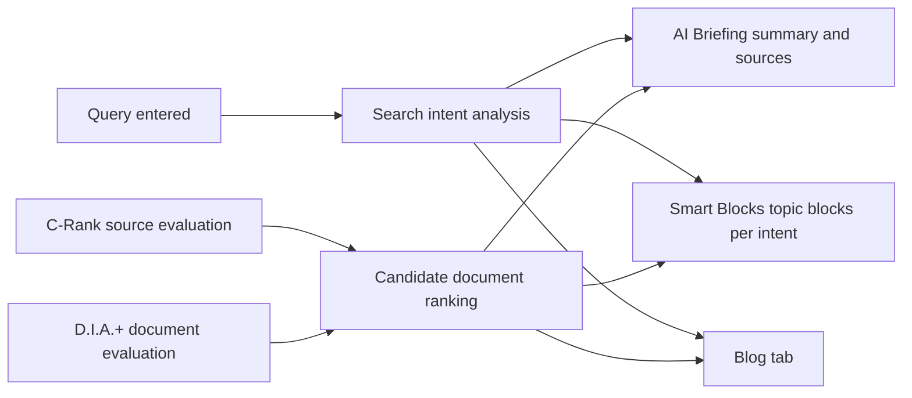

# Naver Blog and How Naver Search Works

> **Learning goal**: Explain how Naver's integrated search builds results from Smart Blocks, the blog tab and AI Briefing, tell apart C-Rank and D.I.A.(+) as Naver has described them, open a blog set up for your topic, separate what Naver treats as low quality or abuse from community folklore, and choose what Blog Stats can actually measure.

This document moves the topic and topic tree chosen in "Choosing a Topic and Audience" onto Naver Blog. It covers only **how search finds and picks posts**. How to write posts and on what cadence is in "Writing and Running a Blog", using AI tools and the policy risk that comes with them in "AI-assisted Production and Platform Policy", and disclosure of promotional posts and copyright in "Disclosure, Copyright and Tax". For AI search compared with Google AI Overviews, see "AI Search · GEO/AEO". Everything is **as of 2026-09**. Naver's help pages and official blog could not be opened directly from this working environment, so Naver's announcements were cross-checked through news reports and commentary and marked "confirmed via search results". Naver does not publish its ranking formula, so the algorithm descriptions here stay **at the level of concepts Naver has explained**.

## Key Concepts

| Term | Meaning |
|---|---|
| Integrated search | The first results screen after a query. It stacks results from many sources in blocks |
| Smart Block | Results grouped into topic blocks, one per search intent, with intent split by AI. Unveiled in 2021-10 together with "AiRSearch" |
| Popular Posts Smart Block | A block collecting user-generated content (UGC) such as blog and cafe posts. Reported as introduced in 2024-02 in place of the old VIEW tab |
| Blog tab | The tab above integrated search that shows blog posts only. In 2024-02 the VIEW tab was split into a blog tab and a cafe tab |
| AI Briefing | A generative AI summary answer shown at the top of integrated search together with its sources (blog originals and others). Introduced 2025-03-27 |
| C-Rank | A concept that evaluates **the trust of the source (the blog)** rather than the document itself. Introduced in 2016 |
| D.I.A. / D.I.A.+ | A model that learns the traits of documents users preferred for each keyword and scores the **document**. D.I.A. is known to date from 2018 and D.I.A.+ from 2020 |
| Naver Influencer | A programme that selects creators by topic and surfaces them in influencer search results and on an influencer home |

## Principles

### How Integrated Search Is Assembled

- **Smart Blocks**: Announcing AiRSearch in 2021-10, Naver explained that it splits the different intents inside one query with AI and presents them as blocks. A Naver lead at the time called this "a constructive dismantling of integrated search" (confirmed via search results). Even for the same "spreadsheet automation" query, separate intent blocks such as "beginner introduction", "macros" and "function collections" may appear.
- **Popular Posts and the blog tab**: In 2024-02 the VIEW tab was removed, a "Popular Posts" Smart Block collecting blog and cafe posts appeared, and the tab split into a blog tab and a cafe tab, as reported (confirmed via search results).
- **AI Briefing**: Introduced on 2025-03-27, it shows the blog originals its answer is based on. It was reported as applied to about 20% of integrated search queries by the end of 2025, and at its 2026-02 earnings call Naver said it would roughly double that coverage by the end of 2026 (confirmed via search results).
- **Source-trust labels**: Naver announced that from 2026-05-14 some official blogs, such as those of public institutions, carry "AI source information", an AI summary of who runs the blog and what it covers. It said it uses LLMs and vision-language models (VLMs) to analyse site character, content structure, and even design and layout (confirmed via search results).

Splitting the results page into many blocks means **there is no single "number one" slot**. Your post may appear in an intent block, in the blog tab or as a source link in AI Briefing, and each slot has a different click rate.

### C-Rank: Who Wrote It

Introducing C-Rank in 2016, Naver explained that it evaluates the trust and popularity of the blog that is the document's source, rather than the document itself, and reflects this in ranking. The factors presented were **Context** (topic focus), **Content** (quality of the content) and **Chain** (the chain reaction of consumption and production, that is, how far it is read and responded to) (confirmed via search results). Two practical readings follow.

1. A blog that covers **one topic steadily and in depth** is more easily assessed as a source for that topic.
2. A blog with scattered topics struggles to be recognised as a source for any of them.

The weights and formula have not been published.

### D.I.A. and D.I.A.+: What Was Written

D.I.A. (Deep Intent Analysis) was presented as a model that uses Naver's data to reflect, per keyword, scores for documents users preferred. The factors cited are topic relevance, experience information, completeness of information, the document's intent, a relative abuse measure, originality and timeliness. D.I.A.+, at the end of 2020, was described as improving deep matching, pattern analysis and dynamic ranking to find documents and sources that match the user's specific intent (confirmed via search results). What matters is that **experience**, **originality** and **abuse measure** sit in the same list. Processes and screens you actually did push a post up; recombining others' posts or repeating the same post pushes it down.

### AI Briefing and Source Selection

Naver has not published figures on how AI Briefing picks its sources. There are two public signals, though. One is that "Naver Mate", piloted from 2026-06, selects creators by **AI Briefing citation count, topic expertise and activity**; the other is that Naver repeatedly frames the direction of search as "trustworthy sources" (confirmed via search results). Being cited in AI Briefing is separate from whether users click through to the original. Google-side research showing fewer clicks on results with a summary is introduced in "Advertising Revenue in Depth".

Beyond those two signals, principle-level criteria have also been reported. Reports say that in May 2026 Naver set out content principles of first-hand knowledge, a consistent topic, honest authenticity, easy-to-read structure and keeping content current, and said that mechanically generated posts, patchworks with unclear sources and overly promotional posts are excluded from citation ([Daum News report (Korean)](https://v.daum.net/v/6X1XvAe4cP), confirmed via search results; Naver's original could not be opened).

### What Naver Treats as Low Quality or Abuse

The Naver Blog operating policy and search help pages could not be opened directly, so below are the **categories** confirmed from the D.I.A. factor descriptions and from reports on the operating policy.

| Type | Example | Linked basis |
|---|---|---|
| Repetition and copying | Publishing the same post several times with only the title changed, pasting others' posts | The originality and abuse-measure factors of D.I.A. |
| Keyword stuffing | Listing popular keywords unrelated to the body, over-repeating one keyword | Topic relevance, document intent |
| Mass auto-generation | Publishing many similarly structured posts at short intervals | Abuse measure. The problem is described as the mass, low-value pattern rather than AI use itself |
| Engagement manipulation | Inflating likes, comments, neighbours or visits with macros or programs | Prohibited acts in the operating policy (confirmed via search results) |
| Undisclosed payment | Hiding the economic interest in sponsored or reviewer-programme posts | KFTC Guidelines on Endorsement and Recommendation Advertising (in force 2024-12-01: disclose in the title or at the start) |
| Rights infringement | Unauthorised images, video or fonts | Takedown after a copyright report |

On AI-generated content, Naver introduced an "AI used" label for blogs, cafes and other services in 2025-05, and labelling on blogs was reported as voluntary (confirmed via search results). No official Naver document was found saying "posts written with AI are automatically dropped from search". The limits of AI use are covered in "AI-assisted Production and Platform Policy", and what counts as a promotional post and how to disclose it in "Disclosure, Copyright and Tax" and "Law · Ethics · Ad Disclosure".

## Applied: Example Creator J Opens the Blog

J opens the blog before D0 (2026-10-05). Menu names follow the 2026-09 screens and may change.

| Setting | J's choice | Why |
|---|---|---|
| Blog name and nickname | A name that shows the topic (e.g. "J's work automation notes") | So search results and AI source information show what the blog covers |
| Profile introduction | Office worker who cuts repetitive work every day with spreadsheets and AI tools, plus the scope covered | No face, but the source of experience is stated |
| Blog topic | Pick the IT and computers area in the blog topic setting of the admin screen | Matches the Context part of the C-Rank description |
| Categories | The topic tree's 3 clusters = 3 categories (repetitive spreadsheet tasks, document work with AI tools, report automation) plus notices | One category per cluster |
| Per-post topic | Pick the same topic area for every post when publishing | Keeps blog topic and post topic aligned |
| Material distribution | Free templates offered through download instructions inside posts | The first step of "Own Products: Courses, E-books and Templates" |

What J does not do in the first 4 weeks: mix in daily-life posts on other topics, republish the same tutorial with a new title, use neighbour-growth programs, or publish several posts in one burst. Post structure and cadence follow "Writing and Running a Blog".

Every Monday J records only three things from Blog Stats: last week's views per post, the share of search traffic and the top search queries, and the views of the post that offers the free template. These records feed the D30, D60 and D90 decisions in "A 90-day Channel Plan".

## Going Deeper

### Naver Influencer

Naver Influencer is a creator programme you apply to by choosing one topic and are selected into after review. Once selected you get an influencer home, and your content can appear in influencer-related blocks in integrated search and in the influencer tab. According to material relaying Naver's ranking-change notice, influencer topic ranking reflects service activity, user feedback, creator influence and fan count, together with **document quality** (confirmed via search results). Selected creators can use "Brand Connect", which links brands and creators.

Numbers such as "N posts, N in the last 3 months" circulate as application criteria, but Naver has not published them. J does not apply in the first 90 days. J considers it once enough posts have built up on one topic and search traffic in Blog Stats has stabilised.

### Folklore and What Is Documented

| Claim | Status | Basis |
|---|---|---|
| "There is a blog index (optimal, semi-optimal level N)" | Not an official Naver term | Estimates built by outside vendors on their own models. After Naver changed RSS access in 2025-11, index lookup services shut down (confirmed via search results) |
| "My blog got hit by low quality" | Not a status Naver publishes | A community phrase for a sudden drop in exposure. Causes can be many: policy violations, changes in document or source evaluation, changes in the results layout (Smart Blocks, AI Briefing), more competing posts |
| "Break the one-post-a-day streak and rankings fall" | Not documented | The C-Rank description includes activity and response (Chain), but no frequency formula |
| "Posts need N characters and N photos" | Not documented | The D.I.A. factor is completeness of information, not a length rule |
| The C-Rank and D.I.A.(+) concepts | Concepts Naver has explained | Announced 2016, 2018, 2020 (confirmed via search results) |
| Smart Blocks, the blog/cafe tab split, AI Briefing | Naver announcements | 2021-10, 2024-02, 2025-03-27 |

### What Blog Stats Can Actually Measure

| Measurable | Use |
|---|---|
| Views and visitor trends (day, week, month) | Relating cadence to response |
| Traffic sources and incoming search queries | Seeing which search intents bring readers, picking the next post in the topic tree |
| Gender, age and device mix | Checking the persona ("Choosing a Topic and Audience") |
| Views ranking per post | Comparing clusters |
| Creator Advisor trends | Recent queries in your topic area |

Be clear about what cannot be measured too. **Your ranking score, a C-Rank value or an "index" appears on no official screen.** Values shown by outside tools are estimates. Stat item names follow the 2026-09 screens and may change.

## Common Misconceptions

- **"On Naver you compete for one top slot"** — Results split into intent Smart Blocks, the blog tab and AI Briefing sources.
- **"You can check your C-Rank score"** — Naver explained the concept only and does not publish scores.
- **"Posts written with AI are always dropped from search"** — No such official document was found. The problem is repetitive, mass, low-value patterns.
- **"The index sites stopped, so Naver abolished the index"** — It was never a Naver index.
- **"Being cited in AI Briefing brings more visitors"** — Citation and clicks are separate. Check with traffic sources in Blog Stats.

## Self-Check Questions

1. Which of "who" and "what" do C-Rank and D.I.A.+ each evaluate? Which one hurts a blog with scattered topics?
2. After the 2024-02 VIEW tab change, name three places where a blog post can appear in search results.
3. Connect J's choice to align categories with the topic tree's clusters to the C-Rank description.
4. When you feel "hit by low quality", what two things do you check first in Blog Stats, and what three causes do you examine instead of folklore?
5. Why does J postpone applying to Naver Influencer until after the first 90 days?

## References

- [Naver unveils "AiRSearch", a new search experience (Korean)](https://navercorp.com/media/pressReleasesDetail?seq=30604) — NAVER Corp. press release, 2021-10, confirmed via search results (2026-09-30)
- [Naver overhauls search for the first time in 20 years (Korean)](https://byline.network/2021/10/26-173/) — Byline Network, 2021-10-26, confirmed via search results (2026-09-30)
- [Naver VIEW becomes the "Popular Posts" Smart Block; blog and cafe tabs split (Korean)](https://www.etnews.com/20240201000022) — Electronic Times, 2024-02-01, confirmed via search results (2026-09-30)
- [Naver introduces "AI Briefing" in the search box on the 27th (Korean)](https://biz.newdaily.co.kr/site/data/html/2025/03/24/2025032400067.html) — NewDaily, 2025-03-24, confirmed via search results (2026-09-30)
- [Naver: "AI Briefing to double by year end" (Korean)](https://www.sentv.co.kr/article/view/sentv202602060034) — Seoul Economic TV, 2026-02-06, confirmed via search results (2026-09-30)
- [Naver AI Briefing extends search from summary to exploration (Korean)](https://blog.nasmedia.co.kr/entry/2604naspick) — Nasmedia, 2026-04, confirmed via search results (2026-09-30)
- ["Can I trust this?" Naver AI tells you who is behind a blog (Korean)](https://www.newsis.com/view/NISX20260507_0003620731) — Newsis, 2026-05-07, confirmed via search results (2026-09-30)
- [Naver focuses on search trust, using AI to pick trustworthy sources (Korean)](https://www.news1.kr/it-science/general-it/6164096) — News1, confirmed via search results (2026-09-30)
- [Naver names 3,000 creators cited by AI and launches Naver Mate (Korean)](https://www.edaily.co.kr/News/Read?newsId=03466966645478440) — Edaily, 2026-06, confirmed via search results (2026-09-30)
- [Which content does AI choose? A look at Naver Mate selection criteria (Korean)](https://v.daum.net/v/6X1XvAe4cP) — Daum News, report on the content principles, confirmed via search results (2026-09-30)
- [Naver's latest ranking logic: D.I.A. (Korean)](https://www.twinword.co.kr/blog/naver-seo-d-i-a/) — Twinword, confirmed via search results (2026-09-30). Commentary quoting Naver Search's official blog
- [Naver SEO part 2: algorithms and search engine systems (Korean)](https://www.ascentkorea.com/naver_seo_strategies_2/) — Ascent Korea, confirmed via search results (2026-09-30). Quotes the C-Rank and D.I.A.+ descriptions
- ["This content was made with AI": Naver introduces the "AI used" label (Korean)](https://news.nate.com/view/20250520n29594) — Nate News, 2025-05-20, confirmed via search results (2026-09-30)
- [Naver's double standard on AI labels: mandatory for shopping, voluntary for blogs (Korean)](https://news.mtn.co.kr/news-detail/2026072417015682342) — MTN, 2026-07-24, confirmed via search results (2026-09-30)
- [Blogdex shutdown and refunds: fact check on "Naver abolished the optimal index?" (Korean)](https://www.i-boss.co.kr/ab-6141-68793) — i-boss, confirmed via search results (2026-09-30)
- [Naver changes the influencer search algorithm; document quality now matters (Korean)](https://gobooki.net/%EB%84%A4%EC%9D%B4%EB%B2%84-%EC%9D%B8%ED%94%8C%EB%A3%A8%EC%96%B8%EC%84%9C-%EA%B2%80%EC%83%89-%EC%95%8C%EA%B3%A0%EB%A6%AC%EC%A6%98-%EB%B3%80%EA%B2%BD/) — Gobooki Media Strategy Lab, confirmed via search results (2026-09-30)
- [Paid blog posts and reviews must state "ad" or "sponsored" in the title or opening (Korean)](https://www.ajunews.com/view/20241115102251443) — Aju Business Daily, 2024-11-15, confirmed via search results (2026-09-30)
