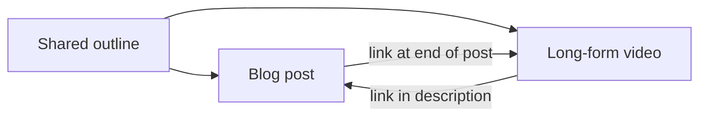

# Writing and Running a Blog: Answering Search Readers from One Outline

> **Learning goal**: Design a Naver Blog post part by part (title, first screen, structure, images, tables, download), write to search intent without repeating keywords, and improve posts with a pre-publish checklist, a refresh routine and Naver Blog Stats.

This document covers **the craft of writing posts and running a blog**. How Naver Search finds and ranks documents (C-Rank, D.I.A.+, Smart Blocks, AI Briefing) is in "Naver Blog and How Naver Search Works", and who you write for is in "Choosing a Topic and Audience". The policy risks of AI tools are in "AI-assisted Production and Platform Policy", and image and font copyright plus ad disclosure are in "Disclosure, Copyright and Tax". Naver Blog menu names and features are **as of 2026-09** and can change with app updates.

## Key Concepts

| Term | Meaning | How this document uses it |
|---|---|---|
| Search intent | The "thing I want solved right now" behind a query | The basis for the title and the first screen |
| First screen | The area under the title visible without scrolling (mostly mobile) | Put the conclusion and the answer here |
| Outline | A blueprint of subheadings, each with one key line | Shared by the blog post and the video script |
| Template | A post frame you fill in the same order every time | Fixes the quality floor |
| Keyword stuffing | Unnaturally repeating the search term | Do not do it |
| Refresh | Updating the facts, images and links of a published post | A monthly routine |
| Blog Stats | Naver Blog's statistics screens for views, traffic sources, rankings and more | The evidence for choosing what to fix |

## Principles

### 1. Anatomy of a Naver Post

| Part | Role | Check |
|---|---|---|
| Title | Shows the search term and the promise together | What the reader would search + what they get. No hype or bait |
| First screen | Gives the answer first | Conclusion within 3-5 lines, who the post is for, time needed |
| Subheading structure | A map for readers who skim | 3-7 subheadings split into steps, comparisons and cautions |
| Images and captions | Proof you did it, and the explanation | Your own screenshots. One caption line on "what to look at" |
| Tables | Comparisons and settings at a glance | 3 columns or fewer, readable on mobile without sideways scrolling |
| Checklist or template download | Something to use right after reading | File attachment or link. State the free-use terms in the post |
| Closing | The next action | 1-2 links to related posts or videos, one line inviting questions |

Images default to **screenshots you made yourself**. Other people's images, thumbnails made with paid fonts and icons taken from the web need a rights check ("Disclosure, Copyright and Tax"). Checking that no personal email, company file name or customer data shows in a screenshot is part of the image check too.

### 2. Writing to Search Intent without Repeating Keywords

A query usually has one main intent. Decide the intent first and the shape of the post follows.

| Intent | Example query | Matching post shape |
|---|---|---|
| How-to | "remove duplicates in Excel" | Step-by-step walkthrough + result screen |
| Troubleshooting | "VLOOKUP #N/A error" | Diagnosis table by cause + fix order |
| Comparison | "Excel Power Query vs macros" | Criteria table + recommendation by situation |
| Concept | "what is Power Query" | Definition -> example -> when to use it |

- **Bad example**: Repeat "remove duplicates in Excel" word for word in the title, first paragraph, every subheading and every image description, and restate the same sentence several times in the body.
- **Good example**: Put the search term in the title once, naturally, and explain the body with the other words readers actually use, such as "duplicate rows", "keep unique values only" and "the UNIQUE function". Check first **whether you answered the question to the end**, not the keyword.

How search engines evaluate documents is detailed in "Naver Blog and How Naver Search Works". The rule here is simple: write so the reader can finish the job with this one post.

### 3. A Post Template

```text
[Title] {search term} — {result they get} ({audience/version})
[First screen] 2-3 line conclusion / who this is for / time needed / what to prepare
[Subheading 1] See the result first: 1 finished screenshot + caption
[Subheading 2] Step by step: step 1 ~ step n (1 screenshot per step)
[Subheading 3] Where people get stuck: error -> cause -> fix table
[Subheading 4] Variations: 1-2 similar situations
[Download] Practice file and checklist (one line on the terms of use)
[Closing] Related post and video links / version and check date / invite questions
```

### 4. Pre-publish Editing Checklist

- [ ] The title alone tells the reader what they get.
- [ ] The first screen has the conclusion. A long greeting such as "Hello, today we..." does not come before it.
- [ ] You **followed every step again yourself** and got the same result.
- [ ] Numbers, versions and menu names were checked against official docs or the real screen, with the check date written down.
- [ ] Screenshots contain no personal or company information.
- [ ] You checked the source and terms of use for every image, font and icon.
- [ ] Any affiliate link or sponsorship is disclosed on the first screen ("Disclosure, Copyright and Tax").
- [ ] You checked in mobile preview that tables and images are readable.
- [ ] Links to related posts and videos work.

### 5. Update and Refresh Routine

A tutorial becomes a wrong post when the tool changes. Instead of only writing new posts, **fix old posts on a fixed cycle**.

| Cycle | Task | Evidence |
|---|---|---|
| Weekly | Answer new comment questions; add recurring ones to the body | Comments |
| Monthly | Check versions, menu names and links in the most-viewed posts | Post ranking in Blog Stats |
| Quarterly | Merge several thin posts answering the same question into one; link to it from the rest | List of overlapping topics |
| On tool updates | Add one line at the top: "Updated: date, what changed" | Tool announcements |

We could not confirm any official statement from Naver on how edits affect search visibility. So the purpose of a refresh is **removing wrong information, not a visibility trick**.

### 6. One Outline, Two Outputs

Planning the blog post and the long-form video separately doubles the time. The rule is one: **make one outline, then write it out as a post and as a video.** The full pipeline that turns one source into Shorts and product modules as well is in "One Source, Multi Use (OSMU) Strategy"; here we look only at the writing side of the link.



- **Blog -> YouTube**: Send steps that need "follow along on screen" to the video link.
- **YouTube -> Blog**: Tables, formulas, copyable text and practice files that are hard to show in full on video belong to the post; the description sends viewers there.
- A post is for reading and copying; a video is for watching and following. Do not move the same sentences across unchanged.

### 7. Measuring with Blog Stats

Naver Blog offers Blog Stats in the management screen and in the app. The menu layout can change, so find the right screen by the **question** you are asking.

| Question | Statistic to check (menu names are examples) | Action |
|---|---|---|
| Which posts get read? | Post ranking by views | Refresh the top posts first |
| Where do readers come from? | Traffic sources, incoming search terms | Unexpected search terms are new post candidates |
| Do they read to the end? | Dwell metrics such as average time spent | If short, fix the first screen and structure |
| Do they come back? | Return-visit and Neighbor-visit metrics | Strengthen series and internal links |

Check statistics **once a week on the same day**. Reacting to daily swings means you spend more time watching numbers than fixing posts.

### 8. Where AI Fits in Writing

| Stage | What you can hand to AI | What a person must do |
|---|---|---|
| Outline | A list of reader questions, candidate subheadings | Reorder into the sequence you actually followed |
| Draft | Polishing step descriptions, table frames | Reproduce and screenshot every step yourself |
| Fact-check | Extracting the list of claims to verify | Verify against official docs or the real screen; record source and date |
| Before publishing | Spelling and duplicate-sentence checks | Write the sentences that carry experience and judgment yourself |

AI-written sentences sound plausible but often get **menu names, function arguments and versions** wrong. Before publishing, treat "a factual claim written by AI" as "a claim not yet checked". Naver introduced an "AI used" label for Blog and other services in 2025-05, and as of 2026-07 reports, the label is voluntary on Blog. That label and the policy on mass posting are covered in "AI-assisted Production and Platform Policy".

## Applied: Example Creator J's Blog Week

Example creator J spends about 2 of their 10 weekly hours on the blog. The outline shared with the video counts toward the source-package time in "One Source, Multi Use (OSMU) Strategy", which has the full weekly split. D0 is 2026-10-05 (Monday).

| Day | Blog work | Hours (assumption) |
|---|---|---|
| Sat (previous weekend) | Write the shared outline (shared with the video) | Counted in the source package |
| Mon | Check Blog Stats, collect comment questions, refresh 1 old post | 0.5 |
| Mon-Tue | Draft the post from the outline, take step screenshots, prepare the practice file | 1.0 |
| Wed | Run the checklist, publish, embed the video posted on Tuesday | 0.5 |

An example first post (assumption):

- **Title**: "Remove Duplicates in Excel in One Go — 3 Methods Compared (Microsoft 365)"
- **First screen**: "Under 1,000 rows, use [Remove Duplicates]; if you must keep the original, use the UNIQUE function; if you repeat the same job every week, Power Query fits. It takes 10 minutes to follow along, and the practice file is below the post."
- **Download**: A practice Excel file + a "5 things to check before removing duplicates" checklist. This later leads to the free template -> paid template pack path ("Own Products: Courses, E-books and Templates").

J uses AI for outline candidates and polishing sentences, but follows every step again on their own PC and takes the screenshots. Function explanations that AI suggests stay only after being checked against Microsoft's official help.

## Going Deeper

### Series and Hub Posts

Once one topic has more than 5 posts, create a **hub post** such as "Excel Automation for Beginners: Contents" and link each post to the hub and the hub to each post. Readers find the next post more easily, and you see missing topics at a glance.

### When to Merge Thin Posts

If several short posts answer the same question, readers cannot tell which one to read. Merge the content into the post with the most views, and put a link to the merged post at the top of the others. Whether to delete or keep a post depends on its existing links and comments.

### One Line on Other Blog Platforms

Platforms such as Tistory or WordPress let you handle ad code and domains yourself, but this section covers only Naver Blog, aimed at beginners whose search traffic is concentrated on Naver.

## Common Misconceptions

- **"The more keywords, the higher the rank"** — Repetition ruins reading and can be a problem under search quality policies. Answering the intent to the end comes first.
- **"Longer posts always win"** — What you need is a post with no missing steps, not length. If the first-screen answer comes late, a long post is worse.
- **"Writing several posts a day with AI grows the blog fast"** — Unverified facts and near-duplicate posts pile up. For the policy risk of mass posting, see "AI-assisted Production and Platform Policy".
- **"Once written, a post is done"** — Tutorials go wrong when tools change. Refreshing is part of running the blog.
- **"Blog posts and videos must be planned separately"** — Making both from one outline lets you run two channels within 10 hours a week ("One Source, Multi Use (OSMU) Strategy").

## Self-Check Questions

1. Write a 3-line first screen for a reader who searched "VLOOKUP #N/A error".
2. What are two ways to put the search term in the title and body without keyword stuffing?
3. What will you do with the post ranking by views and with the incoming search terms, respectively?
4. From the same outline, name one part the blog post handles and one the video handles.
5. What three items in an AI-written draft must a person check before publishing?

## References

- Naver Blog Stats screen — Naver Blog app and management screen; the menu layout as of 2026-09-30 needs a direct check (help pages were unreachable and search results did not confirm the detailed items)
- ["This content was made with AI": Naver introduces the "AI used" label (Korean)](https://news.nate.com/view/20250520n29594) — Nate News, 2025-05-20, for when the label was introduced, confirmed via search results
- Report that the label is voluntary on Blog — [Naver's double standard on AI labels: mandatory for Shopping, voluntary for Blog](https://news.mtn.co.kr/news-detail/2026072417015682342) — Money Today Broadcast (MTN), in Korean, 2026-07-24, confirmed via search results
- Report on Naver's response to low-quality mass AI posts — [Low-quality "machine-gun" AI blog posts; Naver to tighten sanctions](https://www.newsverse.kr/news/articleView.html?idxno=9959) — Newsverse, in Korean, confirmed via search results
- [Google Search's guidance on using generative AI content on your website](https://developers.google.com/search/docs/fundamentals/using-gen-ai-content?hl=ko) — Google Search Central, confirmed via search results (general principles from another search engine, for reference)
- [UNIQUE function](https://support.microsoft.com/en-us/office/unique-function-c5ab87fd-30a3-4ce9-9d1a-40204fb85e1e) — Microsoft Support, for checking the function in the applied example, confirmed via search results
