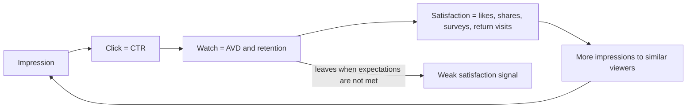

# How YouTube Recommends and Channel Design: Recommendations Follow the Viewer, Not the Video

> **Learning goal**: Explain the recommendation principles YouTube itself describes (Home, suggested videos, search, the Shorts feed, satisfaction signals), use YouTube Studio's traffic sources and CTR, average view duration and retention for diagnosis, and design a channel around a promise, format series, playlists and the channel home.

This document covers **the recommendation system and channel design**. Making a single video is in "Planning and Producing Long-form Video", producing vertical video and faceless channels is in "Shorts and Faceless Channels", and the monetization thresholds are in "Ad Revenue: AdPost and the YouTube Partner Program". Choosing the channel topic and viewers comes first, in "Choosing a Topic and Audience". Content is **as of 2026-09**. YouTube Help, How YouTube Works and the official blog could not be opened directly from the environment used to write this document, so those facts were confirmed via search results and are marked as such. Weights or thresholds YouTube has not published are not given.

## Key Concepts

| Term | Meaning | Name shown in Studio (example) |
|---|---|---|
| Home | The personalized feed you see when you open the app | Browse features |
| Suggested videos | Videos shown beside, below or after the one being watched | Suggested videos |
| Search | The result list for a viewer who typed a query | YouTube search |
| Shorts feed | The feed where you swipe through vertical videos | Shorts feed |
| Impressions | Times a thumbnail was shown on a viewer's screen | Impressions |
| Impressions click-through rate (CTR) | Share of impressions that became clicks | Impressions click-through rate |
| Average view duration (AVD) | Average watch time per view | Average view duration |
| Audience retention | Share of viewers still watching at each point in the video | Audience retention, key moments |
| Satisfaction signals | Signals used to estimate whether a viewer was satisfied | Not shown directly |

## Principles

### 1. The Goal and Signals YouTube Describes

YouTube describes its recommendation system as finding **videos that one particular viewer wants to watch and will be satisfied by**. The signals mentioned in its official explanations (confirmed via search results) are:

- **Clicks**: what the viewer chose. YouTube itself says clicks alone do not show satisfaction.
- **Watch time**: how much they watched.
- **Survey responses**: surveys that ask viewers to rate a video they watched. YouTube says only views rated 4 or 5 stars count as "valued watch time". Responses from people who did not answer are predicted by a model.
- **Shares, likes and dislikes**: viewers are more likely to be satisfied by videos they share or like, and a dislike signals they did not enjoy it.
- Explicit feedback such as **"Not interested"**.

The key point is that recommendation does not spread a "good video" to everyone; it picks **the video this viewer will be satisfied with at this moment**. So the same video can keep being recommended to some viewers and never appear for others. YouTube staff have repeated this in interviews and Creator Insider videos, in the spirit of "the algorithm follows the audience" (confirmed via search results).

### 2. Each Surface Means a Different Viewer Task

| Surface | Viewer's state | What the video needs |
|---|---|---|
| Home | Browsing without a goal | A thumbnail and title understood at a glance, a match with interests |
| Suggested videos | Looking for what follows the video just watched | A topic answering the previous video's next question, a series |
| Search | Already has a problem to solve | A title that matches the query, the answer within the first 30 seconds |
| Shorts feed | Swiping | A reason in the first 1-2 seconds, a short self-contained structure ("Shorts and Faceless Channels") |
| Channel page, playlists, notifications | Already knows the channel | Organized playlists, a consistent promise |

The traffic sources report in YouTube Studio splits views into Browse features, Suggested videos, YouTube search, External, Channel pages, Playlists, Notifications, Direct or unknown, and more. Views from links in a video description are said to count under Suggested videos, not External (confirmed via search results). Tutorial channels often see search dominate at first, with suggested and Home growing as viewer responses accumulate, but this is a tendency, not a fixed sequence.

### 3. The Creator's Proxy Metrics: CTR, AVD and Retention

Most satisfaction signals are not visible to creators. Instead, read Studio metrics as **proxies for satisfaction**.

- **CTR depends on where the impression happened.** YouTube Help says about half of all channels and videos have an impressions CTR in the 2-10% range (confirmed via search results). As impressions widen to new viewers, CTR can naturally drop, so do not judge a video on CTR alone.
- **AVD = total watch time / views.** A 5-minute AVD on a 10-minute video and on a 20-minute video mean different things, so read it together with retention (%).
- **Key moments in retention**: Studio marks the Intro (the share still watching after the first 30 seconds), Top moments, Spikes and Dips (confirmed via search results). Designing the first 30 seconds is covered in "Planning and Producing Long-form Video".
- YouTube's "Test & Compare" choosing the winner by **watch time**, not CTR, points the same way. A thumbnail that draws clicks and then disappoints does not win.

### 4. The Order to Read YouTube Studio

| Question | Report to check | Caution |
|---|---|---|
| Where was it shown? | Traffic source types | CTR baselines differ by source |
| When shown, did people click? | Impressions, impressions CTR | CTR falling as impressions grow can be normal |
| After clicking, did they watch? | Average view duration, retention, key moments | Compare with your own videos of similar length |
| Did they come back? | Returning viewers, subscriber change | Return viewing shows channel health better than subscriber count |
| What about Shorts? | Shorts views and engaged views | Since 2025-03-31, Shorts views count from the start of each play or replay. YPP and revenue sharing still use engaged views, the older definition (confirmed via search results) |

### 5. Channel Design: Promise, Format Series, Playlists, Channel Home

Recommendation happens video by video, but **channel design is what makes a viewer pick a second video.**

- **Promise**: One sentence of "for whom, which problem, in what way". Viewers remember the channel only if every video fits inside this sentence.
- **Format series**: A recurring series built on the same frame. Viewers know the frame when they arrive, and planning time drops for the creator.
- **Playlists**: One per series. Sort ordered lectures so viewers start from part 1.
- **Channel trailer**: A short introduction shown on the channel home to visitors who have not subscribed. Help says it is not shown again to a viewer who has already watched it (confirmed via search results).
- **Featured video**: The video shown on the channel home to returning subscribers. Use your latest flagship lecture.
- **Channel home sections**: Up to 12 custom sections are allowed, according to Help (confirmed via search results). Put series playlists at the top.

### 6. How Long-form and Shorts Audiences Relate

YouTube staff have said several times that Shorts and long-form are distributed by **separate recommendation systems**, and that performance in one does not penalize recommendations in the other (statements by the Shorts product lead and the creator liaison, confirmed via search results). They also acknowledge that viewers who watch only Shorts do not often move to long-form. So:

- Shorts subscribers can grow without long-form views growing at the same rate. Read the two numbers separately.
- Use the **related video link** feature that sends Shorts viewers to long-form (confirmed via search results). How to produce it is in "Shorts and Faceless Channels".
- Choose Shorts topics inside the long-form promise. Trending Shorts outside the promise gather viewers unrelated to your long-form.

### 7. Upload Cadence versus Quality

YouTube staff have explained, in effect, that upload frequency itself does not raise recommendation scores and that taking a break is not penalized (Creator Insider and others, confirmed via search results). Recommendation judges each video by viewer response. The reason cadence matters lies with **people**, not the algorithm.

- Viewers remember a fixed day, and the creator builds a routine.
- A cadence you cannot keep lowers quality and eventually stops. Start at **the lowest cadence you can keep**, then raise it.

## Applied: Example Creator J's Channel Design

Example creator J makes one long-form lecture (8-12 min) and 3 Shorts cut from it with 10 hours a week. D0 = 2026-10-05 (Monday).

- **Promise**: "How office workers can automate the spreadsheet tasks they repeat every week, with AI tools, in 10 minutes."
- **Three format series**:

| Series | Format | Example | Main surface expected |
|---|---|---|---|
| One Function in 10 Minutes | Lecture | "XLOOKUP in 10 Minutes" | Search |
| Automating Repeat Work | Lecture | "Build the Weekly Report Automatically" | Search -> suggested videos |
| Trying AI Tools | Review | "3 AI Spreadsheet Assistants on the Same Task" | Home, suggested videos |

- **Playlists**: 3 by series + 1 "Start here if you are new".
- **Trailer and home**: Until about 5 videos exist, skip the trailer and set the best lecture as the featured video. Then make a trailer that states the promise in 30-60 seconds (the length is J's choice).
- **Uploads**: Long-form on the same weekday every week; Shorts spread across the week. The time of day is whenever J can keep it.

Studio review every Sunday (diagnostic examples, assumptions):

| Observation (assumption) | Possible reading | What to change in the next video |
|---|---|---|
| Search traffic exists, but CTR is lower than similar videos of mine | The title does not show the query and the promise well | Put the problem name at the front of the title |
| CTR is high, but intro retention is low | The first 30 seconds differ from what the thumbnail promised | Show the result screen in the first 30 seconds |
| A sharp dip mid-video | A stretch where the explanation drags | Split into chapters, change the screen |
| Many Shorts views, almost no traffic to long-form | Shorts topics are far from the long-form | Related video link, align the topics |

## Going Deeper

### Recommendation Is "Pull", Not "Push"

A common explanation is that "a new video is first tested on subscribers and, if it does well, spreads in widening circles". Todd Beaupré, YouTube's director for growth and discovery, explained in interviews that a video is not "dispatched" to anyone when it goes live; instead, **each time a viewer opens the app, the system pulls candidates suited to that person**, and the first viewers are not limited to core subscribers (confirmed via search results). There are no official numbers for the size or duration of any spread. So do not judge a video on its first 48 hours alone; look at search and suggested traffic over several weeks.

### Video by Video, Not Channel by Channel

YouTube's creator liaison has explained, in effect, that recommendation is judged by video and topic rather than by the whole channel (confirmed via search results). One weak video does not "punish" the next. But if you keep posting topics your subscribers do not respond to, weaker early viewer response to new videos is a natural result.

### Personalization Makes Comparison Hard

The same video has different CTR and retention for different viewer groups. Comparing with **your own videos of similar length and topic** gives a cleaner signal than comparing with other channels' averages. Studio's "typical" comparison line is also based on your recent videos.

## Common Misconceptions

- **"Posting at the right hour makes the algorithm push you"** — YouTube says publish time is not known to affect long-term performance. Posting when your viewers are active may only bring early views slightly sooner (confirmed via search results).
- **"You need lots of tags to rank"** — YouTube Help says tags are useful when your content is commonly misspelled and otherwise play a minimal role in discovery (confirmed via search results). The title, description and the video itself come first.
- **"The algorithm hates me"** — Recommendation follows viewer response video by video. If views stalled, find where: traffic source, CTR or retention.
- **"Posting Shorts ruins long-form"** — YouTube says the recommendation systems are separate. The audiences can still differ.
- **"The higher the CTR, the better"** — A thumbnail that betrays expectations can raise CTR while lowering watch time and satisfaction.
- **"Taking a break kills the channel"** — There is no official statement that a break itself is penalized. Only viewers' habits weaken.

## Self-Check Questions

1. What does YouTube call "valued watch time", and why is watch time alone not enough?
2. Explain why the same video's CTR differs between search and Home.
3. In a video with high CTR but low intro retention, what would you fix first?
4. Name one video topic outside example creator J's promise and say why J should avoid it.
5. After 2025-03-31, how do Shorts views and engaged views differ, and which one is used for YPP?

## References

- [How YouTube recommendations work](https://support.google.com/youtube/answer/16089387?hl=en) — YouTube Help, confirmed via search results
- [On YouTube's recommendation system](https://blog.youtube/inside-youtube/on-youtubes-recommendation-system/) — YouTube Official Blog, confirmed via search results
- [How YouTube Works: Recommendations](https://www.youtube.com/howyoutubeworks/product-features/recommendations/) — YouTube, unreachable on 2026-09-30
- [Understand your YouTube video reach (traffic sources)](https://support.google.com/youtube/answer/9314355?hl=en) — YouTube Help, confirmed via search results
- [Impressions & click-through-rate FAQs](https://support.google.com/youtube/answer/7628154?hl=en) — YouTube Help, confirmed via search results
- [Measure key moments for audience retention](https://support.google.com/youtube/answer/9314415?hl=en) — YouTube Help, confirmed via search results
- [A/B test titles & thumbnails](https://support.google.com/youtube/answer/16391400?hl=en) — YouTube Help, confirmed via search results
- [Customize your YouTube channel layout](https://support.google.com/youtube/answer/3219384?hl=en) — YouTube Help, confirmed via search results
- [Add tags to your YouTube videos](https://support.google.com/youtube/answer/146402?hl=en) — YouTube Help, confirmed via search results
- [YouTube changes how Shorts views are counted from March 31](https://ppc.land/youtube-changes-how-shorts-views-are-counted-from-march-31/) — PPC Land, 2025-03, confirmed via search results
- [How to convert YouTube Shorts views into long-form channel growth](https://blog.youtube/creator-and-artist-stories/youtube-related-videos-traffic-guide/) — YouTube Official Blog, confirmed via search results
- [Do YouTube Shorts Hurt Your Long-Form Videos? What YouTube Actually Said](https://creaticalc.com/blog/do-youtube-shorts-hurt-long-form) — CreatiCalc, a summary of YouTube staff statements (secondary source), confirmed via search results
- [Subscribers skip 90% of uploads in their feed, YouTube director says](https://ppc.land/subscribers-skip-90-of-uploads-in-their-feed-youtube-director-says/) — PPC Land, a summary of Todd Beaupré's statements (secondary source), confirmed via search results
- Creator Insider algorithm Q&A videos — YouTube; the individual videos were unreachable, so only quotations in search results were checked
