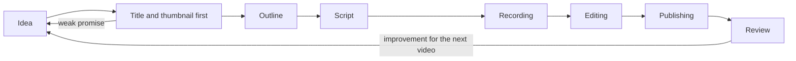

# Planning and Producing Long-form Video: A Pipeline for Lectures and Reviews

> **Learning goal**: Apply the long-form production pipeline, from idea to review, to lecture and review videos; design for retention with the first 30 seconds and a chapter structure; choose screen-recording and audio gear and editing tools for a faceless tutorial within a budget; and finish with captions, chapters and Test & Compare using a checklist.

This document covers **the process of making one horizontal video of roughly 8-20 minutes**. How recommendation works and how to read Studio metrics are in "How YouTube Recommends and Channel Design"; the details of Shorts and the faceless format are in "Shorts and Faceless Channels"; the policy risks of AI voices and AI editing are in "AI-assisted Production and Platform Policy"; and background music, fonts and on-screen copyrighted works are in "Disclosure, Copyright and Tax". Tool features and prices and YouTube features are **as of 2026-09**, and every gear budget is an **example range**.

## Key Concepts

| Stage | Output | Lecture (e.g. a spreadsheet function lecture) | Review (e.g. comparing AI tools) |
|---|---|---|---|
| Idea | One viewer question | "How do I use XLOOKUP?" | "Which AI spreadsheet assistant should I use?" |
| Title and thumbnail first | 3 title candidates, a thumbnail sketch | Result screen + problem name | What is compared + verdict |
| Outline | Chapter list | Result -> steps -> mistakes -> variations | Verdict -> criteria -> results -> recommendation |
| Script | Sentences to read or points to speak | Step-by-step explanation | Test process and reasons for the verdict |
| Recording | Screen recording + voice | One file, start to finish | The same task repeated in each tool |
| Editing | Finished cut | Remove filler, zoom in | Side-by-side result screens |
| Publishing | Title, thumbnail, description, captions, chapters | Practice file link | Disclose any sponsorship or affiliate link |
| Review | One thing to carry into the next video | Where retention dips sharply | Counter-arguments and follow-up questions in comments |

## Principles

### 1. The Whole Pipeline



Each stage checks that it keeps the previous stage's promise. Fixing the plan after recording costs the most, so **discard a lot in the early stages, where change is cheap.**

### 2. Why the Title and Thumbnail Come First

The title and thumbnail are a promise to the viewer. Writing the promise first gives you two things.

- **Idea validation**: If you cannot write three titles that give a reason to click, the idea is weak. Drop it before recording.
- **A standard for the content**: The video must confirm this promise in the first 30 seconds and keep it to the end. A thumbnail that overpromises can raise CTR while lowering retention and satisfaction ("How YouTube Recommends and Channel Design").

For a faceless channel, the default thumbnail is **a result screen + a short 2-4 word caption**. Shrink it to check it still reads on a small screen.

### 3. The Hook and the First 30 Seconds

YouTube Studio shows, as the "Intro" key moment in audience retention, the share of viewers still watching after the first 30 seconds (confirmed via search results). The job of the first 30 seconds is **confirming "this is the video I was looking for"**.

| Segment (example) | Lecture | Review |
|---|---|---|
| 0-5 s | Finished result screen: "This table gets built with one click" | Verdict first: "Of the three tools, I recommend only one" |
| 5-20 s | For whom, what, in how many minutes | Which task, and which criteria the comparison used |
| 20-30 s | Start step 1 right away | Start the first test |

Avoid: long logo animations, greetings with no conclusion, asking for subscribes and likes at the very start, and opening with a topic that was not in the thumbnail. The segment lengths are examples, not rules; tune them with your own videos' intro retention.

### 4. Structure for Retention: Chapters and Pattern Breaks

- **Chapters**: The outline's subheadings are the chapters. Viewers can skip to the part they need, which makes the video useful all the way through.
- **Flow**: A lecture goes result first -> setup -> steps 1-n -> common mistakes -> variations -> next video. A review goes verdict first -> test criteria -> results per tool -> who it suits -> limits and disclosures.
- **Pattern breaks**: Viewers tend to leave when the same screen lasts too long. Change the rhythm with a zoom, a before/after split, a summary card or a short quiz ("What went wrong here?"). There is no official rule for how many seconds apart, so look at **where retention dips sharply** and put one just before it.

### 5. Script: Sentences for the Ear

- In a faceless tutorial, the voice and the screen are everything. Write the script **as speech to be heard, not text to be read**: short sentences, one action per sentence, pointing words such as "here, this button".
- A common approach is a full script down to each step for lectures, and a full script only for the reasons behind the verdict in reviews. You can draft the script with AI, but rewrite it into the order you actually followed and your own voice. Read it aloud and fix any sentence you stumble on before recording.
- The script and recording files become raw material for the blog post, Shorts and later course products. How to cut them into reusable units is covered in "One Source, Multi Use (OSMU) Strategy".

### 6. Screen Recording and Audio: The Faceless Tutorial

Viewers leave over **hard-to-hear sound** sooner than over a soft picture. Spend the budget on audio first.

| Tier | Setup (example) | Budget (example range, not price research) |
|---|---|---|
| Tier 0 | Your laptop + wired earphone mic + a quiet room + OBS Studio (free) | KRW 0 |
| Tier 1 | USB mic + pop filter + reducing echo with a closet or curtains | About KRW 50,000-150,000 |
| Tier 2 | Dynamic mic + audio interface + mic arm + monitoring headphones | About KRW 200,000-500,000 |
| Tier 3 | Second monitor, acoustic panels, paid editing tools | About KRW 500,000 or more |

Recording habits:

- Turn off notifications and clear personal and company information from the desktop, browser tabs and file names. Raise the display scaling, or zoom in during editing, so text is readable on a phone.
- **Recording voice and screen separately** makes it easy to re-record only the sentence you fluffed. Listen to the first 10 seconds for noise, echo and level before the real take.

### 7. Editing Tools and Their Tiers

| Tier | Tool (example) | Features | What to check |
|---|---|---|---|
| Recording | OBS Studio | Free and open source; Windows, macOS, Linux | Recording format and audio track settings |
| Beginner | Vrew | Turns speech into text so you cut like editing a document; auto captions | Reported to have moved to a unified credit pricing model in 2026-04 (confirmed via search results) |
| Beginner | CapCut | Templates, auto captions | Reports say a 2025 pricing overhaul cut free features. Check commercial-use terms for templates and music |
| Intermediate | DaVinci Resolve (free version) | Free version with no watermark; editing, color, audio | High hardware requirements |
| Paid | DaVinci Resolve Studio, Premiere Pro, Final Cut Pro, Camtasia | Advanced features, collaboration, screen-recording focus (Camtasia) | Resolve Studio is a one-time purchase (listed at USD 295, confirmed via search results); Premiere Pro is a subscription |

Using **one tool all the way** is faster. Start with a beginner tool and move once a missing feature becomes clear.

### 8. Captions and Chapters

- **Captions**: YouTube generates automatic captions in many languages, including Korean (confirmed via search results). Technical terms such as function and menu names are often wrong, so fix them in Studio or upload a caption file (.srt or similar) made in your editing tool.
- **Chapters**: Add a list of timestamps to the description. The first timestamp must be 00:00, with at least 3 timestamps and each chapter at least 10 seconds long (confirmed via search results).
- **End screens**: They can go in the last 5-20 seconds of a video, and the video must be at least 25 seconds long (confirmed via search results). Link to the next lecture or a playlist.

### 9. Testing the Title and Thumbnail: Test & Compare

YouTube Studio's **Test & Compare** lets you upload up to 3 titles, thumbnails or title + thumbnail combinations for one video and shows them to split groups of viewers (confirmed via search results).

- Title testing was reported to have expanded to creators worldwide in 2025-12. Channels with advanced features enabled use it in YouTube Studio on a computer. The winner is decided by **watch time**, not CTR (some descriptions say watch time per impression). A test runs for up to 2 weeks, and the result is one of Winner (statistically significantly ahead on watch time share), Preferred (likely ahead but not significant) or None (no difference; the first variant you uploaded stays the default) (confirmed via search results).
- Shorts, scheduled live streams, Premieres and some others are said not to be eligible. A new channel with few views is likely to get "None".

### 10. Production Checklist

- [ ] Planning: one viewer question, 3 title candidates, a thumbnail sketch, and 3+ chapters each with one key line.
- [ ] Script: the first 30 seconds give the result, the audience and the time needed. You read it aloud.
- [ ] Recording: notifications off, personal information hidden, test recording checked.
- [ ] Editing: pauses and mistakes cut, small text zoomed, pattern breaks before expected dips.
- [ ] Rights and AI: terms of use checked for music, fonts and images ("Disclosure, Copyright and Tax"); disclosure settings checked if you used an AI voice or synthetic elements ("AI-assisted Production and Platform Policy").
- [ ] Publishing: one-line summary at the top of the description, practice file and blog post links, chapters, corrected captions, end screen.
- [ ] Review: after one week, one thing to carry into the next video is written down, from intro retention, dips and comment questions.

## Applied: Example Creator J's Week

Example creator J's split of 10 hours a week (assumption). The reasoning behind the full split is in "One Source, Multi Use (OSMU) Strategy", and the details of the 2 blog hours are in "Writing and Running a Blog".

| Task | Hours (assumption) |
|---|---|
| Source package: research and example files | 1.0 |
| Source package: outline (shared with the blog) | 0.5 |
| Source package: script | 0.5 |
| Source package: recording (screen + voice) | 1.5 |
| Long-form editing and thumbnail (including caption fixes, chapters, publishing) | 3.0 |
| Blog post | 2.0 |
| 3 Shorts ("Shorts and Faceless Channels") | 1.0 |
| Community (pinned comment, collecting questions) | 0.5 |
| Total | 10.0 |

First video (assumption): "Remove Duplicates in Excel in One Go — 3 Methods Compared", target length 10 minutes. Example chapters in the description:

```text
00:00 Result first: a table with no duplicates
00:25 Which method to choose
01:10 Method 1: Remove Duplicates
03:30 Method 2: the UNIQUE function
06:00 Method 3: automate it weekly with Power Query
08:40 3 common mistakes
09:40 Practice file and the next lecture
```

J starts with Tier 0 gear and moves to Tier 1 if comments about "echoey sound" keep coming for 4 weeks. Editing stays with one beginner tool. Once views accumulate, J uses Test & Compare to try 2-3 titles on a lecture with strong search traffic. The AI voice is used only as a tested option on one Short, not on the main video ("AI-assisted Production and Platform Policy").

## Going Deeper

### Video Length Is a Result, Not a Goal

We could not confirm any official statement that YouTube favors a particular length. 8-12 minutes is only a **target range** fitted to J's production time and topic. Every chapter in the outline should be as long as it needs to be and no longer. Stretches added for length show up as sharp retention dips.

### Trust in Review Videos

A review's verdict rests on trust. Test with the same task and the same criteria, and show the result screens as they are. If you received the product or use an affiliate link, disclose it early in the video and in the description, and turn on YouTube's paid promotion setting. The detailed rules are in "Disclosure, Copyright and Tax".

## Common Misconceptions

- **"You need a good camera first"** — A faceless tutorial needs no camera. Audio and screen readability come first.
- **"Starting with a channel logo intro looks professional"** — The first few seconds decide whether viewers leave. Show the result first.
- **"Longer videos add watch time, so they win"** — Stretches padded for length drive viewers away.
- **"Auto captions are enough"** — Wrong technical terms hurt both search and understanding. Correct them.
- **"Test & Compare picks the thumbnail with the highest CTR"** — It uses watch time.

## Self-Check Questions

1. What are two reasons to write the title and thumbnail before the script?
2. Design the first 30 seconds of a review video segment by segment.
3. What are three things you can do in editing when you find a sharp dip in the retention graph?
4. What three conditions must be met for YouTube chapters to show?
5. With a KRW 100,000 budget for faceless tutorial gear, what would you buy first, and why?

## References

- [A/B test titles & thumbnails](https://support.google.com/youtube/answer/16391400?hl=en) — YouTube Help, confirmed via search results
- [YouTube Title A/B Testing Rolls Out Globally To Creators](https://www.searchenginejournal.com/youtube-title-a-b-testing-rolls-out-globally-to-creators/562571/) — Search Engine Journal, 2025-12, confirmed via search results
- [Measure key moments for audience retention](https://support.google.com/youtube/answer/9314415?hl=en) — YouTube Help, confirmed via search results
- [Video chapters](https://support.google.com/youtube/answer/9884579?hl=en) — YouTube Help, confirmed via search results
- [Add end screens to videos](https://support.google.com/youtube/answer/6388789?hl=en) — YouTube Help, confirmed via search results
- [Use automatic captioning](https://support.google.com/youtube/answer/6373554?hl=en) — YouTube Help, confirmed via search results
- [obsproject/obs-studio](https://github.com/obsproject/obs-studio) — OBS Project, confirmed via search results
- [DaVinci Resolve Studio](https://www.blackmagicdesign.com/products/davinciresolve/studio) — Blackmagic Design, confirmed via search results
- [Vrew](https://vrew.ai/ko/) — VoyagerX; the pricing change was confirmed only through secondary sources (confirmed via search results)
- [CapCut Pricing (2026): Free vs Pro](https://bigvu.tv/blog/capcut-pricing-2026-free-vs-pro-whats-included-alternatives/) — BIGVU (secondary source), confirmed via search results
