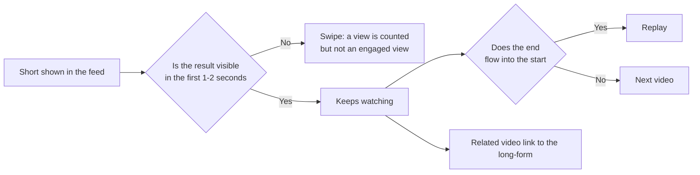

# Shorts and Faceless Channels: Designing to Beat a Single Swipe, and Adding Originality

> **Learning goal**: Explain how the Shorts feed asks the viewer for a different decision than long-form does, cut Shorts from a long-form video and link them back with a related video, and tell where faceless channels run into the "inauthentic content" and reused-content policies from what adds originality.

This document covers the **production** of Shorts and faceless formats. How recommendations work and how to design a channel are in "How YouTube Recommends and Channel Design", planning an 8 to 12 minute lecture is in "Planning and Producing Long-form Video", the overall flow that splits one source into long-form, Shorts, a blog post and products is in "One Source, Multi Use (OSMU) Strategy", AI tools and synthetic-content disclosure are in "AI-assisted Production and Platform Policy", and the Shorts revenue share is in "Ad Revenue: AdPost and the YouTube Partner Program". Features and policies are **as of 2026-09**. YouTube Help could not be opened directly, so some facts are marked "confirmed via search results".

## Key Concepts

| Term | Meaning | What was confirmed (as of 2026-09) |
|---|---|---|
| Shorts | Vertical or square video of 3 minutes or less | Up to 3 minutes for uploads from 2024-10-15 (60 seconds before that) |
| Views (Shorts) | One view each time a play or replay starts | Counted with no minimum watch time since 2025-03-31 |
| Engaged views | The previous way of counting views | Used for YPP eligibility and the Shorts revenue share |
| Viewed vs swiped away | The share of feed impressions where the viewer kept watching versus swiped on | A Shorts metric in YouTube Studio analytics |
| Related video link | A link at the bottom of a Short to one video on the same channel | Set in YouTube Studio on desktop |
| Faceless channel | A channel made with screen recording, slides, B-roll and voice-over, with no presenter on camera | The format itself does not break any policy |

In the Shorts feed the viewer does **not choose** the video. In long-form the first step is a click on a thumbnail and title. In Shorts the video is already playing, and the viewer only decides "keep watching or swipe". So the place CTR holds in long-form is taken in Shorts by **viewed vs swiped away**.

## Principles

### The first one or two seconds are the thumbnail

To avoid the swipe, the opening frame has to show the result. For a work-automation topic, show "a 30-minute clean-up finishing in 3 seconds" first and explain the method afterwards. Greetings, channel intros and logo animations are all reasons to swipe.

### Loops and length

Since 2025-03-31 Shorts views are counted **each time** a play or replay starts. If the last frame flows naturally into the first, replays go up. Revenue sharing and YPP eligibility still use **engaged views**, though, so giving people a reason to watch to the end beats forced edits that chase replays.

The maximum is 3 minutes, but length is not the goal. Third-party analyses say 30 to 60 seconds is the most common high-performing range, but that is not an official standard, so **treat it as a hypothesis and test it on your own channel**. Reports say recording in the Shorts camera is capped at 60 seconds per take, so build longer Shorts in an editor and upload them.

### Cutting Shorts from long-form

| Method | How | Upside | Watch out |
|---|---|---|---|
| YouTube's "Edit into a Short" | Pick a segment on the watch page of a public long-form video and make a Short | Linked back to the original long-form automatically | Per the Help page the segment is at most 60 seconds. Not available for private or unlisted videos or videos with third-party copyright claims |
| Re-edit in an editor | Re-crop for vertical and add captions and zoom | Makes small screen-recording text readable | A horizontal frame dropped into a vertical frame is unreadable |
| Shoot or record for Shorts | Record in vertical from the start | Easiest to read | Adds production time |

This section covers only the craft of making one Short. Which derivatives come from which source is decided in "One Source, Multi Use (OSMU) Strategy". Screen-recorded tutorials are horizontal by default, so a vertical crop makes cell and menu text tiny. Decide in advance which area to zoom into, and keep **one action** per Short.

### Sending viewers from a Short to long-form

The related video link, introduced in September 2023, connects a Short to **one video on the same channel** at the bottom of the screen. External links in Shorts descriptions were made unclickable as an anti-spam measure, so the path to the blog runs through the long-form description and a pinned comment. The flow is "Short → related long-form → blog post and template in the long-form description".

### Four faceless formats

| Format | Good fit | Where originality comes from | Common failure |
|---|---|---|---|
| Screen recording | Software how-tos, spreadsheets and automation | A real work problem you solved yourself, mistakes and how you fixed them | Clicks with no explanation |
| Slides | Concepts, comparisons, checklists | Diagrams and decision rules you made yourself | Reading a text-packed slide aloud |
| B-roll | Mood, supporting a story | Footage you shot, edits that match the explanation | Stitching free stock clips together and swapping only the script |
| Voice-over | The explanatory spine of every format | Your experience, opinions and way of speaking | Reading a script that would be the same whoever said it |

### Where faceless channels run into policy

On 2025-07-15 YouTube renamed its "repetitious content" policy to **"inauthentic content"** and made clear that it covers repetitive or mass-produced content: content that looks made from a template with little variation between videos, or content easily replicable at scale. YouTube described this as a rename and clarification of an existing policy. Separately, the **reused content** rule blocks re-uploading other people's content without significant original commentary, modification or educational value. It applies even with the original creator's permission, and it is judged separately from copyright.

Having no face is not the problem. The problem is **a production method that gives the same result whoever uses it**.

| Warning sign | How to add originality |
|---|---|
| Several videos a day from one template with only the keyword swapped | Show a different real problem and result in each video |
| Other people's or stock footage stitched together and read by a synthetic voice | Use your own screen recordings and your own files |
| A script that summarizes web articles | Add "when I tried it" experience, failures, numbers and decision rules |
| No trace of a person anywhere on the channel | The same voice, the same point of view, follow-ups answering comment questions |

In his January 2026 annual letter, YouTube CEO Neal Mohan named managing low-quality AI content ("AI slop") as a priority for 2026. It is safer to assume the risk for mass-produced faceless channels has not gone down. The rules for using AI tools are in "AI-assisted Production and Platform Policy".

### Voice quality

On a faceless channel the voice is effectively the presenter.

- **Recording space**: a quiet room with little echo matters more than an expensive microphone. Keep the same distance between mouth and mic every time.
- **Editing**: clean up in this order: noise reduction, breaths and silences, then level the volume. Heavy noise reduction makes a voice sound robotic.
- **Script**: written-style scripts sound read. Read them aloud and shorten the sentences.
- **AI voice**: an option, nothing more. It can cost the trust and identity you built with your own voice, and synthesizing someone else's voice triggers disclosure ("AI-assisted Production and Platform Policy").

### A growth tool or a revenue tool

| | Shorts | Long-form |
|---|---|---|
| Main role | Discovery: reaching people who do not know the channel | Trust and revenue: the path to watch time, ads and products |
| Ad revenue model | Shorts feed ads pooled, 45% of the creator-pool allocation | 55% of net watch-page ad revenue |
| From 2027-02-01 | Shorts ad and subscription revenue share only with 10M+ engaged views in the last 90 days (as announced) | No change |
| Expectation for a small channel | Subscribers and long-form traffic rather than revenue | The centre of revenue and product sales |

The figures and calculations are in "Ad Revenue: AdPost and the YouTube Partner Program". This document's conclusion is simple: **on a small channel, Shorts are an entrance to the long-form and the blog, not a revenue source**.

## Applied: Example Creator J's Three Shorts

Each week J uploads one 8 to 12 minute long-form lecture (for example "Clean up duplicate spreadsheet data in one go with AI") and makes three Shorts from it. Assume about 1.5 of J's 10 weekly hours go to Shorts.

| Short | Content | First 1-2 seconds | Link |
|---|---|---|---|
| 1 Result | Before and after of the sheet | A messy table cleaning itself up in one step | Related video: this week's long-form |
| 2 Mistake | One common beginner mistake and the fix | The error message on screen | Related video: this week's long-form |
| 3 Question | Answering a comment from last week | A screenshot of the comment | Related video: the long-form the question came from |

- Recording: mark the zoom areas while recording the long-form, then record the Shorts segments once more in vertical.
- Voice: J's own voice by default. An AI voice is tested on one Short only, and the decision follows a comparison of viewed vs swiped away and comments against Shorts in J's own voice.
- Decision rule (assumption): after 12 Shorts over 4 weeks, compare each Short's viewed share and the long-form views that came via the related video link, then make more of the types that worked.

## Going Deeper

### The same video on several platforms

You can post the same video to other vertical-video platforms such as Instagram Reels. Upload the original file rather than one stamped with another platform's watermark. No official explanation was found of how cross-posting affects recommendations.

### What to measure

| Question | Metric |
|---|---|
| Did the opening frame work | Viewed vs swiped away |
| Was it worth watching to the end | Average percentage viewed, replays |
| Did it send people to long-form | Related video link clicks, Shorts as a traffic source on the long-form |
| Did the channel grow | Subscribers gained per Short |

## Common Misconceptions

- **"Shorts are capped at 60 seconds"**: uploads from 2024-10-15 can run 3 minutes. Reports say recording in the Shorts camera is capped at 60 seconds per take.
- **"More views mean more revenue"**: since 2025-03-31 views include replays and brief plays. Revenue and YPP use engaged views.
- **"Faceless channels cannot be monetized"**: the test is mass production and reuse, not the format.
- **"Reuse is fine if I have permission"**: the reused content rule looks for significant added value, whatever the permission.
- **"Posting lots of Shorts builds ad revenue"**: from 2027-02-01 there is no Shorts revenue share below 10M engaged views in 90 days (as announced).

## Self-Check Questions

1. Which Shorts metric plays the role CTR plays in long-form, and why are the roles similar?
2. Since 2025-03-31, how do "views" and "engaged views" differ, and which one is used for revenue?
3. What is the first problem to solve when turning a horizontal screen recording into a Short?
4. Name two policy risks for a faceless channel that makes five videos a day from the same template, and a way to reduce each.
5. On a channel with 300 subscribers, what should the goal of Shorts be instead of revenue, and which metric confirms it?

## References

- [Upload YouTube Shorts / Shorts length extended to 3 minutes](https://support.google.com/youtube/answer/10059070?hl=en) — YouTube Help, confirmed via search results (2026-09-30)
- [YouTube changes how Shorts views are counted from March 31](https://ppc.land/youtube-changes-how-shorts-views-are-counted-from-march-31/) — PPC Land, 2025-03, checked 2026-09-30
- [Add a related video to your YouTube Shorts](https://support.google.com/youtube/answer/14075157?hl=en) — YouTube Help, confirmed via search results (2026-09-30)
- [YouTube's "related links" connect Shorts, long-form videos, and live streams](https://www.tubefilter.com/2023/09/01/youtube-related-links-multi-format-creators-shorts-live-long-form/) — Tubefilter, 2023-09-01, checked 2026-09-30
- [Create YouTube Shorts from your videos](https://support.google.com/youtube/answer/12836917?hl=en) — YouTube Help, confirmed via search results (2026-09-30)
- [YouTube channel monetization policies](https://support.google.com/youtube/answer/1311392?hl=en) — YouTube Help, confirmed via search results (2026-09-30)
- [YouTube Clarifies Changes to Monetization Rules Around Inauthentic Content](https://www.socialmediatoday.com/news/youtube-clarifies-monetization-update-inauthentic-repeated-content/752892/) — Social Media Today, 2025-07, checked 2026-09-30
- [YouTube chief says 'managing AI slop' is a priority for 2026](https://www.cnbc.com/2026/01/21/youtube-chief-says-managing-ai-slop-is-a-priority-for-2026-.html) — CNBC, 2026-01-21, checked 2026-09-30
- [YouTube Shorts monetization policies](https://support.google.com/youtube/answer/12504220?hl=en) — YouTube Help, confirmed via search results (2026-09-30)
- [New opportunities to earn and changes to the YouTube Partner Program](https://blog.youtube/news-and-events/youtube-partner-program-updates-2027-new-opportunities-earn/) — YouTube Blog, 2026-08, confirmed via search results (2026-09-30)
