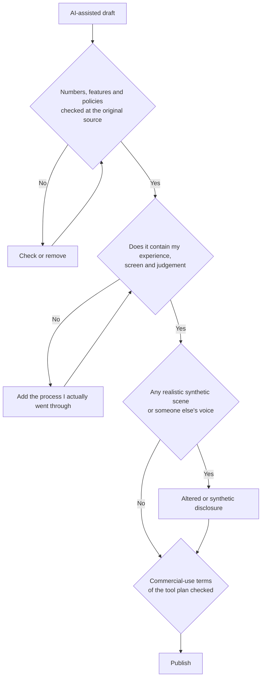

# AI-assisted Production and Platform Policy: Speed from AI, Responsibility from You

> **Learning goal**: Separate what AI can help with at each production stage from where it hurts quality, explain YouTube's altered or synthetic content disclosure, the "inauthentic content" and reused-content rules and Naver's stance on AI mass-produced posts, and set up a pre-publish check that includes the commercial-use terms of your tools.

AI cuts the time spent on scripts, editing, captions and translation. It also makes your output look like that of the many channels using the same tools, and it makes wrong information sound convincing. This document covers **AI tools and the platform-policy risk that comes with them**. The craft of Shorts and faceless formats is in "Shorts and Faceless Channels", turning one source into several formats is in "One Source, Multi Use (OSMU) Strategy", and the legal side of ad disclosure, copyright and tax is in "Disclosure, Copyright and Tax". Policies and terms are **as of 2026-09**. YouTube Help and Naver help pages could not be opened directly, so many items are marked "confirmed via search results". Tool names are **neutral examples**, not recommendations.

## Key Concepts

| Term | Meaning | Key point |
|---|---|---|
| Altered or synthetic content disclosure | A YouTube Studio setting at upload for disclosing realistic altered or synthetic content | Only realistic content. Help with scripts or captions is not covered |
| Inauthentic content | The YPP rule that excludes mass-produced or repetitive content from monetization | Renamed from "repetitious content" on 2025-07-15 |
| Reused content | Reusing other people's content without significant added value | Judged separately from permission and copyright |
| Likeness detection | A YouTube feature that finds AI-generated videos using your face and alerts you | You can request removal after a match |
| Commercial-use terms | What a tool's terms say about ownership and commercial use of outputs | They differ by plan |

## Principles

### A tool map by stage

| Stage | What AI does well | Neutral example (not a recommendation) | Where it hurts quality |
|---|---|---|---|
| Research | Source lists, summaries, finding counter-arguments | General chat assistants, AI search | Invents sources and numbers (hallucination) |
| Script | Outlines, polishing sentences, adjusting length | General chat assistants | Sentences anyone could write, explanations with no experience behind them |
| Voice and TTS | Voice-over, a pronunciation guide | TTS services such as ElevenLabs | Flat intonation costs trust. Commercial terms vary by plan |
| Image | Thumbnail backgrounds, draft diagrams | Image generators such as Midjourney | Fake screenshots that look like a real screen |
| Video | B-roll, transitions | Text-to-video services | Realistic scenes need disclosure. The channel starts to look like every other one |
| Editing | Removing silences, cutting, noise reduction | AI features in video editors | Heavy auto-cutting removes the natural pauses |
| Captions | Speech-recognition captions | YouTube automatic captions | Errors in technical terms and proper names |
| Translation and dubbing | Subtitles in other languages, voice dubbing | YouTube auto-dubbing | Awkward machine translation, inconsistent terms |

**YouTube auto-dubbing**: reports say it was announced in September 2024, extended to YPP creators in 2025, and opened to all creators in early 2026 with 27 languages (confirmed via search results). Dubbing Korean videos into English is reported to be supported. Language pairs and eligible channels can change, so check in YouTube Studio and review each dub before it goes live.

### Where AI helps and where it hurts

There is one test: does AI shrink or grow **what viewers can get only from this channel**?

- **Helps**: repetitive work (caption timing, silence removal, format conversion), drafts (outlines, title options), checks (spelling, missing steps).
- **Hurts**: when it writes your experience (the process you actually went through) for you, when facts (numbers, features, policies) are copied without checking, when it replaces your voice and point of view wholesale.

### YouTube's altered or synthetic content disclosure

YouTube requires creators to disclose content made with altered or synthetic media, including generative AI, when a viewer could **easily mistake it for a real person, place or event**.

| Disclosure needed | Disclosure not needed |
|---|---|
| Replacing a real person's face with someone else's | Clearly unrealistic scenes, animation |
| Synthesizing another person's voice to narrate | Minor edits such as colour grading or beauty filters |
| Altering real events or places, such as making a real building look on fire | Using AI only for production help, such as scripts, ideas or automatic captions |
| Realistic fictional events, such as a tornado heading for a real town | Cloning your own voice for voice-overs or dubs (per YouTube's 2024 announcement) |

- **Where**: at upload, in the "Altered content" setting in YouTube Studio.
- **Where the label appears**: by default in the "How this content was made" section of the expanded description. For sensitive topics such as health, news, elections and finance, a more prominent label may appear on the player.
- **If you do not**: YouTube may add the label itself, and creators who consistently fail to disclose may face penalties including content removal or suspension from YPP (confirmed via search results).

### "Inauthentic content" and reused content

Both rules are **YPP monetization policies**. A channel can lose monetization without breaking the Community Guidelines.

| | Inauthentic content | Reused content |
|---|---|---|
| What it looks at | Mass production and repetition: videos that look template-made with little variation | Source: content that is not your own creation and already exists elsewhere |
| History | Renamed from "repetitious content" on 2025-07-15 and clarified to include mass-produced content | An existing rule |
| Examples | Hundreds of synthetic-voice videos from one template with only the sentences changed | Compilations of other people's clips, reactions with no commentary, re-uploads of other channels' videos |
| When it is allowed | Each video has its own content and production decisions | Significant original commentary, substantive modification, or educational or entertainment value is added |
| Note | Using AI is not banned in itself | Applies even with the original creator's permission. Judged separately from copyright and fair use |

**Turning your own content into other formats**: cutting Shorts from your own long-form or writing a blog post from the same outline is not reuse of other people's content. But using AI to churn out many videos from lightly varied versions of one script moves you towards the inauthentic-content risk. What each derivative adds is decided in "One Source, Multi Use (OSMU) Strategy"; check it against this table.

### Likeness detection

Reports say YouTube began offering likeness detection to YPP creators in October 2025 and, in May 2026, opened it to channel owners and managers aged 18 and over (confirmed via search results). It scans newly uploaded videos for AI-generated content that uses an enrolled person's face and alerts them, and the person can review a match and request removal under the privacy guidelines. Reports in September 2026 also describe adding voice detection. Even a faceless channel should watch this if **its voice is the brand**.

### Naver's stance: the problem is mass production and low quality, not AI

- **AI-use label**: from 2025-05-21 Naver Blog added an option to mark images and videos generated or edited with AI with an "AI-use" icon. A July 2026 report says that on the blog this is **recommended, not mandatory** (confirmed via search results).
- **Mass-produced posts**: after a March 2026 report on blogs publishing 100 AI-made posts a day, Naver said it continuously monitors and sanctions abnormal use such as spam, advertising and macros, and is strengthening its technical response to keep search results trustworthy (Newsverse, 2026-03-24).
- **Summary**: no evidence was found that Naver officially bans the use of AI. The risk is unchecked AI output and mass publishing. How search evaluates documents is covered in "Naver Blog and How Naver Search Works".

### Rights in AI outputs and voices

| What to check | What was confirmed (2026-09; each tool's terms can change) |
|---|---|
| Copyright in AI outputs in Korea | The June 2025 guide from the Ministry of Culture, Sports and Tourism and the Korea Copyright Commission: with human creative contribution, a work can be registered as a "work using generative AI"; a "generative AI output" with no such contribution cannot |
| Chat assistant outputs (e.g. OpenAI) | The terms assign the company's rights in outputs to the user "if any". That is not a promise that rights exist |
| Image generation (e.g. Midjourney) | Paid subscribers own their assets. A company with over USD 1 million in annual revenue (or its employee) needs a Pro or Mega plan |
| TTS (e.g. ElevenLabs) | The free plan allows no commercial use and requires attribution in the title when published. Paid plans include a commercial licence (beta features excluded) |
| Voice cloning | Do not clone another person's voice without consent. It also triggers YouTube disclosure |

This table is not legal advice. **Check the terms of the plan you use before publishing**, and record the date you checked. The general principles of contracts and IP are in "Contracts · IP · Open Source".

### A pre-publish check

## Applied: Example Creator J's Rules for AI

J teaches work automation, so the process of using AI is itself content. The rule is "AI does drafts and repetitive work; judgement and the screen are J's".

| Stage | J's approach | Saved per 10-hour week (assumption) |
|---|---|---|
| Outline | Refine one outline with AI, then split it into the blog post and the video script | About 1 hour |
| Script | Rewrite the AI draft, adding J's own mistakes and numbers | About 0.5 hours |
| Recording | Screen-record real spreadsheet files. No AI-generated screens | 0 |
| Editing and captions | Use silence removal and automatic captions, then correct terms such as function names by hand | About 1 hour |
| Voice | J's own voice by default. An AI voice only on one Short, after checking the paid plan's terms | 0 |
| Disclosure | Only J's own screen and voice, so usually no disclosure. Disclose if a realistic synthetic scene is used | — |

J's weekly videos each cover a different real work problem, which is far from template mass production. The risk is "using AI to make this week's script a variation of last week's".

## Going Deeper

### Does the label affect performance

YouTube Help says adding a disclosure does not limit a video's reach or its eligibility to earn money (confirmed via search results). Penalties come from repeatedly failing to disclose what should be disclosed. It is more accurate to see the label not as "a confession of using AI" but as **a device that stops viewers from taking it as real**.

### Keep a record

For each video, write one line: tools used, plan, the date you checked the terms, and whether you disclosed. It is your evidence if the terms change or someone disputes your use later.

## Common Misconceptions

- **"Any use of AI must be disclosed"**: only realistic, misleading alteration or synthesis. Help with scripts or captions is not covered.
- **"AI videos cannot be monetized"**: the test is mass production, repetition and reuse, not AI use itself.
- **"I had permission, so it is not reused content"**: the reused-content judgement is separate from permission and copyright.
- **"Naver bans AI posts"**: no official ban was found. Spam, mass publishing and wrong information are the problem.
- **"I paid, so the copyright is mine"**: ownership under the terms is not the same as copyright protection. Without human creative contribution, protection may be weak.

## Self-Check Questions

1. Does a screen-recording video with an AI-written script and your own recorded voice need the altered or synthetic disclosure? Why?
2. What does each of the "inauthentic content" and reused-content rules look at?
3. What must you check before using narration made with a free TTS plan in a monetized video?
4. Is Naver Blog's "AI-use" label mandatory? What does Naver actually treat as a problem?
5. If you drop the "my experience, screen and judgement" step from the pre-publish check, which two risks grow?

## References

- [Disclosing use of GenAI content (altered or synthetic content)](https://support.google.com/youtube/answer/14328491?hl=en) — YouTube Help, confirmed via search results (2026-09-30)
- [Understanding 'How this content was made' disclosures on YouTube](https://support.google.com/youtube/answer/15447836?hl=en) — YouTube Help, confirmed via search results (2026-09-30)
- [How we're helping creators disclose altered or synthetic content](https://blog.youtube/news-and-events/disclosing-ai-generated-content/) — YouTube Blog, 2024-03, confirmed via search results (2026-09-30)
- [YouTube channel monetization policies](https://support.google.com/youtube/answer/1311392?hl=en) — YouTube Help, confirmed via search results (2026-09-30)
- [YouTube clarifies "inauthentic content" policy changes](https://ppc.land/youtube-clarifies-inauthentic-content-policy-changes/) — PPC Land, 2025-07, checked 2026-09-30
- [Understanding YouTube's reused content policy](https://ppc.land/understanding-youtubes-reused-content-policy/) — PPC Land, checked 2026-09-30
- [Likeness detection on YouTube](https://support.google.com/youtube/answer/16440338?hl=en) — YouTube Help, confirmed via search results (2026-09-30)
- [YouTube Rolls Out Likeness Detection To All Creators Over 18](https://www.mediapost.com/publications/article/415170/youtube-rolls-out-likeness-detection-to-all-creato.html) — MediaPost, 2026-05-19, checked 2026-09-30
- [Unlocking a global audience with auto dubbing](https://blog.youtube/news-and-events/youtube-auto-dubbing-expressive-speech/) — YouTube Blog, confirmed via search results (2026-09-30)
- [Naver's double standard on AI labels: mandatory in shopping, voluntary on blogs](https://news.mtn.co.kr/news-detail/2026072417015682342) — MTN (Korean), 2026-07-24, checked 2026-09-30
- [100 low-quality "AI machine-gun" blog posts a day; Naver to tighten sanctions](https://www.newsverse.kr/news/articleView.html?idxno=9959) — Newsverse (Korean), 2026-03-24, checked 2026-09-30
- [Copyright registration guide for works using generative AI](https://www.copyright.or.kr/information-materials/publication/research-report/view.do?brdctsno=54253) — Korea Copyright Commission (Korean), 2025-06, confirmed via search results (2026-09-30)
- [Terms of Use](https://openai.com/policies/row-terms-of-use/) — OpenAI, confirmed via search results (2026-09-30)
- [Terms of Service](https://docs.midjourney.com/hc/en-us/articles/32083055291277-Terms-of-Service) — Midjourney, confirmed via search results (2026-09-30)
- [Can I publish the content I generate on the platform?](https://elevenlabs.io/docs/help-center/legal/can-i-publish-the-content-i-generate-on-the-platform) — ElevenLabs, confirmed via search results (2026-09-30)
