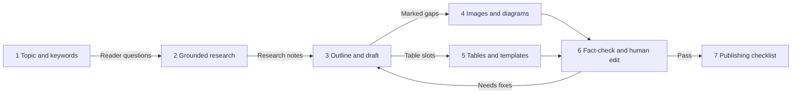

# Writing Blog Posts with AI: Tools and Tutorials

> **Learning goal**: Split one Naver Blog post into seven stages, from topic and keyword research to the publishing checklist, pick the AI tool and official tutorial that fit each stage to learn it quickly, and keep the experience and fact-checking steps that a human must own.

This document covers **how to do the writing craft from "Writing and Running a Blog" faster with AI tools**, stage by stage. Policy risks such as disclosure, mass production and tool terms are in "AI-assisted Production and Platform Policy", how Naver search evaluates posts is in "Naver Blog and How Naver Search Works", and how the 10 weekly hours are split is in "One Source, Multi Use (OSMU) Strategy". Video tools are in "Making YouTube Videos with AI: Tools and Tutorials", and the prompt library, review protocol, automation and pricing are in "An AI Production Method: Prompts, Review and Automation". Features and names are **as of 2026-09**. Every link is an address confirmed in search results on 2026-09-30; none could be opened directly from this environment. Tool names are **neutral examples**, not recommendations.

## Key Concepts

| Term | Meaning | How this document uses it |
|---|---|---|
| Grounded research | Using AI so that every answer carries a source, or answers only from material you uploaded | The default for the research stage |
| Deep research | A feature where the AI searches and reads many times, then writes a report with sources | Used only when digging into a new topic |
| Project memory | A workspace where instructions and files, added once, apply to every chat inside it | Holds the style guide and the post template |
| Style guide | A one-page document of tone, term spellings, banned phrases and post structure | Fixes the floor of draft quality |
| AI Briefing | Naver's AI summary answer at the top of search, shown with blog and other source posts | The standard for writing in a citable structure |
| Tutorial | A vendor's official help page or course, or a lesson video from a proven creator | Worth 20-30 minutes the first time you use a tool |

## Principles

### 1. The seven-stage flow

At each stage AI takes **drafting and sorting**, and the human takes **direction, experience and checking**. Instead of skipping stages, pick just one tool per stage.

| Stage | What AI does | What the human does | Typical tools (examples) |
|---|---|---|---|
| 1 Topic and keywords | Cluster search terms, turn them into questions | Check the numbers, choose the topic | Naver DataLab, the search-ad keyword tool + a chat AI |
| 2 Grounded research | Find sources, summarize, find counterpoints | Open the originals, note the dates | Perplexity, Gemini Notebook (formerly NotebookLM), web search and deep research |
| 3 Outline and draft | Heading candidates, sentence drafts | Reorder to the steps you actually did | Claude Projects, ChatGPT Projects, Gemini Gems (→ Skills) |
| 4 Images and diagrams | Concept diagrams, cover backgrounds | Capture real screens, hide personal data | Canva AI, image generators, a screenshot tool |
| 5 Tables and templates | Suggest formulas, sample data | Verify formulas, tidy the download file | Copilot in Excel, Gemini in Sheets |
| 6 Fact-check and edit | List the claims to check | Compare with official docs, write the experience lines | A second AI, official help pages |
| 7 Publish | Spelling and duplicate checks | Final check of labels, links and rights | Checklist |

### 2. Topic and keywords: numbers from Naver's tools, clustering by AI

- **Tools**: the tool descriptions of Naver DataLab search trends and the search-ad keyword tool are in "Choosing a Topic and Audience". This section covers only the order in which to use the two tools with AI.
- **How to**: (1) In the keyword tool, download the related keywords for a seed term such as "Excel duplicates". (2) Paste the list into an AI and ask it to "group these by search intent and turn each group into one reader question". (3) Check the seasonality of the top two or three groups in DataLab. (4) Copy the numbers **from the tool screens**, not from the AI.
- **Tutorials**: [Naver DataLab guide](https://www.ascentkorea.com/naver-datalab-guide/) (Korean, Ascent Korea), [Using the Naver keyword tool effectively](https://www.theegg.com/ko/insights/naver-keyword-tool-explained/) (Korean, The Egg), video [Comparing four Naver search-volume tools](https://www.youtube.com/watch?v=PjvqZZoZVLg) (Korean, a marketer's lesson).

Do not ask an AI "which keywords have high search volume". A chat AI does not know Naver's search volumes and will invent plausible numbers.

### 3. Grounded research: opening the source is part of the research

| Tool | Good at | How to | Tutorial |
|---|---|---|---|
| Perplexity | A source link on every answer. Pro Search and Deep Research modes | Pick the mode and write a specific question. Put standing instructions for repeat topics in Spaces (the help page is now titled Projects) | [What is Pro Search?](https://www.perplexity.ai/help-center/en/articles/10352903-what-is-pro-search) (English), [Introducing Perplexity Deep Research](https://www.perplexity.ai/hub/blog/introducing-perplexity-deep-research) (English) |
| Gemini Notebook (formerly NotebookLM) | Answers only from the PDFs, web pages and YouTube videos you add, with citations | Add official help pages and your practice file as sources and ask "say so if it is not in these sources" | [Learn about NotebookLM](https://support.google.com/notebooklm/answer/16164461) (English), video [12 practical ways to use NotebookLM](https://www.youtube.com/watch?v=eeJz8HAyTk0) (Korean, Oppadu Excel) |
| ChatGPT deep research | Described as proposing a research plan you review and edit, then writing a report (confirmed via search results; how it starts may change) | Pick Deep Research from the tools menu (+) and state the reader, scope and output format | [Deep research in ChatGPT](https://help.openai.com/en/articles/10500283-deep-research-in-chatgpt) (English) |
| Gemini Deep Research | Shows a research plan first, then generates the report | Choose Deep Research at gemini.google.com | [Use Deep Research in the Gemini app](https://support.google.com/gemini/answer/15719111?hl=ko&co=GENIE.Platform%3DDesktop) (Korean) |
| Claude web search and Research | Turn on web search; on paid plans, Research runs many searches | Turn on web search from the + menu in the input box, then choose Research | [Enable and use web search](https://support.claude.com/en/articles/10684626-enable-and-use-web-search) (English), [Use research on Claude](https://support.claude.com/en/articles/11088861-use-research-on-claude) (English) |

- **Rename**: on 2026-07-16 Google announced that NotebookLM is renamed Gemini Notebook. It is the same product, and existing notebooks and links are said to keep working (confirmed via search results). The help-page addresses still contain notebooklm.
- **Rule**: keep **the original address and the date you checked it** in your research notes, not the AI summary. Open every source the AI gives and check that the sentence is really there. A deep-research report is a "reading list", not a conclusion to quote.

### 4. Outline and draft: put the style guide in once

If you retype instructions such as "friendly, answer first" every time, results drift. Put your style guide and the post template from "Writing and Running a Blog" into **project memory**, and draft only inside it.

| Tool | What to put in | Tutorial |
|---|---|---|
| Claude Projects + styles | Project instructions (style guide), project knowledge (template, two or three past posts). You can also build a custom style from samples of your writing | [What are projects?](https://support.claude.com/en/articles/9517075-what-are-projects) (English), [Introduction to projects · Claude Academy](https://academy.claude.com/courses/claude-101/introduction-to-projects) (English course) |
| ChatGPT Projects | Project files and instructions. Custom GPTs are being retired and personal accounts are reported to be unable to create new GPTs, so use Projects (confirmed via search results; "An AI Production Method: Prompts, Review and Automation") | [Projects in ChatGPT](https://help.openai.com/en/articles/10169521-projects-in-chatgpt) (English), [Writing with ChatGPT](https://openai.com/academy/writing/) (English) |
| Gemini Gems | The Gem's name and instructions (style guide), reference files. Personal accounts are due to move to Skills from 2026-11-17, so keep the original instructions in your own file | [Get started with Gems in the Gemini app](https://support.google.com/gemini/answer/15236321?hl=ko) (Korean) |

- **How to**: (1) Paste the research notes and the reader questions and ask for **only the outline** first. (2) Reorder the outline to the steps you actually did. (3) Ask for a draft one heading at a time. (4) Have the draft leave `[experience]` slots wherever a line such as "when I tried it" or "in my file" belongs. A human fills those slots.
- For the actual prompt text, use the prompt library in "An AI Production Method: Prompts, Review and Automation".

### 5. Naver's AI: what exists in 2026 and what does not

| Item | Status as of 2026-09 | What it means for a blogger |
|---|---|---|
| CLOVA X and Cue: | Shut down on 2026-04-09. Naver's stated direction is to fold HyperCLOVA X technology into core services such as search (confirmed via reports) | There is no Naver chatbot to write posts with |
| An AI writing helper in SmartEditor | No official AI writing assistant could be confirmed in search results | Draft in outside tools and polish in the editor |
| AI Briefing | Introduced 2025-03. Shows blog and other source posts with the summary at the top of search. 30 million monthly users per a 2026-08 press release | A post with the answer on its first screen becomes a citation candidate |
| AI Tab | Beta for Naver Plus members on 2026-04-28, full launch for all users on 2026-06-26 (confirmed via reports) | Conversational search also uses source posts |
| Naver Mate | Beta from 2026-06. Reported to pick about 3,000 creators a month by AI Briefing citations, topic expertise and activity, and pay them an activity grant | Citations are a new reward metric. Revenue as a whole is in "Ad Revenue: AdPost and the YouTube Partner Program" |
| AI-use label | A label for AI-generated images and videos. Voluntary on the blog | The labelling standard is in "AI-assisted Production and Platform Policy" |

- **Posts that get cited**: the content principles and citation exclusions Naver was reported to set out in 2026-05 are covered in the AI Briefing and source selection section of "Naver Blog and How Naver Search Works".
- **Conclusion**: a post that reads as AI-written moves away from citation. How AI Briefing chooses documents is in "Naver Blog and How Naver Search Works", and generative search in general is in "AI Search · GEO/AEO".

### 6. Images and diagrams: capture real screens, use AI only for concepts

| Use | Tool (example) | How to | Tutorial |
|---|---|---|---|
| Covers and diagrams | Canva AI | Put the title into a template and use AI to vary the background and layout | [Getting started with Canva AI](https://www.canva.com/help/using-canva-ai/) (Korean help page), [Canva's official Korean channel](https://www.youtube.com/@canvakorea) (Korean) |
| Concept illustrations | ChatGPT image generation | State the aspect ratio and any text in the prompt | [Images in ChatGPT](https://help.openai.com/en/articles/11084440-images-in-chatgpt) (English) |
| Concept illustrations | Gemini app image generation (Nano Banana) | Create an image from the tools menu, or edit an uploaded image | [Generate and edit images with the Gemini app](https://support.google.com/gemini/answer/14286560?hl=ko) (Korean) |
| Stylized images | Midjourney | Generate on the web Create page | [Getting Started Guide](https://docs.midjourney.com/docs/quick-start) (English) |
| Images with text | Ideogram | Put the exact wording in quotation marks | [Text and Typography](https://docs.ideogram.ai/using-ideogram/getting-started/prompting-guide/2-prompting-fundamentals/text-and-typography) (English) |
| Real screens | Windows Snipping Tool | Capture with Windows logo key+Shift+S, mark with the pen, hide emails with text actions | [Snipping Tool](https://www.microsoft.com/ko-kr/windows/tips/snipping-tool) (Korean) |

- **Rule**: any image that says "this is what it really looks like", such as an Excel screen, **must be captured by you**. A fake screenshot drawn by AI misleads readers and destroys a tutorial's credibility.
- **Rights**: commercial-use terms differ between free and paid plans. The one-line summary and the check procedure are in "AI-assisted Production and Platform Policy", and font and image copyright is in "Disclosure, Copyright and Tax".

### 7. Tables and templates: J's topic itself

- **Copilot in Excel**: the help page says to open it with the Copilot icon at the lower right of Excel (confirmed via search results; in some versions it may be the button on the ribbon's Home tab), then ask in plain words for formulas, charts, PivotTables and formatting. The 2026-09 help page describes three modes: edit, plan and chat (confirmed via search results). What personal Microsoft 365 plans include, and Korean-language support, can differ by plan.
- **Gemini in Sheets**: use "Ask Gemini" at the upper right to request tables, formulas, analysis and charts. Check the help page for which plans include it.
- **How to**: (1) Have the AI make **practice sample data**, such as "30 rows of fictional orders". Never paste real company data. (2) Take the AI's formula suggestion but enter it in a cell yourself and check the result. (3) Keep only formulas that work without any AI feature in the template you distribute.
- **Tutorials**: [Get started with Copilot in Excel](https://support.microsoft.com/en-us/excel/copilot/get-started-with-copilot-in-excel) (English), [Microsoft Copilot video tutorials](https://support.microsoft.com/en-us/microsoft-365-copilot/microsoft-365-copilot-video-tutorials) (English), [Practical Excel Copilot for office workers](https://www.oppadu.com/lesson/xl-copilot-tips/) (Korean, Oppadu Excel), [Collaborate with Gemini in Google Sheets](https://support.google.com/docs/answer/14356410?hl=ko-kr) (Korean), video [Gemini: Your always-on AI assistant in Sheets](https://www.youtube.com/watch?v=lfGIQbzyhFs) (English).

### 8. Fact-check and the human edit pass

1. Use the P7 template to list the **claims to check** in the draft (function names and arguments, menu names, versions, numbers).
2. Check that list following the review protocol and the pre-publish checklist in section 5 of "An AI Production Method: Prompts, Review and Automation". The `[experience]` slots count as placeholders under that checklist. For Excel functions the standard is an official page such as [Excel functions (alphabetical)](https://support.microsoft.com/en-us/excel/excel-functions-alphabetical) plus your own screen.

### 9. Publishing checklist (the AI parts)

- [ ] You decided whether to add the "AI-use" label to AI-made images (standard in "AI-assisted Production and Platform Policy").
- [ ] You checked the image tool's plan and commercial-use terms.
- [ ] Any affiliate or sponsored link is disclosed on the first screen ("Disclosure, Copyright and Tax").
- [ ] Links to official docs and videos in the post open, and you added a link to your own video on the same topic.

## Applied: One Post by Example Creator J (the AI Version)

Example creator J spends about 2 of their 10 weekly hours on the blog ("Writing and Running a Blog"). This week's topic is "Remove Excel duplicates in one go". All times are illustrative assumptions.

| Stage | J's tool | Output | Hours (assumed) |
|---|---|---|---|
| 1 Topic and keywords | Keyword tool + clustering by intent in Claude | Five reader questions | Inside the shared outline time |
| 2 Grounded research | Three Microsoft help pages as sources in Gemini Notebook | Research notes with sources and dates | Inside the shared outline time |
| 3 Outline and draft | Claude Projects (style guide, two past posts) | A draft with `[experience]` slots marked | 0.3 |
| 4 Images | Six step captures with the Snipping Tool, one cover in Canva | Captioned images | 0.3 |
| 5 Tables and templates | Sample data and draft formulas with Copilot in Excel | Practice file | 0.2 |
| 6 Check and edit | Cross-check in ChatGPT, compare with official docs | A manuscript with `[experience]` filled | 0.5 |
| 7 Publish | Checklist | Published post, video link | 0.2 |

- The 1.5 hours plus the Monday stats check and refresh of 0.5 hours ("Writing and Running a Blog") fit the 2-hour weekly budget. What AI saves is **drafting** time, and checking and editing time is assumed to grow.
- J makes only the cover with an AI tool and captures every Excel screen directly. In weeks with an AI-generated cover image, J turns on the "AI-use" label.
- J fixes one tool per stage. Trying a new tool every week spends the saved time on learning tools again.

## Going Deeper

### Should you aim for AI Briefing citations

Citations feed Naver Mate selection, so you will care about them. But the citation standard is public only at the level of principles, and the detailed algorithm is not published. Since the principles themselves are "experience, a consistent topic, easy-to-read structure, currency", keeping the basics of **putting the answer on the first screen and writing the process you actually followed** points the same way as chasing citations. Industry analyses say heading structure, comparison tables and step-by-step explanations are cited often, but that is not Naver's official explanation.

### How to choose tutorial links

Use the same standard when you give readers links. (1) Official help pages and courses first, (2) Korean where it exists, (3) material from the last year, (4) avoid channels with titles like "10 million won a month in one day". Videos age quickly when a tool's screens change, so pair one video with one official help page in your post.

### Signs to drop an AI tool

If one stage has two or more tools, or setting up and comparing tools takes longer than the time they save, drop one. How to measure time per tool is in "An AI Production Method: Prompts, Review and Automation".

## Common Misconceptions

- **"Just ask the AI for search volume"**: a chat AI does not know Naver's search volumes. Copy the numbers from the DataLab and keyword-tool screens.
- **"It has a source, so it is true"**: sometimes the source link does not support the sentence. Until you open it, the claim is unchecked.
- **"Naver has its own AI writing chatbot"**: CLOVA X shut down on 2026-04-09. Naver's AI now lives in search (AI Briefing, AI Tab).
- **"AI images can stand in for screens"**: a tutorial's screens are evidence. Capture real screens yourself.
- **"More tools means more speed"**: savings add up only when you fix one tool per stage.

## Self-Check Questions

1. What does the value 100 in DataLab search trends mean, and why must you not read it as absolute volume?
2. Which research role fits Gemini Notebook (formerly NotebookLM), and which fits deep-research features?
3. Name three files J should put into project memory.
4. As of 2026-09, name two Naver AI services where a blogger's posts are used as sources.
5. In the fact-check step, what do you do if two AIs give the same answer but the official documentation differs?

## References

Every link was confirmed in search results on 2026-09-30 (not opened directly).

**Naver**
- [Naver ends its generative AI experiment: CLOVA X and Cue: close in April](https://zdnet.co.kr/view/?no=20260225180559) — ZDNet Korea (Korean), 2026-02-25
- [Naver AI chatbot CLOVA X shuts down to focus on AI agents](https://news.nate.com/view/20260409n31474) — Nate News (Korean), 2026-04-09
- [Naver officially launches the conversational search AI Tab](https://www.navercorp.com/media/pressReleasesDetail?seq=10034429) — NAVER Corp. press release (Korean), 2026-06
- [Blog creators earn more in the AI era: creator support roughly doubled since AI Briefing](https://navercorp.com/media/pressReleasesDetail?seq=10034578) — NAVER Corp. press release (Korean), 2026-08
- ["AI citations over follower counts": Naver Mate changes the creator ecosystem](https://zdnet.co.kr/view/?no=20260622165503) — ZDNet Korea (Korean), 2026-06-22
- [Which content does AI choose? A look at Naver Mate selection criteria](https://v.daum.net/v/6X1XvAe4cP) — Daum News (Korean), report on the content principles
- [70% of content cited in AI Briefing is UGC: why Naver created Naver Mate](https://blog.nasmedia.co.kr/entry/2606naspick) — Nasmedia blog (Korean)
- [Naver DataLab guide](https://www.ascentkorea.com/naver-datalab-guide/) — Ascent Korea (Korean)
- [Using the Naver keyword tool effectively](https://www.theegg.com/ko/insights/naver-keyword-tool-explained/) — The Egg (Korean)
- [A marketer's full comparison of four Naver search-volume tools](https://www.youtube.com/watch?v=PjvqZZoZVLg) — YouTube (Korean)

**Research tools**
- [NotebookLM is now Gemini Notebook](https://blog.google/innovation-and-ai/products/gemini-notebook/notebooklm-gemini-notebook/) — Google Blog, 2026-07
- [Learn about NotebookLM](https://support.google.com/notebooklm/answer/16164461) — Google Help
- [Try NotebookLM's popular Audio Overviews in Korean](https://blog.google/intl/ko-kr/company-news/technology/notebooklm-audio-overviews-50-languages-kr/) — Google Korea Blog (Korean)
- [NotebookLM guide: 12 practical uses for office workers](https://www.oppadu.com/live/250/) — Oppadu Excel (Korean), [YouTube video](https://www.youtube.com/watch?v=eeJz8HAyTk0)
- [What is Pro Search?](https://www.perplexity.ai/help-center/en/articles/10352903-what-is-pro-search), [What are Projects?](https://www.perplexity.ai/help-center/en/articles/10352961-what-are-spaces) — Perplexity Help Center
- [Introducing Perplexity Deep Research](https://www.perplexity.ai/hub/blog/introducing-perplexity-deep-research) — Perplexity blog
- [Deep research in ChatGPT](https://help.openai.com/en/articles/10500283-deep-research-in-chatgpt) — OpenAI Help Center
- [Use Deep Research in the Gemini app](https://support.google.com/gemini/answer/15719111?hl=ko&co=GENIE.Platform%3DDesktop) — Gemini Apps Help (Korean)
- [Enable and use web search](https://support.claude.com/en/articles/10684626-enable-and-use-web-search), [Use research on Claude](https://support.claude.com/en/articles/11088861-use-research-on-claude) — Claude Help Center

**Drafting tools and courses**
- [What are projects?](https://support.claude.com/en/articles/9517075-what-are-projects) — Claude Help Center; [Introduction to projects](https://academy.claude.com/courses/claude-101/introduction-to-projects) — Claude Academy; Styles (no link: the original announcement URL returns 404 as of 2026-09-30) — Anthropic; [Anthropic YouTube channel](https://www.youtube.com/@anthropic-ai)
- [Projects in ChatGPT](https://help.openai.com/en/articles/10169521-projects-in-chatgpt) — OpenAI Help Center; [Writing with ChatGPT](https://openai.com/academy/writing/) — OpenAI Academy; [Using custom GPTs](https://openai.com/academy/custom-gpts/) — OpenAI Academy (custom GPTs are being retired)
- [Get started with Gems in the Gemini app](https://support.google.com/gemini/answer/15236321?hl=ko) — Gemini Apps Help (Korean)
- [Google AI Essentials](https://grow.google/ai-essentials/) — Grow with Google introductory course

**Images and screenshots**
- [Getting started with Canva AI](https://www.canva.com/help/using-canva-ai/) — Canva Help; [Canva](https://www.youtube.com/@canvakorea) — Canva's official Korean YouTube
- [Images in ChatGPT](https://help.openai.com/en/articles/11084440-images-in-chatgpt) — OpenAI Help Center
- [Generate and edit images with the Gemini app](https://support.google.com/gemini/answer/14286560?hl=ko) — Gemini Apps Help (Korean)
- [Getting Started Guide](https://docs.midjourney.com/docs/quick-start) — Midjourney; [Text and Typography](https://docs.ideogram.ai/using-ideogram/getting-started/prompting-guide/2-prompting-fundamentals/text-and-typography) — Ideogram
- [Snipping Tool](https://www.microsoft.com/ko-kr/windows/tips/snipping-tool) — Microsoft Windows (Korean)

**Tables and templates, fact-checking**
- [Get started with Copilot in Excel](https://support.microsoft.com/en-us/excel/copilot/get-started-with-copilot-in-excel), [Microsoft Copilot video tutorials](https://support.microsoft.com/en-us/microsoft-365-copilot/microsoft-365-copilot-video-tutorials), [Excel functions (alphabetical)](https://support.microsoft.com/en-us/excel/excel-functions-alphabetical) — Microsoft Support
- [Practical Excel Copilot for office workers](https://www.oppadu.com/lesson/xl-copilot-tips/) — Oppadu Excel (Korean); [Oppadu Excel YouTube](https://www.youtube.com/@Oppadu)
- [Collaborate with Gemini in Google Sheets](https://support.google.com/docs/answer/14356410?hl=ko-kr) — Google Docs Editors Help (Korean); [Gemini: Your always-on AI assistant in Sheets](https://www.youtube.com/watch?v=lfGIQbzyhFs) — YouTube (English)
- [Google Search's guidance on using generative AI content on your website](https://developers.google.com/search/docs/fundamentals/using-gen-ai-content) — Google Search Central (general principles of another search engine, for reference)
