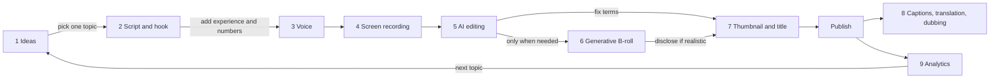

# Making YouTube Videos with AI: Tools and Tutorials

> **Learning goal**: Split long-form, Shorts and faceless production into nine stages from ideas to analytics, pick one of YouTube's built-in AI features or an outside tool for each stage and learn it from an official tutorial, and tell the features you can use in Korea apart from those not yet confirmed there.

This document gathers **how to do the production craft from "Planning and Producing Long-form Video" and "Shorts and Faceless Channels" faster with AI tools**, stage by stage. Policy risks such as synthetic-content disclosure, inauthentic content and tool terms are in "AI-assisted Production and Platform Policy", blog-side tools are in "Writing Blog Posts with AI: Tools and Tutorials", the prompt library, review protocol, automation and pricing are in "An AI Production Method: Prompts, Review and Automation", and the split of the 10 weekly hours is in "One Source, Multi Use (OSMU) Strategy". Feature names and regions are **as of 2026-09**. YouTube rolls out its AI features by country, device and channel, so this page separates "confirmed in Korea" from "not confirmed". Every link is an address that appeared in search results on 2026-09-30; none could be opened directly from this environment. Tool names are **neutral examples**, not recommendations.

## Key Concepts

| Term | Meaning | How this document uses it |
|---|---|---|
| Ask Studio | The conversational AI inside YouTube Studio. It answers with your channel data, comments and upload history | The default for the idea and analytics stages |
| Inspiration tab | The Studio tab that suggested ideas, titles, thumbnails and outlines | Being phased out from 2026-08, replaced by Ask Studio |
| Text-based editing | Editing where deleting or moving words in the transcript cuts the video with them | Cutting screen-recorded lessons |
| Voice cloning | Building an AI voice from samples of your own voice | Only for a test on one Short. Wrong words in long-form are re-recorded. Disclosure rules are in doc 07 |
| Generative video | Models that make short clips from a prompt (Veo, Runway, Kling and others) | Explanatory B-roll only |
| Auto dubbing | YouTube translates a video's speech and creates an audio track in another language | An optional after-publish stage |
| Tutorial | A vendor's official help or course, or a lesson video from a vetted creator | Invest 20-30 minutes when you first use a tool |

## Principles

### 1. The nine-stage flow and where people check

AI takes the **drafts and repetitive work**; the person takes the **experience, screens and judgment**. The edge labels are the points where the person steps in.

### 2. YouTube's built-in AI features: can you use them in Korea

Before outside tools, check what YouTube Studio and the Shorts app already have. These features are free and tied to your channel data. Their regions differ by feature.

| Feature | What it does | Korea (as of 2026-09) | Basis |
|---|---|---|---|
| Ask Studio | Ideas, comment summaries, analytics questions | **Available** (desktop YouTube Studio) | YouTube Korea blog (confirmed via search results) |
| Inspiration tab | Idea cards | Phased out from 2026-08 | YouTube Help (confirmed via search results) |
| Edit with AI (Shorts) | A first cut from your footage with music and transitions. As announced, it also adds an AI voice-over (English or Hindi) | Announced including South Korea (2025-11), starting with some devices and creators | PPC Land, YouTube Community announcement |
| Gemini conversational editing | Places cuts, transitions and captions from spoken or typed instructions | **Reported** to reach 14 countries including Korea and the US in early 2027 | ZDNet Korea, 2026-09-24 |
| Veo 3 Fast (Shorts) | Generates a clip of about 8 seconds in the Shorts camera | **Not confirmed**. Announced for the US, UK, Canada, Australia and New Zealand (2025-09), later some MENA countries | YouTube Blog, Google MENA blog |
| Dream Screen (Veo 2) | Generates Shorts backgrounds and clips | **Not confirmed**. Announced for the US, Canada, Australia and New Zealand | YouTube Blog, 2025-02 |
| Storytelling assistant, dynamic thumbnails | Feedback on scripts and rough cuts; a per-viewer thumbnail choice | Announced 2026-09-23. Korean timing **not confirmed** | YouTube Blog (Made On YouTube 2026) |
| Auto dubbing | Creates audio tracks in other languages | A Korean-language help page exists. Check language pairs in Studio | YouTube Help |
| YouTube Create app | Mobile editing app | South Korea is on the Android availability list | YouTube Help |

"Not confirmed" does not mean the feature is missing. It means **no official source confirmed availability in Korea**. The final check is whether the menu appears in your own Studio and Shorts camera. Do not bypass regional limits with a VPN or similar; it can breach the terms.

### 3. Ideas: Ask Studio first

- **What it does**: You ask things like "How is my latest upload doing?" or "What are viewers saying about my editing style?". It answers from your analytics, comments and upload history.
- **How to use it**: Click the sparkle icon at the top right of desktop YouTube Studio. The official guide advises naming a specific video instead of a vague "give me ideas from comments", and using the analytics labels ("Traffic sources", "New viewers").
- **Limits**: Official Artist Channels, Made for Kids channels and creators under 18 cannot use it (confirmed via search results). Answers are AI summaries, so recheck numbers on the analytics screens.
- **Tutorials**: [Introducing Ask Studio (Korean)](https://blog.youtube/intl/ko-kr/news-and-events/ai-ask-studio/), [Ask Studio: Getting started guide (English)](https://blog.youtube/creator-and-artist-stories/youtube-ask-studio-creator-guide/), [Getting-started video (English)](https://www.youtube.com/watch?v=zpXHtc5m4ZI)

The Inspiration tab (formerly the Research tab) is being phased out from 2026-08. If you want keyword demand separately, add the keyword research method from "Writing Blog Posts with AI: Tools and Tutorials".

### 4. Script and hook: a general LLM plus channel context

- **Tools**: General chat AIs such as Claude, ChatGPT and Gemini. Put your style guide and past scripts into a project feature so you do not re-explain them each time ([Create a Claude project](https://support.claude.com/en/articles/9519177-how-can-i-create-and-manage-projects), [Introduction to projects course](https://academy.claude.com/courses/claude-101/introduction-to-projects)).
- **Order**: (1) one line for the title and thumbnail promise, (2) three hook options for the first 30 seconds, (3) a chapter outline, (4) a draft in sentences written for the ear, (5) J fills the `[experience]` slots with real mistakes and numbers. Structure follows "Planning and Producing Long-form Video".
- **On YouTube's side**: At Made On YouTube on 2026-09-23 YouTube announced a storytelling assistant that analyses scripts and rough cuts and suggests pacing and structure changes. Korean timing was not confirmed.
- The prompts themselves (three hooks, finding Shorts cut points and more) are templates in "An AI Production Method: Prompts, Review and Automation".

### 5. Voice: your own voice comes first

On a faceless channel the voice is the host ("Shorts and Faceless Channels"). In long-form, fix a wrong word by **re-recording that sentence**. AI voice and voice cloning stay a test option on one Short, as set in "Planning and Producing Long-form Video". Disclosure of synthetic voice and each plan's commercial-use terms are in "AI-assisted Production and Platform Policy".

| Tool (example) | Korean | Notes (2026-09, confirmed via search results) | Tutorial |
|---|---|---|---|
| Vrew AI voice | Yes | TTS inside the editor. Read 30 prepared sentences to build "my voice AI" | [AI voice page (Korean)](https://vrew.ai/ko/feature/ai-voice/) |
| ElevenLabs | Yes | TTS, voice cloning and dubbing. Docs list Korean for Eleven v3 | [Kevin Stratvert beginner guide (English)](https://kevinstratvert.com/2026/07/21/elevenlabs-tutorial-for-beginners-complete-step-by-step-guide/) |
| Typecast | Yes | A Korean service. A 2026-04 report cites about 400 AI voice actors with emotional delivery | [How to use (Korean)](https://typecast.ai/kr/learn/how-to-use-typecast/) |
| CLOVA Dubbing | Yes | Naver Cloud's AI voice dubbing. On the free tier, check attribution and commercial terms | [Playlist (Korean)](https://www.youtube.com/playlist?list=PLq8dHmDf5DDXPPp_LB7yf_qiFqEDg6tmq) |
| Supertone Play | Yes | TTS from Supertone, a HYBE company. A new model with 23 languages was announced in 2026-01 | [New model post (Korean)](https://www.supertone.ai/ko/work/ai-tts-model-sona2-multilingual) |

J's rule: record the main video in J's own voice and re-record only the sentence with a wrong function name. Voice cloning is used only for Shorts tests, and any video fixed with voice cloning gets the altered or synthetic content setting under doc 07's conservative rule.

### 6. Screen recording: people record, tools zoom

| Tool (example) | Platform | AI and automatic features | Tutorial |
|---|---|---|---|
| OBS Studio | Windows, macOS, Linux, free | No AI features. Stable settings and separate audio tracks | [Official Quick Start (English)](https://obsproject.com/kb/quick-start-guide), [OBS how-to video (Korean)](https://www.youtube.com/watch?v=XuAYjvxi0mE) |
| Screen Studio | Comparison posts say macOS only | Auto zoom on clicks, smoothed cursor | Not linked: the official site address did not appear in search results |
| Loom | Browser and desktop | Captions, auto titles, summaries and chapters, filler-word removal | [Loom AI features (English)](https://support.atlassian.com/loom/docs/loom-ai-features) |

Auto zoom is especially useful when cutting vertical Shorts. But J decides the zoom areas before recording ("Shorts and Faceless Channels"). On Windows, use keyframed zoom in the editing stage instead.

### 7. AI editing: cut by text, fix terms by hand

| Tool (example) | What AI does | Korean and pricing notes (confirmed via search results) | Tutorial |
|---|---|---|---|
| Vrew | Korean auto captions, cutting by deleting text, silence cleanup | Moved to unified credits on 2026-04-22. The free tier is said to get monthly credits | [Follow-along #1 (Korean)](https://www.youtube.com/watch?v=QtP9PvjMy5E), [Text-based editing guide (Korean)](https://vrew.ai/ko/blog/all/text-based-video-editing/) |
| CapCut | Auto captions, templates, background removal | Reports say auto captions and more moved to paid plans. Check music and template commercial terms | [Caption recognition help (Korean)](https://www.capcut.com/ko-kr/help/how-to-recognise-subtitles) |
| Descript | Edit like a document, the Underlord AI co-editor, audio cleanup | A third-party review lists Korean among transcription languages | [Six steps to start (English)](https://www.descript.com/blog/article/descript-tutorial-for-beginners-6-steps-to-get-started) |
| Premiere Pro | Text-based editing, speech-to-text captions, Generative Extend, media intelligence search | Subscription. Check Korean transcription in your installed version | [Text-Based Editing (English)](https://helpx.adobe.com/premiere/desktop/edit-projects/edit-video-using-text-based-editing/overview-of-text-based-editing.html) |
| DaVinci Resolve | 20: AI IntelliScript (rough cut from a script), AI animated subtitles, AI Audio Assistant. 21 (final 2026-06): more AI tools | Reports say many AI features are in the paid Studio edition | [Official training (English)](https://www.blackmagicdesign.com/products/davinciresolve/training) |
| YouTube Edit with AI | A first cut from Shorts footage. As announced, it also adds an AI voice-over; J turns it off, or discloses synthetic voice if kept | Announced including Korea, rolling out gradually | [Help (English)](https://support.google.com/youtube/answer/16631240?hl=en-GB), [How-to Short (English)](https://www.youtube.com/shorts/1WW76Rz4nqM) |

In screen-recorded lessons, AI editing gets **function names, menu names and numbers** wrong most often. "VLOOKUP" comes out as a phonetic spelling and "filter" as a similar-sounding word. Keep a list of words to batch-replace in auto captions. Stick to **one tool**, as in the tool tiers of "Planning and Producing Long-form Video".

### 8. Generative video: B-roll only, and disclose

On a tutorial channel like J's, generative video has a narrow place, because the real screen is the evidence. It fits explanatory B-roll such as chapter transitions and concept metaphors ("a warehouse where data piles up").

| Service (example) | Status as of 2026-09 (confirmed via search results) | Link |
|---|---|---|
| Veo (Google) | Veo 3.1 in the Gemini app, Flow and the API. Sources say Flow expanded to about 140 countries, but Korea was not confirmed | [Veo model page](https://deepmind.google/models/veo/), [Flow launch (Korean)](https://blog.google/intl/ko-kr/company-news/technology/google-flow-veo-ai-filmmaking-tool-kr/) |
| Veo in Shorts | See the table above. Not confirmed in Korea | [Made on YouTube 2025 tools explained](https://blog.youtube/news-and-events/generative-ai-creation-tools-made-on-youtube-2025/) |
| Sora (OpenAI) | App and web closed 2026-04-26; the API was announced to end on 2026-09-24 | [Discontinuation notice](https://help.openai.com/en/articles/20001152-what-to-know-about-the-sora-discontinuation) |
| Runway | Trial credits and monthly plans. Credits are charged by generation length | [Credits help](https://help.runwayml.com/hc/en-us/articles/15124877443219-How-do-credits-work) |
| Kling (Kuaishou) | Version 3.0 reported in 2026-02 | [Official site](https://kling.ai/) |
| Pika | Web and app service continues | [Official site](https://pika.art/) |

**Three rules**: (1) Never make fake screens that look like real spreadsheets. (2) Disclose realistic scenes of people, places or events as altered or synthetic content ("AI-assisted Production and Platform Policy"). (3) Reusing a generated clip is not a problem in itself. If whole videos are the same template, the same clips and only changed sentences, that is the inauthentic-content risk ("AI-assisted Production and Platform Policy").

### 9. Thumbnails, captions and dubbing, analytics

**Thumbnails**: The faceless default is a result-screen capture plus two to four words ("Planning and Producing Long-form Video"). Use Canva's [YouTube thumbnail templates](https://www.canva.com/create/youtube-thumbnails/) and [AI Thumbnail Maker](https://www.canva.com/ai-thumbnail-maker/) to lay out options quickly; J chooses the words. Compare two or three options on watch time with [Test & Compare](https://support.google.com/youtube/answer/16391400?hl=en). Dynamic thumbnails, announced in 2026-09, were not confirmed for Korea.

**Captions, translation and dubbing**:
- [Automatic captions](https://support.google.com/youtube/answer/6373554?hl=en) support Korean, but uploading a caption file corrected in your editor is more accurate.
- [Auto dubbing (Korean help page)](https://support.google.com/youtube/answer/15569972?hl=ko) is turned on in the channel's advanced settings, with an option to review dubs manually before publishing (confirmed via search results). Reports say it reached all creators in early 2026.
- Upload translated audio you made yourself as a [multi-language audio track](https://support.google.com/youtube/answer/13338784?hl=ko). For target languages and review rules, see the auto-dubbing item in doc 07.

**Analytics**: Ask Studio also suggests questions on the analytics page. Ask something like "How many viewers came from Shorts to long-form in the last four weeks?", then check the numbers against the original report in the analytics tab. Interpreting metrics follows "How YouTube Recommends and Channel Design".

## Applied: Example Creator J's Video Production Stack

J's weekly split follows the baseline table in "One Source, Multi Use (OSMU) Strategy". Attaching one tool to each part of the six video hours (script 0.5, recording and voice 1.5, long-form editing and thumbnail 3.0, Shorts 1.0) gives the table below. Times are illustrative assumptions.

| Stage | J's tool | What AI does | What J does | Time (assumed) |
|---|---|---|---|---|
| Ideas | Ask Studio | Summarises questions in last week's comments | Picks one topic | Included in research time |
| Script and hook | Claude Projects (style guide, two past scripts) | Three hooks, chapter outline, draft | Adds mistakes and numbers, reads aloud | 0.5 |
| Recording and voice | OBS Studio + USB microphone | None | Records with real files, records own voice | 1.5 |
| Long-form editing | Vrew | Auto captions, text cuts, silence cleanup | Fixes function names, edits zoom sections | 2.5 |
| Thumbnail | Canva + Test & Compare | Layout options | Chooses the words, captures the result screen | 0.5 |
| Three Shorts | Vertical re-edit in Vrew (tries Edit with AI on one Short if the menu appears, with the AI voice-over off) | Segment candidates | Picks the result, mistake and question types | 1.0 |
| After publishing | Corrected auto captions uploaded, Ask Studio | Comment summary | Notes the next topic | Included in the Monday review |

- **Test rule (assumed)**: One new tool per month, tried on one Short. After four weeks, compare editing time and the viewed vs swiped away ratio with the old way before keeping it.
- **Not used**: Spreadsheet screens made with generative video, full AI narration. AI voice stays a test option on one Short, as set in "Planning and Producing Long-form Video".
- **Disclosure**: Videos with only J's own screen and voice are not in scope. AI-voice Shorts, videos fixed with voice cloning and videos with realistic generated clips are disclosed.

## Going Deeper

### Announced is not available

At Made On YouTube 2026 on 2026-09-23, YouTube announced conversational editing, a storytelling assistant, dynamic thumbnails, live real-time dubbing and more. YouTube usually ships AI features **in English and the US first, then some countries, then wider**, and timing differs between channels within one country. So this document keeps announced-only features out of J's workflow. Check a new feature in this order: (1) the official blog announcement, (2) the availability list on the help page, (3) your own Studio screen.

### How to choose tutorials

(1) Official help and courses first, (2) Korean material when it exists, (3) material from the last year, (4) avoid channels with titles like "earn money with AI in one day". Tool screens change within months, so pair one video with one official help page. YouTube's official training material is gathered at [YouTube Creators (Korean)](https://www.youtube.com/intl/ko_ALL/creators/) and [AI for Creators](https://www.youtube.com/creators/create/ai-for-creators/).

### Tool costs and shutdown risk

As the Sora app and web closing in 2026-04 shows, AI tools change plans and even disappear quickly. Keep raw recordings, scripts and caption files (.srt) **outside the tool**, so the work survives a tool change. The monthly budget table for LLM and automation tools is in "An AI Production Method: Prompts, Review and Automation". Pricing notes for editing and voice tools stay in this document's tables; check the official pricing page before paying.

## Common Misconceptions

- **"YouTube announced it, so it works in Korea"** — As of 2026-09, Korean availability of Veo in Shorts and Dream Screen was not confirmed. Check announcements and country lists separately.
- **"The Inspiration tab is the idea tool"** — It is being phased out from 2026-08. The conversational Ask Studio replaces it.
- **"AI editing means no caption fixes"** — Function names, menu names and numbers are almost always wrong. A person fixes them.
- **"An AI clone of my own voice needs no disclosure"** — No official source confirmed that exception, so disclose conservatively ("AI-assisted Production and Platform Policy").
- **"More tools make you faster"** — Savings add up only when each stage has one fixed tool. Learning a new tool is production time too.

## Self-Check Questions

1. How do Ask Studio and the Inspiration tab differ, and which should a creator in Korea use as of 2026-09?
2. Name three points in the nine-stage flow where a person must step in, and what they check at each.
3. When cutting a screen-recorded lesson with a text-based editor, which kind of error do you fix first?
4. What three rules must J follow when adding one generative B-roll shot?
5. When a new YouTube AI feature is announced, in what order do you check whether it works in Korea?

## References

Every link was confirmed in search results on 2026-09-30 (not opened directly).

**YouTube: ideas, analytics, editing**
- [Introducing Ask Studio, a new AI partner for Korean creators](https://blog.youtube/intl/ko-kr/news-and-events/ai-ask-studio/) — YouTube Korea blog (Korean); [Learn about Ask Studio in YouTube Studio](https://support.google.com/youtube/answer/16291691?hl=en) — YouTube Help
- [Ask Studio: Getting started guide for creators](https://blog.youtube/creator-and-artist-stories/youtube-ask-studio-creator-guide/) — YouTube Blog; [Ask Studio - Getting Started Guide for Creators](https://www.youtube.com/watch?v=zpXHtc5m4ZI) — YouTube (English)
- [Explore Inspiration tab on YouTube](https://support.google.com/youtube/answer/15575509?hl=en) — YouTube Help (2026-08 phase-out notice)
- [Transform your creative journey with the latest YouTube Studio updates](https://blog.youtube/intl/ko-kr/news-and-events/youtube-studio-made-on-youtube-2025/) — YouTube Korea blog (Korean), 2025-09
- [Made On YouTube 2026: All Announcements & New Features](https://blog.youtube/news-and-events/innovation-youtube-era-made-on-viewers-creators/) — YouTube Blog, 2026-09
- ["We will not replace creators": YouTube greatly expands AI features](https://zdnet.co.kr/view/?no=20260924092215) — ZDNet Korea (Korean), 2026-09-24 (report of conversational editing coming to 14 countries)
- [Create content using Edit with AI](https://support.google.com/youtube/answer/16631240?hl=en-GB) — YouTube Help; [YouTube launches Edit with AI for automated Shorts creation](https://ppc.land/youtube-launches-edit-with-ai-for-automated-shorts-creation/) — PPC Land, 2025-11; [HOW TO: Edit with AI in YouTube Shorts](https://www.youtube.com/shorts/1WW76Rz4nqM) — YouTube (English)
- [YouTube Create available locations](https://support.google.com/youtube/answer/13952912?hl=en) — YouTube Help; [YouTube Shares More Info on Its 'Ask Studio' AI Bot](https://www.socialmediatoday.com/news/youtube-ask-studio-ai-chatbot-explainer-analytics/803682/) — Social Media Today

**YouTube: generative video, thumbnails, captions, dubbing**
- [Unpacking the magic of our new creative tools](https://blog.youtube/news-and-events/generative-ai-creation-tools-made-on-youtube-2025/) — YouTube Blog, 2025-09 (Veo 3 Fast countries)
- [Unlocking new creative possibilities with Veo 3 on YouTube Shorts in MENA](https://blog.google/intl/en-mena/product-updates/connect-communicate/unlocking-new-creative-possibilities-on-youtube-shorts-with-veo-3-in-mena/) — Google MENA blog, 2025-11
- [Imagine it, create it: Veo 2 is coming to YouTube Shorts](https://blog.youtube/news-and-events/veo-2-shorts/) — YouTube Blog, 2025-02
- [Create content for Shorts using AI-generated features](https://support.google.com/youtube/answer/15260303?hl=ko) — YouTube Help (Korean)
- [A/B test titles & thumbnails](https://support.google.com/youtube/answer/16391400?hl=en) — YouTube Help; [Use automatic captioning](https://support.google.com/youtube/answer/6373554?hl=en) — YouTube Help
- [Use automatic dubbing](https://support.google.com/youtube/answer/15569972?hl=ko), [Add multi-language features to your videos](https://support.google.com/youtube/answer/13338784?hl=ko) — YouTube Help (Korean); [YouTube Expands Auto-Dubbing to All Creators](https://www.socialmediatoday.com/news/youtube-expands-auto-dubbing-to-all-creators/811375/) — Social Media Today
- [YouTube Creators](https://www.youtube.com/intl/ko_ALL/creators/), [AI for Creators](https://www.youtube.com/creators/create/ai-for-creators/) — YouTube's official training sites

**Voice**
- [Make my voice AI](https://vrew.ai/ko/feature/ai-voice/) — Vrew (Korean); [Korean Text to Speech](https://elevenlabs.io/text-to-speech/korean), [Text to Speech docs](https://elevenlabs.io/docs/overview/capabilities/text-to-speech) — ElevenLabs; [ElevenLabs Tutorial for Beginners](https://kevinstratvert.com/2026/07/21/elevenlabs-tutorial-for-beginners-complete-step-by-step-guide/) — Kevin Stratvert, 2026-07-21
- [How to use the Typecast AI voice actors](https://typecast.ai/kr/learn/how-to-use-typecast/) — Typecast (Korean); [Typecast, a leader in AI voice-actor content production](https://www.mstoday.co.kr/news/articleView.html?idxno=101040) — MS TODAY (Korean), 2026-04
- [CLOVA Dubbing](https://www.ncloud.com/product/aiService/clovaDubbing) — Naver Cloud; [CLOVA Dubbing playlist](https://www.youtube.com/playlist?list=PLq8dHmDf5DDXPPp_LB7yf_qiFqEDg6tmq) — YouTube (Korean)
- [Supertone Play unveils a new TTS model](https://www.supertone.ai/ko/work/ai-tts-model-sona2-multilingual) — Supertone (Korean); [Supertone Play](https://play.supertone.ai/)

**Recording and editing**
- [Quick Start Guide](https://obsproject.com/kb/quick-start-guide) — OBS; [Screen recording with OBS Studio](https://inflab-1.gitbook.io/inflearn/lecture-video/recording/obs-studio) — Inflearn instructor guide (Korean); [How to use OBS Studio](https://www.youtube.com/watch?v=XuAYjvxi0mE) — YouTube (Korean)
- [Screen Studio for Windows: 7 Best Alternatives](https://www.screensnap.pro/blog/screen-studio-for-windows) — ScreenSnap (comparison post on macOS-only status); [Loom AI features](https://support.atlassian.com/loom/docs/loom-ai-features) — Atlassian Support
- [Vrew follow-along and master #1](https://www.youtube.com/watch?v=QtP9PvjMy5E) — YouTube (Korean), [Vrew tutorials](https://vrew.imweb.me/tutorial), [Vrew_PC Tutorial (ko) playlist](https://www.youtube.com/playlist?list=PLIJ_xikv0zfcSMgpi9w2fb4348keFPxWK)
- [Add YouTube captions with the AI caption tool Vrew](https://vrew.ai/ko/blog/all/ai-subtitle-with-vrew/), [Text-based video editing guide](https://vrew.ai/ko/blog/all/text-based-video-editing/) — Vrew blog (Korean); [Switching to unified credits on 2026-04-22](https://vrew.imweb.me/notice/?bmode=view&idx=170656156) — Vrew notice (Korean)
- [How are captions recognised?](https://www.capcut.com/ko-kr/help/how-to-recognise-subtitles) — CapCut Help (Korean); [CapCut captions aren't free anymore](https://www.descript.com/blog/article/capcut-captions-arent-free-anymore-heres-a-better-option) — Descript blog (a competitor's post)
- [Descript Tutorial for Beginners: 6 Steps to Start](https://www.descript.com/blog/article/descript-tutorial-for-beginners-6-steps-to-get-started), [How to Get Started with Underlord: An AI Video Editor Primer](https://www.descript.com/blog/article/underlord-ai-video-editor-primer) — Descript blog
- [Text-Based Editing overview in Premiere](https://helpx.adobe.com/premiere/desktop/edit-projects/edit-video-using-text-based-editing/overview-of-text-based-editing.html), [What's new in Adobe Premiere](https://helpx.adobe.com/premiere/desktop/whats-new/whats-new.html) — Adobe Help
- [DaVinci Resolve Training](https://www.blackmagicdesign.com/products/davinciresolve/training) — Blackmagic Design; [DaVinci Resolve 20 Released with a Handful of AI-assisted Features](https://www.cined.com/davinci-resolve-20-released-with-handful-of-ai-assisted-features/) — CineD; [DaVinci Resolve 21 Officially Released](https://petapixel.com/2026/06/03/davinci-resolve-21-officially-released-with-new-photo-editing-ai-tools-and-much-more/) — PetaPixel, 2026-06-03

**Generative video, thumbnails, scripts**
- [Veo](https://deepmind.google/models/veo/) — Google DeepMind; [[I/O 2025] Introducing Flow, an AI filmmaking tool built on Veo 3](https://blog.google/intl/ko-kr/company-news/technology/google-flow-veo-ai-filmmaking-tool-kr/) — Google Korea blog (Korean); [You can now make your images talk with Veo 3 in Flow, plus we're expanding to more countries](https://blog.google/innovation-and-ai/models-and-research/google-labs/flow-adds-speech-expands/) — Google Blog
- [What to know about the Sora discontinuation](https://help.openai.com/en/articles/20001152-what-to-know-about-the-sora-discontinuation) — OpenAI Help; [OpenAI's Sora was the creepiest app on your phone -- now it's shutting down](https://techcrunch.com/2026/03/24/openais-sora-was-the-creepiest-app-on-your-phone-now-its-shutting-down/) — TechCrunch, 2026-03-24
- [How do credits work?](https://help.runwayml.com/hc/en-us/articles/15124877443219-How-do-credits-work), [Pricing](https://runway.com/pricing) — Runway; [Kling AI](https://kling.ai/); [Pika](https://pika.art/)
- [Make YouTube thumbnails](https://www.canva.com/create/youtube-thumbnails/), [AI Thumbnail Maker](https://www.canva.com/ai-thumbnail-maker/) — Canva
- [How can I create and manage projects?](https://support.claude.com/en/articles/9519177-how-can-i-create-and-manage-projects) — Claude Help; [Introduction to projects](https://academy.claude.com/courses/claude-101/introduction-to-projects) — Claude Academy
