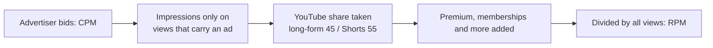
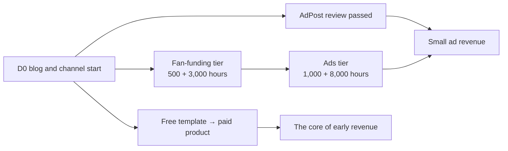

# Ad Revenue: AdPost and the YouTube Partner Program

> **Learning goal**: Explain the eligibility, revenue mechanics and payout rules of Naver AdPost and the YouTube Partner Program (YPP), estimate when a channel reaches the thresholds under explicit assumptions and the YPP rules that change on 2027-02-01, and say why ads alone fall short at a small scale.

This document covers **ad revenue only**, for the blog and for YouTube. The general principles of RPM and CPM, the AdSense revenue share and invalid traffic are already in "Advertising Revenue in Depth" and are not repeated. Selling courses, e-books and templates is in "Own Products: Courses, E-books and Templates", withholding tax and income tax are in "Disclosure, Copyright and Tax", and the part Shorts play in growth is in "Shorts and Faceless Channels". Everything is **as of 2026-09**. Naver help pages and YouTube Help could not be opened directly, so most facts are "confirmed via search results", and where no official figure exists this document says so. The exchange rate is the site-wide assumption of **USD 1 = KRW 1,400**.

## Key Concepts

| Term | Meaning | Key point |
|---|---|---|
| Naver AdPost | Naver's programme that places ads on Naver media such as Naver Blog and shares the revenue | After the media review, ads appear automatically |
| YPP fan-funding tier | The lower YPP tier, open from 500 subscribers | Memberships, Super Chat, Super Thanks, Shopping. No ad revenue share |
| YPP ads tier | The full monetization tier, open from 1,000 subscribers | Watch-page ads, Shorts ads, YouTube Premium revenue share |
| CPM | What advertisers pay per 1,000 ad impressions | Before YouTube's share, counted per ad impression |
| RPM | What the creator earns per 1,000 views | After YouTube's share, across all views including those with no ad |
| Qualified watch hours | Public long-form watch time used for YPP eligibility | Time watched in the Shorts feed does not count |

## Principles

### Naver AdPost

| Item | What was confirmed | Level |
|---|---|---|
| Eligibility | No official numeric threshold is published. Naver reviews operating period, number of public posts, activity such as visitors and pageviews, and suitability as an ad medium together | Confirmed via search results |
| Common myth | "90 days since opening, 50 posts, 100 visitors a day" is not an official rule | Confirmed via search results |
| Review | After registering the medium at adpost.naver.com, blog review takes up to 5 business days, and ads appear automatically once approved | Confirmed via search results |
| How revenue arises | From impressions and clicks on ads placed in posts. The share of advertiser spend paid out is not published | Confirmed via search results |
| Payout condition | Paid the next month if the balance at the end of the previous month is at or above the minimum payout you set (default KRW 50,000; it cannot be set lower) | Confirmed via search results |
| Payout date | Around the 25th of each month for individual members; earlier around holidays | Confirmed via search results |
| Other way to receive | Individual members are reported to be able to convert small amounts to Naver Pay money | Confirmed via search results; the minimum was not confirmed |
| Sanctions | Confirmed invalid clicks or traffic can lead to deductions, withheld payouts and clawback of paid amounts | Confirmed via search results |

Tax is withheld at payout. The income category and rate are in "Disclosure, Copyright and Tax".

Naver has creator income beyond AdPost. Naver Brand Connect, which matches advertisers with creators, is sponsorship and is covered with its disclosure rules in "Disclosure, Copyright and Tax". "Naver Mate" is a programme reported to pick creators each month, partly by how often AI Briefing cites them, and pay them an activity grant (beta from 2026-06, confirmed via search results). Neither is ad revenue, so they are only named here. An August 2026 report says AdPost payouts grew about 14% compared with February 2025.

### The YouTube Partner Program: two tiers and the 2027 change

In August 2026 YouTube announced changes to YPP. For **channels applying from 2027-02-01**, the ads-tier thresholds double. Channels already in YPP keep their status, but from the same date an activity requirement and a Shorts revenue threshold apply, and they must accept the revised terms by 2027-01-31.

| Item | Fan-funding tier | Ads tier (applying by 2027-01-31) | Ads tier (applying from 2027-02-01) |
|---|---|---|---|
| Subscribers | 500 | 1,000 | 1,000 |
| Uploads | 3 public uploads in the last 90 days | — | — |
| Viewing condition (either) | 3,000 qualified watch hours in the last 12 months or 3M qualified Shorts views in the last 90 days | 4,000 hours in 12 months or 10M Shorts views in 90 days | 8,000 hours in 365 days or 20M Shorts views in 90 days |
| Unlocks | Channel memberships, Super Chat and Super Stickers, Super Thanks, Shopping | All of those plus watch-page ads, Shorts feed ads, Premium revenue share | Same |
| In Korea | Launched first in 2023 in five countries including Korea | Applies | Applies |

- **The fan-funding tier does not change.** It carries no ad revenue share; a channel moves up once it meets the ads-tier thresholds.
- **Shorts revenue threshold (from 2027-02-01)**: even a YPP channel needs 10M qualified Shorts views in the last 90 days to receive the Shorts ad and subscription revenue share. Below that it keeps earning on long-form, and the Shorts share resumes once it crosses the threshold again.
- **Activity requirement (from 2027-02-01, existing partners)**: reports say a channel counts as "active" if it has 1,000 qualified watch hours in the last year, 1M qualified Shorts views in the last 90 days, or uploads two long-form videos or five Shorts every 90 days.

### Revenue shares

| Source | Creator share | Note |
|---|---|---|
| Long-form watch-page ads | 55% of net ad revenue | Calculated per video |
| Shorts feed ads | 45% of the creator-pool allocation | Feed ad revenue is pooled, the music-licensing portion is taken out, and the rest is split by each creator's share of engaged views per country |
| YouTube Premium | Distributed by how much Premium members watch | The August 2026 announcement is reported to set the creator pool at 30% of net Premium subscription revenue and 60% for Premium Lite, split 55% long-form and 45% Shorts |

For a Short using one music track, half of its portion of the pool goes to music licensing, but **your rate (45%) and your engaged-view allocation do not depend on music use**.

### What moves RPM on YouTube

RPM puts views with no ad in the denominator, so it is **always lower than CPM**.

| Factor | How it works | What it means for J |
|---|---|---|
| Topic | Advertisers bid more for audiences they want to reach | Work tools and automation overlap with business-software advertisers (size of the effect not confirmed) |
| Viewer country | Ad markets differ in size by country | A Korean-language channel is watched mostly in Korea. Auto-dubbing may bring viewers from elsewhere ("AI-assisted Production and Platform Policy") |
| Video length | Long-form videos of 8 minutes or more can carry mid-roll ads | 8 to 12 minute lectures qualify. Place mid-rolls where they do not break the flow |
| Format | Shorts are paid from a pooled feed allocation, so revenue per view is very low | Shorts are a traffic source rather than a revenue source |
| Views with no revenue | Ad blockers and views with no ad only grow the denominator | Each channel has to measure its own RPM |

No official RPM range exists. The calculation below uses **third-party estimates** as assumptions: Korean long-form RPM of KRW 1,000 to 5,000 (estimates on a Korean revenue-calculator blog) and Shorts RPM of USD 0.01 to 0.08 (estimates by overseas tool vendors, about KRW 14 to 112). Replace them with the real values from YouTube Studio after monetization.

## Applied: When Example Creator J Reaches the Thresholds (Illustrative Calculation)

**This is an illustrative calculation from assumptions, not a forecast.** D0 is 2026-10-05, and month 1 is the month starting at D0.

| Assumption | Value | Basis |
|---|---|---|
| Long-form | One a week, 10 minutes | The site-wide example |
| Average view duration | 4 minutes (40% retention) | Calculation assumption |
| Monthly long-form views | k × n in month n (growing by k each month) | Calculation assumption. k = 500 / 1,000 / 2,000 |
| Subscriber conversion | 1 per 100 long-form views; Shorts contribution ignored | Calculation assumption (conservative) |
| Qualified watch hours | Long-form views × 4 minutes ÷ 60, summed over the last 12 months | Shorts feed watch time does not count |

In every scenario J applies after 2027-02-01, so **the new thresholds (1,000 subscribers + 8,000 hours)** apply. Reaching the old 4,000 hours before 2027-01-31 would take 60,000 cumulative views in the first four months, that is k ≈ 6,000.

| Scenario | Fan-funding tier (500 subscribers + 3,000 hours) | Ads tier (1,000 subscribers + 8,000 hours) | Monthly long-form ad revenue just after joining (assumed RPM KRW 1,000-5,000) |
|---|---|---|---|
| Slow k = 500 | Month 14 (early 2027-12); subscribers are the binding limit | Month 26 (early 2028-12), about 1,755 cumulative subscribers | 13,500 views a month × RPM → about KRW 13,500-67,500 |
| Medium k = 1,000 | Month 10 (early 2027-08); subscribers are the binding limit | Month 16 (early 2028-02), about 1,360 cumulative subscribers | 17,000 views a month × RPM → about KRW 17,000-85,000 |
| Fast k = 2,000 | Month 7 (early 2027-05) | Month 11 (early 2027-09), about 1,320 cumulative subscribers | 24,000 views a month × RPM → about KRW 24,000-120,000 |

- Worked example (medium): views over the 12 months to month 16 (months 5-16) = 1,000 × (5 + … + 16) = 126,000 → 126,000 × 4 ÷ 60 = 8,400 hours. Month 15 gives 7,600 hours, short of the bar.
- The review after applying takes extra time. At D90 (2027-01-03) no scenario has reached even the fan-funding tier.
- Shorts: from 2027-02-01 there is no Shorts revenue share below 10M qualified Shorts views in 90 days. This model does not assume three Shorts a week will get there.

**Blog (AdPost)**: neither an official RPM nor a reliable published range was found, so only the formula is given: cumulative pageviews needed to reach the KRW 50,000 minimum payout = 50,000 ÷ (earnings per 1,000 pageviews) × 1,000. **Assuming** KRW 1,000 per 1,000 pageviews for ease of calculation, 50,000 pageviews are needed. The balance carries over, so it does not have to be reached in one month. Replace the value with real earnings 4 to 8 weeks after approval.

## Going Deeper

### Why ads alone fall short at a small scale

In the "medium" scenario above, monthly long-form ad revenue just after joining the ads tier is about KRW 17,000 to 85,000 by assumption. The time invested is 10 hours a week, about 43 hours a month. Ads pay **a few thousand won per 1,000 views**, so they stay small without scale, and they are zero before the threshold. By contrast, when a few of the same viewers buy a template pack or a course, each one pays thousands to tens of thousands of won. So J's path is to **build a list with a free template and move on to paid products** while waiting for ads. The design is in "Own Products: Courses, E-books and Templates", and pricing and payments are in "Paid Sales, Subscriptions and Pricing".

### The order for growing ad revenue

1. **Pass the threshold**: long-form watch time decides it. Shorts help with subscribers and long-form traffic.
2. **Measure RPM**: 4 to 8 weeks after monetization, redo the table above with the real RPM.
3. **Place mid-rolls**: in videos of 8 minutes or more, at the points where an explanation ends.
4. **Protect the account**: clicking your own ads, asking for clicks and buying traffic are grounds for clawback and suspension on both AdPost and YouTube ("Advertising Revenue in Depth").

## Common Misconceptions

- **"AdPost approves you at 90 days and 50 posts"**: there is no official numeric rule. Activity and suitability are reviewed together.
- **"1,000 subscribers and 4,000 hours is enough"**: channels applying from 2027-02-01 need 8,000 hours or 20M Shorts views.
- **"500 subscribers bring ad revenue"**: the fan-funding tier has no ad revenue share.
- **"Lots of Shorts views fill the watch hours too"**: Shorts feed watch time does not count toward qualified watch hours.
- **"A CPM of KRW 5,000 means KRW 5,000 per 1,000 views"**: RPM is lower because of YouTube's share and views with no ad.

## Self-Check Questions

1. What is AdPost's minimum payout, and what happens in a month when the balance is below it?
2. For a channel applying to YPP for the first time in 2027-03, what are the ads-tier thresholds, and how do they differ from the fan-funding tier?
3. How is the creator share calculated for long-form ads and for Shorts ads?
4. If monthly long-form views grow by 1,000 each month and the average view duration is 5 minutes, in which month are 8,000 hours first reached?
5. Using numbers, explain why J should grow own products first even after joining the ads tier.

## References

- [Naver AdPost eligibility and earnings](https://postdot.kr/blog/naver-adpost-guide) — PostDot (Korean), confirmed via search results (2026-09-30)
- [Naver AdPost payout and settlement guide](https://online-financer.com/%EB%84%A4%EC%9D%B4%EB%B2%84-%EC%95%A0%EB%93%9C%ED%8F%AC%EC%8A%A4%ED%8A%B8-%EC%88%98%EC%9D%B5-%EC%A7%80%EA%B8%89/) — (Korean), confirmed via search results (2026-09-30)
- ["Does blogging pay?" Naver says creator income and support doubled](https://m.news.nate.com/view/20260807n25996) — Nate News (Korean), 2026-08-07, confirmed via search results (2026-09-30)
- [New opportunities to earn and changes to the YouTube Partner Program](https://blog.youtube/news-and-events/youtube-partner-program-updates-2027-new-opportunities-earn/) — YouTube Blog, 2026-08, confirmed via search results (2026-09-30)
- [Changes to the YouTube Partner Program](https://support.google.com/youtube/answer/12843009?hl=en) — YouTube Help, confirmed via search results (2026-09-30)
- [YouTube teases Premium Lite expansion, doubles channel monetization requirements](https://9to5google.com/2026/08/10/youtube-premium-lite-expansion-monetization-changes/) — 9to5Google, 2026-08-10, confirmed via search results (2026-09-30)
- [Expanded YouTube Partner Program overview](https://support.google.com/youtube/answer/13429240?hl=ko) — YouTube Help (Korean), confirmed via search results (2026-09-30)
- [YouTube Partner Program overview & eligibility](https://support.google.com/youtube/answer/72851?hl=en) — YouTube Help, confirmed via search results (2026-09-30)
- [YouTube Shorts monetization policies](https://support.google.com/youtube/answer/12504220?hl=en) — YouTube Help, confirmed via search results (2026-09-30)
- [Understand ad revenue analytics](https://support.google.com/youtube/answer/9314357) — YouTube Help, confirmed via search results (2026-09-30)
- [Manage mid-roll ad breaks in long videos](https://support.google.com/youtube/answer/6175006?hl=en) — YouTube Help, confirmed via search results (2026-09-30)
- [YouTube revenue calculation 2026: RPM and CPM](https://snsboost.kr/blog/44) — SNS Booster (Korean), third-party estimate, confirmed via search results (2026-09-30)
- [YouTube Shorts RPM in 2026: Typical Ranges by Niche](https://miraflow.ai/blog/youtube-shorts-rpm-2026-real-ranges-by-niche) — Miraflow, third-party estimate, confirmed via search results (2026-09-30)
