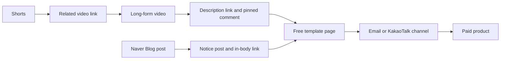

# Own Products: Courses, E-books and Templates

> **Learning goal**: Design a product ladder that runs from a free lead magnet to cohorts and consulting, read demand signals in comments, searches and questions, validate with a pre-sale before building, and choose where to sell your first product by comparing the fees and control of Korean sales channels.

Ads pay only once views pile up, and they pay nothing until you pass the thresholds (Naver AdPost approval, the YouTube Partner Program). The ad side is covered in "Ad Revenue: AdPost and the YouTube Partner Program"; this document covers only **products you make and sell yourself**. Pricing theory (value-based pricing, Van Westendorp, bundles) and payment infrastructure (PG, MoR) live in "Paid Sales, Subscriptions and Pricing" and are not repeated here. The rules for turning content into product modules are in "One Source, Multi Use (OSMU) Strategy", the launch timing is in "A 90-day Channel Plan", and the disclosure duties and taxes that come with selling are in "Disclosure, Copyright and Tax". Fees and policies are as of 2026-09 and change often. Every money example is an illustrative assumption.

## Key Concepts

| Rung | Form (example) | Price band (illustrative assumption) | Build time | What the customer buys |
|---|---|---|---|---|
| 0. Lead magnet | Free template, checklist | KRW 0 (in exchange for an email or KakaoTalk channel subscription) | 2-6 hours | A small result they can use right away |
| 1. Low-price product | Paid template pack | KRW 10,000-30,000 | 10-20 hours | Time saved |
| 2. E-book | PDF guide | KRW 20,000-50,000 | 30-60 hours | A structured method |
| 3. VOD course | Recorded course plus practice files | KRW 50,000-200,000 | 60-120 hours | A path they can follow step by step |
| 4. Cohort or consulting | Small live class, one-on-one review | Several hundred thousand KRW or more | Time spent on every sale | An answer fitted to their problem |

- **Product ladder**: some customers who gain trust on a lower rung climb to the next. Higher rungs cost more, take longer to build and have fewer buyers.
- **Lead magnet**: a free resource exchanged for contact details. Its purpose is not revenue but **a list you can contact again**.
- **Demand signal**: a trace that says "people might pay for this problem": comments repeating the same question, search terms that bring visitors, saves and downloads.
- **Pre-sale**: taking payment before the product is finished. A **waitlist** only collects interest without payment and is the weaker test.

## Principles

### 1. Ads and products earn very different amounts per person

> Product revenue = visitors × conversion rate × price − fees

Ad revenue is counted per 1,000 views (RPM); for RPM assumptions use the ranges in "Ad Revenue: AdPost and the YouTube Partner Program" and "Advertising Revenue in Depth". Products earn a large share from a few buyers. Example (assumption): if 0.5% of 3,000 monthly visitors buy a KRW 14,900 template, that is 15 sales, about KRW 220,000. To earn that from the same visitors through ads, the RPM would have to be about KRW 75,000, far outside the site's shared assumption range. The 0.5% conversion rate is also an assumption; replace it with your own number after the first sales.

### 2. How content creates demand

| Signal | Where to see it | Product hint | Caution |
|---|---|---|---|
| Questions in comments | YouTube comments, blog comments | "Please share the file" → template | One person's request is not a signal. Count the same question from different people |
| Search traffic | Search terms in Naver Blog statistics, search terms in YouTube Analytics | Recurring search terms → e-book outline | Search volume is not purchase intent |
| Saves and downloads | Free template downloads, playlist saves | A much-downloaded resource → paid extended edition | Many people download things because they are free |
| DMs and email | Email replies, KakaoTalk channel chats | "How would I apply this at my company?" → consulting | The more specific the request, the stronger the signal |

The rules for splitting one piece of content into a blog post, a video, Shorts and a product module are in "One Source, Multi Use (OSMU) Strategy". Products come fastest when they are not built from scratch but **bundle and deepen content whose response you have already seen**.

### 3. Validate before you build

1. **Waitlist**: post one paragraph about the product and a draft outline, and open a "notify me at launch" form. Sign-ups are the upper bound of interest.
2. **Pre-sale**: open a payment link at an early-bird price. If it misses the bar (for example 10 sales in a pre-sale window of about 12 days, an assumption), refund everyone in full and change the topic or format.
3. **Minimum delivery**: deliver to pre-sale buyers first, then strengthen the full edition with the questions they send.

The fuller "evidence ladder" of validation steps is in "Choosing Opportunities and Validating Demand". The rate at which waitlist sign-ups turn into payments varies widely by product, so no published benchmark is used here. Use your own list's actual rate as the first baseline. A pre-sale is still subject to the E-Commerce Act's disclosure and refund duties (section 7 below).

### 4. Price by value and alternatives

Pricing theory follows "Paid Sales, Subscriptions and Pricing". Only the points specific to creator products are listed here.

- The comparison is **free YouTube videos and the effort of doing it yourself**. Put the reason to pay for "something you can learn for free" (time saved, an organized order, files ready to use) in the first line of the product description.
- Keep a 2-5x price gap between rungs (assumption), and give buyers of a lower product a discount coupon for the next one.

### 5. Where to sell in Korea

| Channel | Fees (published or reported, checked 2026-09) | Control | Fits |
|---|---|---|---|
| Kmong | Tiered service fee by sale amount: 16.4% (up to KRW 700,000), 9.4%, 4.4%, plus a 3.3% payment network fee, plus 10% VAT on both fees. May differ by category | Low: product review, limited access to buyer contacts | E-books, templates, consulting |
| Class101 | Subscription (CLASS101+) classes are paid out by share of watch time, with a settlement rate that differs by contract plan. Individually sold classes are confirmed for settlement 90 days after the buyer starts (creator guide, confirmed via search results) | Low: production and scheduling negotiated, delayed settlement | VOD courses |
| Taling | About 20% brokerage commission on e-books and VOD (reports and comparison articles), with 3.3% income tax withheld at settlement. Deductions differ by format | Medium: review, a reported minimum length for e-books | E-books, VOD, one-day classes |
| Naver Smart Store | Naver Pay order-management fee of about 1.98-3.63% by revenue tier (appears to include VAT, not verified), plus a 2.73% sales fee (0.91% for traffic from marketing links, reported as excluding VAT; reorganized 2025-06-02) | High: buyer data, coupons, reviews | Template packs, e-books (check the seller center for how digital goods can be listed) |
| Own site plus a domestic PG | 3.4% on ordinary cards, with sign-up and annual fees on top (comparison data in "Paid Sales, Subscriptions and Pricing") | Highest: list, prices and updates are all yours | Courses, bundles, subscriptions |
| Overseas MoR (Paddle, Gumroad) | Paddle 5% + 50 cents; Gumroad 10% + 50 cents (plus card processing, and 30% on marketplace sales) | High, with overseas tax handled for you | English-language templates and e-books |

- Marketplaces (Kmong, Class101, Taling) **sell you traffic for a fee**. Your own site charges less but you must bring the traffic. While the channel is small, marketplace exposure helps; as your list grows, shift toward selling directly.
- The figures come from official notices, press reports and seller comparison articles, and they vary by contract, category and date. Recheck the current rate in each seller center right before listing.
- As an individual's sales grow, mail-order registration and business registration become an issue. See "Registration · Mail-Order Sales" and "Disclosure, Copyright and Tax".

### 6. From Naver Blog and YouTube to the product



- **YouTube description and pinned comment**: description links are clickable only when the channel has advanced features turned on. In the pinned comment, give one action, such as "The free template is in the first line of the description".
- **Shorts**: since 2023-08-31, links in Shorts descriptions and comments are not clickable. Instead, link the Short to its source long-form video as a **related video**, and send viewers to the product from the long-form video (recheck the current state in YouTube Help).
- **Naver Blog**: post the free-template guide as a notice so it sits at the top of the blog (the role of a featured post), and put the same link at the end of related tutorials.
- **Email and KakaoTalk channel**: when collecting contacts, ask separately for consent to receive advertising, and mark sales messages "(ad)". The rules are in "Law · Ethics · Ad Disclosure". KakaoTalk channel messages are charged per send, so check the rates in the Kakao Business guide.

### 7. Refunds and customer support

- A consumer who buys through mail-order sales can in principle withdraw within 7 days (E-Commerce Act, Article 17(1)).
- For digital content, withdrawal can be restricted **once delivery has begun**, but the seller must show that withdrawal is not possible in a place the buyer can easily see and take steps such as offering a trial (a preview or sample chapter) (Article 17(2)5 and 17(6)). Without those steps the restriction is hard to claim.
- On the sales page, state **the refund terms, the file format, the software version required, and the support channel with its response time**. For an Excel template, state compatibility, e.g. "Tested in Microsoft 365 Excel; some functions not supported in older versions".
- Route questions to one channel (email or the KakaoTalk channel), and turn repeated questions into an FAQ and the next content topic.

## Applied: Example creator J's product ladder

This is the ladder for J (work automation with spreadsheets and AI tools, 10 hours a week). Dates follow D0 (2026-10-05) in "A 90-day Channel Plan", and every number is an illustrative assumption.

| Rung | Product | When | Price (assumption) | Channel | Validation bar (assumption) |
|---|---|---|---|---|---|
| 0 | Free "weekly work report automation sheet" | D14 (2026-10-19) | KRW 0 | Blog notice post plus form | 150 contacts by D60 |
| 1 | Paid template pack (8 sheets plus how-to videos) | Waitlist D35, pre-sale D49-D60, delivery D63 | List KRW 14,900, early bird KRW 9,900 | Smart Store or Kmong | 10 pre-sales in the window (D49-D60, about 12 days) |
| 2 | E-book "Cut repetitive work with Excel and AI" | Waitlist after D90 | KRW 29,000 | Taling or own site | Survey of template buyers |
| 3 | VOD course | Outside the 90-day plan (review only) | TBD | Class101 offer or own site | E-book sales trend |

**Net per sale by channel (list price KRW 14,900, excluding VAT and income tax, fees only, assumed calculation)**

```text
Kmong (first tier 16.4% + payment network 3.3%, 10% VAT on fees):
  14,900 × (0.164 + 0.033) × 1.1 = KRW 3,229 → net about KRW 11,671
Smart Store (both fees made VAT-inclusive: order management 1.98% small-business tier assumed to include VAT, sales fee 0.91% × 1.1 = 1.001%):
  14,900 × (0.0198 + 0.01001) = KRW 444 → net about KRW 14,456
Own site + PG (3.4%):
  14,900 × 0.034 = KRW 507 → net about KRW 14,393, before PG sign-up and annual fees
```

Ten pre-sales at the early-bird price of KRW 9,900 come to about KRW 96,000 on Smart Store (10 × 9,900 × (1 − 0.02981)). J's conclusion: for the first product the bottleneck is not the fee but **the time to set up the channel**. J puts Smart Store first, because J keeps the buyer list, and if the pre-sale misses the bar, tests once more with Kmong's marketplace exposure. An own site with PG sign-up fees waits until annual volume is known.

Bad example:

> In the channel's first week J started filming a 20-lesson VOD course. Three months later J announced it to 80 subscribers and sold 2.

Good example:

> After 12 different people asked "please share the sheet" in the comments, J collected contacts with a free sheet and pre-sold a paid pack. Production started only after sales passed 10.

## Going Deeper

### The top of the ladder: cohorts and consulting

Cohort classes and one-on-one consulting take little build time but **take time on every sale**. For J, at 10 hours a week, one or two a month is the limit (assumption). In return they put you closest to specific customer problems, and the questions that come up there become the outline of the e-book and the course. The higher the price, the more a promise of results ("KRW 1 million a month guaranteed") can become a problem under the Fair Labeling and Advertising Act ("Law · Ethics · Ad Disclosure").

### Template licenses and update policy

- State the **scope of use** on the sales page: personal and in-house use allowed, resale and redistribution prohibited, a team license when several people at a company use it.
- Check that the fonts, icons and images inside the template allow redistribution ("Disclosure, Copyright and Tax", "Contracts · IP · Open Source").
- Promise only the updates you can keep (e.g. "free updates for 1 year"). Every promise is a support load.

### Platform fees and owning the list

Marketplace sales often do not let the seller freely use buyer contacts. To move customers up the ladder you need **your own list**, built with free resources. Even on a marketplace, put a subscription link for your free resources inside the product (the last page of the PDF, the guide sheet of the template). Before listing, check whether each marketplace's terms forbid steering buyers to outside payment.

## Common Misconceptions

- **"You need 10,000 subscribers before you can launch a product."** Even a small channel can pre-sell once a few people with the same problem gather. The bar is repeated questions, not subscriber count.
- **"The lowest fee is always best."** Ten sales after a 20% marketplace fee beat zero sales on your own site with no traffic. Weigh fees, traffic and list ownership together.
- **"Digital products can't be refunded."** You can restrict withdrawal only with a clear notice and trial measures.
- **"You need a big course first to earn trust."** A big product built before validation has a big failure cost. The ladder is climbed from the bottom up.
- **"A free template is a loss."** The purpose of a free resource is the list and trust, not revenue.

## Self-Check Questions

1. With 2,000 monthly visitors, 0.8% conversion (assumption) and a KRW 19,000 price, what is monthly revenue? What RPM would ads need to earn the same?
2. "Please send the file" has appeared three times in the comments. What else would you check before treating it as a product signal?
3. You set the pre-sale bar at "10 in 12 days" and got 6. Name two next actions.
4. Explain whether to sell your first template pack on Kmong or Smart Store, using fees, traffic and list ownership.
5. To state a withdrawal restriction on a PDF e-book's sales page, what measure must you take alongside it?

## References

- [Sales fee policy](https://kmong.com/support/expert-center/posts/751) — Kmong, confirmed via search results (2026-09-30)
- [Taling brokerage commission](https://talingtutorguide.oopy.io/commission) — Taling tutor guidebook, confirmed via search results (2026-09-30)
- [2026 comparison of e-book sales sites](https://start.litt.ly/blog/ebook-side-hustle-strategy) — Litt.ly blog, confirmed via search results (2026-09-30)
- [Class101 payout terms and guide](https://docs.channel.io/creator/ko/articles/d6a90b1b-%ED%81%B4%EB%9E%98%EC%8A%A4101-%EC%A0%95%EC%82%B0-%EA%B0%80%EC%9D%B4%EB%93%9C%EA%B0%80-%EC%9E%88%EB%82%98%EC%9A%94) — Class101 creator center, confirmed via search results (2026-09-30)
- [Why Naver Plus Store is changing its fee structure](https://byline.network/2025/03/04_naver/) — Byline Network, 2025-03, confirmed via search results (2026-09-30)
- [Naver Smart Store fees after the June 2025 reorganization](https://www.sellerking.io/blog/%EB%84%A4%EC%9D%B4%EB%B2%84-%EC%8A%A4%EB%A7%88%ED%8A%B8%EC%8A%A4%ED%86%A0%EC%96%B4-%EC%88%98%EC%88%98%EB%A3%8C-%EA%B3%84%EC%82%B0%ED%95%98%EB%8A%94-%EB%B0%A9%EB%B2%95-2025%EB%85%84-6%EC%9B%94-%EA%B0%9C%ED%8E%B8-58772) — Sellerking blog, confirmed via search results (2026-09-30)
- [Gumroad pricing](https://gumroad.com/pricing) — Gumroad, confirmed via search results (2026-09-30)
- [YouTube's banning clickable links from Shorts descriptions and comments](https://www.tubefilter.com/2023/08/10/youtube-shorts-comments-spam/) — Tubefilter, 2023-08-10, confirmed via search results (2026-09-30)
- [Sharing links with your audiences](https://support.google.com/youtube/answer/13748639?hl=en) — YouTube Help, confirmed via search results (2026-09-30)
- [Act on Consumer Protection in Electronic Commerce, Article 17](https://www.law.go.kr/%EB%B2%95%EB%A0%B9/%EC%A0%84%EC%9E%90%EC%83%81%EA%B1%B0%EB%9E%98%EB%93%B1%EC%97%90%EC%84%9C%EC%9D%98%EC%86%8C%EB%B9%84%EC%9E%90%EB%B3%B4%ED%98%B8%EC%97%90%EA%B4%80%ED%95%9C%EB%B2%95%EB%A5%A0/%EC%A0%9C17%EC%A1%B0) — Korea National Law Information Center, confirmed via search results (2026-09-30)
- [Messages](https://kakaobusiness.gitbook.io/main/channel/run/message) — Kakao Business guide, confirmed via search results (2026-09-30)
