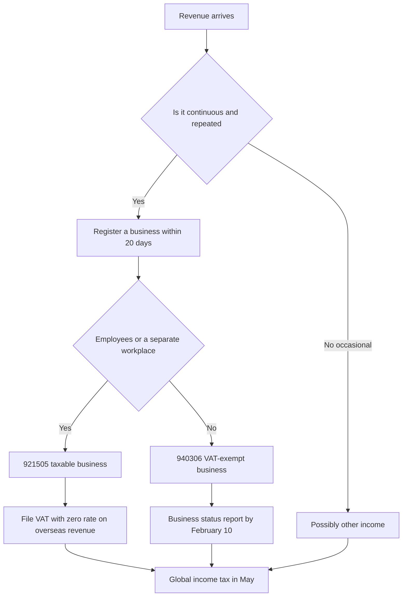

# Disclosure, Copyright and Tax

> **Learning goal**: Explain where and how to place the disclosure wording in posts and videos that involve an economic relationship, follow a rights-checking order for fonts, background music, images, other people's videos and software screens, and map the business registration, industry code, VAT and global income tax flow for a solo media creator.

> This document is general information, not legal or tax advice. Rules change often, so check the Korea Fair Trade Commission (KFTC) and National Tax Service (NTS) originals before acting, and consult a tax accountant or lawyer when needed.

The ad revenue model is covered in "Ad Revenue: AdPost and the YouTube Partner Program", product sales in "Own Products: Courses, E-books and Templates", and AI output and platform policy in "AI-assisted Production and Platform Policy". This document covers only the **disclosure duties, copyright and tax** attached to those activities. General business law and tax are in the Business track's "Registration · Mail-Order Sales", "VAT · Zero Rate · Tax Invoices", "Income Tax · Corporate Tax · Withholding · Books" and "Contracts · IP · Open Source", and advertising regulation for marketing in general is in "Law · Ethics · Ad Disclosure"; they are not repeated here. Content is as of 2026-09.

## Key Concepts

| Term | Meaning | Where it applies in this section |
|---|---|---|
| Economic relationship | Cash, free products, discounts, commissions, employment and similar ties between an advertiser and an endorser | Sponsored reviews, affiliate links |
| Endorsement and recommendation | Advertising that consumers perceive as the opinion of a third party rather than the advertiser | Blog reviews, YouTube reviews |
| Quotation of published works | Quoting within a justified scope and in line with fair practice for reporting, criticism, education or research (Copyright Act, Article 28) | Using parts of other people's videos or images |
| Fair use | Use without permission judged on purpose, type of work, share used and market effect (Copyright Act, Article 35-5) | Review and commentary videos |
| Portrait rights and publicity rights | The right not to be filmed or shown without consent, and the economic value of a well-known person's name and likeness | People on screen, thumbnails |
| Taxable and VAT-exempt business | Whether the business charges value-added tax | Industry codes 921505 and 940306 |
| Zero rate | A 0% VAT rate: output tax is zero and input tax can be credited | YouTube revenue received from abroad |
| Other income and business income | The split between occasional income and continuous, repeated income | Naver AdPost income |

## Principles

### 1. Disclosing an economic relationship: when it is required

The KFTC Guidelines on Endorsement and Recommendation Advertising require an endorser who receives something from an advertiser to disclose that relationship **so that consumers can easily recognize it**.

| Situation | Disclosure required | Why |
|---|---|---|
| An advertiser pays a fee and asks for a review | Yes | Monetary consideration |
| You receive a product free and review it (not returned) | Yes | Free provision is also economic consideration |
| You earn a commission when people buy through an affiliate link | Yes | Conditional consideration. Vague wording such as "may receive a commission" is inappropriate |
| Sponsorship or sales commission received through an affiliate platform such as Naver Brand Connect | Yes | Consideration is consideration, even through a platform. Even if the platform adds a label, check the title-or-opening disclosure yourself |
| You recommend a tool you bought yourself, with nothing received | Not in principle | No economic relationship |
| You introduce your own product (template, e-book) | Self-advertising, which is different from an endorsement | To avoid confusion, it is safest to say "This is a paid product I made" |

### 2. Where, and in what words

- **Text-based media such as blogs**: under the revision in force from 2024-12-01, the disclosure must go **in the title or the opening of the post**. Before that, the end of the post was also allowed. Hiding it mid-text, in comments or behind "more" is not appropriate.
- **Video**: the KFTC handbook's examples disclose by voice or caption **at the start and the end** of the video and, in long videos, **repeat** the disclosure with captions (example: every 5 minutes). For live streams, the examples repeat it so viewers who join midway can see it, and put the sponsorship in the stream title (confirmed via search results).
- **Form**: text in a size and color that stands out from the background, and audio that can be understood without adjusting volume or speed. Place the disclosure close to the endorsement itself.
- **Wording**: state the consideration plainly, e.g. "Ad", "Sponsored", "Written after receiving the product free from [brand]". The 2024 revision added conditional or vague wording such as "may receive a small commission" as an example of inappropriate disclosure.
- **AI virtual humans**: under the revision in force from 2026-06-01, when a virtual human made with generative AI endorses something, you must disclose that it is a "virtual human". In text media, put it in the title or opening; in video, show it near the virtual human while it appears.

### 3. YouTube's paid promotion checkbox

In the video details in YouTube Studio, under **Content declaration**, ticking "This video contains paid promotion such as paid product placement, sponsorships or endorsement" shows an "Includes paid promotion" notice for a few seconds when viewing starts (confirmed via search results). YouTube Help also says this feature **does not replace the disclosure duties under each country's law**. In Korea, use the checkbox together with on-screen captions or voice and a disclosure in the first line of the description.

### 4. Copyright: a checking order by asset type

| Asset | What to check | Safe default |
|---|---|---|
| Fonts | Korean copyright law protects the **font file (a program)**, not the letter shapes. Check that you obtained the file legitimately and that the license allows video, thumbnails, commercial use and embedding in templates | Use only fonts licensed for commercial use or fonts you bought, and keep a screenshot of the license |
| Background music | Each track in the YouTube Audio Library has its own license type. For CC BY tracks that require attribution, put the credit line in the description | Use only the Audio Library or services with a clear license, and log the track name |
| Images | Most images in search results have a rights holder | Your own captures or creations, stock licensed for commercial use; for AI output see "AI-assisted Production and Platform Policy" |
| Clips of others' videos | Quotation (Article 28) needs a criticism or education purpose, the minimum needed, a source credit, and your content as the main part. Many analyses say summaries, recaps and reactions are unlikely to count as fair use | Don't use them, get permission, or use only the short scene you are critiquing |
| Screen recordings of software | A product's UI is also a copyrighted work. Microsoft allows screenshots in tutorials, videos and websites but forbids alteration, third-party content or identifiable people in the shot, and splash or beta screens, and requires "Used with permission from Microsoft" | Check each vendor's screenshot guidelines, and do not use a logo as if it were your own mark |

YouTube's Content ID decisions are not copyright law. No Content ID claim does not make a use lawful, and a claim does not make it unlawful.

### 5. Portrait rights and privacy

- **Portrait rights** are not written in a statute; courts recognize them based on the constitutional right of personality. Get consent from recognizable people when filming in the street or at the office, or blur them.
- **Publicity rights**: using a well-known person's name, likeness, voice or similar in your business without permission can be an act of unfair competition under Article 2(1)(ta) of the Unfair Competition Prevention Act (in force from 2022-06-08). Putting a celebrity's face in a thumbnail or imitating their voice with AI falls here.
- **Personal data in screen recordings**: the most common accident in Excel tutorials is recording a real company file, a colleague's name, an email address or a notification pop-up. Make up the example data, turn notifications off, and watch every frame once before uploading.

### 6. Tax: the flow for a solo media creator

- **When to register**: the VAT Act requires registration within 20 days of starting a business. NTS guidance tells YouTubers who earn continuously and repeatedly to register. There is no "from this amount" threshold, so once revenue starts coming in regularly, check with the tax office or a tax accountant. The procedure is in "Registration · Mail-Order Sales".
- **Industry codes (as the NTS describes them)**: with personnel (employees) or physical facilities (such as a separate studio), **921505 media content creation, a taxable business**. Working alone without such facilities, **940306 solo media content creator, a VAT-exempt personal-services business**.

| Item | 921505 taxable | 940306 VAT-exempt |
|---|---|---|
| VAT | Must file. Consideration for services received in foreign currency from abroad, such as from Google, is zero-rated, and input tax on equipment can be credited or refunded | No VAT filing and no input tax credit. File a business status report by February 10 of the following year |
| Simple expense rate threshold (prior-year revenue) | Under KRW 36 million (information services group, confirmed via search results) | Under KRW 24 million (personal services group, confirmed via search results) |
| 2026 change | Added to the industries that must file a cash sales statement (commentary says from returns filed after 2026-04, confirmed via search results) | No such report |

- **AdPost income**: for individual members, Naver is reported to withhold tax as **other income** before paying (many sources describe it as 8.8%), while business members issue an electronic tax invoice and are paid against it. But a platform's withholding category does not settle the income category under tax law. Tax commentary says continuous and repeated income is in principle business income, so once the income grows, decide with a tax accountant on switching to a business membership and on the income category.
- **Global income tax**: income for January to December is filed in **May** of the following year (June for those subject to the faithful-filing confirmation). If other income is KRW 3 million or less a year, you may choose separate taxation. Tax already withheld is settled in the return. Rates and bookkeeping are in "Income Tax · Corporate Tax · Withholding · Books".
- **Records**: keep monthly platform statements (YouTube/AdSense payments, AdPost settlements), foreign-currency deposit records, receipts for equipment, software, fonts and stock, and license screenshots in one folder. A separate business bank account makes the books and evidence easier.

## Applied: Example creator J's compliance checklist

J is an office worker who makes faceless Excel and AI tool lessons with screen recordings and their own voice. Dates follow "A 90-day Channel Plan".

| When | Action | Basis |
|---|---|---|
| Before D0 | Check the side-job clause in the employer's work rules. Build fake example data files and set notifications off | Company rules, privacy |
| D0 | Start an asset log: font name and license URL, music track name and license type, screenshot guidelines | Copyright |
| First AI tool review | If the vendor gave free credits: "[Sponsored]" at the start of the blog title, captions at the start and end of the video, paid promotion ticked | Endorsement guidelines |
| First affiliate link | Right above the link: "If you buy through this link, J earns a commission" | Ban on vague wording |
| First paid sale (pre-sale at D49) | Check whether mail-order registration applies and consider business registration (no facilities → 940306 is a candidate; template sales need a separate industry review) | "Registration · Mail-Order Sales" |
| 2027-02-10 | If registered as VAT-exempt, file the business status report for 2026 | NTS |
| 2027-05 | File global income tax for October-December 2026 income together with wage income | Income Tax Act |

> J's template and e-book sales are not "supplying content to a video platform". Apart from the creator industry code, check with a tax accountant whether to add a secondary code such as e-commerce retail, and whether those sales are taxable (to be confirmed).

Bad example:

> J got a free one-year subscription from a tool company and posted a "must-have" review. The disclosure was a single "#sponsored" at the bottom of the description.

Good example:

> Title "[Sponsored] Two weeks with the automation tool X", a caption and voice line "I received a one-year subscription free from X" in the first 5 seconds and at the end, paid promotion ticked, and the same line as the first line of the description.

## Going Deeper

### Withholding by overseas platforms

If you have not submitted tax information, YouTube (AdSense) may withhold US tax on earnings from US viewers. Submitting tax information, applying the tax treaty and claiming the foreign tax credit in the Korean return are in "Income Tax · Corporate Tax · Withholding · Books".

### Health insurance for an office-worker creator

If an employee subscriber's non-wage income (business income, other income and so on) exceeds KRW 20 million a year, an extra income-based premium is charged on the excess (National Health Insurance Service guidance, confirmed via search results). Count the premium, not just the tax, in your net income.

### Sponsorship contracts

When you take a sponsorship, write into the contract who carries the disclosure duty, whether the advertiser reviews the wording, and the scope and period of reuse of the video. Contracts in general are in "Contracts · IP · Open Source".

## Common Misconceptions

- **"I put #ad at the bottom of the description, so I'm fine."** The standard is the title or opening for text media, and the start, end and repeats for video.
- **"I ticked YouTube's checkbox, so my legal duty is done."** The platform feature does not replace the Korean disclosure duty.
- **"It's a free font, so I can use it anywhere."** Free fonts can still restrict commercial use or embedding in their license.
- **"If I credit the source I can use someone else's video."** A credit is only one requirement of quotation. Purpose, amount and your content being the main part are also needed.
- **"AdPost withholds as other income, so I don't need to file."** The withholding category does not settle the income category, and filing may be required depending on the amount and repetition.

## Self-Check Questions

1. In a Naver Blog post with an affiliate link, where and with what sentence would you place the disclosure?
2. Name every place you would put the disclosure in a 12-minute sponsored video.
3. What is the difference in industry code and VAT duty between a YouTuber filming alone at home and one who employs an editor?
4. Name three privacy or copyright items to check in an Excel tutorial screen recording before upload.
5. For an office worker whose first income arrives in November 2026, list the filing dates to keep in order.

## References

- [Amended Guidelines on Endorsement and Recommendation Advertising take effect](https://www.ftc.go.kr/www/selectBbsNttView.do?pageUnit=10&pageIndex=1&searchCnd=all&key=12&bordCd=3&searchCtgry=01%2C02&nttSn=47547) — KFTC, 2026, confirmed via search results (2026-09-30)
- [Guidelines on Endorsement and Recommendation Advertising](https://www.law.go.kr/%ED%96%89%EC%A0%95%EA%B7%9C%EC%B9%99/%EC%B6%94%EC%B2%9C%C2%B7%EB%B3%B4%EC%A6%9D%EB%93%B1%EC%97%90%EA%B4%80%ED%95%9C%ED%91%9C%EC%8B%9C%C2%B7%EA%B4%91%EA%B3%A0%EC%8B%AC%EC%82%AC%EC%A7%80%EC%B9%A8) — Korea National Law Information Center, confirmed via search results (2026-09-30)
- [Revised handbook on disclosing economic relationships](https://www.ftc.go.kr/www//selectBbsNttView.do?pageUnit=10&pageIndex=1&searchCnd=all&key=12&bordCd=3&searchCtgry=01,02&searchViolt=000002&nttSn=46709&rltnNttSn=42475) — KFTC, confirmed via search results (2026-09-30)
- [Pre-announcement of the amended endorsement guidelines](https://www.kimchang.com/ko/insights/detail.kc?sch_section=4&idx=30241) — Kim & Chang, confirmed via search results (2026-09-30)
- [How to disclose economic relationships in video advertising](https://easylaw.go.kr/CSP/OnhunqueansInfoRetrieve.laf?onhunqnaAstSeq=94&onhunqueSeq=5759) — Easy-to-Find Everyday Law Information, confirmed via search results (2026-09-30)
- [AI virtual-human ads must carry a label from tomorrow](https://www.seoul.co.kr/news/economy/2026/05/31/20260531500033) — Seoul Shinmun, 2026-05-31, confirmed via search results (2026-09-30)
- [Use of Microsoft Copyrighted Content](https://www.microsoft.com/en-us/legal/intellectualproperty/copyright/permissions) — Microsoft, checked 2026-09-30
- [Use music and sound effects from the Audio Library](https://support.google.com/youtube/answer/3376882?hl=en) — YouTube Help, confirmed via search results (2026-09-30)
- [Paid product placements and endorsements](https://support.google.com/youtube/answer/154235?hl=en) — YouTube Help, confirmed via search results (2026-09-30)
- [Learn about font file copyright before use](https://www.mcst.go.kr/site/s_notice/press/pressView.jsp?pSeq=17076) — Ministry of Culture, Sports and Tourism, confirmed via search results (2026-09-30)
- [Copyright Act, Article 35-5](https://casenote.kr/%EB%B2%95%EB%A0%B9/%EC%A0%80%EC%9E%91%EA%B6%8C%EB%B2%95/%EC%A0%9C35%EC%A1%B0%EC%9D%985) — CaseNote, confirmed via search results (2026-09-30)
- [Amendment to the Unfair Competition Prevention Act on data misuse and unauthorized use of celebrity identifiers](https://www.kimchang.com/ko/insights/detail.kc?sch_section=4&idx=24264) — Kim & Chang, confirmed via search results (2026-09-30)
- [Tax guide for online sectors: solo media creators](https://www.nts.go.kr/nts/cm/cntnts/cntntsView.do?mi=2480&cntntsId=7802) — NTS, confirmed via search results (2026-09-30)
- [Tax guide for YouTubers and other new sectors, part 4: VAT returns](https://www.nts.go.kr/nts/na/ntt/selectNttInfo.do?nttSn=1319617&mi=2489) — NTS, confirmed via search results (2026-09-30)
- [Business status report overview](https://www.nts.go.kr/nts/cm/cntnts/cntntsView.do?cntntsId=7699&mi=2283) — NTS, confirmed via search results (2026-09-30)
- [Cash sales statements made mandatory for YouTubers](https://m.joseilbo.com/news/view.htm?newsid=560914) — Joseilbo, confirmed via search results (2026-09-30)
- [Global income tax filing manual for bloggers (AdSense, AdPost)](https://help.3o3.co.kr/hc/ko/articles/19156591135385) — 3o3 help center, confirmed via search results (2026-09-30)
- [Income-based premium on employee subscribers' non-wage income](https://www.nhis.or.kr/nhis/policy/wbhada01900m01.do) — National Health Insurance Service, confirmed via search results (2026-09-30)
