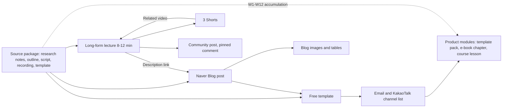

# One Source, Multi Use (OSMU) Strategy: Research Once, Rewrite for Each Platform

> **Learning goal**: Tell source assets from derivatives, split one week's source package into long-form, Shorts, a Naver post, community posts, messages and product modules, make each derivative native to its platform rather than a copy, and set rules for publishing order, linking, rights, measurement and pruning.

This document ties the whole section into one production flow. The craft of writing a post is in "Writing and Running a Blog", lecture videos are in "Planning and Producing Long-form Video", a single Short is in "Shorts and Faceless Channels", the policy risks of AI tools are in "AI-assisted Production and Platform Policy", product design and marketplaces are in "Own Products: Courses, E-books and Templates", copyright and ad disclosure are in "Disclosure, Copyright and Tax", and the week-by-week schedule is in "A 90-day Channel Plan". Here we decide **what to make once and what to make fresh for each platform**. Policies and features are **as of 2026-09**; Naver's help pages and the YouTube Help Center could not be opened directly, so several items are marked "confirmed via search results". All time and performance figures are illustrative assumptions.

## Key Concepts

**One source, multi use (OSMU)** means deriving several outputs from a source you make once. The point is not "upload the same file in many places" but **research and structure once, expression fresh for each platform**. A **source asset** is material you reuse regardless of platform, and one week's bundle is called a **source package**. A **derivative** is an output rebuilt from the source in one platform's grammar, and a **product module** is a paid unit made by bundling and deepening several weeks of sources.

| Source asset | What it holds | Main derivatives it feeds |
|---|---|---|
| Research notes | Reader questions, official doc links with check dates, results you tried yourself | The factual basis of every derivative |
| Outline | Problem → solution steps → common mistakes → next step | Long-form structure, blog subheadings, e-book table of contents |
| Script | Sentences to say, screen directions | Long-form narration, raw material for the blog draft |
| Screen recording master | Horizontal master + marked zoom segments | Long-form, Shorts, blog screenshots, course lessons |
| Template file | Practice spreadsheet, checklist | Free template, paid template pack |

| Derivative | Platform | Taken from the source | Must be made fresh | Role |
|---|---|---|---|---|
| Long-form lecture (8-12 min) | YouTube | Outline, script, recording | Opening, editing rhythm, thumbnail | Trust and watch time |
| 3 Shorts | YouTube | Recording segments | Vertical reframing, first 1-2 seconds, captions | Discovery |
| Naver Blog post | Naver | Outline, research notes | Title and first screen matched to the search question, copyable formulas | Search traffic |
| Blog images and tables | Naver | Recording captures, template | Step-by-step screenshots, comparison tables | Post comprehension |
| Community post, pinned comment | YouTube | The outline's core question | Poll or question, links to the post and template | Engagement and linking |
| Email or KakaoTalk channel message | Own list | This week's summary, template | One paragraph just for list readers | List relationship |
| Product module | Marketplace | Sources from W1-W12 (W13 excluded, as it falls just before D90) | Organisation, manual, support | Revenue |

## Principles

### 1. Translation, not copying: native to each platform

A derivative must be the source **translated into the way that platform's audience uses content**. Naver readers arrive from a search query, skim and copy; long-form viewers watch while following along; Shorts viewers decide in the first 1-2 seconds whether to swipe. **Bad example**: pasting the video's auto-captions straight into the blog body, and cutting the first 60 seconds of the long-form into a Short. **Good example**: the blog puts the answer, formulas and tables on the first screen, the video opens on the problem, and the Short opens on a single result screen.

### 2. Naver: similar and duplicate documents

On 2012-10-30 Naver announced "Project BiO", which separates original documents from similar ones and shows the original first (confirmed via press reports). Its current criteria are not public, and the "similar document" concept used in the industry (light edits can still be caught; repeated posts inside your own blog are a problem too) is commentary, not an official Naver document. So the rules are conservative.

- **Do not copy** the same post to a blog, a Cafe or another account. When turning video captions into a post, rewrite the sentences, structure and screenshots.
- Do not write another post answering the same question on your own blog; **revise and merge the existing post** ("Writing and Running a Blog"). How search evaluates documents is in "Naver Blog and How Naver Search Works".

### 3. YouTube: reused content and inauthentic content

The definitions, examples and allowed scope of these two monetization policies are in "AI-assisted Production and Platform Policy". Only the conclusions OSMU needs are here. Making Shorts from your own long-form is a flow YouTube supports through its "Edit into a Short" feature. The OSMU risk is not reuse but **repetition**. Stacking weekly videos that swap a few words in the same frame leans towards inauthentic content. Every source needs a new problem and a new recording.

### 4. Order of production and publishing

Production always starts with **research → outline → script → recording**. Only after recording do the post's screenshots and the Shorts segments exist. We found no official platform rule on publishing order, so the table below is a set of judgement criteria.

| Choice | When | Why | Caution |
|---|---|---|---|
| Video first, post the next day | Default. Tutorials without urgent search timing | The post can go out with the video embedded, and the long-form the Shorts will point to already exists | The post enters search a day later |
| Post first, video later | When search demand clusters on a date, such as year-end tax settlement or a new feature launch | A post is faster to make than a video | Add the video to the post after it goes public |
| Shorts spread out after the long-form | Always | A related video link can only point to a video that is already uploaded | Do not post all 3 on the same day |

### 5. Linking without cannibalising

When derivatives do the same job, they steal each other's views (cannibalisation). **Split the roles**: the video shows the process, the post gives the formulas, tables and files to copy, and the Short shows one result and sends viewers to the long-form. If the post carries the whole video script, readers have no reason to see both.

Design the links as a one-way chain: Short → (related video) → long-form → (description, pinned comment) → blog post and free template → (opt-in subscription) → email and KakaoTalk channel list → product. Links in Shorts descriptions and comments have not been clickable since 2023-08-31, so the related video link is the only direct path. The blog post sends readers back to the long-form by embedding the video at the "follow along on screen" step. Consent and labelling rules for promotional messages follow "Channels · Content · Paid · Lifecycle" and "Disclosure, Copyright and Tax".

### 6. Asset library and rights

A source is only reused if you can find it. Keep sources and derivatives together in one weekly folder (for example `2026-W41_dedupe/`) and put the type and version in file names (`src_outline_v2.md`, `src_rec_raw.mp4`, `out_short-1_result.mp4`). In each folder, `rights.md` records the origin and licence scope of the fonts, music and images used that week. Because one asset flows into video, post and paid product, **only put assets into the source that are cleared for every derivative plus paid products.** If in doubt, replace them with assets you made yourself.

| Asset | What to check | Example |
|---|---|---|
| Fonts | Allowed scope for video, print and embedding (e-books, apps) | Noonnu labels each font's allowed uses, such as embedding and BI/CI (confirmed via search results). The final check is the foundry's licence |
| Background music | Whether use outside the platform is allowed | Standard-licence tracks in the YouTube Audio Library are described as restricted outside YouTube, and CC BY tracks as needing attribution (confirmed via search results) |
| Images | Whether redistribution and inclusion in products for sale are allowed | Check in the licence whether a stock image may sit inside a template file you sell |
| AI-generated output | The tool's terms for commercial use | "AI-assisted Production and Platform Policy" |

### 7. Converting formats with AI, editing by a human

AI is good at format conversion: transcript → blog subheadings and step list, long-form transcript → 5 candidate 30-60 second segments "where the result is visible on one screen", outline → candidate community questions. The output is a **draft**. A human writes the sentences, picks 3 of the candidates, checks every function name and menu path against the real screen, and adds **one thing the source did not have** to each derivative (a new screenshot, a new question, a new example). Labelling rules (YouTube's altered or synthetic content disclosure, and the optional "AI-used" label Naver Blog introduced on 2025-05-21) follow "AI-assisted Production and Platform Policy".

### 8. When OSMU hurts

Cutting a 20-step setup process into a Short conveys nothing, so that week you make fewer Shorts. The same applies when the number of derivatives becomes the goal and each one gets worse, or when you force seven outputs out of a weak source. **Not making a format that does not fit** is also an OSMU rule.

## Applied: Example creator J's weekly source package

J's week 1 (D0 = 2026-10-05) source is "cleaning up duplicate data in Excel". This table is the canonical allocation for the whole section, and the hours in other documents follow it.

| Order | Step | Output | Hours (assumed) |
|---|---|---|---|
| 1 | Research, example file | Research notes, practice sheet (source) | 1.0 |
| 2 | Outline | "One outline" (source) | 0.5 |
| 3 | Script | AI draft + J's own mistake stories (source) | 0.5 |
| 4 | Screen recording, voice | Horizontal master + marked zoom segments (source) | 1.5 |
| 5 | Long-form edit, thumbnail | 10-minute lecture (published Tue) | 3.0 |
| 6 | Blog post, screenshots, tables | Naver post (published Wed, video embedded) | 2.0 |
| 7 | 3 Shorts | Result, mistake and question types (spread Thu, Sat, Mon) | 1.0 |
| 8 | Community post, pinned comment, message, library tidy-up | Question post, list message, `rights.md` | 0.5 |
| | Total | | **10.0** |

If the same outputs were made separately for each platform (an illustrative calculation, not a measurement):

| Task | OSMU | Separately | Why it differs |
|---|---|---|---|
| Research, outline, script | 2.0 | 3.5 | Separate research and outlines for video and post |
| Recording | 1.5 | 1.5 | Same |
| Long-form edit | 3.0 | 3.0 | Same |
| Blog post | 2.0 | 3.0 | New example file and screenshots |
| 3 Shorts | 1.0 | 3.0 | Each planned and recorded on its own |
| Community, message, tidy-up | 0.5 | 0.5 | Same |
| Total | **10.0** | **14.5** | |

Working separately overshoots the 10 weekly hours by 4.5, so J would have to give up either Shorts or the blog. Most of the saving comes from **doing research and recording only once**. Over W1-W12 the sources accumulate like this (W13 excluded, as it falls just before D90). The product schedule follows "Own Products: Courses, E-books and Templates" and "A 90-day Channel Plan".

| When | Accumulated sources | Product module built from them |
|---|---|---|
| Weeks 1-2 (D0-D13) | 2 outlines, 2 sheets | The best-received sheet → free template (D14) |
| Weeks 3-5 (to D34) | 5 outlines, 5-8 sheets | Paid template pack list from the sheets with the most downloads and comment requests, waitlist opens (D35) |
| Weeks 6-10 (to D69) | 10 weeks of recording masters | Masters re-edited short into the pack's "how to use" videos, presale (D49-D60, judged at the D60 review) and delivery (D63) |
| Weeks 11-12 (to D83) | 12 outlines from W1-W12 (W13 excluded, as it falls just before D90) | 12 outlines grouped into 4 parts × 3 chapters as the e-book table of contents, waitlist after D90 |

A paid pack needs more than a bundle of free sheets. It needs **value on top of what buyers already got for free**, such as a manual, an integrated sheet and a promise of updates. In the illustrative calculation in "Ad Revenue: AdPost and the YouTube Partner Program", J reaches the YPP ad tier in month 11 to 26, so in the first 90 days the OSMU payoff is not ads but **time saved, product modules and learning which topics get a response**.

## Going Deeper

### Which derivative drove the result

| Tool | What it shows | J's question |
|---|---|---|
| UTM or short links | Which derivative a visit to the product or template page started from | Did template downloads come from the blog post or the long-form description? |
| Traffic sources in YouTube Studio's Reach tab | Shorts feed, YouTube search, Suggested videos, External and more | How many long-form views came via Shorts? |
| Inflow analysis in Naver Blog Statistics | Search inflow, site inflow, inflow search terms (menu names can change) | Does the post get readers from search or from YouTube? |

Tag every link with its origin, for example `?utm_source=naverblog&utm_medium=post&utm_campaign=2026-w41`. UTM only means something when the receiving page reads it with an analytics tool, and it misses journeys that switch devices, so add one question to the download form: "Where did you hear about this?"

### A pruning rule

Review each derivative's **result per hour invested** (downloads, subscriptions, search inflow) in 4-week blocks (assumption). If it is the lowest for 4 weeks running and another derivative delivers the same result, cut it back or stop it. In the first 90 days, "result" means product signals such as downloads, list sign-ups and presales, not ad revenue. The exception is long-form, the centre of the loop: it is the raw material for every derivative and where watch time builds, so it stays even when its short-term result is low. Never prune on the first 2 weeks of numbers.

### Refreshing old content

On Naver, revise and update an old top-viewed post instead of rewriting it as a new one. On YouTube a published video file cannot be swapped, so make a new Short from the old long-form (public long-form only, not with a third-party copyright claim), or, if the tool has changed, make a new version and link it from the old video's pinned comment. A refreshed source flows into a template pack update.

### Adding more platforms later (optional)

Add Instagram Reels, Threads or a newsletter one at a time, **only after the core loop (long-form, Shorts, Naver) has held steady for 12 weeks**. First check in `rights.md` that the music and fonts are cleared for the new platform, and upload the original file rather than one watermarked by another platform ("Shorts and Faceless Channels").

## Common Misconceptions

- **"OSMU means uploading the same content in many places"** — It reuses the research and structure, not the finished output.
- **"Shorts cut from my own video count as reused content and lose monetization"** — Reused content targets material that is not your own creation. The risk is repetition and mass production ("AI-assisted Production and Platform Policy").
- **"More derivatives are always better"** — A derivative that does not pay back its time eats into the quality of the source.
- **"Music and fonts used in a video can also go into an e-book"** — The allowed scope differs by use.
- **"If AI converts it, no editing is needed"** — AI output is a draft. A human checks the facts and fits the platform's grammar.

## Self-check Questions

1. Name the five source assets and one derivative each of them feeds.
2. What two problems can come from posting long-form captions unchanged as a Naver post?
3. For a year-end tax settlement Excel tutorial, would you publish the video or the post first? Why?
4. What path must a reader take to get from a Short to the blog post?
5. Over 4 weeks, community posts had the lowest result per hour. What do you check before stopping them?

## References

- [YouTube channel monetization policies — YouTube Help](https://support.google.com/youtube/answer/1311392?hl=en) — Google, confirmed via search results (2026-09-30)
- [FAQ: Reused Content & YouTube's Partner Program — YouTube Community](https://support.google.com/youtube/community-guide/271248162/%F0%9F%94%8E-faq-reused-content-youtube%E2%80%99s-partner-program?hl=en) — Google, confirmed via search results (2026-09-30)
- [Create YouTube Shorts from your videos — YouTube Help](https://support.google.com/youtube/answer/12836917?hl=en) — Google, confirmed via search results (2026-09-30)
- [YouTube enables linking between Shorts and long-form videos — Search Engine Land](https://searchengineland.com/youtube-enables-linking-shorts-long-form-videos-430655) — Search Engine Land, confirmed via search results (2026-09-30)
- [YouTube's banning clickable links from Shorts descriptions and comments — Tubefilter](https://www.tubefilter.com/2023/08/10/youtube-shorts-comments-spam/) — Tubefilter, confirmed via search results (2026-09-30)
- [Understand your YouTube video reach — YouTube Help](https://support.google.com/youtube/answer/9314355?hl=en) — Google, confirmed via search results (2026-09-30)
- [URL builders: Collect campaign data with custom URLs — Analytics Help](https://support.google.com/analytics/answer/10917952?hl=en) — Google, confirmed via search results (2026-09-30)
- [Naver search overhaul (Korean) — Hankook Ilbo](https://www.hankookilbo.com/news/article/201210301298432767) — Hankook Ilbo, 2012-10-30, confirmed via search results (2026-09-30)
- [Rethinking Naver's "similar document" concept (Korean) — Openads](https://www.openads.co.kr/content/contentDetail?contsId=4748) — Openads (industry commentary), confirmed via search results (2026-09-30)
- [YouTube Audio Library: what is it & what are its limitations — Lickd](https://lickd.co/youtube-audio-library/) — Lickd, confirmed via search results (2026-09-30)
- [Noonnu FAQ — Noonnu](https://noonnu.cc/en/questions) — Noonnu, confirmed via search results (2026-09-30)
