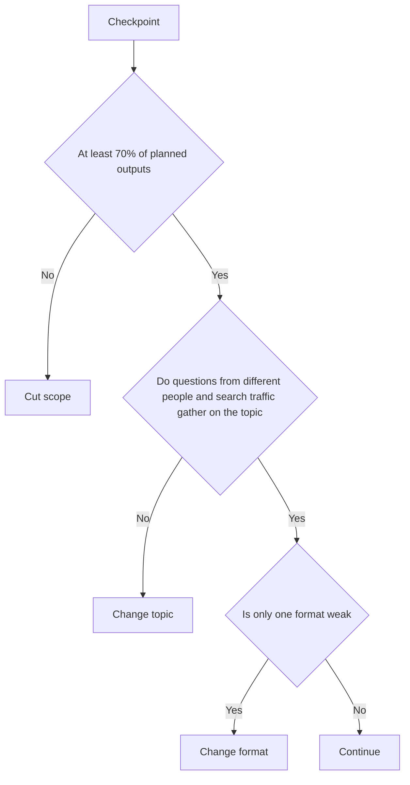

# A 90-day Channel Plan

> **Learning goal**: Split 10 hours a week across blog, long-form, Shorts and product work, set up a weekly routine and content calendar that turn one source package a week into derivatives, use D30, D60 and D90 metrics to decide whether to continue, change topic or change format, and pick the timing of the first product launch.

This document ties the whole section into one plan. The methods for each step live in the sibling documents, so this one covers only **order, time and decision rules**. For topic and audience see "Choosing a Topic and Audience"; for search and writing, "Naver Blog and How Naver Search Works" and "Writing and Running a Blog"; for YouTube, "How YouTube Recommends and Channel Design", "Planning and Producing Long-form Video" and "Shorts and Faceless Channels"; for AI tools and policy risk, "AI-assisted Production and Platform Policy"; for revenue, "Ad Revenue: AdPost and the YouTube Partner Program" and "Own Products: Courses, E-books and Templates"; for law and tax, "Disclosure, Copyright and Tax". The rules for splitting one source into many derivatives are in "One Source, Multi Use (OSMU) Strategy", and this plan's weekly routine puts that flow on a calendar. Dates and rules are as of 2026-09, and every target number is an assumption for Example creator J.

## Key Concepts

| Term | Meaning | In this plan |
|---|---|---|
| Source package | One week's bundle of source assets: research notes, example files, outline, script, raw screen recording | One per week (a week folder such as `2026-W41`) |
| Derivative | An output made from the source package | 1 long-form video, 1 Naver Blog post, 3 Shorts, a community post, a product-module note |
| Time budget | How the hours available each week are split | Fixed at 10 hours a week |
| Leading metric | A metric that moves fast and can be turned into action | Impressions CTR, average percentage viewed, blog search terms, questions in comments, template downloads |
| Lagging metric | An outcome metric that moves slowly | Subscribers, ad revenue, product sales |
| Decision rule | A rule that picks the next action at a checkpoint from conditions set in advance | Continue / change format / change topic / cut scope |

## Principles

### 1. Commit to outputs, judge results later

For a beginner, 90 days is too short to judge ad revenue. Ads start only after passing Naver AdPost review and the YouTube Partner Program thresholds, and in the illustrative calculation (not a forecast) in "Ad Revenue: AdPost and the YouTube Partner Program", J reaches the fan-funding tier (500 subscribers, no ad revenue share) in month 7-14 and the new ads-tier bar that applies from 2027-02-01 (1,000 subscribers plus 8,000 hours in 365 days) in month 11-26. At D90 no scenario reaches even the fan-funding tier. So the 90-day plan is judged on **outputs you control** (one source package a week) and **leading metrics**, and reaching the ad thresholds is not a decision condition.

### 2. Splitting 10 hours a week

Phase 1 uses the weekly split from "One Source, Multi Use (OSMU) Strategy" as is. As production becomes familiar, the time saved moves to product work.

| Task | Phase 1 D0-D30 | Phase 2 D31-D60 | Phase 3 D61-D90 |
|---|---|---|---|
| Source: research, example files, outline, script | 2.0 | 2.0 | 1.5 |
| Source: screen recording and voice | 1.5 | 1.5 | 1.5 |
| Long-form editing and thumbnail (8-12 min) | 3.0 | 2.5 | 2.5 |
| Naver Blog post | 2.0 | 1.5 | 1.5 |
| 3 Shorts (cut from the long-form video) | 1.0 | 1.0 | 1.0 |
| Community, measurement and product work | 0.5 | 1.5 | 2.0 |
| **Total (hours)** | **10** | **10** | **10** |

The reductions in phases 2 and 3 are J's assumptions. Log the actual time for the first 2 weeks of phase 1, and if it runs longer than assumed, cut scope before adding product work (see the decision rules below).

### 3. The weekly routine: one source, many derivatives

As an office worker, J makes the source on the weekend, then finishes and publishes the derivatives on the following weekdays. Publishing days (long-form Tuesday, blog Wednesday, Shorts Thursday, Saturday and Monday) follow the defaults in "One Source, Multi Use (OSMU) Strategy".

| Day | Hours | Work | Output |
|---|---|---|---|
| Sat | 3.5 | Pick the topic from comments and search terms, research and example files, outline, check the AI script draft, screen recording and voice | Source package |
| Sun | 3 | Long-form editing, thumbnail, title | Long-form (scheduled for Tuesday) |
| Mon | 1 | Blog draft and captures from the same outline | Blog draft |
| Tue | 1 | Finish the blog post, embed the video | Blog post (scheduled for Wednesday) |
| Wed | 1 | Cut 3 Shorts from the long-form video and link it as the related video | 3 Shorts (scheduled for Thu, Sat, Mon) |
| Thu | 0.5 | Pinned comment and community post, collect questions, one line of weekly metrics | Weekly log |

The blog post and the video come from the same outline ("one outline, two outputs"). In phases 2 and 3, trim Saturday's source time and Sunday's editing time and add 1-1.5 hours of product work at the end of Sunday.

### 4. Decision rules

- **Cut scope**: if outputs are below 70%, shrink the plan before looking at metrics. Go from 3 Shorts to 1, or turn the blog post into a short summary.
- **Change topic**: if demand signals (questions, search terms, downloads) are weak in every format, move to a sub-topic within the same field. Example: "Excel in general" → "report automation for sales and admin roles".
- **Change format**: if blog search traffic grows but only long-form retention is weak, the problem is the format, not the topic. Change the video length, the opening and the thumbnail ("Planning and Producing Long-form Video").
- The comparison baseline is not an outside average but **your own channel's median over the last 4 weeks**.

## Applied: Example creator J's 90 days (2026-10-05 to 2027-01-03)

### Content calendar

Weeks are counted by publishing week. J makes the W1 source on the weekend just before D0 (2026-10-03 to 04).

| Week | Starts | Source topic (example) | Product work |
|---|---|---|---|
| W1 | 2026-10-05 (D0) | Cleaning up duplicate data in Excel | Basic blog and channel setup |
| W2 | 2026-10-12 | Weekly work report automation sheet | Prepare the free sheet |
| W3 | 2026-10-19 (D14) | Matching lists with XLOOKUP | Publish the free template, contact form |
| W4 | 2026-10-26 | How to ask AI for Excel formulas | Collect comments and questions |
| W5 | 2026-11-02 (D30 is 11-04) | Monthly reports with pivot tables | D30 review |
| W6 | 2026-11-09 (D35) | Merging many files with Power Query | Open the paid template pack waitlist |
| W7 | 2026-11-16 | Q&A from comment questions | Pack contents and how-to video plan |
| W8 | 2026-11-23 (D49) | Template pack preview tutorial | Start a 2-week pre-sale |
| W9 | 2026-11-30 (D60 is 12-04) | A dashboard with conditional formatting | D60 review, close the pre-sale |
| W10 | 2026-12-07 (D63) | How to use the template pack | Deliver to pre-sale buyers |
| W11 | 2026-12-14 | Turning meeting notes into tables with AI | Improve from buyer questions, record one spare source in advance |
| W12 | 2026-12-21 | Year-end work review sheet | Switch to regular sales, draft the e-book outline |
| W13 | 2026-12-28 | Revisiting the most-asked question (the spare source may be used) | D90 review (2027-01-03) |

Office schedules tend to pile up at year end, so J records a spare source in W11. If it is not needed, it is used in the first week of January.

### Checkpoints and targets (J's assumptions)

| When | Output target | Leading metrics to watch | Decision |
|---|---|---|---|
| D30 (2026-11-04) | 5 long-form, 5 blog posts, 12 Shorts, free template published | Impressions CTR and average percentage viewed per video, blog search terms, template contacts | Decide only whether to cut scope. Too early to judge the topic |
| D60 (2026-12-04) | Cumulative 9 long-form, 9 blog posts, 25 Shorts, pre-sale under way | Number of distinct people asking questions, 4-week trends, waitlist size | Apply the full decision rules. Check the pre-sale bar (10 in 2 weeks, assumption) |
| D90 (2027-01-03) | Cumulative 13 long-form, 13 blog posts, 38 Shorts (W13's Monday Short falls on D91), template pack delivered | Buyer questions, top blog posts by search traffic, videos that convert viewers to subscribers | Decide the next 90 days' topic, format and product (whether to open an e-book waitlist) |

The cumulative counts assume long-form on Tuesdays, the blog on Wednesdays and Shorts on Thursdays, Saturdays and Mondays. Over all 13 weeks the totals match the "13 long-form videos, 39 Shorts and 13 blog posts" in "Blog & YouTube Monetization Overview"; only the last Short goes out the day after D90 (2027-01-04).

Ads: plan ad revenue inside the 90 days at KRW 0. Applying for Naver AdPost and reaching the YouTube Partner Program thresholds are not D90 decision conditions. When you get close, follow the steps in "Ad Revenue: AdPost and the YouTube Partner Program".

### Timing the first product launch

J publishes a free template at D14 to collect contacts, then takes the paid template pack through **a waitlist at D35, a pre-sale at D49 and delivery at D63**. J sells no paid product before D30, because there is no basis for selling yet (repeated questions from different people). Before D49, check whether mail-order registration and business registration apply, and put the refund terms on the sales page ("Disclosure, Copyright and Tax", "Own Products: Courses, E-books and Templates").

### Risks, and what to stop

| Risk | Signal | Response |
|---|---|---|
| Burnout | Outputs below 70% for 2 weeks in a row, whole weekends used up | Apply the cut-scope rule, use the spare source early |
| Videos that look repetitive or mass-produced | Same template every week with only the words changed, reading an AI script as is | A new problem and a new recording in every source, check "AI-assisted Production and Platform Policy" |
| Copyright or privacy accident | A real company file or a notification pop-up gets recorded | Fake example data, full review before upload |
| Side-job conflict at work | A side-job clause in the work rules | Check before D0 |
| Comparison and impatience | Changing the plan after seeing other channels grow | The baseline is your own median over the last 4 weeks |

What to stop: daily uploads, checking statistics several times a day, adding a new platform within the 90 days, endless thumbnail revisions, and trying to solve problems by buying equipment.

## Going Deeper

### Batch production and spare sources

Once the schedule is stable, record two sources at once every other week (batching) and build up 1-2 weeks of raw recordings. Spare sources absorb predictable gaps such as overtime and year end. Keep the once-a-week publishing rhythm even while building them.

### After 90 days: what to carry into the next plan

- The common topic of the top 5 blog posts by search traffic and the top 3 videos by subscriber conversion → the next 90 days' topic
- The list of buyer questions and the 12 outlines → the e-book outline (how to bundle them is in "One Source, Multi Use (OSMU) Strategy")
- The actual weekly time log → the next time budget
- The distance left to the ad thresholds → a realistic date estimated with the calculation in "Ad Revenue: AdPost and the YouTube Partner Program"

## Common Misconceptions

- **"After 90 days there should be ad revenue."** Ads begin only after the thresholds. The 90-day judgment uses outputs and leading metrics.
- **"The blog and YouTube need separate planning."** Making derivatives from the same source saves time and keeps the topic consistent.
- **"If views are low, change the topic right away."** First look at output completion and format problems. Change the topic only when signals are weak in every format.
- **"Think about products once you have many subscribers."** Collecting a list with a free template can start at D14.
- **"A spare source is a waste."** For an office worker, a spare source is what keeps the plan from collapsing.

## Self-Check Questions

1. If you only had 8 hours a week, what would you cut from the phase 2 column of the split table, and why?
2. At D60 blog search traffic has grown, but long-form average percentage viewed has fallen for 4 weeks in a row. What do the decision rules say to do?
3. Output completion is 60% but the metrics look good. Can you continue?
4. Explain why the first paid product is not sold before D30.
5. Write W1-W4 source topics for your own subject and list the derivatives each would produce.

## References

- [Overview of the expanded YouTube Partner Program](https://support.google.com/youtube/answer/13429240?hl=en) — YouTube Help, confirmed via search results (2026-09-30)
- [YouTube is lowering the barrier to be eligible for its monetization program](https://techcrunch.com/2023/06/13/youtube-is-lowering-the-barrier-to-be-eligible-for-its-monetization-program/) — TechCrunch, 2023-06-13, confirmed via search results (2026-09-30)
- [YouTube Partner Program: Eligibility, Benefits & Application](https://www.youtube.com/creators/partner-program/) — YouTube, confirmed via search results (2026-09-30)
- [Naver AdPost application conditions and revenue](https://postdot.kr/blog/naver-adpost-guide) — PostDot, confirmed via search results (2026-09-30)
- [Amended Guidelines on Endorsement and Recommendation Advertising take effect](https://www.ftc.go.kr/www/selectBbsNttView.do?pageUnit=10&pageIndex=1&searchCnd=all&key=12&bordCd=3&searchCtgry=01%2C02&nttSn=47547) — KFTC, confirmed via search results (2026-09-30)
- [Tax guide for online sectors: solo media creators](https://www.nts.go.kr/nts/cm/cntnts/cntntsView.do?mi=2480&cntntsId=7802) — NTS, confirmed via search results (2026-09-30)
