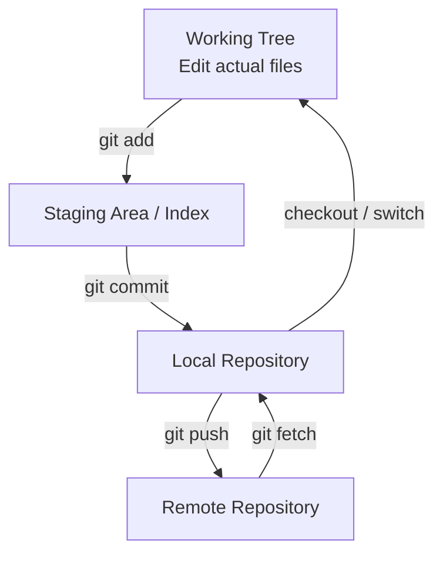

# Git’s Overall Structure at a Glance

Git can be difficult because “files,” “commits,” “branches,” and “remotes” belong to different layers.

Start by capturing the overall structure in one diagram.



## Four Core Layers

| Layer | Meaning |
|---|---|
| Working Tree | The files you actually edit |
| Staging Area | Changes to include in the next commit |
| Local Repository | Git history on your PC |
| Remote Repository | A shared repository on GitHub, GitLab, or a similar service |

## The Basic Flow

```text
Edit files
↓
git add
↓
Staging
↓
git commit
↓
Local Repository
↓
git push
↓
Remote Repository
```

## The Reverse Direction

```text
Remote Repository
↓ git fetch
Update remote-tracking refs in the local repository
↓ merge / rebase
Update the local branch
↓ checkout result
Working Tree
```

## The Most Important Distinction

### `stable`

This is a local branch.

### `origin/stable`

This is not the remote branch itself. It is **the position of origin’s stable branch remembered by your local repository**: a remote-tracking reference.

```text
Worktree
  ↓
stable               Local Branch
  ↓ tracks
origin/stable        Remote-Tracking Ref
  ↓ corresponds to
GitHub stable        Remote Branch
```

## Recommended Order for Learning Git

1. Working Tree / Stage / Commit
2. Branch / HEAD
3. Remote / fetch / push
4. Worktree
5. Merge / Rebase / Cherry-pick
6. Restore / Revert / Reset
7. PR / Code Review / Actions

Following this order lets you understand commands by asking “which layer does this command change?” rather than memorizing them individually.
