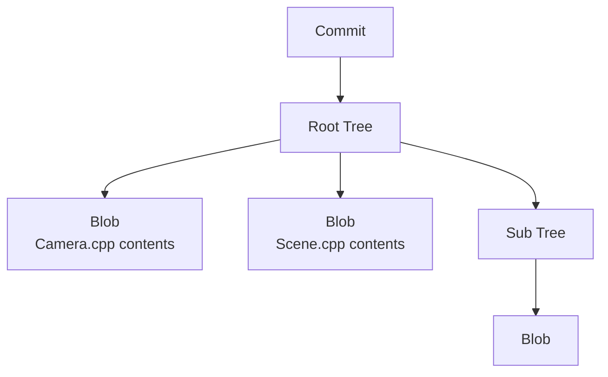

# Repository, Git Object, Branch

## Local and Remote Repositories

```text
Local Repository
= A Git repository on your computer

Remote Repository
= A repository on GitHub, GitLab, or an internal Git server
```

One local repository can have multiple remotes configured.

```text
Local Repository
├─ origin  → GitHub
├─ backup  → GitLab
└─ upstream → Official source repository
```

## What Is a Git Object?

Git stores data internally as objects.

| Object | Role |
|---|---|
| Blob | File contents |
| Tree | Filenames and directory structure |
| Commit | A snapshot at a particular point in time + metadata |
| Tag object | An annotated tag attached to a specific object |



A commit typically contains the following information.

```text
Commit
├─ Tree
├─ Parent Commit
├─ Author
├─ Committer
├─ Message
└─ Time
```

## A Branch Is Not an Object

A branch is a **movable reference** pointing to a particular commit.

```text
feature/camera
      ↓
   Commit D
```

Creating a new commit moves the branch to that commit.

```text
Before
A ─ B ─ C
        ↑ feature

After commit
A ─ B ─ C ─ D
            ↑ feature
```

## Bare Repository

A bare repository contains Git data without a working tree.

Regular repository:

```text
Project/
├─ Source/
├─ README.md
└─ .git/
```

Bare Repository:

```text
project.git/
├─ objects/
├─ refs/
├─ HEAD
└─ config
```

A bare layout is natural for a server because the server does not need to edit files directly.

## Reasons to Use Multiple Remote Repositories

- Backups
- GitHub + GitLab mirrors
- Separating a fork from the official source
- Separating internal and external distribution
- Separating permission boundaries

However, **there is no need to split remote repositories merely because Claude and Codex develop in parallel.** In that case, one remote with multiple branches/worktrees is simpler.
