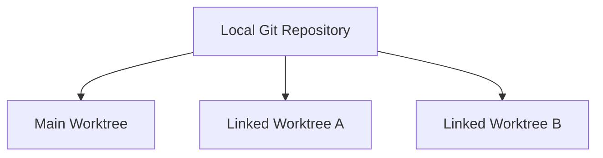

# Understanding Worktrees

A worktree is **a workspace that materializes the file state of a particular commit or branch in an actual folder**.

## Why Worktrees Are Needed

A typical working tree has only one branch checked out at a time.

Developing several features at once therefore requires repeated branch switches.

With worktrees:

```text
Local Repository
├─ Main Worktree   → stable
├─ Linked WT A     → feature/a
└─ Linked WT B     → feature/b
```

These can remain available simultaneously.

## What Is the Main Worktree?

The main worktree is the initial working folder created by `git clone`.

```text
C:/Dev/MyProject/
├─ Source/
├─ README.md
└─ .git/
```

Additional worktrees are linked worktrees.

“Main” does not mean that it is the parent of the linked worktrees.



## What Is Shared and What Is Separate?

| Item | Shared or Separate |
|---|---|
| Git Object DB / Commit History | Shared |
| Remote configuration | Shared |
| Branch refs | Shared |
| Actual working files | Separate |
| HEAD | Separate |
| Index / Staging | Separate |
| Uncommitted Changes | Separate |

An additional worktree’s `.git` is usually a file pointing to the main repository’s Git data, rather than a directory.

## Can One Worktree View Multiple Branches at Once?

No. **1 Worktree = 1 HEAD**.

You can switch branches, but only one is checked out at any given moment.

## Can a Worktree Exist Without a Branch?

Yes. It is in a detached HEAD state.

## Can Multiple Worktrees Use the Same Branch?

Git prevents this by default within the same local repository.

```text
WT A → feature/camera
WT B → feature/camera   X
```

This avoids the risk of two folders moving the same branch pointer simultaneously.

Different developers’ PCs have separate local repositories, so each can check out the same remote branch.

## Does a Remote Repository Also Have Worktrees?

A typical GitHub remote has no workspace such as “Claude Worktree A.”

The remote contains Git data such as commits, refs, and tags.

A worktree is a local workspace concept.

## Start New Task B from a Clean stable

Leave worktree A as it is, even if its work is unfinished.

```text
Main WT → stable (clean)
WT A    → feature/a (uncommitted changes)
```

New task:

```bash
git fetch origin
git worktree add ../worktrees/b -b feature/b origin/stable
```

Result:

```text
Main WT → stable
WT A    → feature/a  Ongoing edits unchanged
WT B    → feature/b  Starts from the latest origin/stable
```

There is no need to stash or commit A’s changes.

## AI Coding Agents and Worktrees

Recommended:

```text
Session A ↔ Worktree A ↔ feature/a
Session B ↔ Worktree B ↔ feature/b
```

Even if an existing session runs `git worktree add` to create B, the session itself does not move to B.

Start a new session at B’s path.
