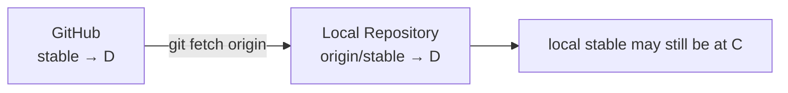

# Remote, Fetch, Pull, Push, Upstream

## What Is origin?

`origin` is simply a **name** assigned to a remote repository.

```text
origin → https://github.com/.../project.git
```

You can configure multiple remote names.

```bash
git remote add backup ...
git remote add upstream ...
git remote -v
```

## Fetch

The essence of fetch:

> Bring the remote’s latest Git objects and ref information into the local repository.



In other words:

```text
fetch
= Download objects
+ Create/update remote-tracking refs
```

Local branches do not move automatically, however.

## Remote-Tracking Reference

```text
stable
= Local Branch

origin/stable
= The position of origin’s stable known locally at the most recent fetch
```

## Pull

Conceptually, pull is:

```text
fetch
+
Integrate into the current branch
```

Depending on configuration, integration may use merge or rebase.

For a baseline branch such as stable, avoid unnecessary merge commits with:

```bash
git pull --ff-only
```

This establishes a fast-forward-only policy for the operation.

## Push

Push sends local commits/refs to the remote.

First push:

```bash
git push -u origin feature/camera
```

`-u` sets the upstream relationship that determines which remote branch the local branch tracks afterward.

## Two Meanings of Upstream

### upstream as a Remote Name

This is common in a fork workflow.

```text
origin   → Your fork
upstream → Official source
```

### Branch upstream

This is the target that a local branch tracks.

```text
local feature/camera
      ↓ tracks
origin/feature/camera
```

Do not confuse these two meanings.

## Downstream

Downstream describes a relationship rather than naming a core Git setting.

```text
Official source → Fork → Feature Branch
upstream           downstream
```

## Collaborating on a Branch Pushed by Someone Else

```bash
git fetch origin
git switch --track origin/feature/camera
```

This is possible.

However, if two people push to the same branch concurrently, non-fast-forward conflicts occur frequently.

It is generally easier to manage separate branches for each person and integrate them through PRs.
