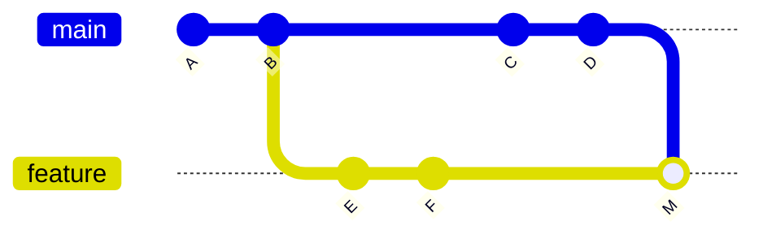

# Merge, Rebase, Cherry-pick

All three can be confusing because they “bring in other changes.”

The most important first step is to identify **the acting branch and the target**.

> In most commands, **the currently checked-out branch is the acting branch**.

## Merge

When the current branch is `feature`:

```bash
git merge stable
```

- Acting branch: `feature`
- Target: `stable`
- Meaning: merge stable’s history into feature.



Existing commits are preserved, and branching and merging remain visible in history.

## Rebase

While currently on `feature`:

```bash
git rebase origin/stable
```

- Acting branch: `feature`
- New base: `origin/stable`
- Meaning: **recreate feature’s own commits as new commits** after the latest stable

```text
Before

A ─ B ─ C ─ D   stable
           E ─ F     feature

After rebase

A ─ B ─ C ─ D   stable
                             E' ─ F' feature
```

### An Important Misconception

Rebasing does not delete the feature branch or merge it into stable.

```text
stable  → D
feature → F'
```

Both branches remain.

The later PR + Merge step is what actually brings the changes into stable.

### Why Pushing Can Become a Problem

Rebase changes commit hashes.

If you rebase a feature branch that has already been pushed to the remote, a normal push may be rejected. Consider `--force-with-lease` only when team policy permits it.

## Cherry-pick

From the current branch:

```bash
git cherry-pick abc123
```

- Acting branch: the current branch
- Target: commit `abc123`
- Meaning: create a **new commit that copies only that commit’s changes**.

```text
feature-A
A ─ B ─ C

feature-B
X ─ Y ─ C'
```

C has not moved; its patch has been reapplied as C'.

## Choosing an Operation

| Situation | Choice |
|---|---|
| Combine two branch histories as they are | Merge |
| Place your feature on top of the latest stable | Rebase |
| Need only one commit from another branch | Cherry-pick |

## Handling Conflicts

### Merge

```bash
git merge --abort
```

### Rebase

```bash
git add <resolved>
git rebase --continue
git rebase --abort
```

### Cherry-pick

```bash
git add <resolved>
git cherry-pick --continue
git cherry-pick --abort
```

## Operating Principles for Beginners

- Default integration: PR + Merge
- Update a personal feature: consider rebase
- Bring in a specific fix: cherry-pick
- Rebase a shared branch: use great caution
- If the direction is unclear, first write down **current branch / target / expected result** before running the command.
