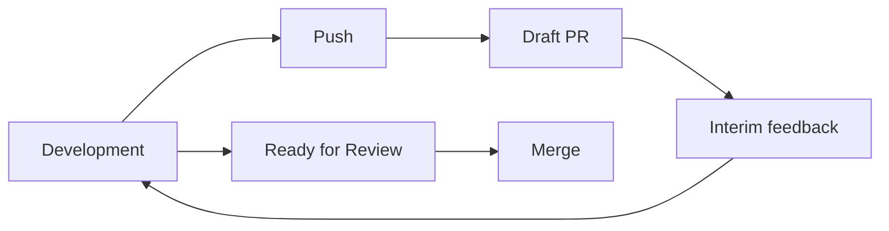

# Collaboration: Commit, Push, PR, and Code Review

## The Difference Between Commit and Push

```text
Commit
= Record in your local repository

Push
= Share with the remote repository
```

If you commit locally without pushing, ordinary collaborators cannot see that commit.

## What If You Only Create a Local Branch?

It does not exist on the remote yet.

```text
Local
feature/camera

Remote
None
```

First push:

```bash
git push -u origin feature/camera
```

Collaborators can now fetch and view it.

## Can a Push Alone Enable Review?

Yes.

```text
Branch Push
→ A collaborator fetches
→ Checks out the branch directly
→ Inspects it
```

However, PRs are more convenient for a structured review.

## The Role of a Pull Request

A PR is more than a merge button.

- List of changed files
- Line diff
- List of commits
- Reviewer assignment
- Line comment
- Discussion
- CI status
- Approve / Request Changes
- Merge

In other words:

> **Push = publish your work**  
> **PR = start the formal review process**

## Draft PR

A draft PR is useful when you want feedback before the work is complete.



## What If You Delete the Branch Before Merging the PR?

### Delete Only the Local Branch

This usually has no effect on the PR if the remote branch still exists.

### Delete the Remote Head Branch

The GitHub UI does not let you delete the head branch of an open PR. If you delete it with `git push`, for example `git push origin --delete <branch>`, the PR is closed.

The basic order is therefore:

```text
Development
→ Push
→ PR
→ Review
→ Merge
→ Delete the branch
```

## Multiple Developers Working on the Same Branch

This is technically possible.

However, non-fast-forward errors often occur when each person creates commits and then pushes.

```text
Developer A: C ─ A1
Developer B: C ─ B1
```

B must integrate A1 before pushing.

In general:

```text
Developer A → feature/camera-core
Developer B → feature/camera-ui
                 ↓
                PR
```

Separating responsibilities this way is more reliable.

## Code Review and Peer Review

- Design Review: check the design before implementation
- WIP Review: check direction during development
- Code Review / Peer Review: inspect code in a PR
- Integration / Regression Test: check the overall impact after merging

Good collaboration has multiple verification stages—**design → work in progress → code → integration**—rather than only inspecting work after completion.
