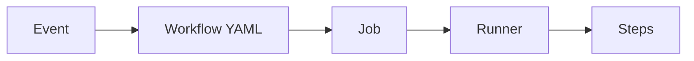

# GitHub Actions, Hook, Cron, YAML

The three often appear together, but they are distinct concepts.

## GitHub Actions

This system runs automated tasks when events occur within GitHub.



Example:

```yaml
name: PR Check

on:
  pull_request:
    branches: [stable]

jobs:
  build:
    runs-on: windows-latest
    steps:
      - uses: actions/checkout@3d3c42e5aac5ba805825da76410c181273ba90b1 # v7.0.1
      - run: cmake -S . -B build
      - run: cmake --build build
```

The long string after `uses:` pins the action to a commit SHA instead of a tag; the reasons and method are in "GitHub Actions in Practice".

## The Most Common Triggers

| Trigger | Meaning |
|---|---|
| push | Run after a push |
| pull_request | When a PR is created/updated |
| workflow_dispatch | Run manually through a button |
| schedule | Run at a scheduled time |
| release | A release event |
| workflow_call | Called by another workflow |

## Hook

A hook is a **local script** that runs before or after a specific Git action.

Example: pre-push hook

```text
git push
↓
pre-push hook
↓
Local Build / Test
↓
Push if successful
```

A hook is not YAML. It can be an executable script written in Shell, Python, or another language.

## Cron

Cron is a **time-scheduling expression**.

```text
Minute Hour Day Month Day-of-week
0  3  *  *  *
```

→ Every day at 03:00

Cron can be used inside GitHub Actions YAML.

```yaml
on:
  schedule:
    - cron: '0 18 * * *'
```

GitHub Actions `schedule` runs on UTC, so 03:00 KST every day is `'0 18 * * *'`.

In other words:

```text
YAML
└─ schedule
   └─ cron expression
```

## Are Builds Before Push Also Used?

Frequently. They are usually **local builds**, rather than GitHub Actions.

```text
Implementation
↓
Local Incremental Build / Test
↓
Commit
↓
Push
↓
GitHub Actions Clean Build / Test
↓
PR Review
```

For large C++ projects, instead of requiring a full build on every push:

- Local: fast incremental builds
- CI: Clean Build
- Nightly: extensive regression tests

Dividing verification into these stages is more efficient.

## Recommended Workflows

```text
.github/workflows/
├─ pr-check.yml
├─ stable-check.yml
├─ manual-build.yml
└─ nightly.yml
```

### PR Check

Fast compilation/tests

### Stable Check

Check integration after merging

### Manual Build

Full builds only when needed

### Nightly

Heavy checks such as full regression, import/export, and performance

Actions does not judge “whether a feature is good for users.” It is **the layer that automates mechanically verifiable conditions**.
