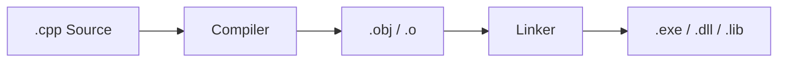
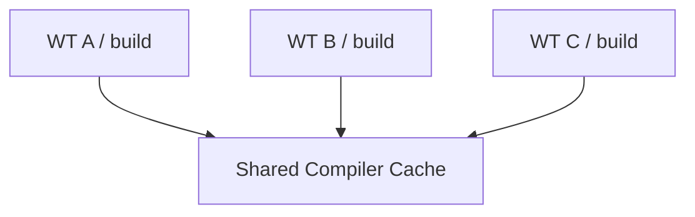

# Build Directories and Worktree Disk Usage

A build directory is a workspace for a C/C++ build system, not a Git concept.

## Source Versus Build

```text
Source/
├─ Camera.cpp
├─ Scene.cpp
└─ Main.cpp

build/
├─ *.obj
├─ *.lib
├─ *.dll
├─ *.exe
├─ *.pdb
├─ CMakeCache.txt
└─ generated files
```

## The Build Process



## Incremental Build

The first build compiles many files.

Subsequent builds can regenerate only the outputs of modified files.

```text
Modify Camera.cpp
↓
Regenerate Camera.obj
Reuse Scene.obj
Reuse UI.obj
↓
Link
```

Deleting the build directory usually turns the next build into a more expensive clean build.

## Why Multiple Worktrees Use More Disk Space

Worktrees share the Git object database, but build outputs are usually generated separately for each worktree.

```text
WT A
├─ Source
└─ build 40 GB

WT B
├─ Source
└─ build 42 GB

WT C
├─ Source
└─ build 38 GB
```

The main contributors are usually:

- .obj
- .pdb
- .lib
- generated code
- shader cache
- dependency build outputs

## Strategies

### 1. Keep Each Worktree’s Build Directory Separate

Sharing a build directory is risky.

```text
WT A → build/A
WT B → build/B
```

### 2. Delete Build Outputs for Inactive Worktrees

This does not affect source files or commits. Regenerate the outputs when needed.

### 3. Remove Merged Worktrees

```bash
git worktree remove ../worktrees/camera
git branch -d feature/camera
```

### 4. Share a Compiler Cache

Caches such as `ccache` / `sccache` can be shared.



Reuse previously compiled outputs while keeping the build directories themselves separate.

### 5. Share Dependency Caches

Download and binary caches from dependency managers such as vcpkg / Conan can also be shared.

## A Practical Cleanup Policy

```text
Active Worktree
→ Keep build outputs

Paused Worktree
→ Delete build outputs if needed

Merged Worktree
→ Remove the worktree + build outputs

Shared
→ compiler/dependency cache
```

This preserves the safety of parallel development while reducing disk usage and repeated build time.
