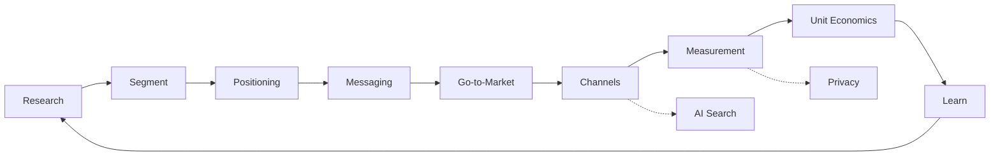

# Marketing Overview

As of: 2026-09-28

Marketing is not the job of making ads.

> It is the work of **deciding and validating to whom you deliver what value, through which paths, and at what cost you acquire and keep customers**.

This track is a map that helps developers and Product Owners understand the whole field of marketing in a structured way. It focuses less on definitions and more on **which decisions are made and on what evidence**.

## Core Questions Marketing Must Answer

1. Whose problem, and which one, are we targeting? (Segment, ICP)
2. Why are we better than the alternatives? (Positioning)
3. In what words do we communicate it? (Messaging)
4. How do we enter the market? (Go-to-Market)
5. Through which channels do we reach people and maintain the relationship? (Channels, Lifecycle)
6. Did it actually work? (Measurement, Incrementality)
7. Does the model make money? (CAC, LTV, Payback)
8. Do we stay within the lines of law and trust? (Consent, ad disclosure)



## Documents in This Track

| Document | Question it answers |
|---|---|
| 01 Market and Customer Research · Segmentation | Whose job are we targeting |
| 02 Positioning · Messaging · Brand | Why us, and how do we get remembered |
| 03 Go-to-Market · Launch · PLG/SLG | Which motion do we use to enter the market |
| 04 Channel Strategy | Which of Content/SEO, Paid, Lifecycle, Community, Partnerships to use, and how to split and scale the budget |
| 05 AI Search · GEO/AEO | How to be found in the era of AI Overviews and ChatGPT search |
| 06 Measurement · Attribution · Privacy | How do we know what actually worked |
| 07 Marketing Metrics | How to read CAC, LTV, Payback, and Retention |
| 08 AI Workflows · Risks | Where to use AI and where to stop |
| 09 Law · Ethics · Ad Disclosure | Basics of consent, ad disclosure, dark patterns, and AI-output labeling |

## How B2B and B2C Differ

The same concept carries different weight in B2B and B2C. The table shows general tendencies; the documents on the right go deeper.

| Aspect | B2B | B2C | More in |
|---|---|---|---|
| Buying unit | An organization (account, workspace) | An individual or household | 01 (ICP and Persona) |
| Number of decision makers | Several: users, decision makers, budget approvers, security and legal reviewers | Usually just the buyer | 01 |
| Cycle length | Long; grows with price and adoption complexity | Short; many repeat and impulse purchases | 03 (PLG and SLG) |
| Main channels | Search and docs, communities, partners, sales, email | Search, paid social, app push and messaging, commerce and reviews | 04 |
| Key metrics | Pipeline, PQL, win rate, NRR, CAC payback | Conversion rate, retention, repeat purchase, ARPU, LTV | 03, 07 |
| Legal scope | Network Act Article 50 does not limit recipients to private individuals, so it can apply to advertising email sent to people at companies. Ad copy falls under the Labeling and Advertising Act | Network Act Article 50, E-Commerce Act (dark patterns, subscription conversions), PIPA (consent for targeted ads), Labeling and Advertising Act | 09 |

This track's example product is **an incident-monitoring tool used by teams of 1–5 people**. Billing is per team (B2B), but individual developers often pay directly by card, so it is a boundary case where you check both columns.

## What Changed in 2024–2026

Only time-sensitive changes are collected here. Detailed evidence is in each document's references.

| Area | Change | When |
|---|---|---|
| Browser | Chrome withdrew its plan to phase out third-party cookies and announced the retirement of most Privacy Sandbox APIs | 2025-04, 2025-10 |
| Search | Google AI Overviews expanded to 200+ countries and territories and 40+ languages; Korean added to AI Mode | 2025-05, 2025-09 |
| Search measurement | Search Console's generative AI performance report launched for a subset of UK sites and then expanded to all sites. It shows impressions only, with no clicks or queries | 2026-06, 2026-08 |
| Ads in AI answers | OpenAI announced ChatGPT ad testing in the US. For Korea, a pilot was announced in 2026-06 and, per OpenAI's notice, ads launched on 2026-08-11 for logged-in adult Free and Go users; paid plans stay ad-free | 2026-01, 2026-06, 2026-08 |
| Mobile | French and Italian competition authorities fined Apple over ATT; Germany accepted commitments | 2025-03, 2025-12, 2026-08 |
| Measurement tools | Google Meridian (open-source MMM) made available to everyone | 2025-01 |
| Regulation | Korea's E-Commerce Act rules on six dark-pattern types took effect; EU AI Act Article 50 transparency obligations began to apply; Korea's AI Basic Act took effect | 2025-02, 2026-08, 2026-01 |
| Ad disclosure | Korea FTC added AI virtual-person disclosure to its endorsement guidelines | In force 2026-06 |

## Shared Principles

- **Customer comes before channel.** Channel choice is the result of segmentation and positioning.
- **Attribution numbers are hypotheses, not evidence.** Causality is confirmed through experiments.
- **Metrics must connect to unit economics.** Clicks and impressions are only intermediate signals.
- **Tools and policies change quickly.** Do not trust an undated "this is how it works now".
- **Trust is expensive to rebuild.** Consent, ad disclosure, and fact-checking are prerequisites, not costs.

## Marketing Work, Simplified

```text
Understand the customer
→ Choose (who, what)
→ Promise (positioning, message)
→ Reach (channel)
→ Measure (incrementality)
→ Judge economics (CAC, LTV)
→ Choose again
```

Good marketing is less about spending a large budget and more about **reducing the likelihood of making the wrong promise to the wrong customer**.

## References

- [Update on Plans for Privacy Sandbox Technologies — Google Privacy Sandbox](https://privacysandbox.google.com/blog/update-on-plans-for-privacy-sandbox-technologies) (2025-10-17, accessed 2026-09-28)
- [AI Overviews are now available in over 200 countries and territories — Google](https://blog.google/products-and-platforms/products/search/ai-overview-expansion-may-2025-update/) (2025-05, accessed 2026-09-28)
- [Introducing Search Generative AI performance reports in Search Console — Google Search Central](https://developers.google.com/search/blog/2026/06/gen-ai-performance-reports) (2026-06, accessed 2026-09-28)
- [Generative AI performance report (Search) — Search Console Help](https://support.google.com/webmasters/answer/16984139?hl=en) (accessed 2026-09-28)
- [Testing ads in ChatGPT — OpenAI](https://openai.com/index/testing-ads-in-chatgpt/) (published 2026-01-16, updated 2026-08-11, accessed 2026-09-28)
- [OpenAI brings ChatGPT ads to Korea, keeps paid plans ad-free — The Korea Times](https://www.koreatimes.co.kr/business/companies/20260619/openai-brings-chatgpt-ads-to-korea-keeps-paid-plans-ad-free) (2026-06-19, accessed 2026-09-28)
- [Amended E-Commerce Act rules on dark patterns take effect, with KFTC Q&A — Kim & Chang (in Korean)](https://www.kimchang.com/ko/insights/detail.kc?sch_section=4&idx=31411) (2025-02, accessed 2026-09-28)
- [Network Act Article 50 — Korea National Law Information Center](https://www.law.go.kr/%EB%B2%95%EB%A0%B9/%EC%A0%95%EB%B3%B4%ED%86%B5%EC%8B%A0%EB%A7%9D%EC%9D%B4%EC%9A%A9%EC%B4%89%EC%A7%84%EB%B0%8F%EC%A0%95%EB%B3%B4%EB%B3%B4%ED%98%B8%EB%93%B1%EC%97%90%EA%B4%80%ED%95%9C%EB%B2%95%EB%A5%A0/%EC%A0%9C50%EC%A1%B0) (accessed 2026-09-28)
- [Apple changes its rules for personalised advertising in apps — Bundeskartellamt](https://www.bundeskartellamt.de/SharedDocs/Meldung/EN/Pressemitteilungen/2026/08_17_2026_Apple_ATTF.html) (2026-08-17, accessed 2026-09-28)
- [Meridian is now available to everyone — Google](https://blog.google/products/ads-commerce/meridian-marketing-mix-model-open-to-everyone/) (2025-01-29, accessed 2026-09-28)
- [Transparency obligations under Article 50 of the AI Act — European Commission](https://digital-strategy.ec.europa.eu/en/faqs/transparency-obligations-under-article-50-ai-act) (accessed 2026-09-28)
