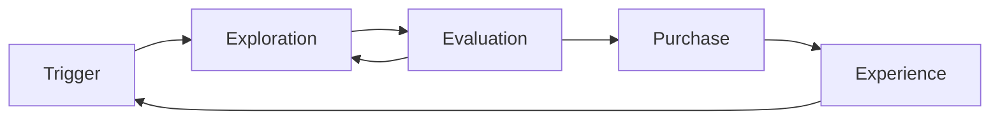

# Market and Customer Research · Segmentation

The first step in marketing is not writing a message but **choosing whose situation to target**.

## Questions Research Must Answer

- In what situation, and toward what progress, is the customer trying to move?
- What do they use to solve that problem today? (Including competitive alternatives and the status quo)
- Who makes the purchase decision, in what order, and with what information?
- Which group is willing to spend money and time on the problem?

## The Jobs to Be Done Lens

The Christensen Institute describes JTBD as **the progress a person is trying to make in a particular circumstance**. The idea is that customers do not buy products; they "hire" them to make progress.

Bad example:

> Our customers are developers aged 25–34.

Good example:

> A developer running a new service alone who, when an incident happens, must find the cause within 10 minutes and explain it to the team.

Demographics are useful for **reach (targeting)** but do not explain **why people buy**. JTBD looks at functional, social, and emotional dimensions together.

## Choosing a Research Method

| Method | What you learn | Limitations |
|---|---|---|
| Customer interviews | Context, reasons, buying process | Small samples; words and actions can differ |
| Switch and churn interviews | Why they bought / why they left | Recall bias |
| Surveys | Scale, distribution, priorities | Question design shapes the result |
| Product analytics | Actual behavior | Cannot tell you why |
| Search queries and community observation | Customer language, alternatives | Unclear representativeness |
| Sales and support records | Recurring objections and requests | Bias toward the loudest customers |
| Competitor analysis | Market standards and gaps | Tends to show only the surface |

Principle: **Form hypotheses qualitatively; confirm size quantitatively.**

## Segmentation

A segment is "a group of customers similar enough to be handled with the same message and the same channel".

| Basis | Example | Use |
|---|---|---|
| Firmographic (B2B) | Industry, size, region | Sales coverage, pricing |
| Demographic (B2C) | Age, region | Media targeting |
| Behavioral | Usage frequency, feature use, purchase history | Lifecycle, PQL |
| Needs / JTBD | Desired progress, situation | Positioning, message |
| Value | Willingness to pay, LTV | Budget allocation |

Conditions for a good segment:

- Identifiable (it can be separated in data)
- Reachable (a channel exists)
- Large enough (it can sustain a business)
- Responds differently (there is a reason to treat it differently)

## ICP and Persona

```text
ICP (Ideal Customer Profile)
= The conditions of the most valuable, most likely-to-succeed "customer organization or group"

Persona
= The role and motivation of a "person" within it who is involved in buying or using
```

In B2B, a single purchase often involves users, decision makers, budget approvers, and security or legal reviewers. Personas are only useful when split by these roles.

## The Buying Journey Is Not a Straight Line

Think with Google's "Messy Middle" research (2020) described the middle of the buying process as **a loop in which exploration and evaluation repeat**.



B2B is similar. In a Gartner survey of 646 B2B buyers conducted in August–September 2025 and published on 2026-03-09, 67% said they prefer a rep-free buying experience. In other words, **customers have largely decided before they meet sales**.

## Research Outputs

- Problem / JTBD statement
- One or two priority segments and the reasons for choosing them
- ICP definition and exclusion criteria
- Role-based personas (where needed)
- A list of words customers actually use
- A list of competitive alternatives (including the status quo)

## Common Mistakes

- Defining everyone as a customer
- Building segments from demographics alone
- Asking in interviews, "Would you use it if it had this feature?"
- Doing research once and stopping
- Using research only to confirm a conclusion already reached

## References

- [Jobs to Be Done Theory — Christensen Institute](https://www.christenseninstitute.org/theory/jobs-to-be-done/) (accessed 2026-09-28)
- [The 'messy middle' and purchase behaviour — Think with Google](https://www.thinkwithgoogle.com/intl/en-emea/consumer-insights/consumer-journey/navigating-purchase-behavior-and-decision-making/) (2020, accessed 2026-09-28)
- [Gartner Sales Survey Finds 67% of B2B Buyers Prefer a Rep-Free Experience — Gartner](https://www.gartner.com/en/newsroom/press-releases/2026-03-09-gartner-sales-survey-finds-67-percent-of-b2b-buyers-prefer-a-rep-free-experience) (2026-03-09, accessed 2026-09-28)
- [The B2B Buying Journey — Gartner](https://www.gartner.com/en/sales/insights/b2b-buying-journey) (accessed 2026-09-28)
