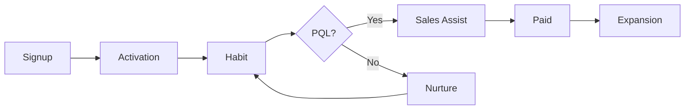

# Go-to-Market · Launch · PLG and SLG

Go-to-market (GTM) is not a "launch event". It is **the design of how a product meets customers, gets bought, and expands**.

## Components of a GTM Plan

| Component | Question |
|---|---|
| Target | Which segment / ICP do we pursue first |
| Value Proposition | What do we promise that segment |
| Pricing & Packaging | Free/paid boundary, pricing unit, plan structure |
| Motion | Product-led, sales-led, or a mix |
| Channels | Where are we discovered and where do people buy |
| Enablement | What do sales, support, and partners need to know |
| Metrics | How do we judge success |

## Comparing GTM Motions

| Aspect | Product-Led (PLG) | Sales-Led (SLG) |
|---|---|---|
| First value experience | Self-serve use after signup | Demo, PoC, sales conversation |
| Purchase decision | The user pays directly | Organizational procurement |
| Fits when | Value shows quickly, low price, self-onboarding possible | High price, complex adoption, many stakeholders |
| Key metrics | Activation, free-to-paid conversion, expansion | Pipeline, win rate, sales cycle |
| Risk | Free users grow but revenue does not | High sales cost leads to high CAC |

Atlassian and OpenView describe PLG as **a go-to-market strategy in which the product itself is the primary driver of acquisition, activation, retention, and expansion**.

### Hybrid: Product-Led Sales

In practice, the two are often combined: product usage data identifies accounts likely to buy, and sales steps in.

```text
MQL (Marketing Qualified Lead)
= Judged by response to marketing activity (e.g., downloading a resource)

PQL (Product Qualified Lead)
= Judged by behavior in the product (e.g., inviting 5 teammates, repeated use of a core feature)
```

Do not set PQL criteria by guesswork; derive them from **the behavior patterns of accounts that actually converted to paid**.



## B2B Buyers Research Alone, and Use AI Too

According to a Gartner survey published on 2026-05-20 (645 B2B buyers, August–September 2025), buyers used an average of seven information sources in a recent purchase, and 45% said they used generative AI. In the same survey, 69% said they prefer to validate AI-generated insights with sales reps.

The share preferring a rep-free buying experience was 61% in the survey published on 2025-06-25 and 67% in the one published on 2026-03-09 (see document 01).

Implications:

- Websites, documentation, and pricing pages are read before any sales conversation
- If the website and sales say different things, trust is lost
- How AI answers summarize your product also becomes part of GTM (document 05)

## Tiering Launches

If every launch is the same size, the team burns out and customers become numb.

| Tier | Example criteria | Example activities |
|---|---|---|
| Tier 1 | New product, new market, pricing change | Press release, campaign, sales training, event |
| Tier 2 | Major feature, major integration | Blog, email, in-app announcement, sales briefing |
| Tier 3 | Improvements, small features | Changelog, in-app tooltip |

### Launch Checklist

- Who the launch is for and what changes (one sentence)
- Positioning and messaging document
- Impact on pricing, permissions, and plans
- Documentation, FAQ, support scripts
- Sales and support briefing
- Measurement plan (baseline, target, observation period)
- Criteria for rollback or rescheduling

## Bad Example / Good Example

Bad example:

> The feature is done, so we will announce it on every channel next Tuesday.

Good example:

> We promise the small-team admin segment "invitations done in 3 minutes". As a Tier 2 launch we use an in-app announcement and email; the goal is to improve the 7-day teammate invitation rate of new workspaces. After two weeks we review results and decide whether to expand.

## Common Mistakes

- Starting GTM right before launch
- Misreading PLG as "it sells itself without sales"
- Setting the free-plan boundary once and never revisiting it
- Reporting launch activity volume (emails sent, posts published) as results

## References

- [What is product-led growth? — Atlassian](https://www.atlassian.com/agile/product-management/product-led-growth) (accessed 2026-09-28)
- [Product-Led Growth — OpenView](https://openviewpartners.com/product-led-growth/) (accessed 2026-09-28)
- [Your Guide to Product Qualified Leads (PQLs) — OpenView](https://openviewpartners.com/blog/your-guide-to-product-qualified-leads-pqls/) (accessed 2026-09-28)
- [Gartner Survey Finds 69% of B2B Buyers Turn to Sales Reps to Validate AI-Generated Insights — Gartner](https://www.gartner.com/en/newsroom/press-releases/2026-05-20-gartner-survey-finds-sixty-nine-percent-of-b-two-b-buyers-turn-to-sales-reps-to-validate-ai-generated-insights) (2026-05-20, accessed 2026-09-28)
- [Gartner Sales Survey Finds 61% of B2B Buyers Prefer a Rep-Free Buying Experience — Gartner](https://www.gartner.com/en/newsroom/press-releases/2025-06-25-gartner-sales-survey-finds-61-percent-of-b2b-buyers-prefer-a-rep-free-buying-experience) (2025-06-25, accessed 2026-09-28)
