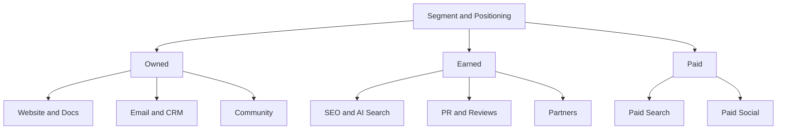

# Channel Strategy · Content · Paid · Lifecycle · Community

A channel is not a strategy but **a path for executing one**. Segment and positioning come first; then you choose where those customers actually are.

## Channel Map

| Type | Characteristics | Cost structure |
|---|---|---|
| Owned | Assets we control | Production and operating cost, compounding effect |
| Earned | Others mention or recommend us | Cannot be bought directly, high credibility |
| Paid | Exposure bought with money | Immediate effect, stops when spending stops |

## Questions for Choosing Channels

- When our ICP feels the problem, where do they search or ask, and what do they ask?
- Whose word do they trust before buying? (Peers, communities, reviews, AI answers)
- What CAC can our price and LTV sustain? (Document 07)
- Can we measure effectiveness in this channel? (Document 06)

Early on, it is better to **prove repeatable results in one or two channels** than to spread across many.

## Content · SEO

Search traffic is a compounding asset, but it is slow.

Google's official position (Search Central) is consistent.

- What matters is **whether content is helpful to people**, not whether AI was used
- Automated generation whose primary purpose is manipulating rankings violates spam policies
- In 2024-03 Google announced scaled content abuse, site reputation abuse, and expired domain abuse as new spam policies

Bad example:

> Auto-generate and publish 500 AI articles, one per keyword.

Good example:

> Pick 20 questions that recur in customer interviews and turn them into documents with real settings screens and error cases.

## Paid Search · Paid Social

| Aspect | Paid Search | Paid Social |
|---|---|---|
| User state | Already aware of the problem and searching | Consuming a feed; demand is latent |
| Strength | High purchase intent | Demand creation, precise reach |
| Weakness | Cannot grow beyond search volume | Creative fatigue, longer path to conversion |
| Key variables | Keywords and queries, bids, landing page | Creative, targeting, frequency |

### The Spread of Automated Campaigns

Major ad platforms now put campaign types that automate targeting, bidding, and creative combinations with AI front and center. Examples: Google's Performance Max and AI Max for Search campaigns (announced 2025), and Meta's Advantage+ campaigns.

Working principles:

- Automation is only as smart as **the quality of its input signals (conversion data)**
- Conversions reported by a platform are attributed by that platform's rules (document 06)
- People set exclusions, brand safety, and budget caps
- Auto-generated creative is subject to the same disclosure and advertising rules (document 09)

## Email · CRM · Lifecycle

This is the channel for customers you already have a relationship with. It contributes to **activation, retention, and expansion** more than acquisition.

| Stage | Example message | Trigger |
|---|---|---|
| Onboarding | Guide to the first value experience | Right after signup, incomplete steps |
| Activation | Encourage use of a core feature | A specific action has not happened |
| Retention | Usage summary, new value | Signals of declining use |
| Expansion | Higher plan, team invites | Approaching a limit |
| Win-back | Reasons to return | Cancellation, long inactivity |

### Sending Infrastructure Requirements

- Since 2024-02, Gmail has required senders of 5,000 or more messages a day to Gmail accounts to use SPF and DKIM authentication, DMARC, one-click unsubscribe for marketing mail (RFC 8058), and to keep the spam rate reported in Postmaster Tools below 0.3%. Google said it would ramp up enforcement on non-compliant traffic from 2025-11.
- Apple Mail Privacy Protection (announced 2021-06) downloads remote content in advance so senders cannot tell whether a message was opened. As a result, **open rate is an unreliable metric**. Look at clicks, conversions, and unsubscribe rates.
- In Korea, advertising messages require prior opt-in consent, an "(Ad)" label, and instructions for opting out, among other things (document 09).

## Community

A community is not an ad channel but **a structure in which customers help each other**.

- Effects: lower support costs, product feedback, trust, referrals
- Conditions: steady operating staff, clear rules, the company not monopolizing the conversation
- Metrics: active participants, answer rate per question, signups and retention via the community (causality is hard to confirm)

## Partnerships

| Type | Example | Caution |
|---|---|---|
| Integration / Marketplace | Listing in another product's integration directory | Risk of the partner platform changing its policies |
| Reseller / Agency | Sales through agencies and resellers | Margin, ownership of the customer relationship |
| Co-marketing | Joint webinars, joint content | Do the target customers actually overlap |
| Affiliate / Referral | Referral rewards | Duty to disclose material connections (document 09) |

## Common Mistakes

- Entering a channel because competitors are there
- Comparing channel results using different standards
- Feeding automated campaigns a sloppy conversion definition
- Judging email performance by open rate
- Using the community as an announcement board

## References

- [What web creators should know about our March 2024 core update and new spam policies — Google Search Central](https://developers.google.com/search/blog/2024/03/core-update-spam-policies) (2024-03, accessed 2026-09-28)
- [Google Search's guidance about AI-generated content — Google Search Central](https://developers.google.com/search/blog/2023/02/google-search-and-ai-content) (2023-02, accessed 2026-09-28)
- [Unlock next-level performance with AI Max for Search campaigns — Google](https://blog.google/products/ads-commerce/google-ai-max-for-search-campaigns/) (2025, accessed 2026-09-28)
- [Meta Advantage+ — Meta for Business](https://www.facebook.com/business/ads/meta-advantage-plus) (accessed 2026-09-28)
- [Email sender guidelines — Gmail Help](https://support.google.com/a/answer/81126?hl=en) (accessed 2026-09-28)
- [Email sender guidelines FAQ — Gmail Help](https://support.google.com/mail/answer/14229414?hl=en) (accessed 2026-09-28)
- [Mail Privacy Protection & Privacy — Apple](https://www.apple.com/legal/privacy/data/en/mail-privacy-protection/) (accessed 2026-09-28)
- [Apple advances its privacy leadership with iOS 15 — Apple Newsroom](https://www.apple.com/newsroom/2021/06/apple-advances-its-privacy-leadership-with-ios-15-ipados-15-macos-monterey-and-watchos-8/) (2021-06, accessed 2026-09-28)
