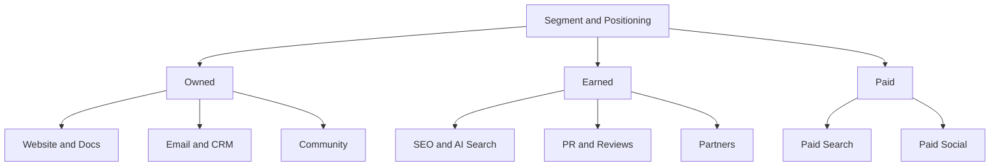

# Channel Strategy · Content · Paid · Lifecycle · Community

A channel is not a strategy but **a path for executing one**. Segment and positioning come first; then you choose where those customers actually are.

## Channel Map



| Type | Characteristics | Cost structure |
|---|---|---|
| Owned | Assets we control | Production and operating cost, compounding effect |
| Earned | Others mention or recommend us | Cannot be bought directly, high credibility |
| Paid | Exposure bought with money | Immediate effect, stops when spending stops |

## Questions for Choosing Channels

- When our ICP feels the problem, where do they search or ask, and what do they ask?
- Whose word do they trust before buying? (Peers, communities, reviews, AI answers)
- What CAC can our price and LTV sustain? (Document 07)
- Can we measure effectiveness in this channel? (Document 06)

Early on, it is better to **prove repeatable results in one or two channels** than to spread across many.

## Content · SEO

Search traffic is a compounding asset, but it is slow.

Google's official position (Search Central) is consistent.

- What matters is **whether content is helpful to people**, not whether AI was used
- Automated generation whose primary purpose is manipulating rankings violates spam policies
- In 2024-03 Google announced scaled content abuse, site reputation abuse, and expired domain abuse as new spam policies

Bad example:

> Auto-generate and publish 500 AI articles, one per keyword.

Good example:

> Pick 20 questions that recur in customer interviews and turn them into documents with real settings screens and error cases.

## Paid Search · Paid Social

| Aspect | Paid Search | Paid Social |
|---|---|---|
| User state | Already aware of the problem and searching | Consuming a feed; demand is latent |
| Strength | High purchase intent | Demand creation, precise reach |
| Weakness | Cannot grow beyond search volume | Creative fatigue, longer path to conversion |
| Key variables | Keywords and queries, bids, landing page | Creative, targeting, frequency |

### The Spread of Automated Campaigns

Major ad platforms now put campaign types that automate targeting, bidding, and creative combinations with AI front and center. Examples: Google's Performance Max and AI Max for Search campaigns (announced 2025), and Meta's Advantage+ campaigns.

Working principles:

- Automation is only as smart as **the quality of its input signals (conversion data)**
- Conversions reported by a platform are attributed by that platform's rules (document 06)
- People set exclusions, brand safety, and budget caps
- Auto-generated creative is subject to the same disclosure and advertising rules (document 09)

## Email · CRM · Lifecycle

This is the channel for customers you already have a relationship with. It contributes to **activation, retention, and expansion** more than acquisition.

| Stage | Example message | Trigger |
|---|---|---|
| Onboarding | Guide to the first value experience | Right after signup, incomplete steps |
| Activation | Encourage use of a core feature | A specific action has not happened |
| Retention | Usage summary, new value | Signals of declining use |
| Expansion | Higher plan, team invites | Approaching a limit |
| Win-back | Reasons to return | Cancellation, long inactivity |

Onboarding and activation messages should aim at an **activation event**, and that event is not set by guesswork. Compare the first one to two weeks of behavior of users still active months later with those who left, and pick the behavior most strongly associated with staying. For the example product, a candidate would be "connects one service and opens the root-cause screen from one alert within the first week" (assumption). This is a correlation, so confirm causality with onboarding experiments. The method is the same as in document 03, where **PQL criteria are derived from the behavior of accounts that actually converted to paid**.

### Sending Infrastructure Requirements

- Since 2024-02, Gmail has required senders of 5,000 or more messages a day to Gmail accounts to use SPF and DKIM authentication, DMARC, and one-click unsubscribe for marketing mail (RFC 8058). Its guidance is to **keep the spam rate reported in Postmaster Tools below 0.10% and never reach 0.30%**. Google said it would ramp up enforcement on non-compliant traffic from 2025-11.
- Apple Mail Privacy Protection (announced 2021-06) downloads remote content in advance so senders cannot tell whether a message was opened. As a result, **open rate is an unreliable metric**. Look at clicks, conversions, and unsubscribe rates.
- In Korea, advertising messages require prior opt-in consent, an "(Ad)" label, and instructions for opting out, among other things (document 09).

## Community

A community is not an ad channel but **a structure in which customers help each other**.

- Effects: lower support costs, product feedback, trust, referrals
- Conditions: steady operating staff, clear rules, the company not monopolizing the conversation
- Metrics: active participants, answer rate per question, signups and retention via the community (causality is hard to confirm)

## Partnerships

| Type | Example | Caution |
|---|---|---|
| Integration / Marketplace | Listing in another product's integration directory | Risk of the partner platform changing its policies |
| Reseller / Agency | Sales through agencies and resellers | Margin, ownership of the customer relationship |
| Co-marketing | Joint webinars, joint content | Do the target customers actually overlap |
| Affiliate / Referral | Referral rewards | Duty to disclose material connections (document 09) |

## Korean Channel Specifics

When targeting Korean customers, a global channel list is not enough. Naver and Kakao each bundle search, messaging, and commerce under one company, so **each channel has a different character and different applicable rules.**

The advertising-information rules in Network Act Article 50 (prior opt-in consent, an "(Ad)" label, separate consent for night-time sending, opt-out instructions) apply to **channels that send to a recipient, such as text messages, email, app push, and messenger messages**. Ads shown in search results or feeds are not transmissions, so Article 50 does not apply to them, but their copy and sponsorship disclosures follow the Labeling and Advertising Act and the KFTC endorsement guidelines (document 09).

| Channel | Character | Network Act Article 50 applies? | Measurability |
|---|---|---|---|
| Naver search ads (Power Link and others) | Search ads with keyword bidding and pay-per-click; capture Korean-language search demand | No; display-type | Clicks and cost in the ad system; signups and payments linked via UTM and your own analytics |
| Naver Blog and Cafe | Reviews and community content shown alongside search results (earned and owned) | Posts: no. Sponsored or product-trial posts must disclose material connections under the endorsement guidelines | Only some traffic visible via UTM; impact through indirect signals such as branded search trends |
| Naver Smart Store | A sales channel connected to Naver Shopping and Naver Pay (mostly B2C goods) | Yes, if you send advertising notices to buyers | Mostly Seller Center statistics; merging with your own analytics needs separate design |
| KakaoTalk Channel | An owned channel built on follows (chat, posts, messages) | Yes, when sending ad messages: "(Ad)" label, contact details, opt-out method | Send and click metrics, follower count |
| AlimTalk | Only for **informational** messages needed for transactions and service use, such as orders, payments, and signups; cannot be sent if any advertising content is mixed in | Within the informational scope it is an exception to the advertising rules; mixed-in ads make it advertising | Delivery reported by the sending vendor; later behavior via link UTM |
| Brand Message (replaces FriendTalk) | **Advertising** messages. FriendTalk ended on 2025-12-31 and was replaced by Brand Message from 2026-01-01. Sent to channel followers by default; sending to non-followers who consented to marketing requires Kakao's extra conditions, such as a channel with at least 50,000 followers, plus proof of consent. Sending is allowed only **08:00–20:50 KST** | Yes: prior opt-in consent, "(Ad)" label, opt-out instructions. Night-time sending is not possible under Kakao's policy | Sends and clicks, link UTM |
| Kakao Moment | Ad platform for Bizboard (a banner at the top of the chat tab), display, video, and message ads | Display-type: no; message ads: yes | Platform-reported conversions (the attribution limits in document 06 apply) |
| Daangn (Biz Profile, Daangn ads) | A neighborhood-based local channel; Biz Profile is free, ads target by area, age, and interests | Display ads: no | Ad manager metrics; area-level targeting makes it a geo-experiment candidate |
| Instagram · YouTube | Global platforms, but channels routinely considered for Korean B2C and creator marketing | Feed and video ads: no. Sponsored content follows the endorsement guidelines | Platform-reported conversions, platform lift tools |

Example judgment: for the example product (an incident-monitoring tool for developers), Naver and Google search ads, a technical blog, and AlimTalk for signup and billing notices are the first candidates, while Daangn and Instagram rank low. For a local shop or B2C commerce, the order is almost reversed.

Product names and policies change often. The table summarizes each provider's guidance as of 2026-09-28, so re-check the originals before running campaigns.

## Budget Allocation

The **order in which you add money** matters more than the number of channels.

1. **Prove one channel first.** Do not add channels before you have a repeatable CAC.
2. **Cap the test budget.** Give new-channel experiments an amount and duration (e.g., 10–20% of the total for 6–8 weeks, assumption) and write down stop criteria in advance.
3. **Scale only after an incrementality read.** Judge by lift or geo experiments, not platform-reported ROAS (document 06).
4. **Look at marginal CAC, not average CAC.** Most channels become less efficient as spend grows (diminishing returns), because the cheapest demand (branded search, high-intent keywords) is used up first.

```text
Marginal CAC example (assumption)
KRW 2.0M per month → 20 new customers   average CAC KRW 100,000
KRW 3.0M per month → 25 new customers   average CAC KRW 120,000
Extra KRW 1.0M     → 5 extra customers  marginal CAC KRW 200,000
```

An average CAC of KRW 120,000 looks fine, but the last KRW 1.0M is spending KRW 200,000 per customer. Base scaling decisions on this number.

### Channel Mix Example: 5-Person B2B SaaS, KRW 5M per Month (Assumption)

An allocation assuming the 5-person team behind the example product spends KRW 5M a month. The amounts are **assumptions** that show how to read the table.

| Channel | Monthly budget | Role | Measurement |
|---|---|---|---|
| Naver and Google search ads (problem keywords such as "errors after deploy", "log monitoring") | KRW 2.0M | Capture demand from people who already feel the problem | Signup-to-activation conversion by query, paid CAC, a quarterly on/off or geo test |
| Content, SEO, AI search (incident write-ups, setup guides) | KRW 1.5M | Compounding asset, candidate for citation in AI answers | Organic signups, Search Console (including the generative AI report), AI-service referrers |
| Lifecycle email and in-app (onboarding, PQL nurture) | KRW 0.5M | Activation and paid conversion | Activation rate, free-to-paid conversion, comparison with a no-send holdout group |
| Community and partners (developer community sponsorship, integration marketplaces) | KRW 0.5M | Trust and referrals | Signups via community (UTM), signup survey "Where did you hear about us?" |
| Test budget (next channel candidate) | KRW 0.5M | Validate a new channel | Stop criteria and duration set in advance |

## Common Mistakes

- Entering a channel because competitors are there
- Comparing channel results using different standards
- Feeding automated campaigns a sloppy conversion definition
- Judging email performance by open rate
- Using the community as an announcement board

## References

- [What web creators should know about our March 2024 core update and new spam policies — Google Search Central](https://developers.google.com/search/blog/2024/03/core-update-spam-policies) (2024-03, accessed 2026-09-28)
- [Google Search's guidance about AI-generated content — Google Search Central](https://developers.google.com/search/blog/2023/02/google-search-and-ai-content) (2023-02, accessed 2026-09-28)
- [Unlock next-level performance with AI Max for Search campaigns — Google](https://blog.google/products/ads-commerce/google-ai-max-for-search-campaigns/) (2025, accessed 2026-09-28)
- [Meta Advantage+ — Meta for Business](https://www.facebook.com/business/ads/meta-advantage-plus) (accessed 2026-09-28)
- [Email sender guidelines — Gmail Help](https://support.google.com/a/answer/81126?hl=en) (accessed 2026-09-28, 0.10% and 0.30% spam-rate thresholds checked)
- [Email sender guidelines FAQ — Gmail Help](https://support.google.com/mail/answer/14229414?hl=en) (accessed 2026-09-28)
- [Mail Privacy Protection & Privacy — Apple](https://www.apple.com/legal/privacy/data/en/mail-privacy-protection/) (accessed 2026-09-28)
- [Apple advances its privacy leadership with iOS 15 — Apple Newsroom](https://www.apple.com/newsroom/2021/06/apple-advances-its-privacy-leadership-with-ios-15-ipados-15-macos-monterey-and-watchos-8/) (2021-06, accessed 2026-09-28)
- [Naver Search Ads — NAVER](https://searchad.naver.com/) (accessed 2026-09-28)
- [How marketers actually set up Power Link campaigns — Marketing Inside (in Korean)](https://inside.ampm.co.kr/insight/10860) (accessed 2026-09-28)
- [Naver Smart Store Center — NAVER](https://sell.smartstore.naver.com/) (accessed 2026-09-28)
- [AlimTalk — Kakao Business Guide (in Korean)](https://kakaobusiness.gitbook.io/main/ad/infotalk) (accessed 2026-09-28)
- [AlimTalk sending rules — Kakao Business Guide (in Korean)](https://kakaobusiness.gitbook.io/main/ad/infotalk/operations) (accessed 2026-09-28)
- [Channel message sending rules — Kakao Business Guide (in Korean)](https://kakaobusiness.gitbook.io/main/ad/moment/start/messagead/operations) (accessed 2026-09-28)
- [FriendTalk shutdown and automatic replacement by Brand Message — SOLAPI (in Korean)](https://solapi.com/notices/notices-2025-12-04) (2025-12-04, accessed 2026-09-28)
- [Brand Message — Kakao Business Guide (in Korean)](https://kakaobusiness.gitbook.io/main/ad/brandmessage) (accessed 2026-09-28, sending hours 08:00–20:50)
- [Kakao Brand Message — SOLAPI (in Korean)](https://solapi.com/kakao-bms-guide) (accessed 2026-09-28, non-follower sending conditions such as at least 50,000 followers)
- [Kakao Moment — Kakao Business Guide (in Korean)](https://kakaobusiness.gitbook.io/main/ad/moment) (accessed 2026-09-28)
- [Introducing Daangn ads — Daangn Biz School (in Korean)](https://bizschool.daangn.com/ads) (accessed 2026-09-28)
- [Daangn Business — Daangn (in Korean)](https://business.daangn.com/) (accessed 2026-09-28)
- [Network Act Article 50 — Korea National Law Information Center](https://www.law.go.kr/%EB%B2%95%EB%A0%B9/%EC%A0%95%EB%B3%B4%ED%86%B5%EC%8B%A0%EB%A7%9D%EC%9D%B4%EC%9A%A9%EC%B4%89%EC%A7%84%EB%B0%8F%EC%A0%95%EB%B3%B4%EB%B3%B4%ED%98%B8%EB%93%B1%EC%97%90%EA%B4%80%ED%95%9C%EB%B2%95%EB%A5%A0/%EC%A0%9C50%EC%A1%B0) (accessed 2026-09-28)
