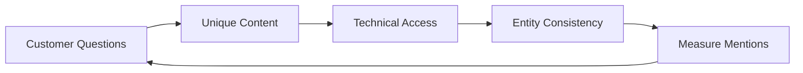

# AI Search · Answer Engines · GEO/AEO

The biggest change in search in 2024–2026 is the growing number of screens where **an AI-generated summary appears before the list of links**. The industry calls the response to this GEO (Generative Engine Optimization) or AEO (Answer Engine Optimization).

## Current State (as of 2026-09-28, with source dates)

| Service | Confirmed fact | Source date |
|---|---|---|
| Google AI Overviews | Available in more than 200 countries and territories and more than 40 languages | Google announcement, 2025-05 |
| Google AI Mode | Five languages added, including Korean | Google announcement, 2025-09 |
| Google AI Mode | Google announced it passed 1 billion monthly users one year after launch | Google I/O, 2026-05 |
| Search Console | Generative AI performance report: launched 2026-06-03 for a subset of UK sites, expanded to all sites around 2026-08-31. Shows **impressions, pages, countries, and devices only** for AI Overviews, AI Mode, and similar features; no clicks, CTR, or queries. Data starts 2026-05-18 | Google announcement 2026-06, expansion 2026-08 |
| ChatGPT search | Started providing answers with links to web sources | OpenAI announcement, 2024-10 |
| ChatGPT ads | US test announced 2026-01. For Korea: plans announced 2026-05, pilot announced and reported 2026-06-19, and per OpenAI's notice launched on 2026-08-11 alongside the UK, Mexico, Brazil, and Japan. Shown only to **logged-in adult Free and Go users**; Plus, Pro, Business, Enterprise, and Edu have no ads | 2026-01, 2026-06, 2026-08 OpenAI and press |
| Naver AI Briefing | AI summary answers with source attribution introduced in integrated search | Reported 2025-03 |
| Naver AI Briefing | Naver said on an earnings call it would roughly double the share of searches it covers by the end of 2026 | Earnings call report, 2026-02 |

User and country counts are **the providers' own announcements** and change often. Re-check the originals before planning. Korean press (2026-06) and OpenAI's notice (2026-08-11) give different start dates for ChatGPT ads in Korea, so check OpenAI's advertiser guidance before running campaigns.

For consumer products aimed at Korea, **check exposure in Naver AI Briefing with the same weight as Google AI Overviews**. Naver keeps widening the range of searches where AI Briefing appears.

## Clicks Can Fall

Pew Research Center analyzed March 2025 browsing data from 900 US adults (published 2025-07-22). On Google search pages with an AI summary, users clicked a result link 8% of the time; on pages without one, 15% of the time. Clicks on source links inside the AI summary were very rare.

This is **the observation of a single study** and may differ by industry and query type. The direction, however, is clear.

- The "informational query → blog visit → conversion" model may weaken
- The gap between impressions and clicks widens
- **Being mentioned or cited inside the answer** becomes one of the goals in itself

In 2024-02 Gartner **predicted** that "by 2026, traditional search engine volume will drop 25%". It is a prediction, not a measurement.

## What Google Officially Says

Google Search Central's guidance (the 2025-05 blog post and the 2026-05 optimization guide) can be summarized as follows.

- There are **no additional technical requirements** to appear in AI Overviews or AI Mode. A page that is indexed and eligible for a snippet is a candidate
- Existing SEO fundamentals remain the foundation
- New machine-readable files, AI-specific text files, or special schema are **not needed**
- There is no need to force content into small chunks
- **Unique, experience-based (non-commodity) content** matters, not common knowledge
- Google recommends prioritizing SEO fundamentals over "AEO/GEO hacks" (such as manufacturing mentions)

Caution: this is guidance **for Google Search**. For other answer engines, check each provider's documentation separately.

## ChatGPT Search and Crawlers

According to OpenAI's documentation, crawler roles are separated.

| User-agent | Role | If blocked |
|---|---|---|
| OAI-SearchBot | Appearing in ChatGPT search results | Hard to appear in ChatGPT search answers and snippets |
| GPTBot | Collection for training generative models | Signals that you do not want content used for training |
| ChatGPT-User | Visits made on a user's request, such as asking ChatGPT to open a specific page | OpenAI says robots.txt rules may not apply because the visit is user-initiated |
| OAI-AdsBot | Visits landing pages submitted as ChatGPT ads to check ad-policy compliance and relevance | If you run ChatGPT ads it is part of ad review, so decide together with ad operations |

So it is possible to **allow search visibility while refusing training collection**. Decide robots.txt settings together with legal and content policy.

## Practical Checklist

1. **Build a question list**: Collect questions customers might ask AI from interviews, sales, and support records.
2. **Create unique answers**: Publish information only you know precisely, such as pricing, limits, comparisons, setup procedures, and real cases.
3. **Make it accessible**: Check indexing, crawler permissions, rendering, and page speed.
4. **Stay consistent**: Make sure product names, prices, and feature descriptions match across the website, docs, marketplaces, and review sites. AI answers combine many sources, so inconsistencies can turn into wrong answers.
5. **Measure**: Use Search Console's generative AI report for **the impression side**. It has no clicks, CTR, or queries, so count **the click side** separately with landing-page referrers (chatgpt.com, perplexity.ai, and others) and UTM parameters. Add a manual check that regularly asks AI services key questions and records mentions and accuracy.

## Bad Example / Good Example

Bad example:

> Auto-generate 100 FAQ pages to rank well in AI, and ask community members to post praise for our product.

Good example:

> For the real customer question "What happens to my data when I move from my current tool?", write a document that states the migration steps, limits, and time required precisely, and make the numbers on the pricing page match the docs.

The second action in the bad example is manufactured mention, which Google advises against; if it involves compensation, it also becomes an ad disclosure issue (document 09).

## What Is Still Uncertain

- Much of how AI answers select sources is not public
- Measurement tooling differs widely by service
- The format and rules for ads inside AI answers keep changing

## References

- [AI Overviews are now available in over 200 countries and territories — Google](https://blog.google/products-and-platforms/products/search/ai-overview-expansion-may-2025-update/) (2025-05, accessed 2026-09-28)
- [AI Mode is now available in five new languages — Google](https://blog.google/products/search/ai-mode-expands-more-languages/) (2025-09, accessed 2026-09-28)
- [Google Search's I/O 2026 updates — Google](https://blog.google/products-and-platforms/products/search/search-io-2026/) (2026-05, accessed 2026-09-28)
- [AI Features and Your Website — Google Search Central](https://developers.google.com/search/docs/appearance/ai-features) (accessed 2026-09-28)
- [Top ways to ensure your content performs well in Google's AI experiences on Search — Google Search Central](https://developers.google.com/search/blog/2025/05/succeeding-in-ai-search) (2025-05, accessed 2026-09-28)
- [A new resource for optimizing for generative AI in Google Search — Google Search Central](https://developers.google.com/search/blog/2026/05/a-new-resource-for-optimizing) (2026-05, accessed 2026-09-28)
- [Introducing Search Generative AI performance reports in Search Console — Google Search Central](https://developers.google.com/search/blog/2026/06/gen-ai-performance-reports) (2026-06, accessed 2026-09-28)
- [Google users are less likely to click on links when an AI summary appears — Pew Research Center](https://www.pewresearch.org/short-reads/2025/07/22/google-users-are-less-likely-to-click-on-links-when-an-ai-summary-appears-in-the-results/) (2025-07-22, accessed 2026-09-28)
- [Gartner Predicts Search Engine Volume Will Drop 25% by 2026 — Gartner](https://www.gartner.com/en/newsroom/press-releases/2024-02-19-gartner-predicts-search-engine-volume-will-drop-25-percent-by-2026-due-to-ai-chatbots-and-other-virtual-agents) (2024-02-19, accessed 2026-09-28)
- [Introducing ChatGPT search — OpenAI](https://openai.com/index/introducing-chatgpt-search/) (2024-10, accessed 2026-09-28)
- [Overview of OpenAI Crawlers — OpenAI](https://developers.openai.com/api/docs/bots) (accessed 2026-09-28, includes ChatGPT-User and OAI-AdsBot)
- [Testing ads in ChatGPT — OpenAI](https://openai.com/index/testing-ads-in-chatgpt/) (published 2026-01-16, updated 2026-08-11, accessed 2026-09-28)
- [OpenAI brings ChatGPT ads to Korea, keeps paid plans ad-free — The Korea Times](https://www.koreatimes.co.kr/business/companies/20260619/openai-brings-chatgpt-ads-to-korea-keeps-paid-plans-ad-free) (2026-06-19, accessed 2026-09-28)
- [OpenAI Brings ChatGPT Ads to Korea for Free and Go Tiers — Seoul Economic Daily](https://en.sedaily.com/technology/2026/06/19/openai-brings-chatgpt-ads-to-korea-for-free-and-go-tiers) (2026-06-19, accessed 2026-09-28)
- [Generative AI performance report (Search) — Search Console Help](https://support.google.com/webmasters/answer/16984139?hl=en) (accessed 2026-09-28)
- [Google Search Console Generative AI Performance Report Live For All — Search Engine Roundtable](https://www.seroundtable.com/google-search-console-ai-report-live-41850.html) (2026-08, accessed 2026-09-28)
- [Naver: AI Briefing to double by year-end — Seoul Economic TV (in Korean)](https://www.sentv.co.kr/article/view/sentv202602060034) (2026-02-06, accessed 2026-09-28)
- [Naver introduces AI Briefing in search — NewDaily](https://biz.newdaily.co.kr/site/data/html/2025/03/24/2025032400067.html) (2025-03-24, accessed 2026-09-28)
