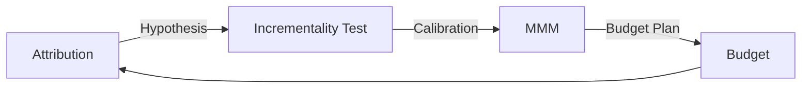

# Measurement · Attribution · Incrementality · Privacy

"Did this ad create revenue?" is the hardest question in marketing. The key is **distinguishing correlation from causation**.

## Three Measurement Tools

| Method | Question | Strength | Weakness |
|---|---|---|---|
| Attribution (MTA, last-click, etc.) | Which touchpoints came before the conversion | Fast, granular | Not causal; sees only trackable touchpoints |
| Incrementality test (lift, geo experiments) | How much would conversions drop without the ads | Estimates causality | Cost and time; one question at a time |
| MMM (Marketing Mix Modeling) | How much did each channel's budget contribute to results | No individual tracking; includes offline | Needs a long data history; sensitive to model assumptions |



The IAB's State of Data 2026 report also discusses how privacy changes, closed platform-specific measurement, and cross-channel inconsistency make it hard to connect media exposure to business outcomes, and treats AI as a tool to strengthen attribution, incrementality, and MMM.

In practice, no one uses just one. The recommended combination is to **form hypotheses with attribution, validate them with experiments, and calibrate MMM with experiment results**. Meta's Robyn documentation also describes calibrating MMM with lift-experiment results.

## Limits of Attribution

- **Last-click** overvalues touchpoints right before conversion, such as search and retargeting
- **Platform-reported conversions** are calculated by each platform's own rules, so adding them up tends to exceed reality
- Credit piles up on **customers who would have bought anyway** (brand search, existing customers)
- Users whose tracking is blocked (declined consent, declined app tracking) are invisible

Bad example:

> Brand keyword ads show a 20x ROAS. Let's double the budget.

Good example:

> Turn off brand keyword ads in some regions for four weeks and compare the change in total conversions to estimate the incremental effect.

## Incrementality Tests

```text
Test group: exposed to ads
Control group: not exposed (randomized or by region)
Lift = (Test conversion rate - Control conversion rate) / Control conversion rate
```

- User-level experiments: platform conversion lift tools (e.g., Google Ads, Meta)
- Region-level experiments: geo experiments (e.g., Meta GeoLift, Google Meridian GeoX)
- Google Meridian GeoX: an open-source geo-experiment library previewed in 2026-05. It splits regions into test and control groups independently of the ad publisher, measures the incremental effect, and is designed to feed those results into Meridian MMM calibration. General availability was reported on 2026-09-09
- Google stated that in 2025 it lowered the minimum budget for Google Ads incrementality experiments (a USD 5,000 minimum, per Google Ads Help)

Caution: small samples produce unstable results. Before the experiment, decide **the observation period, the minimum effect size, and the decision criteria**.

### A Worked Example

Assume the example product is checking the incremental effect of its search ads. Every number is **illustrative**.

```text
50,000 people per group (randomly assigned)
Control conversion rate 2.0%  → 1,000 conversions
Test    conversion rate 2.4%  → 1,200 conversions

Lift                    = (2.4 - 2.0) / 2.0 = 20%
Incremental conversions = 50,000 × (2.4% - 2.0%) = 200
Test ad spend           = KRW 10,000,000
Incremental CAC         = KRW 10,000,000 / 200 = KRW 50,000
```

If the platform credits all 1,200 test-group conversions to the ads, CAC looks like about KRW 8,333. The conversions the ads **added** are 200, and budget decisions use the incremental CAC of KRW 50,000.

### Decide Before the Experiment

- **MDE (minimum detectable effect)**: Set the smallest lift you want to detect first. The required sample grows with the inverse square of the MDE, so halving the MDE needs roughly four times the sample.
- **Minimum sample and number of regions**: In the example above, detecting 2.0% → 2.4% with 80% power and a 5% two-sided significance level needs about 21,000 people per group (normal approximation). In geo experiments, too few regions let region-to-region variation swamp the effect, so set the number of regions and the duration with the power analysis in GeoLift or GeoX.
- **A fixed, pre-registered duration**: Write down the duration, metrics, and decision criteria before the experiment. Use whole weeks so day-of-week effects do not leak in.
- **No peeking**: Checking results daily and stopping on the day they look significant pushes the false-positive rate well above the nominal 5%. If you need interim looks, use a method designed for them from the start, such as a sequential test.

## MMM

- Google Meridian: open-source Bayesian MMM made available to everyone on 2025-01-29
- Meta Robyn: open-source MMM package from Meta Marketing Science

MMM does not need individual-level tracking, so it is resilient to privacy changes. In exchange, meaningful results often require **at least one to two years of weekly data and enough budget variation**.

## Privacy Changes: What Actually Changed

| Area | Status (dates) |
|---|---|
| Chrome third-party cookies | 2024-07 shifted from a scheduled phase-out to a user-choice approach → 2025-04 announced it would not roll out a separate choice prompt either. Users control it in existing settings |
| Privacy Sandbox | 2025-10-17 announced retirement of most APIs, including Topics, Protected Audience, and Attribution Reporting. CHIPS, FedCM, and Private State Tokens remain |
| Safari | 2020-03 WebKit announced full third-party cookie blocking by default |
| Firefox | 2022-06 Total Cookie Protection (per-site cookie partitioning) made the default worldwide |
| iOS ATT | Since 2021, apps need user permission to track. France's competition authority fined Apple EUR 150 million (2025-03-31), Italy's AGCM about EUR 98.6 million (2025-12), and Germany's Bundeskartellamt made commitments binding, including neutral prompts (2026-08-17) |
| iOS ad measurement | AdAttributionKit (2024) follows SKAdNetwork, with aggregated postbacks and no individual identification |
| Google Consent Mode v2 | Since 2024-03, consent signals for ad measurement and personalization (ad_user_data, ad_personalization) must be passed for EEA users |

In summary:

- "Cookies are going away" is **no longer true for Chrome.**
- But because of Safari and Firefox blocking, iOS ATT, and declined consent, **the trackable share is already incomplete**.
- Legal consent requirements (e.g., the EU ePrivacy rules, Korea's Personal Information Protection Act) remain regardless of browser policy.

## First-Party Data and Server-Side Sending

To reduce tracking loss, platforms offer ways to send consented first-party data from the server.

- Meta Conversions API: sends events from servers and CRM directly to Meta
- Google Ads Enhanced Conversions: sends first-party data such as email addresses hashed with SHA256 to improve conversion matching

This is **not a way to bypass consent.** Use it only within the scope of consent.

## Common Mistakes

- Adding up platform-reported conversions and reporting them as total results
- Reallocating budget based on attribution numbers without experiments
- Keeping an old plan built on the assumption that "cookies are ending"
- Adopting server-side sending without consent settings

## References

- [Update on Plans for Privacy Sandbox Technologies — Google Privacy Sandbox](https://privacysandbox.google.com/blog/update-on-plans-for-privacy-sandbox-technologies) (2025-10-17, accessed 2026-09-28)
- [Next steps for Privacy Sandbox and tracking protections in Chrome — Google Privacy Sandbox](https://privacysandbox.google.com/blog/privacy-sandbox-next-steps) (2025-04, accessed 2026-09-28)
- [Full Third-Party Cookie Blocking and More — WebKit](https://webkit.org/blog/10218/full-third-party-cookie-blocking-and-more/) (2020-03, accessed 2026-09-28)
- [Firefox Rolls Out Total Cookie Protection By Default — Mozilla](https://blog.mozilla.org/en/mozilla/firefox-rolls-out-total-cookie-protection-by-default-to-all-users-worldwide/) (2022-06, accessed 2026-09-28)
- [Autorité de la concurrence fines Apple for the ATT framework — Autorité de la concurrence](https://www.autoritedelaconcurrence.fr/en/press-release/targeted-advertising-autorite-de-la-concurrence-imposes-fine-eu150000000-apple) (2025-03-31, accessed 2026-09-28)
- [The Italian Competition Authority fines Apple over 98 million euro — AGCM](https://en.agcm.it/en/media/press-releases/2025/12/A561) (2025-12, accessed 2026-09-28)
- [Apple changes its rules for personalised advertising in apps — Bundeskartellamt](https://www.bundeskartellamt.de/SharedDocs/Meldung/EN/Pressemitteilungen/2026/08_17_2026_Apple_ATTF.html) (2026-08-17, accessed 2026-09-28)
- [AdAttributionKit — Apple Developer Documentation](https://developer.apple.com/documentation/AdAttributionKit) (accessed 2026-09-28)
- [Updates to consent mode for traffic in the EEA — Google Ads Help](https://support.google.com/google-ads/answer/13695607?hl=en) (accessed 2026-09-28)
- [Meridian is now available to everyone — Google](https://blog.google/products/ads-commerce/meridian-marketing-mix-model-open-to-everyone/) (2025-01-29, accessed 2026-09-28)
- [An Analyst's Guide to MMM — Meta Robyn](https://facebookexperimental.github.io/Robyn/docs/analysts-guide-to-MMM/) (accessed 2026-09-28)
- [Meridian GeoX: Google's new open-source Geo incrementality solution — Google](https://business.google.com/us/accelerate/announcements/meridian-geox-googles-new-open-source-geo-incrementality-solution/) (2026-05, accessed 2026-09-28)
- [google/meridian-geox — GitHub](https://github.com/google/meridian-geox) (accessed 2026-09-28)
- [Google Launches Meridian GeoX Globally — Search Engine Journal](https://www.searchenginejournal.com/google-launches-meridian-geox-globally/589030/) (2026-09, accessed 2026-09-28)
- [Strengthen media measurement with incrementality testing improvements — Google Ads Help](https://support.google.com/google-ads/answer/16719772?hl=en) (2025, accessed 2026-09-28)
- [Conversions API — Meta for Developers](https://developers.facebook.com/docs/marketing-api/conversions-api/) (accessed 2026-09-28)
- [About enhanced conversions — Google Ads Help](https://support.google.com/google-ads/answer/9888656?hl=en) (accessed 2026-09-28)
- [State of Data 2026: The AI-Powered Measurement Transformation — IAB](https://www.iab.com/insights/2026-state-of-data-report/) (2026, accessed 2026-09-28)
