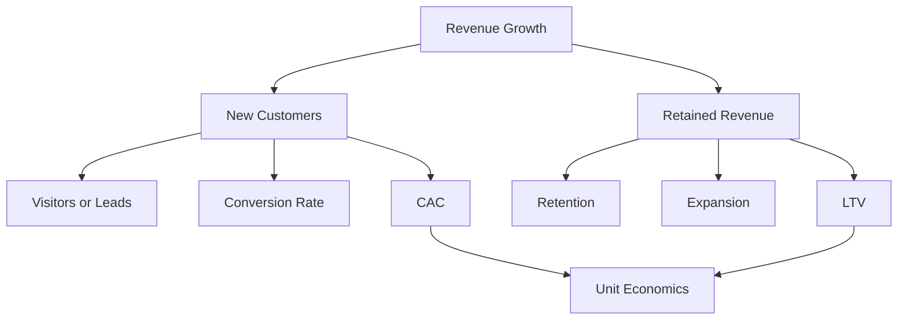

# Marketing Metrics · Unit Economics

The purpose of marketing metrics is not reporting but **answering "Does it pay to buy more customers this way?"**

## Metric Tree



## Core Definitions

| Metric | Definition | Caution |
|---|---|---|
| CAC | Customer acquisition cost = (marketing + sales cost) / new customers | State which costs are included |
| Paid CAC | Paid channel cost / customers acquired through paid channels | Distinguish from blended CAC |
| LTV | Present value of net profit (or gross profit) over the customer relationship | Overstated if calculated on revenue |
| LTV:CAC | LTV / CAC | Very sensitive to assumptions |
| CAC Payback | Months needed to recover CAC | State whether gross margin is applied |
| Retention | Share of customers (or revenue) remaining after a period | Distinguish logo-based from revenue-based |
| NRR | Retention and expansion of existing-customer revenue (including expansion) | Can be driven by one or two large customers |
| Conversion Rate | Rate of conversion between stages | Not comparable if the denominator changes |

### Blended CAC vs Paid CAC

a16z's "16 Startup Metrics" points out that if you only look at **blended CAC**, which includes customers who arrived organically, you cannot tell whether paid channels are actually profitable. To decide whether to increase budget, look at **paid CAC** separately.

### Calculating CAC Payback

```text
CAC Payback (months)
= CAC / (monthly revenue per customer × gross margin)

Example: CAC 6,000,000 KRW, monthly revenue 500,000 KRW, gross margin 80%
= 6,000,000 / (500,000 × 0.8) = 15 months
```

Calculating without gross margin makes the payback period look shorter than it really is.

## Benchmarks Are Only a Reference

Frequently cited rules of thumb:

- **LTV:CAC of 3:1**: a16z explains that investors use roughly 3x as a rough benchmark of a consumer company's health
- **CAC Payback**: a16z material puts the average startup's payback at around 12–18 months, 18–24 months for selling to large enterprises, and 6–12 months for SMBs

These numbers vary with **industry, pricing model, growth stage, and cost of capital**. Your own cohort data is the more important benchmark.

## Look at Cohorts

Averages are good at lying. Split by signup month and acquisition channel.

```text
            M0    M1    M2    M3
Jan cohort  100%  62%   51%   47%
Feb cohort  100%  58%   45%   40%
Mar cohort  100%  66%   57%   -
```

- The key is whether the curve **flattens** (whether retention finds a floor)
- Splitting by channel reveals channels that "come in cheap but leave fast"
- The table above is a **hypothetical example** showing how to read it

## Reading Funnel Metrics

| Stage | Example metrics | Common misconception |
|---|---|---|
| Awareness | Impressions, reach, brand search volume | More impressions means better results |
| Acquisition | Visits, signups, leads | More leads is always good |
| Activation | Rate of reaching the first value experience | Signup = active user |
| Revenue | Paid conversion, ARPU | A conversion bought with discounts counts the same |
| Retention | Retention rate, churn rate | The overall average is enough |
| Referral | Referrals and invites | A referral made for a reward counts the same |

## Bad Example / Good Example

Bad example:

> Leads grew 40% this quarter.

Good example:

> Paid-channel leads grew 40% this quarter, but the paid conversion rate fell, so paid CAC rose 12%. Three-month retention of the new cohort is unchanged, so we keep our LTV assumption. Next quarter we will cut budget for the two campaigns with the lowest conversion rates and run landing page experiments.

A good report flows from **number → interpretation → decision**.

## Metric Pitfalls

- Targeting measurable vanity metrics (followers, impressions)
- Changing the denominator to make conversion rates look better
- Calculating LTV on revenue and over an unlimited period
- Treating attribution-based per-channel CAC as fact (document 06)
- Turning a metric into a target and inviting gaming

## References

- [16 Startup Metrics — Andreessen Horowitz](https://a16z.com/16-startup-metrics/) (2015, accessed 2026-09-28)
- [Why Do Investors Care So Much About LTV:CAC? — Andreessen Horowitz](https://a16z.com/why-do-investors-care-so-much-about-ltvcac/) (accessed 2026-09-28)
- [What is the CAC payback period? — Stripe](https://stripe.com/resources/more/what-is-the-cac-payback-period) (accessed 2026-09-28)
- [It's Payback Time: A Crash Course in Our Favorite SaaS Metric — HubSpot](https://product.hubspot.com/blog/its-payback-time-a-crash-course-in-saas-metrics) (accessed 2026-09-28)
